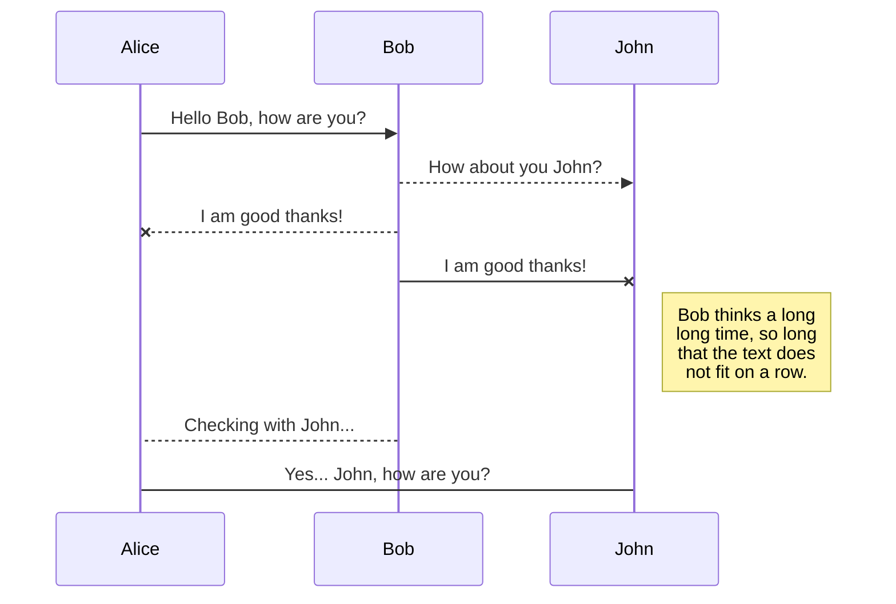
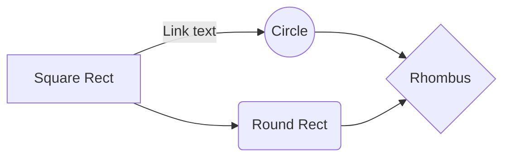

<div class="normani">
<div></div>
<div></div>
<div></div>
<div></div>
<div></div>
</div>
<div class="latto">
<div></div>
<div></div>
<div></div>
<div></div>
<div></div>
</div>

# Sol 4185: Left Navigation Camera
## CURIOSITY RAW IMAGES

  <div class="row">
    <div class="panelColumn">
      <div class="leftColumn">

<!-- lightbox container hidden with CSS -->
<a href="https://mars.nasa.gov/msl-raw-images/proj/msl/redops/ods/surface/sol/04185/opgs/edr/ncam/NLB_769017267EDR_F1071320NCAM00354M_.JPG">
        
</a>

<!-- lightbox container hidden with CSS -->
<a href="#" class="lightbox" id="img1">
  <span style="background-image: url('https://static.wixstatic.com/media/f15be5_79011a18085346fb90334cd841c2c1fd~mv2.jpg/v1/fill/w_464,h_416,al_c,q_80,usm_0.66_1.00_0.01,enc_auto/f15be5_79011a18085346fb90334cd841c2c1fd~mv2.jpg')"></span>
</a>
        </div>
    </div>
    <div class="panelColumn">
      <div class="rightColumn">
<a href="#img2">
  
</a>

<!-- lightbox container hidden with CSS -->
<a href="#" class="lightbox" id="https://mars.nasa.gov/msl-raw-images/proj/msl/redops/ods/surface/sol/04185/opgs/edr/ncam/NLB_769017299EDR_F1071320NCAM00354M_.JPG">
  <span style="background-image: url('https://static.wixstatic.com/media/f15be5_6dff88762912492dacd6d9a1b67ab345~mv2.jpg/v1/fill/w_500,h_500,al_c,q_80,usm_0.66_1.00_0.01,enc_auto/f15be5_6dff88762912492dacd6d9a1b67ab345~mv2.jpg')"></span>
</a>
         </div>
    </div>
  </div>

[](https://mars.nasa.gov/msl-raw-images/proj/msl/redops/ods/surface/sol/04185/opgs/edr/ncam/NLB_769017299EDR_F1071320NCAM00354M_.JPG "Redirect to homepage")
This image was taken by Left Navigation Camera onboard NASA's Mars rover Curiosity on Sol 4185 (2024-05-15 04:55:27 UTC).

[Credits: NASA/JPL-Caltech](https://mars.nasa.gov/raw_images/1334513/?site=msl)

<div class="gullies">
<div></div>
<div></div>
<div></div>
<div></div>
<div></div>
</div>
<hr>
<div>

<h2> Wartime Sexual Violence</h2>
<a href="https://16days.thepixelproject.net/wp-content/uploads/2011/11/War-rape.jpg">  </a>
<p>Wartime sexual violence is rape or other forms of sexual violence committed by combatants during armed conflict, war, or military occupation often as spoils of war, but sometimes, particularly in ethnic conflict, the phenomenon has broader sociological motives. Wartime sexual violence may also include gang rape and rape with objects. A war crime, it is distinguished from sexual harassment, sexual assaults and rape committed amongst troops in military service.[1][2][3]</p>
<p>During war and armed conflict, rape is frequently used as a means of psychological warfare in order to humiliate the enemy. Wartime sexual violence may occur in a variety of situations, including institutionalized sexual slavery, wartime sexual violence associated with specific battles or massacres, as well as individual or isolated acts of sexual violence.</p>
<p>Rape can also be recognized as genocide when committed with the intent to destroy, in whole or in part, a targeted group. International legal instruments for prosecuting perpetrators for genocide were developed in the 1990s, with the Akayesu case of the International Criminal Tribunal for Rwanda being widely considered as a precedent.[4] However, these legal instruments have so far only been used for international conflicts, thus putting the burden of proof in citing the international nature of conflict in order for prosecution to proceed.</p>
<p>## Definition of wartime sexual violence # Main article: Rape There is no consensus definition of wartime sexual violence, as there is variance in what forms of violence are included in the definition and variance in which violence is considered conflict-related.[5] The terms rape, sexual assault and sexual violence are frequently used interchangeably.[6] The Explanatory Note of the Rome Statute, which binds the International Criminal Court, defines rape as follows: </p><p> The perpetrator invaded the body of a person by conduct resulting in penetration, however slight, of any part of the body of the victim or of the perpetrator with a sexual organ, or of the anal or genital opening of the victim with any object or any other part of the body.[7] and The invasion was committed by force, or by threat of force or coercion, such as that caused by fear of violence, duress, detention, psychological oppression or abuse of power, against such person or another person, or by taking advantage of a coercive environment, or the invasion was committed against a person incapable of giving genuine consent.[7] The concept of "invasion" is intended to be broad enough to be gender-neutral and the definition is understood to include situations where the victim may be incapable of giving genuine consent if affected by natural, induced or age-related incapacity.[8] A prominent data-set on conflict-related sexual violence, Sexual Violence in Armed Conflict (SVAC), builds on the ICC definition and covers seven forms of violence: "(a) rape, (b) sexual slavery, (c) forced prostitution, (d) forced pregnancy, (e) forced sterilization/abortion, (f) sexual mutilation, and (g) sexual torture."[5] The data-set defines conflict-related sexual violence as the sexual violence committed "armed actors (specifically, state militaries, rebel groups, and progovernment militias) during periods of conflict or immediately postconflict," thus excluding sexual violence by civilians.[5] More expansive definitions may define wartime sexual violence as being committed even by civilians if the conflict creates a sense of impunity.[5]</p>

</div>

[Thaka_and_Sartu_YoutubeAccount](https://www.youtube.com/@thakasartukellyselassie6468/videos)
[Wild 94.9 | Fierce Freestyle Classics | Vol. 2 | The Mixtress](https://www.youtube.com/watch?v=yVZy7jtIwI4)

# UnixinG_Android 
Hi MRO, want you to have an update on what my computing situation has been since Jose took my laptop back. Im in the library system but they wont let me have free access to a computer. Its connected to my spouse's prostitution and porno. In [Santa Monica Porn is filmed at the library at times](https://www.couriermail.com.au/lifestyle/pornhub-movie-filmed-at-public-library-angers-neighbours/news-story/8f4387f7d47490bba31bd28ac27994d8). The security gaurds told me I need an ID to come in! This is the [Santa Monica Public Library](https://smpl.org/)! and the resulting gossip among security gaurds about me having #Normani_aka_SartuAdem nudes on my cellphone! It was a gift! Im grown and i did not do it on library wifi! There is a law on it i found online. Its filtered now, but i want to know where i stand bc I was attending a dance studio with girls my age and i have been in datacenters most of my life, porn is the channel most ppl in my demographic communicate via to talk to people in the physical world. It causes a lot of hormonal problems and i am a really healthy male. Coral is strong even after the NiCU. Anyway the computers i had accquired got stolen in various ways so there is a big chunck of time i am not building on a Desktop. I promised I would grow as a Sun Admin and while i was without a computer i got turned on to [TErmux](https://termux.dev/en/) and leared a lot of cool configurations to do common programming tasks and it even effected my webdesign, i started building on github and what is now my homepage was a fullpage scrolling design like i was seeing life differently. Check out the screenshots below the Termux demo and see my #PocketPC thats what i call [Android](https://www.android.com/) now...

 

<div class="pinupGallery">
<div class="pinupImage expandingGallery">


</div>
</div>


  <div class="pinupGallery">
    <div class="expandingGallery">
    
  
     
     
     
     
     
  
  
  
  
  
  

  
  


  </div>


  <div class="featured-pinupImage expandingGallery">

  

  

  
  
      
      
      
           
        
  
  
  


  </div>

  <div class="featured-pinupImage expandingGallery">


  
      
  
  

  
      
      
  
      
      


  </div>
  </div>


[Mortal Kombat II (rev L3.1)](https://www.retrogames.cc/arcade-games/mortal-kombat-ii-rev-l3-1.html)


[](https://pbs.twimg.com/media/GK6lMrFbMAAm3m_?format=jpg&name=large "Redirect to homepage")

<div class="mermaid">
sequenceDiagram
Alice ->> Bob: Hello Bob, how are you?
Bob-->>John: How about you John?
Bob--x Alice: I am good thanks!
Bob-x John: I am good thanks!
Note right of John: Bob thinks a long<br/>long time, so long<br/>that the text does<br/>not fit on a row.

Bob-->Alice: Checking with John...
Alice->John: Yes... John, how are you?
</div> 



And this will produce a flow chart:


{{ site.time | date_to_rfc822 }}
{{ site.time | date_to_long_string: "ordinal" }}

[](https://images-assets.nasa.gov/image/iss071e077732/iss071e077732~medium.jpg "Redirect to homepage")

[](https://images.nasa.gov/details/iss071e077732 "Redirect to homepage")

[SpacEStaion](https://images-assets.nasa.gov/image/iss071e077732/iss071e077732~medium.jpg)

[video link](https://www.youtube.com/watch?v=BzgQKphzhzQ){:.no-lightbox}

[video link](https://www.youtube.com/watch?v=BzgQKphzhzQ)

# UnixinG_Android 

<div class="pinupGallery">
<div class="pinupImage expandingGallery">

  


</div>
</div>


<div class="gullies">
<div></div>
<div></div>
<div></div>
<div></div>
<div></div>
</div>


{% include carousel.html height="50" unit="%" duration="2" number="2" %}

# <(''<)  <( ' ' )>  (> '')>


<embed src="https://www.youtube.com/embed/qxyxqVDjSzs?si=FJLDFHo9UgZocaYA" title="YouTube video player"  allowfullscreen />
<embed src="https://www.youtube.com/embed/5YMYrB0dqoU?si=ShVaFTO1D4851hIv" title="YouTube video player"  allowfullscreen />

## Marvel Super Heroes (Euro 951024)
by [Capcom](https://games.capcomusa.com/)  [Play At The internet Arcade](https://archive.org/details/arcade_msh) <(''<)  <( ' ' )>  (> '')>
 <div class="pinupImage expandingGallery">


</div>


[](https://github.com/pages-themes/hacker/actions/workflows/ci.yaml)

<div class="gullies">
<div></div>
<div></div>
<div></div>
<div></div>
<div></div>
</div>
<embed width="100%" height="300" src="https://w.soundcloud.com/player/?url=https%3A//api.soundcloud.com/tracks/1413792211&color=%23446ff2&auto_play=false&hide_related=false&show_comments=true&show_user=true&show_reposts=false&show_teaser=true&visual=true" />SZA - Sos Full Album</a></div>

I listened to [Ctrl](https://www.essence.com/entertainment/only-essence/sza-ctrl-essay/) and understand a lot more about black adolescent emotions, i saw u in [Hollywood](https://tvtropes.org/pmwiki/pmwiki.php/Main/HollywoodHistory), after looking past the grey i realize im not that old! I dont know what i told you in Atlanta, but im not a person to leave loose strings, i may not even be important enough to you to be mentioned. Either way, i asked you for girlfriend advice and your album delivered again, thanks. im more at peace being single(ish) I dont want to talk about Normani bc im still scared thats you, i had a bedroom bandit that was going to the studio, she bonded like a step mother and coral would continue sleeping whenever she came over, or she put yquil in her lunch at Parkside. I was not given foodstamps back then so me an coral got skinny, so i may have all these relationships in my head with the pretty girls from up the street. At the very least im your fan... 


# Gullies on Mars 

[Gullies on Mars](https://www.nasa.gov/image-article/gullies-mars/)

## Bright Gully Deposits on Mars

[Bright Gully Deposits on Mars](https://science.nasa.gov/wp-content/uploads/2024/03/5247_1_Bright_Gully_Deposits_on_Mars-full2.jpg)

[California Constitution](https://archives.cdn.sos.ca.gov/collections/1879/archive/1879-constitution.pdf)

<div class="gullies">
<div></div>
<div></div>
<div></div>
<div></div>
<div></div>
</div>

<embed height="300" src="https://w.soundcloud.com/player/?url=https%3A//api.soundcloud.com/tracks/899207614&amp;color=%2379f281&amp;auto_play=false&amp;hide_related=false&amp;show_comments=true&amp;show_user=true&amp;show_reposts=false&amp;show_teaser=true&amp;visual=true" width="100%" />

Ella Mai::Not Another Love Song

## YoungBoy Never Broke Again - We Poppin (feat. Birdman)
<embed  src="https://www.youtube.com/embed/SKexLz5QRN0?si=09OSnzNjbIoy50dD" title="YouTube video player"  allowfullscreen />


I have not really connected to any of your songs before, but today is different. I miss riding in [Savannah](https://visitsavannah.com/). I lost my little girl, the one that was with me when you an your girl pulled up on me in Savannah. That song was really healing. Im in Los Angeles, i got intimate with [Normani](https://variety.com/2024/music/news/normani-dopamine-debut-solo-album-1235918512/) and i dont know what life is, but i saw that LenoxMall tape when [Allied](https://www.aus.com/) tried you. They had this Intership program at Dance411 an a few girls encircled me, we went to Graveyard and HodgePodge for meetings, an after some reondevus with about 4 different girls that all wear the same makeup i realized i got played... There is this lightskinone i see in Hollywood hellafly, used to dance there... Anyway Im running bc i was accused of killing erika and ppl trying to kill me bc the charge cant stick! [Nasa](https://www.jpl.nasa.gov/) has been monitoring me an i know i can get clear! If you stuck in LosAngeles go get a BackgroundCheck its [FortMcFphereson](https://militarybases.com/georgia/fort-mcpherson/) for LA bc im getting taht since im criminally clean they putting a lot of pressure on me to stay healthy so they can come home. Erika is [Latto](https://www.essence.com/celebrity/mulatto-rapper/) her an Gucci was ... actually u know all there was a [namechange](https://www.11alive.com/article/entertainment/television/programs/the-a-scene/why-rapper-mulatto-changed-her-name/85-2e9c3a1c-0d0f-4ea3-9589-91ded4a60165) an im hurt but since Matt is involved i hope there was like a bad trick bc, at somepoint hey will be free from Playboy an im grieving Normani getting shit Erika missed out on bc they would never give her privacy as a married woman. Its Genocide man they have a word for it in California... [eugenics](https://www.latimes.com/business/story/2020-07-07/caltech-robert-millikan-eugenics-sterilization)



print("YoungBoy Never Broke Again - We Poppin (feat. Birdman)")
print(Normani ride with me ...)


---
# Important Tweets 
```js
// https://x.com/RicoThaka/status/1778868638726115572
// https://x.com/MooNLOVER404/status/1778533571399123058
// https://x.com/MooNLOVER404/status/1778534422075277526
// https://x.com/MooNLOVER404/status/1777831378148835715 
// https://x.com/MooNLOVER404/status/1778506180756975799// 
// https://x.com/RicoThaka/status/1777400067063701972
// https://x.com/RicoThaka/status/1777401550077374969
// https://x.com/RicoThaka/status/1778158754967789832 
// https://x.com/RicoThaka/status/1778179396362510848
// https://x.com/RicoThaka/status/1778182339115491677
// https://x.com/RicoThaka/status/1778196930008580210
// https://x.com/BubbleGumPop626/status/1765185587584364821
// https://x.com/RicoThaka/status/1762585192257245607 
// https://x.com/RicoThaka/status/1721321640292913435 
// https://x.com/BubbleGumPop626/status/1743738575542497712 
// https://x.com/BubbleGumPop510/status/1740490197899620389 
// https://x.com/thakasartu/status/1740162543203840011
// https://x.com/MooNLOVER404/status/1749521832108269600

```


[Marvel Super Heroes (951024 Japan)](https://www.retrogames.cc/arcade-games/marvel-super-heroes-951024-japan.html)

---

<div class="gullies">
<div></div>
<div></div>
<div></div>
<div></div>
<div></div>
</div>
  {% include carousel.html height="100" unit="%" duration="1" number="1" %}

  
<div class="gullies">
<div></div>
<div></div>
<div></div>
<div></div>
<div></div>
</div>

---

<time datetime="2018-01-06T00:00:00+00:00">06 Jan 2018</time>
<div class="pinupGallery">
<div class="expandingGallery">
  
  
  
  
  
  
  
  
  
  
  
  
  
</div>
</div>
<div>
 <p><span class="firstcharacter">An-Nisa</span> In the name of Allah, the Beneficent, the Merciful.[<b>4.1</b>] O people! be careful of (your duty to) your Lord, Who created  you from a single being and created its mate of the same (kind) and  spread from these two, many men and women; and be careful of  (your duty to) Allah, by Whom you demand one of another (your  rights), and (to) the ties of relationship; surely Allah ever watches  over you.<br />[<b>4.2</b>] And give to the orphans their property, and do not substitute  worthless (things) for (their) good (ones), and do not devour  their property (as an addition) to your own property; this is  surely a great crime.<br />[<b>4.3</b>] And if you fear that you cannot act equitably towards  orphans, then marry such women as seem good to you, two and  three and four; but if you fear that you will not do justice  (between them), then (marry) only one or what your right hands  possess; this is more proper, that you may not deviate from the  right course.<br />[<b>4.4</b>] And give women their dowries as a free gift, but if they of  themselves be pleased to give up to you a portion of it, then eat it  with enjoyment and with wholesome result.<br />[<b>4.5</b>]</p>


</div>

[READMORE](https://ricothaka.github.io/alnisa.html)
[An-Nisa ٱلنِّسَاء ](https://en.wikipedia.org/wiki/An-Nisa)


  <div class="pinupGallery">
    <div class="expandingGallery">              </div>
    <div class=" expandingGallery">              </div>
    <div class="expandingGallery">              </div>
  </div>


<div>
  <embed src="https://w.soundcloud.com/player/?url=https%3A//api.soundcloud.com/tracks/411406869&color=%23595959&auto_play=false&hide_related=false&show_comments=true&show_user=true&show_reposts=false&show_teaser=true&visual=true">
  <figcaption>
    Kashdoll is a moniker that gets passed around in real work sex work... slavery. I really miss her, she mentions me by name in the first song "soundcloud context"
  </figcaption>
<video controls=""><source src="https://science.nasa.gov/wp-content/uploads/2024/03/20230217FrontLeftHazcamTwoYearMovie-1280.mp4" type="video/mp4"> Download the <a href="https://science.nasa.gov/wp-content/uploads/2024/03/20230217FrontLeftHazcamTwoYearMovie-1280.mp4">MP4</a> video.</video> <embed src="https://w.soundcloud.com/player/?url=https%3A//api.soundcloud.com/playlists/1148981710&color=%23ff5500&auto_play=false&hide_related=false&show_comments=true&show_user=true&show_reposts=false&show_teaser=true&visual=true">
  <h2>Astronomy Picture of the Day</h2>
  <p>2023 June 27<br>
  <a href="https://apod.nasa.gov/apod/image/2306/MavenMars2panel.png"></a> <b>MAVEN's Ultraviolet Mars</b><br>
  <b>Image Credit:</b> <a href="http://www.nasa.gov/mission_pages/maven/team/index.html">MAVEN</a>, <a href="http://lasp.colorado.edu/home/maven/">Laboratory for Atmospheric and Space Physics, Univ. Colorado</a>, <a href="http://www.nasa.gov/">NASA</a></p>
  <p><b>Explanation:</b> <a href="https://www.nasa.gov/feature/goddard/2023/nasa-s-maven-spacecraft-stuns-with-ultraviolet-views-of-red-planet">These two global views of Mars</a> were captured at ultraviolet wavelengths, <a href="https://science.nasa.gov/ems/01_intro">beyond the spectrum</a> visible to human eyes. Recorded by the <a href="https://www.nasa.gov/mission_pages/maven/main/index.html">MAVEN spacecraft's</a> Imaging Ultraviolet Spectrograph instrument in July 2022 (left) and January 2023, three otherwise invisible ultraviolet bands are mapped into red, green, and blue colors. That color scheme presents the <a href="https://solarsystem.nasa.gov/planets/mars/in-depth/">Red Planet's surface</a> features in shades of tan and green. Haze and clouds appear white or blue, while high altitude ozone takes on a dramatic purple hue. On the left, Mars' south polar ice cap is in brilliant white at the bottom but shrinking during the southern hemisphere's <a href="https://www.planetary.org/articles/mars-calendar">summer season</a>. On the right, the northern hemisphere's polar region is seen shrouded in clouds and atmospheric ozone. Known to some as the Mars Atmosphere and Volatile EvolutioN spacecraft, MAVEN has been exploring Mars' tenuous upper atmosphere, ionosphere, and its interactions with the Sun and solar wind <a href="ap140926.html">since 2014</a>.</p>
  <p></p>
  <hr>
  <h2 class="neon">Lorem ipsum</h2>
  <figure>
    <p><a href="https://mars.nasa.gov/mars2020-raw-images/pub/ods/surface/sol/00001/ids/edr/browse/edl/EBF_0001_0667022756_679ECV_N0010052EDLC00001_0010LUJ01_1200.jpg"></a></p>
    <figcaption>
      Scale model of the Eiffel tower in Parc Mini-France
    </figcaption>
  </figure>
  <p>The contract was signed on...</p>
  <p>Lorem ipsum dolor sit amet, consectetur adipiscing elit. Nam eu sem tempor, varius quam at, luctus dui. Mauris magna metus, dapibus nec turpis vel, semper malesuada ante. Vestibulum id metus ac nisl bibendum scelerisque non non purus. Suspendisse varius nibh non aliquet sagittis. In tincidunt orci sit amet elementum vestibulum. Vivamus fermentum in arcu in aliquam. Quisque aliquam porta odio in fringilla. Vivamus nisl leo, blandit at bibendum eu, tristique eget risus. Integer aliquet quam ut elit suscipit, id interdum neque porttitor. Integer faucibus ligula.</p>
  <p>Quis quam ut magna consequat faucibus. Pellentesque eget nisi a mi suscipit tincidunt. Ut tempus dictum risus. Pellentesque viverra sagittis quam at mattis. Suspendisse potenti. Aliquam sit amet gravida nibh, facilisis gravida odio. Phasellus auctor velit at lacus blandit, commodo iaculis justo viverra. Etiam vitae est arcu. Mauris vel congue dolor. Aliquam eget mi mi. Fusce quam tortor, commodo ac dui quis, bibendum viverra erat. Maecenas mattis lectus enim, quis tincidunt dui molestie euismod. Curabitur et diam tristique, accumsan nunc eu, hendrerit tellus.</p>
  <p class="neon">፤ እግዚአብሔርም ብርሃኑን ቀን ብሎ ጠራው፥።</p>   
</div>
<div class="flex-container">

  <div class="item1"> </div>
  <div class="item2"> </div>
  <div class="item3"> </div>
</div>

# The Koran
## The Women
In the name of Allah, the Beneficent, the Merciful.[<b>4.1</b>] O people! be careful of (your duty to) your Lord, Who created  you from a single being and created its mate of the same (kind) and  spread from these two, many men and women; and be careful of  (your duty to) Allah, by Whom you demand one of another (your  rights), and (to) the ties of relationship; surely Allah ever watches  over you.<br>[<b>4.2</b>] And give to the orphans their property, and do not substitute  worthless (things) for (their) good (ones), and do not devour  their property (as an addition) to your own property; this is  surely a great crime.<br>[<b>4.3</b>] And if you fear that you cannot act equitably towards  orphans, then marry such women as seem good to you, two and  three and four; but if you fear that you will not do justice  (between them), then (marry) only one or what your right hands  possess; this is more proper, that you may not deviate from the  right course.<br>[<b>4.4</b>] And give women their dowries as a free gift, but if they of  themselves be pleased to give up to you a portion of it, then eat it  with enjoyment and with wholesome result.<br>[<b>4.5</b>] 

 

  <div class="lovergraff">
      <div></div>
      <div></div>
      <div></div>
    <div></div>
      <div></div>
      </div>
      ```ruby
# Ruby code with syntax highlighting
GitHubPages::Dependencies.gems.each do |gem, version|
  s.add_dependency(gem, "= #{version}")
end
```
<div class="flex-container">

  <div class="item1"> </div>
  <div class="item2"> </div>
  <div class="item3"> </div>
</div>

# WorkHistory!


# MY_PROFiLE = 
After 20 years in Information Technology, I have developed several practical skills with useful technologies, both OpenSource and Proprietary. The tasks, people, and places that I've worked included assignments in building, supporting, migrating, and developing web SaaS solutions that run on *NIX platform both cloud (AWS) and on-site to ensure business continuity. 

## LANGUAGES = "Programming and Communicative" ##

KNOWN_PROGRAMMiNG_LANGUAGES =  [  
[ "ANSiBLE_ADVANCED", "HTML_ADVANCED", "BASH_ADVANCED" ]
[ "RUBY_iNTERMEDiATE", "CSS_ADVANCED" ]
[ "PYTHON_iNTERMEDiATE", "PHP_BEGiNNER",  ]
] ##THATS_HOW_i_GET_MY_WERK_DONE!!!


  <div class="normani">
      <div></div>
      <div></div>
    <div></div>
      <div></div>
      <div></div>
      </div>

  <div class="lovergraff">
      <div></div>
      <div></div>
    <div></div>
      <div></div>
      <div></div>
      </div>
<div class="flex-container">

  <div class="item1"> </div>
  <div class="item2"> </div>
  <div class="item3"> </div>
</div>


<div class="normani">
    <div></div>
    <div></div>
    <div></div>
    <div></div>
    </div>

 

<div class="normani">
    <div></div>
    <div></div>
    <div></div>
    <div></div>
    </div>


 
<div class="normani">
    <div></div>
    <div></div>
    <div></div>
    <div></div>
    </div>

<div class='twoPanelSpread'>
  <div class='row'>
    <div class='panelColumn'>
      <div class='leftColumn'>
        
      </div>
    </div>
    <div class='panelColumn'>
      <div class='rightColumn'>
        

  </div>
  </div>
  </div>
</div>


<div class="swatch">
    <div></div>
    <div></div>
    <div></div>
    <div></div>
    <div></div>
    <div></div>
    <div></div>
    <div></div>
    <div></div>
    <div></div>
    <div></div>
    <div></div>
    <div></div>
    <div></div>
    <div></div>
    <div></div>
    <div></div>
    <div></div>
    <div></div>
    <div></div>
    <div></div>
    <div></div>
    <div></div>
    <div></div>
    <div></div>
    <div></div>
    <div></div>
    <div></div>
    <div></div>
    <div></div>
    <div></div>
    <div></div>
    <div></div>
    <div></div>
    <div></div>
    <div></div>
    <div></div>
    <div></div>
    <div></div>
    <div></div>
    <div></div>
    <div></div>
    <div></div>
    <div></div>
    <div></div>
    <div></div>
    <div></div>
    <div></div>
    <div></div>
    <div></div>
    <div></div>
    <div></div>
    <div></div>
    <div></div>
    <div></div>
    <div></div>
    <div></div>
    <div></div>
    <div></div>
    <div></div>
    <div></div>
    <div></div>
    <div></div>
    <div></div>
    <div></div>
    <div></div>
    <div></div>
    <div></div>
    <div></div>
    <div></div>
    <div></div>
    <div></div>
    <div></div>
    <div></div>
    <div></div>
    <div></div>
    <div></div>
    <div></div>
    <div></div>
    <div></div>
    <div></div>
    <div></div>
    <div></div>
    <div></div>
    <div></div>
    <div></div>
    <div></div>
    <div></div>
    <div></div>
    <div></div>
    <div></div>
    <div></div>
    <div></div>
    <div></div>
    <div></div>
    <div></div>
    <div></div>
    <div></div>
    <div></div>
    <div></div>
    <div></div>
    <div></div>
    <div></div>
    <div></div>
    <div></div>
    <div></div>
    <div></div>
    <div></div>
    <div></div>
    <div></div>
    <div></div>
    <div></div>
    <div></div>
    <div></div>
    <div></div>
    <div></div>
    <div></div>
    <div></div>
    <div></div>
    <div></div>
    <div></div>
    <div></div>
    <div></div>
    <div></div>
    <div></div>
    <div></div>
    <div></div>
    <div></div>
    <div></div>
    <div></div>
    <div></div>
    <div></div>
    <div></div>
    <div></div>
    <div></div>
    <div></div>
    <div></div>
    <div></div>
    <div></div>
    <div></div>
    <div></div>
    <div></div>
    <div></div>
    <div></div>
    <div></div>
    <div></div>
    <div></div>
    <div></div>
    <div></div>
    <div></div>
    <div></div>
    <div></div>
    <div></div>
    <div></div>
    <div></div>
    <div></div>
    <div></div>
    <div></div>
    <div></div>
    <div></div>
    <div></div>
    <div></div>
    <div></div>
    <div></div>
    <div></div>
    <div></div>
    <div></div>
    <div></div>
    <div></div>
    <div></div>
    <div></div>
    <div></div>
    <div></div>
    <div></div>
    <div></div>
    <div></div>
    <div></div>
    <div></div>
    <div></div>
    <div></div>
    <div></div>
    <div></div>
    <div></div>
    <div></div>
    <div></div>
    <div></div>
    <div></div>
    <div></div>
    <div></div>
    <div></div>
    <div></div>
    <div></div>
    <div></div>
    <div></div>
    <div></div>
    <div></div>
    <div></div>
    <div></div>
    <div></div>
    <div></div>
    <div></div>
    <div></div>
    <div></div>
    <div></div>
    <div></div>
    <div></div>
    <div></div>
    <div></div>
    <div></div>
    <div></div>
    <div></div>
    <div></div>
    <div></div>
    <div></div>
    <div></div>
    <div></div>
    <div></div>
    <div></div>
    <div></div>
    <div></div>
    <div></div>
    <div></div>
    <div></div>
    <div></div>
    <div></div>
    <div></div>
    <div></div>
    <div></div>
    <div></div>
    <div></div>
    <div></div>
    <div></div>
    <div></div>
    <div></div>
    <div></div>
    <div></div>
    <div></div>
    <div></div>
    <div></div>
    <div></div>
    <div></div>
    <div></div>
    <div></div>
    <div></div>
    <div></div>
    <div></div>
    <div></div>
    <div></div>
    <div></div>
    <div></div>
    <div></div>
    <div></div>
    <div></div>
    <div></div>
    <div></div>
    <div></div>
    <div></div>
    <div></div>
    <div></div>
    <div></div>
    <div></div>
    <div></div>
    <div></div>
    <div></div>
    <div></div>
    <div></div>
    <div></div>
    <div></div>
    <div></div>
    <div></div>
    <div></div>
    <div></div>
    <div></div>
    <div></div>
    <div></div>
    <div></div>
    <div></div>
    <div></div>
    <div></div>
    <div></div>
    <div></div>
    <div></div>
    <div></div>
    <div></div>
    <div></div>
    <div></div>
    <div></div>
    <div></div>
    <div></div>
    <div></div>
    <div></div>
    <div></div>
    <div></div>
    <div></div>
    <div></div>
    <div></div>
    <div></div>
    <div></div>
    <div></div>
    <div></div>
    <div></div>
    <div></div>
    <div></div>
    <div></div>
    <div></div>
    <div></div>
    <div></div>
    <div></div>
    <div></div>
    <div></div>
    <div></div>
    <div></div>
    <div></div>
    <div></div>
    <div></div>
    <div></div>
    <div></div>
    <div></div>
    <div></div>
    <div></div>
    <div></div>
    <div></div>
    <div></div>
    <div></div>
    <div></div>
    <div></div>
    <div></div>
    <div></div>
    <div></div>
    <div></div>
    <div></div>
    <div></div>
    <div></div>
    <div></div>
    <div></div>
    <div></div>
    <div></div>
    <div></div>
    <div></div>
    <div></div>
    <div></div>
    <div></div>
    <div></div>
    <div></div>
    <div></div>
    <div></div>
    <div></div>
    <div></div>
    <div></div>
    <div></div>
    <div></div>
    <div></div>
    <div></div>
    <div></div>
    <div></div>
    <div></div>
    <div></div>
    <div></div>
    <div></div>
    <div></div>
    <div></div>
    <div></div>
    <div></div>
    <div></div>
    <div></div>
    <div></div>
    <div></div>
    <div></div>
    <div></div>
    <div></div>
    <div></div>
    <div></div>
    <div></div>
    <div></div>
    <div></div>
    <div></div>
    <div></div>
    <div></div>
    <div></div>
    <div></div>
    <div></div>
    <div></div>
    <div></div>
    <div></div>
    <div></div>
    <div></div>
    <div></div>
    <div></div>
    <div></div>
    <div></div>
    <div></div>
    <div></div>
    <div></div>
    <div></div>
    <div></div>
    <div></div>
    <div></div>
    <div></div>
    <div></div>
    <div></div>
    <div></div>
    <div></div>
    <div></div>
    <div></div>
    <div></div>
    <div></div>
    <div></div>
    <div></div>
    <div></div>
    <div></div>
    <div></div>
    <div></div>
    <div></div>
    <div></div>
    <div></div>
    <div></div>
    <div></div>
    <div></div>
    <div></div>
    <div></div>
    <div></div>
    <div></div>
    <div></div>
    <div></div>
    <div></div>
    <div></div>
    <div></div>
    <div></div>
    <div></div>
    <div></div>
    <div></div>
    <div></div>
    <div></div>
    <div></div>
    <div></div>
    <div></div>
    <div></div>
    <div></div>
    <div></div>
    <div></div>
    <div></div>
    <div></div>
    <div></div>
    <div></div>
    <div></div>
    <div></div>
    <div></div>
    <div></div>
    <div></div>
    <div></div>
    <div></div>
    <div></div>
    <div></div>
    <div></div>
    <div></div>
    <div></div>
    <div></div>
    <div></div>
    <div></div>
    <div></div>
    <div></div>
    <div></div>
    <div></div>
    <div></div>
    <div></div>
    <div></div>
    <div></div>
    <div></div>
    <div></div>
    <div></div>
    <div></div>
    <div></div>
    <div></div>
    <div></div>
    <div></div>
    <div></div>
    <div></div>
    <div></div>
    <div></div>
    <div></div>
    <div></div>
    <div></div>
    <div></div>
    <div></div>
    <div></div>
    <div></div>
    <div></div>
    <div></div>
    <div></div>
    <div></div>
    <div></div>
    <div></div>
    <div></div>
    <div></div>
    <div></div>
    <div></div>
    <div></div>
    <div></div>
    <div></div>
    <div></div>
    <div></div>
    <div></div>
    <div></div>
    <div></div>
    <div></div>
    <div></div>
    <div></div>
    <div></div>
    <div></div>
    <div></div>
    <div></div>
    <div></div>
    <div></div>
    <div></div>
    <div></div>
    <div></div>
    <div></div>
    <div></div>
    <div></div>
    <div></div>
    <div></div>
    <div></div>
    <div></div>
    <div></div>
    <div></div>
    <div></div>
    <div></div>
    <div></div>
    <div></div>
    <div></div>
    <div></div>
    <div></div>
    <div></div>
    <div></div>
    <div></div>
    <div></div>
    <div></div>
    <div></div>
    <div></div>
    <div></div>
    <div></div>
    <div></div>
    <div></div>
    <div></div>
    <div></div>
    <div></div>
    <div></div>
    <div></div>
    <div></div>
    <div></div>
    <div></div>
    <div></div>
    <div></div>
    <div></div>
    <div></div>
    <div></div>
    <div></div>
    <div></div>
    <div></div>
    <div></div>
    <div></div>
    <div></div>
    <div></div>
    <div></div>
    <div></div>
    <div></div>
    <div></div>
    <div></div>
    <div></div>
    <div></div>
    <div></div>
    <div></div>
    <div></div>
    <div></div>
    <div></div>
    <div></div>
    <div></div>
    <div></div>
    <div></div>
    <div></div>
    <div></div>
    <div></div>
    <div></div>
    <div></div>
    <div></div>
    <div></div>
    <div></div>
    <div></div>
    <div></div>
    <div></div>
    <div></div>
    <div></div>
    <div></div>
    <div></div>
    <div></div>
    <div></div>
    <div></div>
    <div></div>
    <div></div>
    <div></div>
    <div></div>
    <div></div>
    <div></div>
    <div></div>
    <div></div>
    <div></div>
    <div></div>
    <div></div>
    <div></div>
    <div></div>
    <div></div>
    <div></div>
    <div></div>
    <div></div>
    <div></div>
    <div></div>
    <div></div>
    <div></div>
    <div></div>
    <div></div>
    <div></div>
    <div></div>
    <div></div>
    <div></div>
    <div></div>
    <div></div>
    <div></div>
    <div></div>
    <div></div>
    <div></div>
    <div></div>
    <div></div>
    <div></div>
    <div></div>
    <div></div>
    <div></div>
    <div></div>
    <div></div>
    <div></div>
    <div></div>
    <div></div>
    <div></div>
    <div></div>
    <div></div>
    <div></div>
    <div></div>
    <div></div>
    <div></div>
    <div></div>
    <div></div>
    <div></div>
    <div></div>
    <div></div>
    <div></div>
    <div></div>
    <div></div>
    <div></div>
    <div></div>
    <div></div>
    <div></div>
    <div></div>
    <div></div>
    <div></div>
    <div></div>
    <div></div>
    <div></div>
    <div></div>
    <div></div>
    <div></div>
    <div></div>
    <div></div>
    <div></div>
    <div></div>
    <div></div>
    <div></div>
    <div></div>
    <div></div>
    <div></div>
    <div></div>
    <div></div>
    <div></div>
    <div></div>
    <div></div>
    <div></div>
    <div></div>
    <div></div>
    <div></div>
    <div></div>
    <div></div>
    <div></div>
    <div></div>
    <div></div>
    <div></div>
    <div></div>
    <div></div>
    <div></div>
    <div></div>
    <div></div>
    <div></div>
    <div></div>
    <div></div>
    <div></div>
    <div></div>
    <div></div>
    <div></div>
    <div></div>
    <div></div>
    <div></div>
    <div></div>
    <div></div>
    <div></div>
    <div></div>
    <div></div>
    <div></div>
    <div></div>
    <div></div>
    <div></div>
    <div></div>
    <div></div>
    <div></div>
    <div></div>
    <div></div>
    <div></div>
    <div></div>
    <div></div>
    <div></div>
    <div></div>
    <div></div>
    <div></div>
    <div></div>
    <div></div>
    <div></div>
    <div></div>
    <div></div>
    <div></div>
    <div></div>
    <div></div>
    <div></div>
    <div></div>
    <div></div>
    <div></div>
    <div></div>
    <div></div>
    <div></div>
    <div></div>
    <div></div>
    <div></div>
    <div></div>
    <div></div>
    <div></div>
    <div></div>
    <div></div>
    <div></div>
    <div></div>
    <div></div>
    <div></div>
    <div></div>
    <div></div>
    <div></div>
    <div></div>
    <div></div>
    <div></div>
    <div></div>
    <div></div>
    <div></div>
    <div></div>
    <div></div>
    <div></div>
    <div></div>
    <div></div>
    <div></div>
    <div></div>
    <div></div>
    <div></div>
    <div></div>
    <div></div>
    <div></div>
    <div></div>
    <div></div>
    <div></div>
    <div></div>
    <div></div>
    <div></div>
    <div></div>
    <div></div>
    <div></div>
    <div></div>
    <div></div>
    <div></div>
    <div></div>
    <div></div>
    <div></div>
    <div></div>
    <div></div>
    <div></div>
    <div></div>
    <div></div>
    <div></div>
    <div></div>
    <div></div>
    <div></div>
    <div></div>
    <div></div>
    <div></div>
    <div></div>
    <div></div>
    <div></div>
    <div></div>
    <div></div>
    <div></div>
    <div></div>
    <div></div>
    <div></div>
    <div></div>
    <div></div>
    <div></div>
    <div></div>
    <div></div>
    <div></div>
    <div></div>
    <div></div>
    <div></div>
    <div></div>
    <div></div>
    <div></div>
    <div></div>
    <div></div>
    <div></div>
    <div></div>
    <div></div>
    <div></div>
    <div></div>
    <div></div>
    <div></div>
    <div></div>
    <div></div>
    <div></div>
    <div></div>
    <div></div>
    <div></div>
    <div></div>
    <div></div>
    <div></div>
    <div></div>
    <div></div>
    <div></div>
    <div></div>
    <div></div>
    <div></div>
    <div></div>
    <div></div>
    <div></div>
    <div></div>
    <div></div>
    <div></div>
    <div></div>
    <div></div>
    <div></div>
    <div></div>
    <div></div>
    <div></div>
    <div></div>
    <div></div>
    <div></div>
    <div></div>
    <div></div>
    <div></div>
    <div></div>
    <div></div>
    <div></div>
    <div></div>
    <div></div>
    <div></div>
    <div></div>
    <div></div>
    <div></div>
    <div></div>
    <div></div>
    <div></div>
    <div></div>
    <div></div>
    <div></div>
    <div></div>
    <div></div>
    <div></div>
    <div></div>
    <div></div>
    <div></div>
    <div></div>
    <div></div>
    <div></div>
    <div></div>
    <div></div>
    <div></div>
    <div></div>
    <div></div>
    <div></div>
    <div></div>
    <div></div>
    <div></div>
    <div></div>
    <div></div>
    <div></div>
    <div></div>
    <div></div>
    <div></div>
    <div></div>
    <div></div>
    <div></div>
    <div></div>
    <div></div>
    <div></div>
    <div></div>
    <div></div>
    <div></div>
    <div></div>
    <div></div>
    <div></div>
    <div></div>
    <div></div>
    <div></div>
    <div></div>
    <div></div>
    <div></div>
    <div></div>
    <div></div>
    <div></div>
    <div></div>
    <div></div>
    <div></div>
    <div></div>
    <div></div>
    <div></div>
    <div></div>
    <div></div>
    <div></div>
    <div></div>
    <div></div>
    <div></div>
    <div></div>
    <div></div>
    <div></div>
    <div></div>
    <div></div>
    <div></div>
    <div></div>
    <div></div>
    <div></div>
    <div></div>
    <div></div>
    <div></div>
    <div></div>
    <div></div>
    <div></div>
    <div></div>
    <div></div>
    <div></div>
    <div></div>
    <div></div>
    <div></div>
    <div></div>
    <div></div>
    <div></div>
    <div></div>
    <div></div>
    <div></div>
    <div></div>
    <div></div>
    <div></div>
    <div></div>
    <div></div>
    <div></div>
    <div></div>
    <div></div>
    <div></div>
    <div></div>
    <div></div>
    <div></div>
    <div></div>
    <div></div>
    <div></div>
    <div></div>
    <div></div>
    <div></div>
    <div></div>
    <div></div>
    <div></div>
    <div></div>
    <div></div>
    <div></div>
    <div></div>
    <div></div>
    <div></div>
    <div></div>
    <div></div>
    <div></div>
    <div></div>
    <div></div>
    <div></div>
    <div></div>
    <div></div>
    <div></div>
    <div></div>
    <div></div>
    <div></div>
    <div></div>
    <div></div>
    <div></div>
    <div></div>
    <div></div>
    <div></div>
    <div></div>
    <div></div>
    <div></div>
    <div></div>
    <div></div>
    <div></div>
    <div></div>
    <div></div>
    <div></div>
    <div></div>
    <div></div>
    <div></div>
    <div></div>
    <div></div>
    <div></div>
    <div></div>
    <div></div>
    <div></div>
    <div></div>
    <div></div>
    <div></div>
    <div></div>
    <div></div>
    <div></div>
    <div></div>
    <div></div>
    <div></div>
    <div></div>
    <div></div>
    <div></div>
    <div></div>
    <div></div>
    <div></div>
    <div></div>
    <div></div>
    <div></div>
    <div></div>
    <div></div>
    <div></div>
    <div></div>
    <div></div>
    <div></div>
    <div></div>
    <div></div>
    <div></div>
    <div></div>
    <div></div>
    <div></div>
    <div></div>
    <div></div>
    <div></div>
    <div></div>
    <div></div>
    <div></div>
    <div></div>
    <div></div>
    <div></div>
    <div></div>
    <div></div>
    <div></div>
    <div></div>
    <div></div>
    <div></div>
    <div></div>
    <div></div>
    <div></div>
    <div></div>
    <div></div>
    <div></div>
    <div></div>
    <div></div>
    <div></div>
    <div></div>
    <div></div>
    <div></div>
    <div></div>
    <div></div>
    <div></div>
    <div></div>
    <div></div>
    <div></div>
    <div></div>
    <div></div>
    <div></div>
    <div></div>
    <div></div>
    <div></div>
    <div></div>
    <div></div>
    <div></div>
    <div></div>
    <div></div>
    <div></div>
    <div></div>
    <div></div>
    <div></div>
    <div></div>
    <div></div>
    <div></div>
    <div></div>
    <div></div>
    <div></div>
    <div></div>
    <div></div>
    <div></div>
    <div></div>
    <div></div>
    <div></div>
    <div></div>
    <div></div>
    <div></div>
    <div></div>
    <div></div>
    <div></div>
    <div></div>
    <div></div>
    <div></div>
    <div></div>
    <div></div>
    <div></div>
    <div></div>
    <div></div>
    <div></div>
    <div></div>
    <div></div>
    <div></div>
    <div></div>
    <div></div>
    <div></div>
    <div></div>
    <div></div>
    <div></div>
    <div></div>
    <div></div>
    <div></div>
    <div></div>
    <div></div>
    <div></div>
    <div></div>
    <div></div>
    <div></div>
    <div></div>
    <div></div>
    <div></div>
    <div></div>
    <div></div>
    <div></div>
    <div></div>
    <div></div>
    <div></div>
    <div></div>
    <div></div>
    <div></div>
    <div></div>
    <div></div>
    <div></div>
    <div></div>
    <div></div>
    <div></div>
    <div></div>
    <div></div>
    <div></div>
    <div></div>
    <div></div>
    <div></div>
    <div></div>
    <div></div>
    <div></div>
    <div></div>
    <div></div>
    <div></div>
    <div></div>
    <div></div>
    <div></div>
    <div></div>
    <div></div>
    <div></div>
    <div></div>
    <div></div>
    <div></div>
    <div></div>
    <div></div>
    <div></div>
    <div></div>
    <div></div>
    <div></div>
    <div></div>
    <div></div>
    <div></div>
    <div></div>
    <div></div>
    <div></div>
    <div></div>
    <div></div>
    <div></div>
    <div></div>
    <div></div>
    <div></div>
    <div></div>
    <div></div>
    <div></div>
    <div></div>
    <div></div>
    <div></div>
    <div></div>
    <div></div>
    <div></div>
    <div></div>
    <div></div>
    <div></div>
    <div></div>
    <div></div>
    <div></div>
    <div></div>
    <div></div>
    <div></div>
    <div></div>
    <div></div>
    <div></div>
    <div></div>
    <div></div>
    <div></div>
    <div></div>
    <div></div>
    <div></div>
    <div></div>
    <div></div>
    <div></div>
    <div></div>
    <div></div>
    <div></div>
    <div></div>
    <div></div>
    <div></div>
    <div></div>
    <div></div>
    <div></div>
    <div></div>
    <div></div>
    <div></div>
    <div></div>
    <div></div>
    <div></div>
    <div></div>
    <div></div>
    <div></div>
    <div></div>
    <div></div>
    <div></div>
    <div></div>
    <div></div>
    <div></div>
    <div></div>
    <div></div>
    <div></div>
    <div></div>
    <div></div>
    <div></div>
    <div></div>
    <div></div>
    <div></div>
    <div></div>
    <div></div>
    <div></div>
    <div></div>
    <div></div>
    <div></div>
    <div></div>
    <div></div>
    <div></div>
    <div></div>
    <div></div>
    <div></div>
    <div></div>
    <div></div>
    <div></div>
    <div></div>
    <div></div>
    <div></div>
    <div></div>
    <div></div>
    <div></div>
    <div></div>
    <div></div>
    <div></div>
    <div></div>
    <div></div>
    <div></div>
    <div></div>
    <div></div>
    <div></div>
    <div></div>
    <div></div>
    <div></div>
    <div></div>
    <div></div>
    <div></div>
    <div></div>
    <div></div>
    <div></div>
    <div></div>
    <div></div>
    <div></div>
    <div></div>
    <div></div>
    <div></div>
    <div></div>
    <div></div>
    <div></div>
    <div></div>
    <div></div>
    <div></div>
    <div></div>
    <div></div>
    <div></div>
    <div></div>
    <div></div>
    <div></div>
    <div></div>
    <div></div>
  
  </div>

[](https://github.com/pages-themes/hacker/actions/workflows/ci.yaml)


