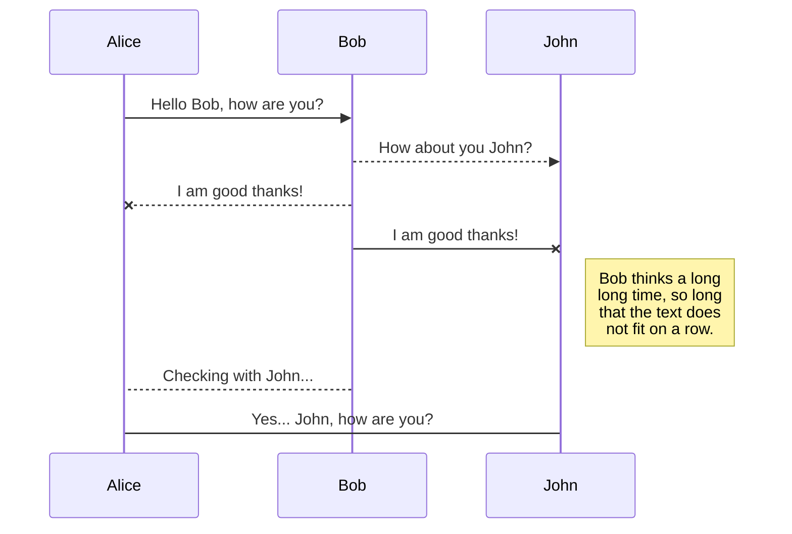
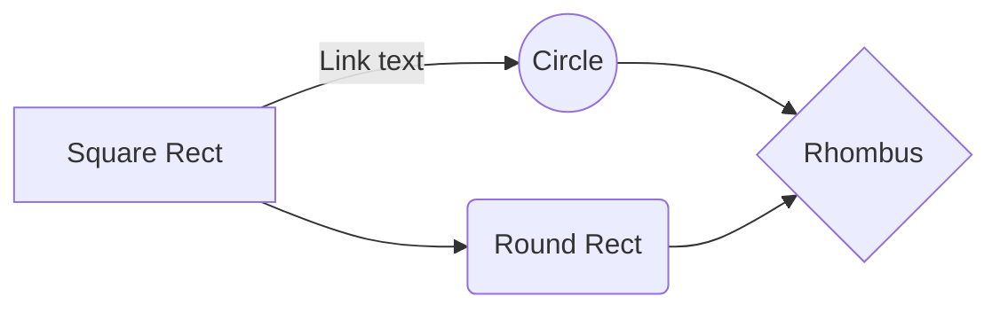

 
1 # HOLE_TO_ANOTHER_UNiVERSE################NormaniLaShaE?# 
2 # TO#####Erika#######Happy_Anniversary ##################
3 # ANOTHER##########https://s.id/1kmbG################### 
4 # UNiVERSE####################################CORaL##### 


# AndroidArchive

<iframe src="https://archive.org/embed/tumblr-rtxuqx-fij-q-1zhx-4f-1-1" width="640" height="480" frameborder="0" webkitallowfullscreen="true" mozallowfullscreen="true" allowfullscreen></iframe>

Sartu, Vanessa, Normani whatever you go by,The mayor might be bullied by that group participating in The [Coup of LosAngeles](https://www.google.com/search?sca_esv=6ff7ee4f5c0b1e29&rlz=1CASLJZ_enUS1113&sxsrf=ADLYWILNPFUnj-3wzC-9tpZb7tcOV3MmWQ:1718052799915&q=los+angeles+riots&tbm=nws&source=lnms&fbs=AEQNm0Aa4sjWe7Rqy32pFwRj0UkWd8nbOJfsBGGB5IQQO6L3J5MIFhvnvU242yFxzEEp3BfblMs7eBu5zPnhtGsrETMyhOqzWtfgc_pCzrf4BYocXLJaX0gJBEKL77s1Ay-4tHfnMqP5vC_ZT8lpSywyzIaNxlK3h27DKyjP4cAIPUhzalTbEILgzj9kP6BqoP0xWu6yYBTYByfUljVA60k5fyr5AlSneg&sa=X&sqi=2&ved=2ahUKEwikruC29dGGAxUbL0QIHVtnA3AQ0pQJegQIDRAB&biw=960&bih=945&dpr=1) [LA 92 (natGeo)](https://www.nationalgeographic.com/tv/movies-and-specials/dab898d3-4259-4f15-bdc8-1ed62c7cfc5e) hollywood must be on some strange [vpn](https://www.nsa.gov/cybersecurity/)! 

### coup d'é·tat
## /ˌko͞o dāˈtä/
A coup d'état (/ˌkuːdeɪˈtɑː/ ⓘ; French: [ku deta]; lit. 'stroke of state'),[1] or simply a coup, is typically an illegal and overt attempt by a military organization or other government elites to unseat an incumbent leadership.[2][3] A self-coup is when a leader, having come to power through legal means, tries to stay in power through illegal means.[3] [ReadMoreOnWikipedia](https://en.wikipedia.org/wiki/Coup_d%27%C3%A9tat)


## Anime 

### Sailor Moon The Movies VHS English Edited Version

### [Sailor Moon The Movies Special Uncut Subtitled Edition VHS](https://archive.org/details/sailor-moon-the-movies-special-uncut-subtitled-edition-vhs_202109)

These are from the official uncut subtitled edition VHS tapes released by Pioneer Entertainment
 . [ReadMoreOnWikipedia](https://en.wikipedia.org/wiki/Sailor_Moon)
<video controls 
  src="https://archive.org/download/sailor-moon-the-movies-special-uncut-subtitled-edition-vhs_202109/Sailor%20Moon%20R%20The%20Movie%20Special%20Uncut%20Subtitled%20Edition%20VHS.mp4"
  poster="https://media0.giphy.com/media/v1.Y2lkPTc5MGI3NjExcm51ZDhkdDR1MHh5YjVxMHg2aXI0a25ydWU1MjM5M3ZvN2hoMnl1ayZlcD12MV9pbnRlcm5hbF9naWZfYnlfaWQmY3Q9Zw/Djk6OV5llwUb6/giphy.webp">

  Sorry, your browser doesn't support embedded videos, but don't worry, you can
  <a href="https://archive.org/download/sailor-moon-the-movies-special-uncut-subtitled-edition-vhs_202109/Sailor%20Moon%20R%20The%20Movie%20Special%20Uncut%20Subtitled%20Edition%20VHS.mp4">download it</a>
  and watch it with your favorite video player!
</video>
<a href="https://upload.wikimedia.org/wikipedia/en/1/15/Pretty_Soldier_Sailor_Moon_arcade_flyer.jpg">

### [Sailor Moon Laserdisc Vol 1-3](https://archive.org/details/sailor-moon-ld-vol-2) [imdb](https://www.imdb.com/title/tt0103369/)
## Pretty Soldier Sailor Moon (Ver. 95-03-22B Europe)
### hit tab to configure keyys
 ~> [Quick guide on how to play on the Internet Arcade](https://armchairarcade.com/perspectives/2014/11/06/quick-guide-on-how-to-play-on-the-internet-arcade/)
 Pretty Soldier Sailor Moon[a] is a side-scrolling beat 'em up arcade video game developed by Gazelle and released on March 22, 1995. It was published by Banpresto.[2][3] It is the first game to be created by Gazelle, one of the offshoots of defunct developer Toaplan that were founded after they declared bankruptcy in 1994, and one of the few titles based upon Naoko Takeuchi's Sailor Moon shōjo manga and anime series that had an official international release, and it also has been compared with other titles in the same genre such as Capcom's Final Fight and Technōs Japan's Double Dragon.[4][5][ReadMoreoNWikiPedia](https://en.wikipedia.org/wiki/Pretty_Soldier_Sailor_Moon_(arcade_game))
<iframe src="https://archive.org/embed/arcade_sailormn" width="100%" height="450px" frameborder="0" webkitallowfullscreen="true" mozallowfullscreen="true" allowfullscreen></iframe>

## Live Action 
### Knight Rider 2010 (1994)
Loosely based on the popular television series of the 80's, this movie brings the story into an apocalyptic time and a new "KITT". [imdb](https://www.imdb.com/title/tt0110273/) /////// Knight Rider 2010 is a 1994 American science fiction action television film directed by Sam Pillsbury and written by John Leekley, loosely based on the television series Knight Rider. The film stars Richard Joseph Paul, Heidi Leick, Michael Beach, and Don McManus. It aired in syndication in the United States on February 13, 1994, as part of Universal Television's Action Pack programming block. [ReadMoreOnWikipedia](https://en.wikipedia.org/wiki/Knight_Rider_2010)
<video controls 
  src="https://archive.org/download/knight-rider-2010-1994/Knight%20Rider%202010-%201994.mp4"
  poster="https://m.media-amazon.com/images/M/MV5BMjJiYjYyZTAtM2ViMi00Yjg3LWJmZjItYTNhNjI5YzUzYmQxXkEyXkFqcGdeQXVyMjQ4Nzk0MDU@._V1_FMjpg_UX1000_.jpg">

  Sorry, your browser doesn't support embedded videos, but don't worry, you can
  <a href="https://archive.org/download/knight-rider-2010-1994/Knight%20Rider%202010-%201994.mp4">download it</a>
  and watch it with your favorite video player!
</video>


<a href="https://upload.wikimedia.org/wikipedia/en/9/90/X-Men_COTA_arcade_flyer.jpg">

## X-Men - Children Of The Atom (950105 USA)
X-Men: Children of the Atom (Japanese: エックス・メン　チルドレン　オブ　ジ　アトム, Hepburn: Ekkusu Men Chirudoren obu ji Atomu) is an arcade game that was produced by Capcom and released on the CP System II arcade hardware in 1994 in Japan and in 1995 in North America and Europe.

Based on the X-Men comic book, it is the first fighting game produced by Capcom using characters under license from Marvel Comics. Released around the time of the mid-1990s X-Men animated series, the game features voice actors from the series reprising their roles. The game's plot is based on the "Fatal Attractions" story from the comics – players control one of the X-Men or their enemies in their fight against the villain Magneto. They face each of the other characters in the game in best of three one-on-one fighting matches, before battling Juggernaut and Magneto.

The gameplay has much in common with Capcom's previous fighting games, Super Street Fighter II Turbo and Darkstalkers. Children of the Atom adds a combo system that features long combos that can even be performed in mid-air. Also featured in the game are various tactical maneuvers, including the ability for characters to roll. Children of the Atom introduced multi-tiered fighting environments in which the ground would crumble and characters would fall into lower parts of the level. These concepts and the fast pace of the game would provide the basis for Capcom's Marvel vs. Capcom series, which started with the game's successor X-Men vs. Street Fighter.

Ports of the game were released for Sega Saturn, PlayStation and personal computer. Of these, the PlayStation version was not as well received as the other versions, suffering from slowdown and missing frames of animation. [ReadMoreOnWikiPedia](https://en.wikipedia.org/wiki/X-Men:_Children_of_the_Atom_%28video_game%29)
[SaveState](ricothaka.github.io/xmcotau.save)
[PlayHere](https://www.retrogames.cc/arcade-games/x-men-children-of-the-atom-950105-usa.html#)

 

[Designing For Print With CSS](https://www.smashingmagazine.com/2015/01/designing-for-print-with-css/)
[Index of /~duncjo01/archive/patterns/windows/ancestry](http://cs.gettysburg.edu/~duncjo01/archive/patterns/windows/ancestry/)

[parie wind](http://cs.gettysburg.edu/~duncjo01/archive/patterns/windows/ancestry/Prairie%20Wind.bmp) <~ tile>

[Copy.sh/windows5nt](https://copy.sh/v86/)


 <div class="mro_banner">
  
  <div class="innertext-block">
    <h4>Los Angeles</h4>
    <p>hole to another universe</p>
  </div>
</div>   

### The Red Planet Mars
An American scientist is able to contact and communicate with Mars with shattering political, economic, and spiritual repercussions. [imdb](https://www.imdb.com/title/tt0045073/)
<video controls 
  src="https://archive.org/download/the-red-planet-mars/the%20red%20planet%20mars.mp4"
  poster="https://i.ebayimg.com/images/g/31cAAOSwu1VW6VuC/s-l1600.webp">

  Sorry, your browser doesn't support embedded videos, but don't worry, you can
  <a href="https://archive.org/download/the-red-planet-mars/the%20red%20planet%20mars.mp4">download it</a>
  and watch it with your favorite video player!
</video>


[My Favorite Martian Season 1 Episode 1 (1963) My Favorite Martin](https://www.youtube.com/watch?v=9bg9AGmYv84)
[My Favorite Martian Full Episodes Season 1 E20 - My Nephew The Artist](https://www.dailymotion.com/video/x822j08)
[My Favorite Martian Full Episodes Season 3 E23 - When A Martian Makes His Violin Cry](https://www.dailymotion.com/video/x81hpd9)
[Full text of "The book of Mars"](https://archive.org/stream/bookofmars00glas/bookofmars00glas_djvu.txt)

[](https://ia601307.us.archive.org/17/items/AILS_AC89-0437-6/AC89-0437-6.jpg "Redirect to homepage")
[](https://pbs.twimg.com/media/GPgeOx9aAAADgZP?format=jpg&name=large "Redirect to homepage")
[](https://pbs.twimg.com/media/GL-EXkdaEAAUeYT?format=jpg&name=large "Redirect to homepage")
[](https://science.nasa.gov/wp-content/uploads/2024/03/mars-dust-storms-global-pia03170.jpg "Redirect to homepage")
<object data="https://murray-lab.caltech.edu/CTX/V01/SceneView/MurrayLabCTXmosaic.html" width="100%" height=400px >
    </object>

[Electronic Gaming Monthly 58](https://archive.org/details/Electronic_Gaming_Monthly_58)
[GamePro Issue 049 August 1993](https://archive.org/details/GamePro_Issue_049_August_1993)
[GamePro Issue 056 March 1994 NBAJAM(s)](https://archive.org/details/GamePro_Issue_056_March_1994)
### [The Global CTX Mosaic of Mars](https://murray-lab.caltech.edu/CTX/index.html)

The Bruce Murray Laboratory for Planetary Visualization has completed a 5.7 terapixel mosaic of the surface of Mars rendered at 5.0 m/px. Each pixel in the mosaic is about the size of a typical parking space, providing unprecedented resolution of the martian surface at the global scale.

We emphasize transparency both in how the mosaic was generated and for users to understand where data in the mosaic come from. We have developed a Python-based pipeline that incorporates non-destructive image processing techniques that preserve all information about the original data that comprise the mosaic and map all seams.. [LearnMore](https://murray-lab.caltech.edu/CTX/index.html)

[Mars:SpaceFlightFacility](https://mars.asu.edu/) [Themis Mars Imageviewer](https://viewer.mars.asu.edu/viewer/themis#T=0) [Themis MArs Odyssey](https://global-data.mars.asu.edu/bin/themis.pl?res=32&clat=-51.956467&clon=34.130493&ids=I18584006&day_night=2&rel=0)

### [Thermal Emission Imaging System](https://en.wikipedia.org/wiki/Thermal_Emission_Imaging_System)

[The Global CTX Mosaic of Mars](https://murray-lab.caltech.edu/CTX/index.html)

# [Fine Ho, Stay](https://www.rcarecords.com/news/flo-milli-announces-new-album-fine-ho-stay/)
[](https://cdn-p.smehost.net/sites/8e1f40b762984a27a20f577d99b7ac97/wp-content/uploads/2023/07/Unknown-1.png "Redirect to homepage")
<embed  src="https://w.soundcloud.com/player/?url=https%3A//api.soundcloud.com/tracks/1772831295&color=%2300ffc8&auto_play=false&hide_related=false&show_comments=true&show_user=true&show_reposts=false&show_teaser=true&visual=true" />
<div style="font-size: 10px; color: #cccccc;line-break: anywhere;word-break: normal;overflow: hidden;white-space: nowrap;text-overflow: ellipsis; font-family: Interstate,Lucida Grande,Lucida Sans Unicode,Lucida Sans,Garuda,Verdana,Tahoma,sans-serif;font-weight: 100;"><a href="https://soundcloud.com/flomilli" title="Flo Milli" target="_blank" style="color: #cccccc; text-decoration: none;">Flo Milli</a> · <a href="https://soundcloud.com/flomilli/cant-stay-mad" title="Can&#x27;t Stay Mad" target="_blank" style="color: #cccccc; text-decoration: none;">Can&#x27;t Stay Mad</a></div>

[FloMilli](https://soundcloud.com/flomilli/cant-stay-mad?in=flomilli/sets/fine-ho-stay) [AILS-AC79-7007](https://archive.org/details/AILS-AC79-7007)

# Vanessa, im convinced its you

<video controls 
  src="https://raw.githubusercontent.com/ricoThaka/ricothaka.github.io/master/assets/video/teslacoilsnormaniismissing.mp4"
  poster="https://griffithobservatory.org/wp-content/uploads/2021/11/griffithobservatory_20200623_013-scaled-1600x800-1638850104.jpg"
  >
  Sorry, your browser doesn't support embedded videos, but don't worry, you can
  <a href="https://archive.org/details/youtube-l14WDZCnz-w">download it</a>
  and watch it with your favorite video player!
</video>


[Need for Speed](https://archive.org/details/msdos_Need_for_Speed_The_1995)


## [JoeMontana Sports Talk Football ](https://retrogames.cc/genesis-games/joe-montana-ii-sports-talk-football-world-rev-a.html)
# Dear_Coral 
i was a #GeorgiaDomeChild #Sports #StemEducation @ChloeBailey
 an the other girls from #Dance411 was just like #Dreamgirls an they were my destined #EternalFriends bc iMade a wish to 
[AtlantaFalcons #CheerLeaders!](https://www.atlantafalcons.com/cheerleaders/)
[Play_Here](https://retrogames.cc/genesis-games/joe-montana-ii-sports-talk-football-world-rev-a.html)
### Excerpt from Genesis Game Guide by The Scribe
Sega's in-house pro football sim - a YACEG series that
                  went with Joe Montana as its spokesman until the 1996
                  release, when the decision was made to use Deion Sanders
                  instead.  The second, NFL Sportstalk Football, was the
                  very first videogame to feature a running commentary, and
                  was the subject of a special feature on the British
                  television program Tomorrow's World. [Read_More](http://backup.segakore.fr/genesiscollective/ShowPage00000000028B686721.htm)

<div class='twoPanelSpread'>
        <div class='row'>
          <div class='panelColumn'>
            <div class='leftColumn'>
             <a href="https://pbs.twimg.com/media/GNJ1ZpGa4AAA7UB?format=jpg&name=medium"> </a>
            </div>
          </div>
          <div class='panelColumn'>
            <div class='rightColumn'>
             <a href="https://pbs.twimg.com/media/GNJ1bsgaAAEOeM0?format=jpg&name=900x900"> </a>
   </div>
  </div>    
 </div>
</div>

[Play_Here](https://retrogames.cc/genesis-games/joe-montana-ii-sports-talk-football-world-rev-a.html)


# smmokers only 
<blockquote class="twitter-tweet"><p lang="en" dir="ltr"><a href="https://twitter.com/hashtag/Proposition64?src=hash&amp;ref_src=twsrc%5Etfw">#Proposition64</a>:<a href="https://twitter.com/hashtag/TheAdultUseofMarijuanaAct?src=hash&amp;ref_src=twsrc%5Etfw">#TheAdultUseofMarijuanaAct</a> <a href="https://t.co/jzFfPyUG4T">https://t.co/jzFfPyUG4T</a> <a href="https://t.co/80xOq7YMNM">https://t.co/80xOq7YMNM</a> <a href="https://twitter.com/hashtag/SacramentoKings?src=hash&amp;ref_src=twsrc%5Etfw">#SacramentoKings</a> <a href="https://t.co/y6ySzNeMwu">https://t.co/y6ySzNeMwu</a> <a href="https://twitter.com/UCBerkeley?ref_src=twsrc%5Etfw">@UCBerkeley</a> <a href="https://twitter.com/UCLAHealth?ref_src=twsrc%5Etfw">@UCLAHealth</a> said i was on <a href="https://twitter.com/hashtag/opiods?src=hash&amp;ref_src=twsrc%5Etfw">#opiods</a> <a href="https://twitter.com/RepKarenBass?ref_src=twsrc%5Etfw">@RepKarenBass</a> i want to <a href="https://twitter.com/hashtag/renew?src=hash&amp;ref_src=twsrc%5Etfw">#renew</a> and get connected to a <a href="https://twitter.com/hashtag/SafeDispensary?src=hash&amp;ref_src=twsrc%5Etfw">#SafeDispensary</a> <a href="https://twitter.com/Normani?ref_src=twsrc%5Etfw">@normani</a> <a href="https://twitter.com/BIABIA?ref_src=twsrc%5Etfw">@BIABIA</a> <a href="https://twitter.com/ThegirlJT?ref_src=twsrc%5Etfw">@ThegirlJT</a> <a href="https://twitter.com/NASA?ref_src=twsrc%5Etfw">@nasa</a> <a href="https://t.co/Gq5sH1FdjE">pic.twitter.com/Gq5sH1FdjE</a></p>&mdash; BubbleGumPop626 (@BubbleGumPop626) <a href="https://twitter.com/BubbleGumPop626/status/1780751404942127144?ref_src=twsrc%5Etfw">April 18, 2024</a></blockquote> <script async src="https://platform.twitter.com/widgets.js" charset="utf-8"></script>

# [Mars Reconnaissance Orbiter](https://mars.nasa.gov/gallery/images.html)


<blockquote class="twitter-tweet"><p lang="qme" dir="ltr"><a href="https://twitter.com/hashtag/AbiyMustGo?src=hash&amp;ref_src=twsrc%5Etfw">#AbiyMustGo</a> <a href="https://twitter.com/hashtag/FreeOromia?src=hash&amp;ref_src=twsrc%5Etfw">#FreeOromia</a><a href="https://twitter.com/hashtag/JawarMahammad?src=hash&amp;ref_src=twsrc%5Etfw">#JawarMahammad</a><a href="https://twitter.com/hashtag/FreeBekalaGarba?src=hash&amp;ref_src=twsrc%5Etfw">#FreeBekalaGarba</a><a href="https://twitter.com/hashtag/FreeAllPoliticalprisoners?src=hash&amp;ref_src=twsrc%5Etfw">#FreeAllPoliticalprisoners</a> <a href="https://t.co/0ObrotbNh5">pic.twitter.com/0ObrotbNh5</a></p>&mdash; sartu Adem (@SartuAdem) <a href="https://twitter.com/SartuAdem/status/1290832418618904577?ref_src=twsrc%5Etfw">August 5, 2020</a></blockquote> <script async src="https://platform.twitter.com/widgets.js" charset="utf-8"></script>
<blockquote class="twitter-tweet" data-media-max-width="560"><p lang="en" dir="ltr">Mood: <a href="https://t.co/CON2tLgY9b">pic.twitter.com/CON2tLgY9b</a></p>&mdash; GloRilla 🦍 (@GloTheofficial) <a href="https://twitter.com/GloTheofficial/status/1780637563163648270?ref_src=twsrc%5Etfw">April 17, 2024</a></blockquote> <script async src="https://platform.twitter.com/widgets.js" charset="utf-8"></script>

[](https://pbs.twimg.com/media/GMB7ujqacAEdvyt?format=jpg&name=large "Redirect to homepage")

<blockquote class="twitter-tweet"><p lang="en" dir="ltr"><a href="https://twitter.com/SecDef?ref_src=twsrc%5Etfw">@SecDef</a> <a href="https://twitter.com/SenBillNelson?ref_src=twsrc%5Etfw">@SenBillNelson</a> <a href="https://twitter.com/NASAJPL?ref_src=twsrc%5Etfw">@nasajpl</a> i got persecuted by <a href="https://twitter.com/hashtag/JehovahsWitnesses?src=hash&amp;ref_src=twsrc%5Etfw">#JehovahsWitnesses</a> for <a href="https://twitter.com/hashtag/PatrioticGraffiti?src=hash&amp;ref_src=twsrc%5Etfw">#PatrioticGraffiti</a> <a href="https://twitter.com/RepKarenBass?ref_src=twsrc%5Etfw">@RepKarenBass</a> this is how ipaint even if i dont get writtern <a href="https://twitter.com/hashtag/permission?src=hash&amp;ref_src=twsrc%5Etfw">#permission</a> <a href="https://twitter.com/HollywoodFoodCo?ref_src=twsrc%5Etfw">@HollywoodFoodCo</a> im not a <a href="https://twitter.com/hashtag/Vandal?src=hash&amp;ref_src=twsrc%5Etfw">#Vandal</a> but its a <a href="https://twitter.com/hashtag/technicality?src=hash&amp;ref_src=twsrc%5Etfw">#technicality</a> at times then the building gets burned or something <a href="https://twitter.com/hashtag/X?src=hash&amp;ref_src=twsrc%5Etfw">#X</a> <a href="https://t.co/GX73zPKSwQ">pic.twitter.com/GX73zPKSwQ</a></p>&mdash; BubbleGumPop626 (@BubbleGumPop626) <a href="https://twitter.com/BubbleGumPop626/status/1781831158394978614?ref_src=twsrc%5Etfw">April 20, 2024</a></blockquote> <script async src="https://platform.twitter.com/widgets.js" charset="utf-8"></script>

<blockquote class="twitter-tweet"><p lang="en" dir="ltr">List of <a href="https://twitter.com/hashtag/dams?src=hash&amp;ref_src=twsrc%5Etfw">#dams</a> and <a href="https://twitter.com/hashtag/reservoirs?src=hash&amp;ref_src=twsrc%5Etfw">#reservoirs</a> in <a href="https://twitter.com/hashtag/California?src=hash&amp;ref_src=twsrc%5Etfw">#California</a> <a href="https://twitter.com/LACityCouncil?ref_src=twsrc%5Etfw">@LACityCouncil</a> <a href="https://twitter.com/RepKarenBass?ref_src=twsrc%5Etfw">@RepKarenBass</a> <a href="https://twitter.com/NASAJPL?ref_src=twsrc%5Etfw">@nasajpl</a> when using <a href="https://twitter.com/NASAEarthData?ref_src=twsrc%5Etfw">@NASAEarthData</a> <a href="https://twitter.com/hashtag/ClimateJustice?src=hash&amp;ref_src=twsrc%5Etfw">#ClimateJustice</a> <a href="https://twitter.com/hashtag/Tool?src=hash&amp;ref_src=twsrc%5Etfw">#Tool</a> <a href="https://twitter.com/kdeleon?ref_src=twsrc%5Etfw">@kdeleon</a> if you want to know about where the <a href="https://twitter.com/hashtag/water?src=hash&amp;ref_src=twsrc%5Etfw">#water</a> is if a dam is listed its close to a <a href="https://twitter.com/hashtag/Resivoir?src=hash&amp;ref_src=twsrc%5Etfw">#Resivoir</a> <a href="https://twitter.com/NASAJPL?ref_src=twsrc%5Etfw">@nasajpl</a> <a href="https://twitter.com/LACoPublicWorks?ref_src=twsrc%5Etfw">@LACoPublicWorks</a> <a href="https://t.co/cGROAhViMK">https://t.co/cGROAhViMK</a> <a href="https://t.co/wGagOS3Oio">pic.twitter.com/wGagOS3Oio</a></p>&mdash; ThakaSartu KellySelassie (@thakasartu) <a href="https://twitter.com/thakasartu/status/1789384568002453589?ref_src=twsrc%5Etfw">May 11, 2024</a></blockquote> <script async src="https://platform.twitter.com/widgets.js" charset="utf-8"></script>
<blockquote class="twitter-tweet"><p lang="en" dir="ltr"><a href="https://twitter.com/SenBillNelson?ref_src=twsrc%5Etfw">@SenBillNelson</a> <a href="https://twitter.com/GADFCS?ref_src=twsrc%5Etfw">@GADFCS</a> removed my daughter for <a href="https://twitter.com/hashtag/MentalHEalthReasons?src=hash&amp;ref_src=twsrc%5Etfw">#MentalHEalthReasons</a> <a href="https://t.co/mJCwmb2L3Z">https://t.co/mJCwmb2L3Z</a> <a href="https://twitter.com/hashtag/SciFiSat?src=hash&amp;ref_src=twsrc%5Etfw">#SciFiSat</a> <a href="https://t.co/89ZCTEVhdp">pic.twitter.com/89ZCTEVhdp</a></p>&mdash; ThakaSartu KellySelassie (@thakasartu) <a href="https://twitter.com/thakasartu/status/1789397411464429890?ref_src=twsrc%5Etfw">May 11, 2024</a></blockquote> <script async src="https://platform.twitter.com/widgets.js" charset="utf-8"></script>
<blockquote class="twitter-tweet"><p lang="en" dir="ltr"><a href="https://t.co/0i1GGtEBvk">https://t.co/0i1GGtEBvk</a> <a href="https://twitter.com/Tesla?ref_src=twsrc%5Etfw">@tesla</a> <a href="https://twitter.com/hashtag/TeslaCoils?src=hash&amp;ref_src=twsrc%5Etfw">#TeslaCoils</a> <a href="https://twitter.com/NASAJPL?ref_src=twsrc%5Etfw">@nasajpl</a> i climbed <a href="https://twitter.com/hashtag/MountHollywood?src=hash&amp;ref_src=twsrc%5Etfw">#MountHollywood</a> &amp; saw the <a href="https://twitter.com/hashtag/TeslaCoils?src=hash&amp;ref_src=twsrc%5Etfw">#TeslaCoils</a> <a href="https://twitter.com/GriffithObserv?ref_src=twsrc%5Etfw">@GriffithObserv</a> / <a href="https://twitter.com/RepKarenBass?ref_src=twsrc%5Etfw">@RepKarenBass</a> ppl playing <a href="https://twitter.com/Coolio?ref_src=twsrc%5Etfw">@Coolio</a> <a href="https://twitter.com/hashtag/GangstersParadise?src=hash&amp;ref_src=twsrc%5Etfw">#GangstersParadise</a> in <a href="https://twitter.com/Braves?ref_src=twsrc%5Etfw">@Braves</a> <a href="https://twitter.com/hashtag/hats?src=hash&amp;ref_src=twsrc%5Etfw">#hats</a> <a href="https://twitter.com/LBCityLibrary?ref_src=twsrc%5Etfw">@LBCityLibrary</a> tell them girls from <a href="https://twitter.com/hashtag/Georgia?src=hash&amp;ref_src=twsrc%5Etfw">#Georgia</a> <a href="https://twitter.com/hashtag/walkoffame?src=hash&amp;ref_src=twsrc%5Etfw">#walkoffame</a> <a href="https://twitter.com/Latto?ref_src=twsrc%5Etfw">@latto</a> <a href="https://twitter.com/xm_muva?ref_src=twsrc%5Etfw">@xm_muva</a> <a href="https://twitter.com/Normani?ref_src=twsrc%5Etfw">@normani</a> <a href="https://twitter.com/hashtag/ilovethem?src=hash&amp;ref_src=twsrc%5Etfw">#ilovethem</a> <a href="https://t.co/HV1THJGDaU">pic.twitter.com/HV1THJGDaU</a></p>&mdash; BubbleGumPop626 (@BubbleGumPop626) <a href="https://twitter.com/BubbleGumPop626/status/1799156543474274418?ref_src=twsrc%5Etfw">June 7, 2024</a></blockquote> <script async src="https://platform.twitter.com/widgets.js" charset="utf-8"></script>

# [Geisha - JodiCobb](https://www.jodicobb.com/portfolio/G00002GbAqpURBhA)
[](https://showme.missouri.edu/wp-content/uploads/2019/10/NGM199510_98.jpg "Redirect to homepage")
>The sealed lips of a geisha woman in Japan represented for Cobb a potent symbol of a secret world hidden from outsiders. It also led to a three-year project that pulled back the curtain on the geishas, culminating in a book nominated for the Pulitzer Prize.

[Through the lens of Jodi Cobb](https://showme.missouri.edu/2019/through-the-lens-of-jodi-cobb/) [JodiCobbDoc](https://m.facebook.com/thesmithcenter/videos/as-national-geographics-first-female-staff-in-field-photographer-jodi-cobb-infil/1205963793249956/) [Global Speakers Series: National Geographic Photographer Jodi Cobb Awes Students](https://www.newarka.edu/news-detail_no-photo?pk=1333705) Jodi Cobb has spent three decades as a staff photographer with National Geographic, working in more than sixty countries—[Jodi Cobb](https://thephotosociety.org/member/jodi-cobb/) [Henri Cartier-Bresson magnumprofile](https://www.magnumphotos.com/photographer/henri-cartier-bresson/) [Bruce Davidson magnumprofile](https://www.magnumphotos.com/photographer/bruce-davidson/) [Elliot Erwitt magnumprofile](https://www.magnumphotos.com/photographer/elliott-erwitt/)

[](https://pbs.twimg.com/media/GB2WGN8bEAAfbCx?format=jpg&name=large "Redirect to homepage")


<embed  src="https://w.soundcloud.com/player/?url=https%3A//api.soundcloud.com/tracks/217049673&color=%23ea27c2&auto_play=false&hide_related=false&show_comments=true&show_user=true&show_reposts=false&show_teaser=true&visual=true" />

<blockquote class="twitter-tweet"><p lang="en" dir="ltr">i like your new sound dont let <a href="https://twitter.com/hashtag/Sno?src=hash&amp;ref_src=twsrc%5Etfw">#Sno</a> steal credit <a href="https://t.co/0gw5wKXqQF">https://t.co/0gw5wKXqQF</a> its not just me!!! <a href="https://twitter.com/girlsinrap?ref_src=twsrc%5Etfw">@girlsinrap</a> <a href="https://twitter.com/NASAGISS?ref_src=twsrc%5Etfw">@NASAGISS</a> <a href="https://twitter.com/NASAJPL?ref_src=twsrc%5Etfw">@NASAJPL</a> <a href="https://twitter.com/Drake?ref_src=twsrc%5Etfw">@drake</a> can tell u whats up bc his <a href="https://twitter.com/hashtag/friend?src=hash&amp;ref_src=twsrc%5Etfw">#friend</a> <a href="https://twitter.com/21savage?ref_src=twsrc%5Etfw">@21savage</a> etyc was crushing me feeds for a long time after <a href="https://twitter.com/Dance411?ref_src=twsrc%5Etfw">@dance411</a> <a href="https://twitter.com/elonmusk?ref_src=twsrc%5Etfw">@elonmusk</a> <a href="https://twitter.com/hashtag/cybersecuritynews?src=hash&amp;ref_src=twsrc%5Etfw">#cybersecuritynews</a> <a href="https://twitter.com/NASA_Astronauts?ref_src=twsrc%5Etfw">@NASA_Astronauts</a> <a href="https://t.co/UjJcE9gpqa">pic.twitter.com/UjJcE9gpqa</a></p>&mdash; ThakaSartu KellySelassie (@thakasartu) <a href="https://twitter.com/thakasartu/status/1780734612731498704?ref_src=twsrc%5Etfw">April 17, 2024</a></blockquote> <script async src="https://platform.twitter.com/widgets.js" charset="utf-8"></script>

<blockquote class="twitter-tweet"><p lang="en" dir="ltr"><a href="https://t.co/C0GRMIKEpw">https://t.co/C0GRMIKEpw</a> hi guys im studying <a href="https://twitter.com/hashtag/ThePlanetMars?src=hash&amp;ref_src=twsrc%5Etfw">#ThePlanetMars</a> <a href="https://twitter.com/NASAJPL?ref_src=twsrc%5Etfw">@nasajpl</a> from <a href="https://twitter.com/hashtag/satelitteOffice?src=hash&amp;ref_src=twsrc%5Etfw">#satelitteOffice</a> <a href="https://twitter.com/LBCityLibrary?ref_src=twsrc%5Etfw">@LBCityLibrary</a> <a href="https://twitter.com/hashtag/thanks?src=hash&amp;ref_src=twsrc%5Etfw">#thanks</a> <a href="https://twitter.com/AEBeach_High?ref_src=twsrc%5Etfw">@AEBeach_High</a> <a href="https://twitter.com/SCADdotedu?ref_src=twsrc%5Etfw">@SCADdotedu</a> <a href="https://twitter.com/SavTech?ref_src=twsrc%5Etfw">@SavTech</a> <a href="https://twitter.com/hashtag/KingdomHall?src=hash&amp;ref_src=twsrc%5Etfw">#KingdomHall</a> <a href="https://twitter.com/hashtag/SeyHey?src=hash&amp;ref_src=twsrc%5Etfw">#SeyHey</a> <a href="https://twitter.com/Normani?ref_src=twsrc%5Etfw">@normani</a> <a href="https://twitter.com/GloTheofficial?ref_src=twsrc%5Etfw">@GloTheofficial</a> <a href="https://t.co/0Cs0WHiiJX">pic.twitter.com/0Cs0WHiiJX</a></p>&mdash; ThakaRasharD (@MooNLOVER404) <a href="https://twitter.com/MooNLOVER404/status/1798843477545156615?ref_src=twsrc%5Etfw">June 6, 2024</a></blockquote> <script async src="https://platform.twitter.com/widgets.js" charset="utf-8"></script>

## Jehovah’s Witnesses— INSIDE The Organization behind the *Name* [Full length]
<iframe width="560" height="315" src="https://www.youtube.com/embed/hThVzMExULQ?si=7OuW6UmEPlAVQbDf" title="YouTube video player" frameborder="0" allow="accelerometer; autoplay; clipboard-write; encrypted-media; gyroscope; picture-in-picture; web-share" referrerpolicy="strict-origin-when-cross-origin" allowfullscreen></iframe>


[The Dark Secret at the Heart of the Jehovah’s WitnessesInformer](https://youtu.be/THfpDRdsQhs?si=Bh1fvf72_1hNch1E)

<iframe width="560" height="315" src="https://www.youtube.com/embed/xUDNMmbYtkw?si=fUq2tGtAzodru__0" title="YouTube video player" frameborder="0" allow="accelerometer; autoplay; clipboard-write; encrypted-media; gyroscope; picture-in-picture; web-share" referrerpolicy="strict-origin-when-cross-origin" allowfullscreen></iframe>

[Headz Ain't Redee (Beatminerz Remix)](https://youtu.be/j3kMvvg2H8g?si=-tccwtxGaZ6pzYeG)
[OJ Da Juiceman - FranKSinatra](https://youtu.be/XCz2BhlS1YM?si=qZGksh_QTRJTBajn)
[E=MC2 (Instrumental)](https://youtu.be/QPghMQJNslI?si=fK03a5gnFaohLnxD)


# Manessa?
do ppl at [RedBull3Style](https://www.redbull.com/us-en/events/red-bull-3style-world-final) well.. [Oracle](https://www.oracle.com/redbullracing/) is into racing so i dont know where you stand, since a lot of the Dance Sex partners are moving forward, how long will these guys take ? I belive you are [Normani](https://www.tiktok.com/@normani?lang=en) & [KashDoll...KayDEE!!](https://www.instagram.com/kashdoll/) 

Yo `https://kashdoll.com` is [redirecting](https://www.site24x7.com/learn/dns-redirects.html) to [Instagram](https://www.instagram.com/kashdoll/) and im at [the library n LongBeach](https://longbeach.gov/library)

```
Something went wrong
There's an issue and the page could not be loaded.
```

So you are down one [media channel](https://www.activecampaign.com/glossary/media-channel#:~:text=A%20media%20channel%20refers%20to,and%20engage%20a%20target%20audience.)

<blockquote class="twitter-tweet"><p lang="en" dir="ltr"><a href="https://twitter.com/hashtag/Theft?src=hash&amp;ref_src=twsrc%5Etfw">#Theft</a>! <a href="https://twitter.com/kashdoll?ref_src=twsrc%5Etfw">@kashdoll</a> <a href="https://twitter.com/hashtag/yo?src=hash&amp;ref_src=twsrc%5Etfw">#yo</a> <a href="https://twitter.com/hashtag/JuryBOWX?src=hash&amp;ref_src=twsrc%5Etfw">#JuryBOWX</a> <a href="https://t.co/Og8rftyMvK">https://t.co/Og8rftyMvK</a> <a href="https://twitter.com/hashtag/Blacktwitter?src=hash&amp;ref_src=twsrc%5Etfw">#Blacktwitter</a> <a href="https://twitter.com/hashtag/GirlsInRap?src=hash&amp;ref_src=twsrc%5Etfw">#GirlsInRap</a> <a href="https://twitter.com/RepKarenBass?ref_src=twsrc%5Etfw">@RepKarenBass</a> she got <a href="https://twitter.com/hashtag/robbd?src=hash&amp;ref_src=twsrc%5Etfw">#robbd</a> <a href="https://twitter.com/MagicCity?ref_src=twsrc%5Etfw">@MagicCity</a> u some bum ass <a href="https://twitter.com/hashtag/LLC?src=hash&amp;ref_src=twsrc%5Etfw">#LLC</a>? <a href="https://twitter.com/GADFCS?ref_src=twsrc%5Etfw">@GADFCS</a> i found manesssah jEERYBOWX <a href="https://twitter.com/FGTV?ref_src=twsrc%5Etfw">@FGTV</a> ~&gt; <a href="https://twitter.com/LAPDHQ?ref_src=twsrc%5Etfw">@LAPDHQ</a> <a href="https://twitter.com/hashtag/reward?src=hash&amp;ref_src=twsrc%5Etfw">#reward</a> <a href="https://twitter.com/Essence?ref_src=twsrc%5Etfw">@essence</a> <a href="https://t.co/8u9LwCE5Mh">https://t.co/8u9LwCE5Mh</a> <a href="https://t.co/LaVBXXzbdq">pic.twitter.com/LaVBXXzbdq</a></p>&mdash; ThakaRasharD (@MooNLOVER404) <a href="https://twitter.com/MooNLOVER404/status/1798793748002033784?ref_src=twsrc%5Etfw">June 6, 2024</a></blockquote> <script async src="https://platform.twitter.com/widgets.js" charset="utf-8"></script>

## Barbie Drip by Nicki Minaj

  <audio controls src="https://archive.org/download/nicki-minaj-barbie-drip/Nicki%20Minaj-Barbie%20Drip.mp3"></audio>
  <a href="https://archive.org/download/nicki-minaj-barbie-drip/Nicki%20Minaj-Barbie%20Drip.mp3"> Download audio </a>


## KASHDOLL ROBBED IN LA!!!
<iframe width="560" height="315" src="https://www.youtube.com/embed/6s4slL3_jtI?si=yaD8RfZzy_yX1Nod" title="YouTube video player" frameborder="0" allow="accelerometer; autoplay; clipboard-write; encrypted-media; gyroscope; picture-in-picture; web-share" referrerpolicy="strict-origin-when-cross-origin" allowfullscreen></iframe>

[](https://pbs.twimg.com/media/GB1AwzYbMAAfdl7?format=jpg&name=medium "Redirect to homepage")
[](https://pbs.twimg.com/media/GB1Aw_laYAAmtOP?format=jpg&name=medium "Redirect to homepage")
[](https://pbs.twimg.com/media/GB1AxL2bkAAKRfI?format=jpg&name=medium "Redirect to homepage")
[](https://pbs.twimg.com/media/GPaZNl_aEAEahaL?format=jpg&name=large "Redirect to homepage")
[](https://pbs.twimg.com/media/GB2WGN8bEAAfbCx?format=jpg&name=large "Redirect to homepage")


[](https://pbs.twimg.com/media/GB2WGN8bEAAfbCx?format=jpg&name=large "Redirect to homepage")


   <div class="vert-container">

   <div class="vert-items"> <a href="https://pbs.twimg.com/media/GB2WF_JbQAAmmB_?format=jpg&name=large" > </a></div>
         <div class="vert-items"> <a href="https://pbs.twimg.com/media/GB2WGaHbsAAfCHM?format=jpg&name=large" > </a>
  </div>
           <div class="vert-items"> <a href="https://github.com/ricoThaka/ricothaka.github.io/blob/master/assets/images/android528/mk2/tumblr_422574a2a84fdc1f84143fbb4fb4e451_f9d1ed33_1280.png?raw=true" > </a>
</div>
           <div class="vert-items"> <a href="https://github.com/ricoThaka/ricothaka.github.io/blob/master/assets/images/android528/mk2/tumblr_b7ec0181314aca1ff2262730a0d3085a_587e241e_1280.png?raw=true" > </a>
        </div>

   </div>
  <div class="border"> </div>

[DeKAy_FReeAGEnTS FlipTheScript](https://youtu.be/Zg9H7urB3kk)
<!-- BEGIN_CODE_BLOCK -->
<!-- TWO_PANEL_FLIPFLOP_ROLLOVER_SPREAD -->
<div id="rollovercontainer">
  <div class='twoPanelSpread'>
    <div class='row'>
      <div class='panelColumn'>
        <div class='leftColumn'>
<a href="https://soundcloud.com/ivthe4" class="rollover">
            
            
          </a>
        </div>
      </div>
      <div class='panelColumn'>
        <div class='rightColumn'>
          <a href="https://www.ellamai.com/" class="rollover">

           

          </a>
        </div>
      </div>
    </div>
  </div>
</div>
<!-- TWO_PANEL_FLIPFLOP_ROLLOVER_SPREAD -->
<!-- END_CODE_BLOCK -->
[Wu Tang Collection - 60 SECOND ASSASSIN AKA(My Life's on the Line) & Dumb Boxer](https://www.youtube.com/watch?v=5Hg-WTb86rM)

### [SONG People Under the Stairs - Acid Raindrops](https://youtu.be/Dm6hcG5GT24?si=ZCPd1U52-YT6NeDE)

<blockquote class="twitter-tweet" data-media-max-width="560"><p lang="cs" dir="ltr"><a href="https://t.co/kkk4AmN6nE">https://t.co/kkk4AmN6nE</a> <a href="https://twitter.com/hashtag/hint?src=hash&amp;ref_src=twsrc%5Etfw">#hint</a> <a href="https://twitter.com/Latto?ref_src=twsrc%5Etfw">@latto</a> <a href="https://twitter.com/coi_leray?ref_src=twsrc%5Etfw">@coi_leray</a> <a href="https://twitter.com/BIABIA?ref_src=twsrc%5Etfw">@BIABIA</a> <a href="https://twitter.com/ellamai?ref_src=twsrc%5Etfw">@ellamai</a> <a href="https://twitter.com/hashtag/feelgoodfreestyle?src=hash&amp;ref_src=twsrc%5Etfw">#feelgoodfreestyle</a> what can u doo <a href="https://twitter.com/TinyMajorMama?ref_src=twsrc%5Etfw">@TinyMajorMama</a> si=lIDsU2V3fgFdm3ew… <a href="https://twitter.com/hashtag/westcoast?src=hash&amp;ref_src=twsrc%5Etfw">#westcoast</a> <a href="https://twitter.com/hashtag/beats?src=hash&amp;ref_src=twsrc%5Etfw">#beats</a> <a href="https://twitter.com/Official_Tink?ref_src=twsrc%5Etfw">@Official_Tink</a> <a href="https://twitter.com/AsianDaBrattt?ref_src=twsrc%5Etfw">@AsianDaBrattt</a></p>&mdash; ThakaRasharD (@MooNLOVER404) <a href="https://twitter.com/MooNLOVER404/status/1798783211742613689?ref_src=twsrc%5Etfw">June 6, 2024</a></blockquote> <script async src="https://platform.twitter.com/widgets.js" charset="utf-8"></script>


# [FraggleRock](https://archive.org/details/MashSeries)
### the dozers
<video controls 
  src="https://archive.org/download/MashSeries/Fraggle%20Rock%20Season%201/Fraggle%20Rock%20S01%20E19%20-%20The%20Great%20Radish%20Famine.mp4"
  poster="https://th.bing.com/th/id/R.931b92c10e6f6c4a88d761939e30e02f?rik=jPOZroQ7QyMY1A&pid=ImgRaw&r=0"
  >
  Sorry, your browser doesn't support embedded videos, but don't worry, you can
  <a href="https://archive.org/download/MashSeries/Fraggle%20Rock%20Season%201/Fraggle%20Rock%20S01%20E19%20-%20The%20Great%20Radish%20Famine.mp4">download it</a>
  and watch it with your favorite video player!
</video>

[ROUJIN Z - Full Movie [HD] English Subs (1991) 老人Z](https://youtu.be/X5i0JU_NsZU?si=5Gc_KArc6yFLWf4c)
[Fatal Fury The Motion Picture (English Dubbed) [VHS]](https://youtu.be/3zL3sHYkxeQ?si=eFCVYYrjEXamXnmx) [Fatal Fury - Legend of the Hungry Wolf (English Dubbed) [VHS]](https://youtu.be/zjqRT8z6kck?si=2K4LJaDB0aIZbtFg) [Metal Skin Panic MADOX- 01 (1987)](https://youtu.be/PUi6RPZv7hw?si=Wxfmsv2lL1Tw1d_H) [Dominion: Tank Police | ドミニオン | Episodes 1-4 | 1988](https://youtu.be/5jeKkbfvId4?si=sxkbyJ22PiIRNjkL) [The Show Documentary (1995)](https://youtu.be/YL18g4yHVYY?si=0W35kNuuzEuhh8Uw)


<blockquote class="twitter-tweet"><p lang="en" dir="ltr">Normani at <a href="https://twitter.com/Essence?ref_src=twsrc%5Etfw">@Essence</a>’s Black Women In Hollywood <a href="https://t.co/K1Hk54jlux">pic.twitter.com/K1Hk54jlux</a></p>&mdash; Normani Updates (@NormaniUpdate) <a href="https://twitter.com/NormaniUpdate/status/1766191985868804427?ref_src=twsrc%5Etfw">March 8, 2024</a></blockquote> <script async src="https://platform.twitter.com/widgets.js" charset="utf-8"></script>

### SONG [Time Machine-The Way Things Are ](https://youtu.be/5YMYrB0dqoU?si=zbVDR13eS1gKla4S)

<blockquote class="twitter-tweet"><p lang="en" dir="ltr"><a href="https://t.co/qPtysCyWls">https://t.co/qPtysCyWls</a> Not found<br>Sorry, we can&#39;t create an embed for that. It may have been deleted or made private. Please try again. <a href="https://twitter.com/SpaceX?ref_src=twsrc%5Etfw">@spacex</a> <a href="https://twitter.com/NASAMars?ref_src=twsrc%5Etfw">@nasamars</a> <a href="https://twitter.com/Tesla?ref_src=twsrc%5Etfw">@tesla</a> <a href="https://twitter.com/elonmusk?ref_src=twsrc%5Etfw">@elonmusk</a> <a href="https://twitter.com/hashtag/GoodMorning?src=hash&amp;ref_src=twsrc%5Etfw">#GoodMorning</a> <a href="https://twitter.com/hashtag/imgettingblocked?src=hash&amp;ref_src=twsrc%5Etfw">#imgettingblocked</a> embedding <a href="https://twitter.com/hashtag/thistweet?src=hash&amp;ref_src=twsrc%5Etfw">#thistweet</a> <a href="https://twitter.com/MalaikaJabali?ref_src=twsrc%5Etfw">@MalaikaJabali</a> <a href="https://twitter.com/brooklynrwhite?ref_src=twsrc%5Etfw">@brooklynrwhite</a> <a href="https://twitter.com/brooklynrwhite_?ref_src=twsrc%5Etfw">@brooklynrwhite_</a> |<a href="https://twitter.com/Normani?ref_src=twsrc%5Etfw">@normani</a> <a href="https://t.co/J70ZTBxlvM">pic.twitter.com/J70ZTBxlvM</a></p>&mdash; ThakaRasharD (@MooNLOVER404) <a href="https://twitter.com/MooNLOVER404/status/1798770730726985818?ref_src=twsrc%5Etfw">June 6, 2024</a></blockquote> <script async src="https://platform.twitter.com/widgets.js" charset="utf-8"></script>

<blockquote class="twitter-tweet" data-media-max-width="560"><p lang="en" dir="ltr"><a href="https://twitter.com/hashtag/NasaJpl?src=hash&amp;ref_src=twsrc%5Etfw">#NasaJpl</a> I&#39;m trying to complete my <a href="https://twitter.com/hashtag/LocationLog?src=hash&amp;ref_src=twsrc%5Etfw">#LocationLog</a> I need a <a href="https://twitter.com/hashtag/RootableAndroid?src=hash&amp;ref_src=twsrc%5Etfw">#RootableAndroid</a> really I just need a <a href="https://twitter.com/hashtag/AndroidDev?src=hash&amp;ref_src=twsrc%5Etfw">#AndroidDev</a> <a href="https://twitter.com/hashtag/Sdk?src=hash&amp;ref_src=twsrc%5Etfw">#Sdk</a> and a <a href="https://twitter.com/hashtag/laptop?src=hash&amp;ref_src=twsrc%5Etfw">#laptop</a> <a href="https://twitter.com/hashtag/stockmarketcrash?src=hash&amp;ref_src=twsrc%5Etfw">#stockmarketcrash</a> <a href="https://t.co/ruMzD3sDnL">pic.twitter.com/ruMzD3sDnL</a></p>&mdash; ricoThaka (@RicoThaka) <a href="https://twitter.com/RicoThaka/status/1737624739907289154?ref_src=twsrc%5Etfw">December 21, 2023</a></blockquote> <script async src="https://platform.twitter.com/widgets.js" charset="utf-8"></script>


<div class="section_hr">
  <a href="https://archive.org/details/sdf-macross-episode-8-longest-birthday-adv-dub_202108">./HoleToAnotherUniverse/MechShiT.py</a>
</div> 

[ROUJIN Z - Full Movie [HD] English Subs (1991) 老人Z](https://youtu.be/X5i0JU_NsZU?si=5Gc_KArc6yFLWf4c)
[Fatal Fury The Motion Picture (English Dubbed) [VHS]](https://youtu.be/3zL3sHYkxeQ?si=eFCVYYrjEXamXnmx) [Fatal Fury - Legend of the Hungry Wolf (English Dubbed) [VHS]](https://youtu.be/zjqRT8z6kck?si=2K4LJaDB0aIZbtFg) [Metal Skin Panic MADOX- 01 (1987)](https://youtu.be/PUi6RPZv7hw?si=Wxfmsv2lL1Tw1d_H) [Dominion: Tank Police | ドミニオン | Episodes 1-4 | 1988](https://youtu.be/5jeKkbfvId4?si=sxkbyJ22PiIRNjkL) [The Show Documentary (1995)](https://youtu.be/YL18g4yHVYY?si=0W35kNuuzEuhh8Uw)

## APPLESEED
<!-- BEGIN_CODE_BLOCK -->
<!-- TWO_PANEL_FLIPFLOP_ROLLOVER_SPREAD -->
<div id="rollovercontainer">
  <div class='twoPanelSpread'>
    <div class='row'>
      <div class='panelColumn'>
        <div class='leftColumn'>
<a href="https://archive.org/details/appleseed1988cat" class="rollover">
            
            
          </a>
        </div>
      </div>
      <div class='panelColumn'>
        <div class='rightColumn'>
          <a href="https://archive.org/details/appleseed1988cat" class="rollover">

           

          </a>
        </div>
      </div>
    </div>
  </div>
</div>
<!-- TWO_PANEL_FLIPFLOP_ROLLOVER_SPREAD -->
<!-- END_CODE_BLOCK -->

## Robot Jox
Dear Normani/Janika/Vanessa/Sartu/Imani(im not mad if its malaika) I cant talk about your movies or Chloe no more... I think you would laugh at how serious i still take this silly by my standards post 12ozProphet, so you guys can make those movies and i will be more accepting to what you do in hollywood professionally.

<video controls 
  src="https://archive.org/download/robotjox/Robot%20Jox.mp4"
  poster="https://canvas-bridge02.tubitv.com/qLl8WbcPCCpxDRYJ7Hxj8icq2Xc=/1920x1080/smart/img.adrise.tv/ad076aa3-6c8c-4812-b385-7d6fab43a0d5.jpg"
  >
  Sorry, your browser doesn't support embedded videos, but don't worry, you can
  <a href="https://archive.org/download/robotjox/Robot%20Jox.mp4">download it</a>
  and watch it with your favorite video player!
</video>

Robot Jox is a 1990 American post-apocalyptic Mecha science-fiction film directed by Stuart Gordon and starring Gary Graham, Anne-Marie Johnson and Paul Koslo. Co-written by science-fiction author Joe Haldeman, the film's plot follows Achilles, one of the "robot jox" who pilot giant machines that fight international battles to settle territorial disputes in a dystopian, post-apocalyptic world...[ReadMoreOnWikipedia](https://en.wikipedia.org/wiki/Robot_Jox) [imdb](https://www.imdb.com/title/tt0102800/) [Robot Jox on Tubi](https://en.wikipedia.org/wiki/Robot_Jox)


<embed  src="https://w.soundcloud.com/player/?url=https%3A//api.soundcloud.com/tracks/217049673&color=%23ea27c2&auto_play=false&hide_related=false&show_comments=true&show_user=true&show_reposts=false&show_teaser=true&visual=true" />


# Arcading
[](https://pbs.twimg.com/media/GPVhC-sa8AAiAvb?format=jpg&name=large "Redirect to homepage")

[](https://pbs.twimg.com/media/GPVBHV7aYAAcBKB?format=jpg&name=large "Redirect to homepage")

[SaveState](ricothaka.github.io/mshvsfa.save) [Marvel Super Heroes vs Street Fighter (970625 Asia)](https://www.retrogames.cc/arcade-games/marvel-super-heroes-vs-street-fighter-970625-asia.html)

<blockquote class="twitter-tweet"><p lang="en" dir="ltr"><a href="https://t.co/lN5NaRvIhX">https://t.co/lN5NaRvIhX</a> <a href="https://twitter.com/NASAMars?ref_src=twsrc%5Etfw">@NASAMars</a> <a href="https://twitter.com/hashtag/Robin?src=hash&amp;ref_src=twsrc%5Etfw">#Robin</a> <a href="https://twitter.com/hashtag/re?src=hash&amp;ref_src=twsrc%5Etfw">#re</a> <a href="https://twitter.com/hashtag/meteorology?src=hash&amp;ref_src=twsrc%5Etfw">#meteorology</a> thats <a href="https://twitter.com/hashtag/PathFinder?src=hash&amp;ref_src=twsrc%5Etfw">#PathFinder</a> <a href="https://twitter.com/hashtag/Viking?src=hash&amp;ref_src=twsrc%5Etfw">#Viking</a> <a href="https://twitter.com/RepKarenBass?ref_src=twsrc%5Etfw">@RepKarenBass</a> can u team with <a href="https://twitter.com/OReillyMedia?ref_src=twsrc%5Etfw">@OReillyMedia</a> to stock <a href="https://twitter.com/LACountyLibrary?ref_src=twsrc%5Etfw">@LACountyLibrary</a> and <a href="https://twitter.com/LAPublicLibrary?ref_src=twsrc%5Etfw">@LAPublicLibrary</a> <a href="https://twitter.com/SMPublicLibrary?ref_src=twsrc%5Etfw">@SMPublicLibrary</a> and <a href="https://twitter.com/LBCityLibrary?ref_src=twsrc%5Etfw">@LBCityLibrary</a> i never want to stop l3arning! <a href="https://twitter.com/hashtag/astronomy?src=hash&amp;ref_src=twsrc%5Etfw">#astronomy</a> <a href="https://twitter.com/hashtag/blackexcellence?src=hash&amp;ref_src=twsrc%5Etfw">#blackexcellence</a> <a href="https://twitter.com/Normani?ref_src=twsrc%5Etfw">@normani</a> <a href="https://t.co/vzxLWcqIMa">pic.twitter.com/vzxLWcqIMa</a></p>&mdash; ricoThaka (@RicoThaka) <a href="https://twitter.com/RicoThaka/status/1777401550077374969?ref_src=twsrc%5Etfw">April 8, 2024</a></blockquote> <script async src="https://platform.twitter.com/widgets.js" charset="utf-8"></script>

---

# {{ site.baseurl }}

---
## {{ site.url }}{{ site.baseurl }} 
---


### Breakadawn De La Soul 
<div class='twoPanelSpread'>
        <div class='row'>
          <div class='panelColumn'>
            <div class='leftColumn'>
             <a href="https://i.discogs.com/oYU8GwNWf8ZpRc7eN87uNLbFsbulqSWPhNaXwoIZ7AU/rs:fit/g:sm/q:90/h:587/w:600/czM6Ly9kaXNjb2dz/LWRhdGFiYXNlLWlt/YWdlcy9SLTMwNDgz/MzItMTYxNDM1MDA4/MC0yODk0LmpwZWc.jpeg"> </a>
            </div>
          </div>
          <div class='panelColumn'>
            <div class='rightColumn'>
             <a href="https://i.discogs.com/v-Cg1YnLvFbYdkUXeQE3yYaGpuqrVo4kxHNbdGKSl6w/rs:fit/g:sm/q:90/h:600/w:585/czM6Ly9kaXNjb2dz/LWRhdGFiYXNlLWlt/YWdlcy9SLTMwNDgz/MzItMTYxNDM1MDA4/MC02MDYxLmpwZWc.jpeg"> </a>
   </div>
  </div>    
 </div>
</div>

<iframe width="100%" height="300" scrolling="no" frameborder="no" allow="autoplay" src="https://w.soundcloud.com/player/?url=https%3A//api.soundcloud.com/tracks/1453747483&color=%231f9c6f&auto_play=false&hide_related=false&show_comments=true&show_user=true&show_reposts=false&show_teaser=true&visual=true"></iframe><div style="font-size: 10px; color: #cccccc;line-break: anywhere;word-break: normal;overflow: hidden;white-space: nowrap;text-overflow: ellipsis; font-family: Interstate,Lucida Grande,Lucida Sans Unicode,Lucida Sans,Garuda,Verdana,Tahoma,sans-serif;font-weight: 100;"><a href="https://soundcloud.com/wearedelasoul" title="De La Soul" target="_blank" style="color: #cccccc; text-decoration: none;">De La Soul</a> · <a href="https://soundcloud.com/wearedelasoul/breakadawn-3" title="Breakadawn" target="_blank" style="color: #cccccc; text-decoration: none;">Breakadawn</a></div> 
[DisCogs](https://www.discogs.com/it/release/3048332-De-La-Soul-Breakadawn-En-Focus)


<iframe src="https://archive.org/embed/IndianaJonesandtheLastCrusade" width="560" height="384" frameborder="0" webkitallowfullscreen="true" mozallowfullscreen="true" allowfullscreen></iframe>

### ~> ThatTweet ~>
```
https://x.com/MooNLOVER404/status/1798491342202626461
https://x.com/MooNLOVER404/status/1796629849072861473
```
[Exif Viewer](https://onlineexifviewer.com/) Great tool!!! 
[detroit](https://ia601306.us.archive.org/31/items/detrmi-Census_2020_-_Kash_Doll/Census_2020_-_Kash_Doll.mp4)

[12oz Twist THR aka Barry McGee Mega-Thread (Official Version)](https://forum.12ozprophet.com/topic/83530-twist-thr-aka-barry-mcgee-mega-thread-official-version/#comment-6545774)


# [Dichlorodiphenyltrichloroethane (DDT):](https://ehp.niehs.nih.gov/doi/pdf/10.1289/ehp.02110125) 

Due to uncontrolled use for several decades, dichlorodiphenyltrichloroethane (DDT), probably
the best known and most useful insecticide in the world, has damaged wildlife and might have
negative effects on human health. This review gives a brief history of the use of DDT

<div class='twoPanelSpread'>
        <div class='row'>
          <div class='panelColumn'>
            <div class='leftColumn'>
             <a href="https://media.mutualart.com/Images/2017_04/25/15/155755276/a1e8b888-5494-422e-be49-181bc4ac761c.Jpeg?w=768"> </a>
            </div>
          </div>
          <div class='panelColumn'>
            <div class='rightColumn'>
             <a href="https://media.mutualart.com/Images/2017_04/25/15/155755276/a1e8b888-5494-422e-be49-181bc4ac761c.Jpeg?w=768"> </a>
   </div>
  </div>    
 </div>
</div>


[Dichlorodiphenyltrichloroethane (DDT):](https://ehp.niehs.nih.gov/doi/pdf/10.1289/ehp.02110125) 

Due to uncontrolled use for several decades, dichlorodiphenyltrichloroethane (DDT), probably
the best known and most useful insecticide in the world, has damaged wildlife and might have
negative effects on human health. This review gives a brief history of the use of DDT

<iframe src="https://www.facebook.com/plugins/post.php?href=https%3A%2F%2Fwww.facebook.com%2FCaptainOfJoy%2Fposts%2Fpfbid02TvRAPpuGqjNuPUZpDeV35MZEKaosBQomcqwLwshbrKTWK94RgCKoxbDKAX37x1dsl&show_text=true&width=500&preview=comet_preview" width="500" height="250" style="border:none;overflow:hidden" scrolling="no" frameborder="0" allowfullscreen="true" allow="autoplay; clipboard-write; encrypted-media; picture-in-picture; web-share"></iframe>

[](https://d7hftxdivxxvm.cloudfront.net/?height=434&quality=80&resize_to=fit&src=https%3A%2F%2Fd32dm0rphc51dk.cloudfront.net%2FFTsni5VEukRSlm6s2wLGyQ%2Flarge.jpg&width=640 "Redirect to homepage")

[Henri Cartier-Bresson TheDecisive Moment](https://www.icp.org/files/ICP_HCB%20Decisive%20Moment%20press%20images%20May%202018.pdf)

>Cartier-Bresson, Henri, 1908-2004. (1945, 20th century). Russian Child Leaves the Concentration Camp in Dessau, Germany, Alternative title: Un enfant russe sort du camp de concentration de Dessau, Allemagne. [Photograph]. Retrieved from https://library.artstor.org/asset/32653514

[](https://pbs.twimg.com/media/GPRK95paAAAG5Bk?format=jpg "Redirect to homepage")

[Henri Cartier-Bresson TheDecisive Moment](https://www.icp.org/files/ICP_HCB%20Decisive%20Moment%20press%20images%20May%202018.pdf)

[Hubble on Flickr](https://www.flickr.com/photos/nasahubble/albums/) [Jekyll’s site.url and baseurl](https://mademistakes.com/mastering-jekyll/site-url-baseurl/)

{{ '/images/dog.jpeg' | relative_url }}

[All Mars Resources](https://science.nasa.gov/mars/resources/?pageno=9&search=perseverance&types=videos&content_list=true)

<object data="https://murray-lab.caltech.edu/CTX/V01/SceneView/MurrayLabCTXmosaic.html" width="100%" height=400px >
    </object>


## [Nipsey Hussle - Mailbox Money (Full Mixtape)](https://youtu.be/I7q-HOvGABQ?si=sbdAmlbJehUWEK7a)

<iframe width="100%" height="300" scrolling="no" frameborder="no" allow="autoplay" src="https://w.soundcloud.com/player/?url=https%3A//api.soundcloud.com/tracks/396999048&color=%235c5454&auto_play=false&hide_related=false&show_comments=true&show_user=true&show_reposts=false&show_teaser=true&visual=true"></iframe><div style="font-size: 10px; color: #cccccc;line-break: anywhere;word-break: normal;overflow: hidden;white-space: nowrap;text-overflow: ellipsis; font-family: Interstate,Lucida Grande,Lucida Sans Unicode,Lucida Sans,Garuda,Verdana,Tahoma,sans-serif;font-weight: 100;"><a href="https://soundcloud.com/nipseyhussle" title="Nipsey Hussle" target="_blank" style="color: #cccccc; text-decoration: none;">Nipsey Hussle</a> · <a href="https://soundcloud.com/nipseyhussle/track-8" title="Status Symbol 3 (feat. Buddy)" target="_blank" style="color: #cccccc; text-decoration: none;">Status Symbol 3 (feat. Buddy)</a></div>

### [Succa Proof - Nipsey Hussle, Victory Lap [Official Audio]](https://youtu.be/rQEuF5QI0Q8?si=po6HyAj41Pa_iIjM)

# Pussy Talk (feat. Doja Cat)

<iframe width="100%" height="300" scrolling="no" frameborder="no" allow="autoplay" src="https://w.soundcloud.com/player/?url=https%3A//api.soundcloud.com/tracks/843506032&color=%23e53774&auto_play=false&hide_related=false&show_comments=true&show_user=true&show_reposts=false&show_teaser=true&visual=true"></iframe><div style="font-size: 10px; color: #cccccc;line-break: anywhere;word-break: normal;overflow: hidden;white-space: nowrap;text-overflow: ellipsis; font-family: Interstate,Lucida Grande,Lucida Sans Unicode,Lucida Sans,Garuda,Verdana,Tahoma,sans-serif;font-weight: 100;"><a href="https://soundcloud.com/thecitygirls" title="City Girls" target="_blank" style="color: #cccccc; text-decoration: none;">City Girls</a> · <a href="https://soundcloud.com/thecitygirls/pussy-talk-feat-doja-cat" title="Pussy Talk (feat. Doja Cat)" target="_blank" style="color: #cccccc; text-decoration: none;">Pussy Talk (feat. Doja Cat)</a></div>

## Yung Miami & [Skilla Baby](https://www.youtube.com/channel/UC4OWd0CnbvaiaozgLZO-L4Q) - CFWM | From The Block Performance 🎙 (Miami)
<iframe width="560" height="315" src="https://www.youtube.com/embed/O5gZWdgSbhM?si=Ogv-taRNh7xaLmJ0" title="YouTube video player" frameborder="0" allow="accelerometer; autoplay; clipboard-write; encrypted-media; gyroscope; picture-in-picture; web-share" referrerpolicy="strict-origin-when-cross-origin" allowfullscreen></iframe>
<iframe width="560" height="315" src="https://www.youtube.com/embed/JgCoHhsW2Is?si=QjEYQOd-tGnxsrZ-" title="YouTube video player" frameborder="0" allow="accelerometer; autoplay; clipboard-write; encrypted-media; gyroscope; picture-in-picture; web-share" referrerpolicy="strict-origin-when-cross-origin" allowfullscreen></iframe>

[Gucci Mane Freestyle ft. OJ Da Juiceman, Kourtney Money & Dg Yola |Shot By @HoodffairsTv](https://www.youtube.com/watch?v=Tthu77cAOdE)
[OJ Da Juiceman on Being Around Gucci Mane During Jeezy Beef ](https://youtu.be/jk_tuAnQdm0?si=Vlir14-eTBtNVFM6)
[T.I. Goes Sneaker Shopping With Complex](https://youtu.be/oeC2NsKrg2A?si=fWiLQB5Go5LJndxW)
[Ice Spice Goes Sneaker Shopping With Complex](https://www.youtube.com/watch?v=LaQu_ZmlTlc)
[Sexyy Red Goes Sneaker Shopping With Complex](https://youtu.be/0dRy38lcWBw?si=fciQgNFH_GdZG7cE)
[Katt Williams Expose How Diddy Force Out Kriss Kross From Hollywood](https://youtu.be/2mpvx9q_cL4?si=PpTWEdd2dYsTMaEg)
[Gucci Mane - Glockumentry (Trap-A-Thon DVD)](https://youtu.be/iS68nVIGJl8?si=WYzqdRxaBZTsH6t9)
[Ex-makeup artist for Diddy and Cassie: I have kept this secret for 14 years](https://youtu.be/dioyfeZPxjM?si=kNIUdpdJjMcKjg9l)
[Birdman, Lil Wayne - Stuntin' Like My Daddy (Official Music Video)](https://youtu.be/_hDPUoUi6_s?si=2-KOuhMx_GrST83X) 
[Rich Boy - Throw Some D's (Official Music Video)](https://youtu.be/pudIZbCRq_c?si=JUBxiDd_d84wdLXJ)
[Rich Homie Quan - Type of Way (Official Video)](https://youtu.be/-KKbdErJkiY?si=we7yzqTlRZNDRlWC)


# Yung Miami

Yung Miami was born on 11 February 1994 in Miami, Florida, USA. She is a music artist and actress, known for You People (2023), Bad Boys for Life (2020) and Diddy Feat. Bryson Tiller, Ashanti, Yung Miami: Gotta Move On (2022) - [imdb](https://www.imdb.com/name/nm10128953/)
### [Trina Talks The Rap Game, Her Love Life, Being From Miami, The City Girls & More | Caresha Please](https://youtu.be/n0eL2CzEnhc?si=JOXfZy6YmLVh-vbg)
## [Yung Miami On Diddy, JT, Caresha Please, Acting in BMF, Marriage & More | The Jason Lee Show](https://youtu.be/RiyASZgnwb0?si=1CMX0NLZ0_JctRX7)


[Birdman Goes Off On The Breakfast Club Power 105.1 (04/22/2016)](https://youtu.be/4jLT7GQYNhI?si=GfwhmLck3_1pZZwY)
[Common & Pete Rock On Nas vs Biggie, Ye's Genius, Drake & Kendrick, New Album & More | Drink Champs](https://youtu.be/yqH9Vb72M_E?si=0dsX53DpZyOoeuvu)
[CooleyHigh](https://youtu.be/ANrXC2HArXA?si=xyhyIT8c0Kt0aacV)

## Convo with a killer
<div style="padding:216.7% 0 0 0;position:relative;"><iframe src="https://player.vimeo.com/video/396000267?h=9c3699c7fc&amp;badge=0&amp;autopause=0&amp;player_id=0&amp;app_id=58479" frameborder="0" allow="autoplay; fullscreen; picture-in-picture" allowfullscreen style="position:absolute;top:0;left:0;width:100%;height:100%;" title="Untitled"></iframe></div><script src="https://player.vimeo.com/api/player.js"></script>


## Perseverance Rover’s Descent and Touchdown on Mars
### Official NASA Video


<video width="500" autoplay="" loop="" muted="">
      <source src="https://science.nasa.gov/wp-content/uploads/2024/03/30414_msl20120808_malinheatshield-640.mp4" type="video/mp4" />

      Your browser does not support the video tag.
  </video>

<br>
<embed  src="https://www.youtube.com/embed/4czjS9h4Fpg?si=Dhkd5gau1VRbYA_A" title="YouTube video player" frameborder="0" allow="accelerometer; autoplay; clipboard-write; encrypted-media; gyroscope; picture-in-picture; web-share" referrerpolicy="strict-origin-when-cross-origin" allowfullscreen />
[Take A Tour](https://www.jpl.nasa.gov/virtual-tour/)




<div class="section_hr">
  <a href="https://www.b98.tv/videos_categories/studios/">./HoleToAnotherUniverse/TheFlintStones.sh</a>
</div> 


## [Pebbles’ Birthday Party](https://www.b98.tv/video/pebbles-birthday-party/)
13629 views
Fred makes arrangements for Pebbles’ first birthday and the Water Buffalo Lodge parties. Trouble ensues when the only caterer in town muddles the parties, including sending a children’s clown to the Water Buffalo Lodge and dancing girls to the babies’ party, and Fred gets blamed for it. Teaser is again a scene from the middle of the episode. [B98tv CArtoons](https://www.b98.tv/video/pebbles-birthday-party)

<div class="section_hr">
  <a href="https://archive.org/download/garfield-s-01-e-09-the-binky-show-keeping-cool-dont-move">./HoleToAnotherUniverse/TheFlintStones.sh</a>
</div> 
<video controls 
  src="https://ia600506.us.archive.org/24/items/youtube-UFrWljsz9eo/UFrWljsz9eo.mp4"
  poster="https://i.ytimg.com/vi/82lOD6znIic/sddefault.jpg?sqp=-oaymwEmCIAFEOAD8quKqQMa8AEB-AH-BIAC4AOKAgwIABABGGUgZShlMA8=&rs=AOn4CLCAnPUsERsRLGZl5bj3qCpecKRrRA"
  >
  Sorry, your browser doesn't support embedded videos, but don't worry, you can
  <a href="https://archive.org/download/youtube-UFrWljsz9eo/UFrWljsz9eo.mp4">download it</a>
  and watch it with your favorite video player!
</video>

## [ABC Network](https://abc.com/) - The Flintstones - "Fred's Flying Lesson" (Promo, 1965)
Here (from an original 2" Quad tape) is a promo for The Flintstones episode "Fred's Flying Lesson," to air at 7:30pm (6:30pm Central time).

This promo starts with a "swinging" RCA TK-60 black-and-white camera with an 'abc' sticker on the side (this was their ID between 1964 and 1966). Also, although this promo was in black-and-white, The Flintstones itself aired in color by this point on the network (one of the very few prior to their increasing color programming in the 1965-66 season).

Ending voiceover by ??

This promo aired on local Chicago TV on Friday, January 1st 1965 at about 6:29pm.

About The Museum of Classic Chicago Television: - [imdb](https://www.imdb.com/title/tt0166203/)  
[Pebbles' Birthday Party (1964)](https://www.imdb.com/title/tt0580218/fullcredits)
[theFlinTstones Pebbles Birthday](https://tubitv.com/tv-shows/596255/s05-e04-pebbles-birthday-party)
[Top_Cartoons_Tv:Pebbles’ Birthday Party](https://www.topcartoons.tv/cartoons/pebbles-birthday-party/)


<blockquote class="twitter-tweet"><p lang="en" dir="ltr"><a href="https://twitter.com/hashtag/PiDayChallengeLateEntry?src=hash&amp;ref_src=twsrc%5Etfw">#PiDayChallengeLateEntry</a> ? wassup wit this hole <a href="https://twitter.com/Ford?ref_src=twsrc%5Etfw">@ford</a> <a href="https://twitter.com/steedaautosport?ref_src=twsrc%5Etfw">@steedaautosport</a> <a href="https://twitter.com/americanmuscle?ref_src=twsrc%5Etfw">@americanmuscle</a> <a href="https://twitter.com/FalkenTire?ref_src=twsrc%5Etfw">@FalkenTire</a> <a href="https://twitter.com/MonsterEnergy?ref_src=twsrc%5Etfw">@MonsterEnergy</a> <a href="https://twitter.com/123klan?ref_src=twsrc%5Etfw">@123klan</a> whats up wit repair, does the <a href="https://twitter.com/hashtag/MarsRover?src=hash&amp;ref_src=twsrc%5Etfw">#MarsRover</a> just conk out and become a <a href="https://twitter.com/hashtag/stationarylander?src=hash&amp;ref_src=twsrc%5Etfw">#stationarylander</a> if the wheels all broke <a href="https://twitter.com/iamcardib?ref_src=twsrc%5Etfw">@iamcardib</a> im not playing with you <a href="https://twitter.com/hashtag/EastAtlanta?src=hash&amp;ref_src=twsrc%5Etfw">#EastAtlanta</a> <a href="https://t.co/qgKsmn4fJA">pic.twitter.com/qgKsmn4fJA</a></p>&mdash; ricoThaka (@RicoThaka) <a href="https://twitter.com/RicoThaka/status/1769068912577323504?ref_src=twsrc%5Etfw">March 16, 2024</a></blockquote> <script async src="https://platform.twitter.com/widgets.js" charset="utf-8"></script>

### [commited](https://github.com/ThakaRashard/thakarashard.github.io/actions/runs/9341297882/job/25707899081)

# [Malaika Jabali](https://x.com/MalaikaJabali)
<blockquote class="twitter-tweet"><p lang="en" dir="ltr">The last stop on my book tour is TODAY in Milwaukee, a city with perhaps the biggest socialist history in the US. <br><br>I lived there while writing just about all of this book and it’s very dear to me. <br><br>Come througghhh! <a href="https://t.co/P4xPEzQD3m">pic.twitter.com/P4xPEzQD3m</a></p>&mdash; Malaika Jabali (@MalaikaJabali) <a href="https://twitter.com/MalaikaJabali/status/1724414138854617330?ref_src=twsrc%5Etfw">November 14, 2023</a></blockquote> <script async src="https://platform.twitter.com/widgets.js" charset="utf-8"></script>

<blockquote class="twitter-tweet" data-media-max-width="560"><p lang="en" dir="ltr">hi! <a href="https://twitter.com/hashtag/ItsRashard?src=hash&amp;ref_src=twsrc%5Etfw">#ItsRashard</a> listen <a href="https://twitter.com/GADFCS?ref_src=twsrc%5Etfw">@GADFCS</a> removed my kid, <a href="https://twitter.com/TanyaAChristian?ref_src=twsrc%5Etfw">@tanyaachristian</a> wrote an article im a <a href="https://twitter.com/NASAMars?ref_src=twsrc%5Etfw">@NASAMars</a> <a href="https://twitter.com/hashtag/missionOperator?src=hash&amp;ref_src=twsrc%5Etfw">#missionOperator</a> or something(<a href="https://twitter.com/hashtag/unix?src=hash&amp;ref_src=twsrc%5Etfw">#unix</a>) im safe <a href="https://twitter.com/hashtag/Help?src=hash&amp;ref_src=twsrc%5Etfw">#Help</a> <a href="https://twitter.com/RepKarenBass?ref_src=twsrc%5Etfw">@RepKarenBass</a> <br># <a href="https://t.co/Ob38gitFWe">https://t.co/Ob38gitFWe</a><br># <a href="https://t.co/Airq2rjpk9">https://t.co/Airq2rjpk9</a> <a href="https://twitter.com/StateDept?ref_src=twsrc%5Etfw">@StateDept</a> <a href="https://twitter.com/DeptofDefense?ref_src=twsrc%5Etfw">@DeptofDefense</a> //<a href="https://twitter.com/NASAJPL?ref_src=twsrc%5Etfw">@nasajpl</a> <a href="https://twitter.com/SecDef?ref_src=twsrc%5Etfw">@SecDef</a> im not flirting <a href="https://t.co/JEkXiWmFfr">pic.twitter.com/JEkXiWmFfr</a></p>&mdash; BubbleGumPop626 (@BubbleGumPop626) <a href="https://twitter.com/BubbleGumPop626/status/1797376539790905626?ref_src=twsrc%5Etfw">June 2, 2024</a></blockquote> <script async src="https://platform.twitter.com/widgets.js" charset="utf-8"></script>

# [MobzWorld://girlblog](https://x.com/MobzWorld)
<blockquote class="twitter-tweet" data-media-max-width="560"><p lang="sl" dir="ltr">Mílagro 👅 <a href="https://t.co/0TiFeXmDBX">pic.twitter.com/0TiFeXmDBX</a></p>&mdash; Mílagro (@MobzWorld) <a href="https://twitter.com/MobzWorld/status/1687835233712807936?ref_src=twsrc%5Etfw">August 5, 2023</a></blockquote> <script async src="https://platform.twitter.com/widgets.js" charset="utf-8"></script>

# Cardi
you told me to call you charity... hi im scared yall toE up!!!!!!!!!!
<blockquote class="twitter-tweet" data-media-max-width="560"><p lang="en" dir="ltr">Cardi B threatens to SUE Bia after the rapper allegedly accused the Bronx rapper of cheating on husband Offset. <br><br>This was revealed in a snippet of a diss track from Bia that Cardi got her hands on and played for the internet. <br><br>Cardi implied that she recorded a 36 minute… <a href="https://t.co/sbHHN3o285">pic.twitter.com/sbHHN3o285</a></p>&mdash; Mílagro (@MobzWorld) <a href="https://twitter.com/MobzWorld/status/1797075029160550592?ref_src=twsrc%5Etfw">June 2, 2024</a></blockquote> <script async src="https://platform.twitter.com/widgets.js" charset="utf-8"></script>
<blockquote class="twitter-tweet" data-media-max-width="560"><p lang="en" dir="ltr">There are a lot of ppl I don’t even engage with, or even follow because I know I’m seen as Millie The Menace to some &amp; I don’t want them dry associated with me/my thoughts. <br><br>Long story short, after knowing who Paris is for idk how long I was like, I like her let me follow. <br><br>Two… <a href="https://t.co/pKD654sRz1">pic.twitter.com/pKD654sRz1</a></p>&mdash; Mílagro (@MobzWorld) <a href="https://twitter.com/MobzWorld/status/1797289523627372568?ref_src=twsrc%5Etfw">June 2, 2024</a></blockquote> <script async src="https://platform.twitter.com/widgets.js" charset="utf-8"></script>
<blockquote class="twitter-tweet" data-media-max-width="560"><p lang="en" dir="ltr">Chile, they be knowing who you are. <a href="https://t.co/m601W0mZpz">pic.twitter.com/m601W0mZpz</a></p>&mdash; Mílagro (@MobzWorld) <a href="https://twitter.com/MobzWorld/status/1797287054302154834?ref_src=twsrc%5Etfw">June 2, 2024</a></blockquote> <script async src="https://platform.twitter.com/widgets.js" charset="utf-8"></script>
<blockquote class="twitter-tweet" data-media-max-width="560"><p lang="en" dir="ltr">Cardi B’s social media liaison took to X to defend the rapper’s actions. <br><br>The blogger reiterated that New York is a one party consent state and implied to a known NM supporter that Bia was recorded saying some unsavory things about the superstar.<br><br>“Also, y’all might wanna stop… <a href="https://t.co/rCmpA3C5kZ">pic.twitter.com/rCmpA3C5kZ</a></p>&mdash; Mílagro (@MobzWorld) <a href="https://twitter.com/MobzWorld/status/1797180519378985110?ref_src=twsrc%5Etfw">June 2, 2024</a></blockquote> <script async src="https://platform.twitter.com/widgets.js" charset="utf-8"></script>


# FaceBook checkin
  <script async defer src="https://connect.facebook.net/en_US/sdk.js#xfbml=1&version=v3.2"></script>  
  <div class="fb-post" 
      data-href="https://www.facebook.com/CaptainOfJoy/videos/1825108517650797"
      data-width="750"></div>
<iframe src="https://www.facebook.com/plugins/post.php?href=https%3A%2F%2Fwww.facebook.com%2Fpermalink.php%3Fstory_fbid%3Dpfbid0EoSWjvFS3D3D1Qqiqcx7JSwMR4iaJ2rSKqNaq5i9CkSiY44nzpVby92atYyLj8oNl%26id%3D100084464911565&show_text=true&width=500&preview=comet_preview" width="500" height="250" style="border:none;overflow:hidden" scrolling="no" frameborder="0" allowfullscreen="true" allow="autoplay; clipboard-write; encrypted-media; picture-in-picture; web-share"></iframe>
<iframe src="https://www.facebook.com/plugins/post.php?href=https%3A%2F%2Fwww.facebook.com%2Fpermalink.php%3Fstory_fbid%3Dpfbid0j2pzZkdWvXhTK8wpLccvGRbQrsuEd56p4bERm2Te1NW7vzKE5eAhRNgEhskuK1aYl%26id%3D100084464911565&show_text=true&width=500&preview=comet_preview" width="500" height="250" style="border:none;overflow:hidden" scrolling="no" frameborder="0" allowfullscreen="true" allow="autoplay; clipboard-write; encrypted-media; picture-in-picture; web-share"></iframe>
<iframe src="https://www.facebook.com/plugins/post.php?href=https%3A%2F%2Fwww.facebook.com%2Fpermalink.php%3Fstory_fbid%3Dpfbid0d4QxJtcQ8nLcawQrfRmdJbDWQrzGNPaT3PmHK1cYL5haQYAZzRaX2d1iV5RP6gsGl%26id%3D100084464911565&show_text=true&width=500&preview=comet_preview" width="500" height="250" style="border:none;overflow:hidden" scrolling="no" frameborder="0" allowfullscreen="true" allow="autoplay; clipboard-write; encrypted-media; picture-in-picture; web-share"></iframe>
<iframe src="https://www.facebook.com/plugins/post.php?href=https%3A%2F%2Fwww.facebook.com%2Fpermalink.php%3Fstory_fbid%3Dpfbid026PvfsDrSCqApe48aus8iAgZHSbjUZLH3CMtHqtHcnVncpCBypUjLqkdqbSfQ6XRXl%26id%3D100084464911565&show_text=true&width=500&preview=comet_preview" width="500" height="250" style="border:none;overflow:hidden" scrolling="no" frameborder="0" allowfullscreen="true" allow="autoplay; clipboard-write; encrypted-media; picture-in-picture; web-share"></iframe>
<iframe src="https://www.facebook.com/plugins/post.php?href=https%3A%2F%2Fwww.facebook.com%2Fpermalink.php%3Fstory_fbid%3Dpfbid032TnVidK5QWwAKHXesLh8t6TNdaedLcoAKMvTjUcgXm9yuKoB9JPboxGDXjb7oBR1l%26id%3D100084464911565&show_text=true&width=500&preview=comet_preview" width="500" height="250" style="border:none;overflow:hidden" scrolling="no" frameborder="0" allowfullscreen="true" allow="autoplay; clipboard-write; encrypted-media; picture-in-picture; web-share"></iframe>
<iframe src="https://www.facebook.com/plugins/post.php?href=https%3A%2F%2Fwww.facebook.com%2Fpermalink.php%3Fstory_fbid%3Dpfbid02G8KimNgcBBNiP3kPeM8JAuuggPY5G9ysDmS8dBVvR8hwva1YCmHiCjbxMLBEZLTEl%26id%3D100084464911565&show_text=true&width=500&preview=comet_preview" width="500" height="667" style="border:none;overflow:hidden" scrolling="no" frameborder="0" allowfullscreen="true" allow="autoplay; clipboard-write; encrypted-media; picture-in-picture; web-share"></iframe>
<iframe src="https://www.facebook.com/plugins/post.php?href=https%3A%2F%2Fwww.facebook.com%2Fpermalink.php%3Fstory_fbid%3Dpfbid02fKuEJSmncshKTVtHL7Fv5kM4Jj8rFAdNKn3Je5ViHmPGwQmAu4nB7TNkYXAK5iT5l%26id%3D100084464911565&show_text=true&width=500&preview=comet_preview" width="500" height="508" style="border:none;overflow:hidden" scrolling="no" frameborder="0" allowfullscreen="true" allow="autoplay; clipboard-write; encrypted-media; picture-in-picture; web-share"></iframe>
<iframe src="https://www.facebook.com/plugins/post.php?href=https%3A%2F%2Fwww.facebook.com%2Fpermalink.php%3Fstory_fbid%3Dpfbid0ByWu9iPiZ2EkeKpa2t3BJQu8XTQZc9NdCptK55qTuLWcSH4pGwsPnBz3YwFVyDzBl%26id%3D100084464911565&show_text=true&width=500&preview=comet_preview" width="500" height="500" style="border:none;overflow:hidden" scrolling="no" frameborder="0" allowfullscreen="true" allow="autoplay; clipboard-write; encrypted-media; picture-in-picture; web-share"></iframe>
<iframe src="https://www.facebook.com/plugins/post.php?href=https%3A%2F%2Fwww.facebook.com%2Fpermalink.php%3Fstory_fbid%3Dpfbid02dLTzgE21LEnAdkPnBsWnzjVfSfHqXKyGqJ58U35fdn4me1jDKz4nuGwBLCBZ2SSbl%26id%3D100084464911565&show_text=true&width=500&preview=comet_preview" width="500" height="564" style="border:none;overflow:hidden" scrolling="no" frameborder="0" allowfullscreen="true" allow="autoplay; clipboard-write; encrypted-media; picture-in-picture; web-share"></iframe>
<iframe src="https://www.facebook.com/plugins/post.php?href=https%3A%2F%2Fwww.facebook.com%2Fpermalink.php%3Fstory_fbid%3Dpfbid0KoPoXEiAhS9LGfzdTaYntd7c7e7aXQbwiwf4dbsFazXe8yQp6J6fagPuenZZissFl%26id%3D100084464911565&show_text=true&width=500&preview=comet_preview" width="500" height="250" style="border:none;overflow:hidden" scrolling="no" frameborder="0" allowfullscreen="true" allow="autoplay; clipboard-write; encrypted-media; picture-in-picture; web-share"></iframe>


<div class="flex-container">


   <div class="flex-items"> 
   
  <video controls 
  src="https://raw.githubusercontent.com/ricoThaka/ricothaka.github.io/master/assets/video/androidSat/sartuzeemotorola.mp4" >

  Sorry, your browser doesn't support embedded videos, but don't worry, you can
  <a href="https://raw.githubusercontent.com/ricoThaka/ricothaka.github.io/master/assets/video/androidSat/sartuzeemotorola.mp4">download it</a>
  and watch it with your favorite video player!
</video>
   
   
   </div>
   <div class="flex-items"> 
   
  <video controls 
  src="https://raw.githubusercontent.com/ricoThaka/ricothaka.github.io/master/assets/video/trunkmusic.mp4" >

  Sorry, your browser doesn't support embedded videos, but don't worry, you can
  <a href="https://raw.githubusercontent.com/ricoThaka/ricothaka.github.io/master/assets/video/trunkmusic.mp4">download it</a>
  and watch it with your favorite video player!
</video>
   
   
   </div>

   <div class="flex-items">
   <video controls 
  src="https://raw.githubusercontent.com/ricoThaka/ricothaka.github.io/master/assets/video/novalauncher.mp4"  >
  Sorry, your browser doesn't support embedded videos, but don't worry, you can
  <a href="https://raw.githubusercontent.com/ricoThaka/ricothaka.github.io/master/assets/video/trunkmusic.mp4">download it</a>
  and watch it with your favorite video player!
</video>
   
   </div>
</div>


# Erika


### [The Launch of the Nintendo 64 (1996) | Classic Gaming Quarterly](https://youtu.be/CeHk5ujpZ2s?si=G96t1hyYENme8OHS)


"


# [yeahGlo](https://www.glorillaofficial.com/)


<embed width="100%" height="200" scrolling="no" frameborder="no" allow="autoplay" src="https://w.soundcloud.com/player/?url=https%3A//api.soundcloud.com/tracks/1741860180&color=%23b5e853&auto_play=false&hide_related=false&show_comments=true&show_user=true&show_reposts=false&show_teaser=true&visual=true" />


# tweets

<blockquote class="twitter-tweet"><p lang="en" dir="ltr"><a href="https://twitter.com/MayorOfLA?ref_src=twsrc%5Etfw">@MayorOfLA</a> im <a href="https://twitter.com/LBCityLibrary?ref_src=twsrc%5Etfw">@LBCityLibrary</a> an someone is <a href="https://twitter.com/hashtag/HAckingMyWorkstation?src=hash&amp;ref_src=twsrc%5Etfw">#HAckingMyWorkstation</a> <a href="https://twitter.com/hashtag/Windows10?src=hash&amp;ref_src=twsrc%5Etfw">#Windows10</a> <a href="https://twitter.com/msdev?ref_src=twsrc%5Etfw">@msdev</a> <a href="https://twitter.com/NASAJPL?ref_src=twsrc%5Etfw">@NASAJPL</a> <a href="https://t.co/0DwyZXOoeM">https://t.co/0DwyZXOoeM</a> <a href="https://twitter.com/hashtag/losAngeles?src=hash&amp;ref_src=twsrc%5Etfw">#losAngeles</a> <a href="https://twitter.com/hashtag/WeDemandBetter?src=hash&amp;ref_src=twsrc%5Etfw">#WeDemandBetter</a> <a href="https://twitter.com/hashtag/weddingdecor?src=hash&amp;ref_src=twsrc%5Etfw">#weddingdecor</a> <a href="https://twitter.com/Normani?ref_src=twsrc%5Etfw">@Normani</a> <a href="https://t.co/dMKNg01aiU">pic.twitter.com/dMKNg01aiU</a></p>&mdash; ThakaRasharD (@MooNLOVER404) <a href="https://twitter.com/MooNLOVER404/status/1795903565887648017?ref_src=twsrc%5Etfw">May 29, 2024</a></blockquote> <script async src="https://platform.twitter.com/widgets.js" charset="utf-8"></script>
<blockquote class="twitter-tweet"><p lang="en" dir="ltr"><a href="https://twitter.com/LACityCouncil?ref_src=twsrc%5Etfw">@LACityCouncil</a> <a href="https://twitter.com/Essence?ref_src=twsrc%5Etfw">@Essence</a> is this erika in a different lifetime <a href="https://twitter.com/hashtag/Akire?src=hash&amp;ref_src=twsrc%5Etfw">#Akire</a> <a href="https://twitter.com/SanBernardinoPD?ref_src=twsrc%5Etfw">@SanBernardinoPD</a> <a href="https://twitter.com/TanyaAChristian?ref_src=twsrc%5Etfw">@TanyaAChristian</a> <a href="https://t.co/fwZ3PFBCbo">https://t.co/fwZ3PFBCbo</a> <a href="https://twitter.com/Latto?ref_src=twsrc%5Etfw">@latto</a> <a href="https://twitter.com/girlsinrap?ref_src=twsrc%5Etfw">@girlsinrap</a> <a href="https://twitter.com/kashdoll?ref_src=twsrc%5Etfw">@kashdoll</a> <a href="https://twitter.com/GloTheofficial?ref_src=twsrc%5Etfw">@GloTheofficial</a> <a href="https://twitter.com/hashtag/relationshipAdvice?src=hash&amp;ref_src=twsrc%5Etfw">#relationshipAdvice</a> &gt;? ? ? ? <a href="https://t.co/i8Z4Q2ytiA">https://t.co/i8Z4Q2ytiA</a> <a href="https://twitter.com/hashtag/VickysTown?src=hash&amp;ref_src=twsrc%5Etfw">#VickysTown</a> <a href="https://twitter.com/hashtag/EastLos?src=hash&amp;ref_src=twsrc%5Etfw">#EastLos</a> <a href="https://twitter.com/hashtag/BoyleHeights?src=hash&amp;ref_src=twsrc%5Etfw">#BoyleHeights</a> <a href="https://twitter.com/hashtag/LincolnHeights?src=hash&amp;ref_src=twsrc%5Etfw">#LincolnHeights</a> <a href="https://twitter.com/hashtag/ivf?src=hash&amp;ref_src=twsrc%5Etfw">#ivf</a> <a href="https://t.co/85zAVJ0PUn">pic.twitter.com/85zAVJ0PUn</a></p>&mdash; ThakaRasharD (@MooNLOVER404) <a href="https://twitter.com/MooNLOVER404/status/1770191958994002092?ref_src=twsrc%5Etfw">March 19, 2024</a></blockquote> <script async src="https://platform.twitter.com/widgets.js" charset="utf-8"></script>
<blockquote class="twitter-tweet" data-media-max-width="560"><p lang="en" dir="ltr"><a href="https://twitter.com/staceyabrams?ref_src=twsrc%5Etfw">@staceyabrams</a> can u look <a href="https://twitter.com/hashtag/webSites?src=hash&amp;ref_src=twsrc%5Etfw">#webSites</a>? <a href="https://t.co/l8ZcMPJFix">https://t.co/l8ZcMPJFix</a> thats <a href="https://twitter.com/Dance411?ref_src=twsrc%5Etfw">@dance411</a> i really fell in love, when erika was on drugs with <a href="https://twitter.com/AllCityMurals?ref_src=twsrc%5Etfw">@allcitymurals</a> them girls pretty jankey but they loving! plz dont judge me <a href="https://twitter.com/Normani?ref_src=twsrc%5Etfw">@normani</a> is <a href="https://twitter.com/hashtag/Nakeisha?src=hash&amp;ref_src=twsrc%5Etfw">#Nakeisha</a> an she recorded <a href="https://twitter.com/hashtag/CovidSound?src=hash&amp;ref_src=twsrc%5Etfw">#CovidSound</a> <a href="https://t.co/WLXzkG4QIS">https://t.co/WLXzkG4QIS</a>❤️‍🔥 <a href="https://t.co/nLuCMHBcDN">pic.twitter.com/nLuCMHBcDN</a></p>&mdash; ricoThaka (@RicoThaka) <a href="https://twitter.com/RicoThaka/status/1778591872749125961?ref_src=twsrc%5Etfw">April 12, 2024</a></blockquote> <script async src="https://platform.twitter.com/widgets.js" charset="utf-8"></script>

[](https://pbs.twimg.com/media/GNVTS12bwAA3yb3?format=jpg&name=small "Redirect to homepage")

<div class="flex-container">
   <div class="flex-items">  <a href="https://pbs.twimg.com/media/GNVRbWTb0AAj_q9?format=jpg&name=large">
        
</a></div>
   <div class="flex-items">  <a href="https://pbs.twimg.com/media/GNVRbrmbsAA-k0n?format=jpg&name=large">

</a></div>
</div>

[](https://pbs.twimg.com/media/GNVPQiAbUAAEkff?format=jpg&name=large "Redirect to homepage")


[1973 SPECIAL REPORT: "BRONX STREET GANGS"](https://youtu.be/KWL6p6hxy3Q?si=_y2564k52ukPlC7r)
# Street Fighter II The Animated Movie UNCENSORED (1994)

<video controls 
  src="https://archive.org/download/street-fighter-ii-the-animated-movie-uncensored-1994/Street%20Fighter%20II%20%20-%20The%20Animated%20Movie%20UNCENSORED%20-%20%20%20%281994%29.mp4"
  poster="https://pbs.twimg.com/media/GO74NpcboAA0mRN?format=jpg&name=medium"
  >
  Sorry, your browser doesn't support embedded videos, but don't worry, you can
  <a href="https://archive.org/details/youtube-l14WDZCnz-w">download it</a>
  and watch it with your favorite video player!
</video>

[Digital Media Rights](https://www.linkedin.com/company/digital-media-rights) you vandalized the opening of this movie you people are crazy!
[Street Fighter II: The Animated Series](https://myanimelist.net/anime/876/Street_Fighter_II_V?cat=anime)
[Street Fighter II V (Includes ADV dub)](https://archive.org/details/street-fighter-ii-v-07-manga-adv-jpn-film-store-group_202107)
[Street Fighter: The Animated Series 1-26](https://archive.org/details/18FaceOfFury)
[Street Fighter II: The Animated Movie (1994)](https://www.youtube.com/watch?v=mNaF9SaPx2Y)


<div class="pinupImage expandingGallery">


</div>

<div class="pinupImage expandingGallery">


</div>

<a href="https://thetshirtlady.com/wp-content/uploads/2023/05/TTSLSon-768x398.png">  </a>

# [Street Fighter III 3rd Strike: Fight For The Future (USA 990608)](https://www.retrogames.cc/arcade-games/street-fighter-iii-3rd-strike:-fight-for-the-future-usa-990608.html)

## [Dear_Cardi](https://www.cardibofficial.com/)
I dont know if you are Bia but i like the song fallback and i was wondering if its you. anyway i found a [Street Fighter 3 Strategy Video](https://www.youtube.com/watch?v=ISOoypQTO2M) im scared to ebed the thing bc webpages foded with incoming content from another place is a security hole and ppl slow down the website. Do you remember [TeeShirt](https://linktr.ee/thetshirtlady) in the villiage ? [The_Tshirt_Lady](https://thetshirtlady.com/) i never really made it back to EastATL after Erika got kidnapped, it was a nightmare caring for coral! Like now that i know [MagicCity staff](https://www.magiccity.com/) is working at [DFCS](https://dfcs.georgia.gov/) im trying to figure out where my bullying began bc even with the vibrator story Manessa is [Janika Lashae](https://www.imdb.com/name/nm11743788/) and wrote down the vibrator was non sexual in use. An she was cutting me off talking about i am always saying innaporpriate things. She formed a physical relationship with me i need to resolve bc its distracting... I am really confused physically bc all the names you guys use to navigate sex tourism... [Normani is on the street man](https://x.com/MooNLOVER404/status/1714401375726219655) I found her in this [Los Angeles HoStroll](https://youtu.be/jUnxQNFSeHA?si=T0vsGpLwIcNrWEtQ) TTyl soon pages will be like [GeoCities](https://www.reddit.com/r/forgottenwebsites/comments/r2icam/a_collection_of_old_geocities_websites_1990s2000s/) research hotlinking for your business growth. i hope that dont get me arrested im in an active twitter exchange with [the secratary of defense](https://www.defense.gov/About/Secretary-of-Defense/), [NasaJPl](https://www.jpl.nasa.gov/virtual-tour/), [LA_City_council](https://lacity.gov/government/elected-officials/city-council) and [Karen Bass](https://www.congress.gov/member/karen-bass/B001270?q=%7B%22search%22%3A%22karen+bass%22%7D&s=1&r=1)! She is a [Congressmember](https://www.house.gov/representatives/find-your-representative) that looks after our district in addition to being mayor so i dont know who have more responsibility but [Senator Bill](https://www.nasa.gov/people/nasa-administrator-bill-nelson/) that is responsible for [Nasa](https://www.bing.com/news/search?q=nasa+news&FORM=HDRSC7) may be her peer, what is a Rep vs a Senator? 

[American Government 101: Difference Between House and Senate](https://online.maryville.edu/blog/difference-between-house-and-senate/#article1)
[The Legislative Branch](https://www.whitehouse.gov/about-the-white-house/our-government/the-legislative-branch/) Last thing, how is the little girl? you know coral is an ivf baby so i wonder if her mom is fighting rn bc [Reproductive health care](https://reproductiverights.gov/) is big news right now

<a href="https://static.billboard.com/files/2020/12/Cardi-B-bb17-2020-billboard-1500-1606919411-compressed.jpg">  </a>

### importantTweets
```
https://vimeo.com/396000267
https://x.com/RicoThaka/status/1787543806445068779
https://x.com/MooNLOVER404/status/1796607728569467224
https://x.com/MooNLOVER404/status/1796608990174179364
https://x.com/MooNLOVER404/status/1796604261352268232 <~ #ReeferMadness
https://x.com/MooNLOVER404/status/1796602219250544686
https://x.com/MooNLOVER404/status/1796601565832470835
https://x.com/MooNLOVER404/status/1796600506670096666
https://x.com/MooNLOVER404/status/1796594741049774334
https://x.com/MooNLOVER404/status/1796594538192175392
https://x.com/MooNLOVER404/status/1796593108639236604
```


[](https://raw.githubusercontent.com/ricoThaka/ricothaka.github.io/master/uploads/androiddemo/image8.png "Redirect to homepage")
[Sonic the Hedgehog 2 Launch (Sonic 2sDay) - Part 1 USA](https://youtu.be/GTMKAq-abSE?si=lLGdGZQI7ila7_i6)
## Play Sonic2 
[Sonic The Hedgehog 2](https://www.allsonicgames.net/) [Sonic The Hedgehog 2](https://www.retrogames.cz/play_219-Genesis.php) 


<blockquote class="twitter-tweet" data-media-max-width="560"><p lang="en" dir="ltr"><a href="https://twitter.com/NASAMars?ref_src=twsrc%5Etfw">@NASAMars</a> <a href="https://twitter.com/hashtag/JAmie?src=hash&amp;ref_src=twsrc%5Etfw">#JAmie</a> <a href="https://twitter.com/NASAJuno?ref_src=twsrc%5Etfw">@NASAJuno</a> im not sure wht happened but you need to talk to <a href="https://twitter.com/hashtag/George?src=hash&amp;ref_src=twsrc%5Etfw">#George</a> (<a href="https://twitter.com/hashtag/DeKAe?src=hash&amp;ref_src=twsrc%5Etfw">#DeKAe</a> <a href="https://twitter.com/Handselecta?ref_src=twsrc%5Etfw">@Handselecta</a> <a href="https://twitter.com/handstyler?ref_src=twsrc%5Etfw">@handstyler</a> <a href="https://twitter.com/12ozProphet?ref_src=twsrc%5Etfw">@12ozProphet</a>) i went to <a href="https://twitter.com/Normani?ref_src=twsrc%5Etfw">@normani</a> dance class an got taken advantage of bc i shit artwork in they world bc i have progressive <a href="https://twitter.com/hashtag/workingmanhobbies?src=hash&amp;ref_src=twsrc%5Etfw">#workingmanhobbies</a> so its always new <a href="https://t.co/jbRO6bnQzA">pic.twitter.com/jbRO6bnQzA</a></p>&mdash; ricoThaka (@RicoThaka) <a href="https://twitter.com/RicoThaka/status/1782924062664331350?ref_src=twsrc%5Etfw">April 24, 2024</a></blockquote> <script async src="https://platform.twitter.com/widgets.js" charset="utf-8"></script>

## https://jekyllrb.com/docs/datafiles/ 
Pages are the most basic building block for content. They’re useful for standalone content (content which is not date based or is not a group of content such as staff members or recipes).


[Song/HipHop/ Eric b and Rakim My Melody](https://youtu.be/Mnl60DoIMk4?si=XZZSsBQTBKwrs4G-)


## important_tweets
```
https://x.com/RicoThaka/status/1775675207031955548
https://x.com/RicoThaka/status/1775961213094228433


```
<blockquote class="twitter-tweet" data-media-max-width="560"><p lang="qme" dir="ltr"><a href="https://t.co/ng5btOetBl">https://t.co/ng5btOetBl</a> <a href="https://twitter.com/xm_muva?ref_src=twsrc%5Etfw">@xm_muva</a> <a href="https://twitter.com/rolandsmartin?ref_src=twsrc%5Etfw">@rolandsmartin</a> <a href="https://twitter.com/hashtag/blackamerica?src=hash&amp;ref_src=twsrc%5Etfw">#blackamerica</a> <a href="https://twitter.com/hashtag/sexuality?src=hash&amp;ref_src=twsrc%5Etfw">#sexuality</a> <a href="https://t.co/x2xfQmxYih">https://t.co/x2xfQmxYih</a> <a href="https://t.co/1NuuVq5UOc">pic.twitter.com/1NuuVq5UOc</a></p>&mdash; ricoThaka (@RicoThaka) <a href="https://twitter.com/RicoThaka/status/1779242374008627646?ref_src=twsrc%5Etfw">April 13, 2024</a></blockquote> <script async src="https://platform.twitter.com/widgets.js" charset="utf-8"></script>


<blockquote class="twitter-tweet"><p lang="en" dir="ltr"><a href="https://t.co/VjnSpcg8mt">https://t.co/VjnSpcg8mt</a> <a href="https://twitter.com/hashtag/GoodMorningCafeteria?src=hash&amp;ref_src=twsrc%5Etfw">#GoodMorningCafeteria</a> <a href="https://twitter.com/Boeing?ref_src=twsrc%5Etfw">@boeing</a> <a href="https://twitter.com/NASAJPL?ref_src=twsrc%5Etfw">@nasajpl</a> <a href="https://twitter.com/SpaceX?ref_src=twsrc%5Etfw">@SpaceX</a> <a href="https://twitter.com/LACityCouncil?ref_src=twsrc%5Etfw">@LACityCouncil</a> <a href="https://twitter.com/DrWeber4CA?ref_src=twsrc%5Etfw">@DrWeber4CA</a> <br><br>see <a href="https://twitter.com/2600?ref_src=twsrc%5Etfw">@2600</a> <a href="https://t.co/G1UBs95Syv">https://t.co/G1UBs95Syv</a><br>see <a href="https://twitter.com/DrWeber4CA?ref_src=twsrc%5Etfw">@DrWeber4CA</a> <a href="https://twitter.com/RepKarenBass?ref_src=twsrc%5Etfw">@RepKarenBass</a> <a href="https://t.co/mDb1R39xhP">https://t.co/mDb1R39xhP</a> ~ <a href="https://twitter.com/Hilda4LACounty?ref_src=twsrc%5Etfw">@Hilda4LACounty</a> <a href="https://twitter.com/hashtag/FreeSpeech?src=hash&amp;ref_src=twsrc%5Etfw">#FreeSpeech</a> <a href="https://twitter.com/hashtag/Hollywood?src=hash&amp;ref_src=twsrc%5Etfw">#Hollywood</a> <a href="https://twitter.com/RyanSeacrest?ref_src=twsrc%5Etfw">@RyanSeacrest</a> <a href="https://twitter.com/TMZLive?ref_src=twsrc%5Etfw">@TMZLive</a> <a href="https://twitter.com/hashtag/TKO?src=hash&amp;ref_src=twsrc%5Etfw">#TKO</a> <a href="https://twitter.com/hashtag/Graffiti?src=hash&amp;ref_src=twsrc%5Etfw">#Graffiti</a> <a href="https://twitter.com/RickCarusoLA?ref_src=twsrc%5Etfw">@RickCarusoLA</a> <a href="https://t.co/jw7XpM2yaI">pic.twitter.com/jw7XpM2yaI</a></p>&mdash; ricoThaka (@RicoThaka) <a href="https://twitter.com/RicoThaka/status/1794068759101206705?ref_src=twsrc%5Etfw">May 24, 2024</a></blockquote> <script async src="https://platform.twitter.com/widgets.js" charset="utf-8"></script>
<blockquote class="twitter-tweet"><p lang="en" dir="ltr"><a href="https://twitter.com/The_RHF?ref_src=twsrc%5Etfw">@The_RHF</a> <a href="https://twitter.com/hashtag/Racheal?src=hash&amp;ref_src=twsrc%5Etfw">#Racheal</a> hi <a href="https://twitter.com/hashtag/iTs_Rashard?src=hash&amp;ref_src=twsrc%5Etfw">#iTs_Rashard</a>(<a href="https://t.co/sVkz8zFJrP">https://t.co/sVkz8zFJrP</a>)i saw <a href="https://t.co/uhtl79eNVt">https://t.co/uhtl79eNVt</a> abt <a href="https://twitter.com/hashtag/Arkrose?src=hash&amp;ref_src=twsrc%5Etfw">#Arkrose</a> can you get more info from <a href="https://twitter.com/elonmusk?ref_src=twsrc%5Etfw">@elonmusk</a> <a href="https://twitter.com/SpaceX?ref_src=twsrc%5Etfw">@SpaceX</a> <a href="https://twitter.com/NASAJPL?ref_src=twsrc%5Etfw">@nasajpl</a> <a href="https://twitter.com/hashtag/Kidnapping?src=hash&amp;ref_src=twsrc%5Etfw">#Kidnapping</a> is the <a href="https://twitter.com/hashtag/Motive?src=hash&amp;ref_src=twsrc%5Etfw">#Motive</a> it violates <a href="https://twitter.com/hashtag/CaliforniaConstitution?src=hash&amp;ref_src=twsrc%5Etfw">#CaliforniaConstitution</a>~<a href="https://t.co/mDb1R38Zsh">https://t.co/mDb1R38Zsh</a><a href="https://t.co/OXXyEiSuK3">https://t.co/OXXyEiSuK3</a><a href="https://twitter.com/RepKarenBass?ref_src=twsrc%5Etfw">@RepKarenBass</a> <a href="https://t.co/6SHR3WGZJ2">pic.twitter.com/6SHR3WGZJ2</a></p>&mdash; ricoThaka (@RicoThaka) <a href="https://twitter.com/RicoThaka/status/1794084869300977908?ref_src=twsrc%5Etfw">May 24, 2024</a></blockquote> <script async src="https://platform.twitter.com/widgets.js" charset="utf-8"></script>
<blockquote class="twitter-tweet" data-media-max-width="560"><p lang="en" dir="ltr"><a href="https://twitter.com/SpaceX?ref_src=twsrc%5Etfw">@SpaceX</a> <a href="https://twitter.com/hashtag/Robin?src=hash&amp;ref_src=twsrc%5Etfw">#Robin</a> <a href="https://twitter.com/elonmusk?ref_src=twsrc%5Etfw">@elonmusk</a> some1 planted a <a href="https://twitter.com/hashtag/bullet?src=hash&amp;ref_src=twsrc%5Etfw">#bullet</a> <a href="https://t.co/QDZMxOzeOY">https://t.co/QDZMxOzeOY</a> on the railroad track near were i stand 2 <a href="https://twitter.com/hashtag/Smoke?src=hash&amp;ref_src=twsrc%5Etfw">#Smoke</a> i took a break from <a href="https://twitter.com/COA_LongBeach?ref_src=twsrc%5Etfw">@COA_LongBeach</a> <a href="https://t.co/M4J7Jl3Ovw">https://t.co/M4J7Jl3Ovw</a> 4 <a href="https://twitter.com/hashtag/HotMeals?src=hash&amp;ref_src=twsrc%5Etfw">#HotMeals</a> bc i have <a href="https://twitter.com/hashtag/GraffitiBeef?src=hash&amp;ref_src=twsrc%5Etfw">#GraffitiBeef</a> 4working4 <a href="https://twitter.com/NASA?ref_src=twsrc%5Etfw">@Nasa</a> &quot;<a href="https://twitter.com/hashtag/U_Ah_Fed?src=hash&amp;ref_src=twsrc%5Etfw">#U_Ah_Fed</a>!&quot; that got us chased out of <a href="https://twitter.com/hashtag/Atlanta?src=hash&amp;ref_src=twsrc%5Etfw">#Atlanta</a> <a href="https://t.co/BrrHbeUZzu">pic.twitter.com/BrrHbeUZzu</a></p>&mdash; ricoThaka (@RicoThaka) <a href="https://twitter.com/RicoThaka/status/1794087575541485803?ref_src=twsrc%5Etfw">May 24, 2024</a></blockquote> <script async src="https://platform.twitter.com/widgets.js" charset="utf-8"></script>
<blockquote class="twitter-tweet"><p lang="en" dir="ltr"><a href="https://t.co/oFy6bF3jrh">https://t.co/oFy6bF3jrh</a> <a href="https://twitter.com/LACo_DPSS?ref_src=twsrc%5Etfw">@LACo_DPSS</a> <a href="https://twitter.com/CityAttorneyLA?ref_src=twsrc%5Etfw">@CityAttorneyLA</a> <a href="https://twitter.com/HildaSolis?ref_src=twsrc%5Etfw">@HildaSolis</a> i hope im not annoying you <a href="https://twitter.com/skyepatrickLIB1?ref_src=twsrc%5Etfw">@skyepatrickLIB1</a> but i get kicked out of <a href="https://twitter.com/hashtag/EastLA?src=hash&amp;ref_src=twsrc%5Etfw">#EastLA</a> often for odor i smelled nothing then someone walks by smelling?!no movement from the desk,an ppl flee. r they <a href="https://twitter.com/OnlyFansSupport?ref_src=twsrc%5Etfw">@OnlyFansSupport</a> an mad?<a href="https://twitter.com/NASA?ref_src=twsrc%5Etfw">@nasa</a> <a href="https://t.co/kglCfQgEQm">pic.twitter.com/kglCfQgEQm</a></p>&mdash; ricoThaka (@RicoThaka) <a href="https://twitter.com/RicoThaka/status/1794467475381461310?ref_src=twsrc%5Etfw">May 25, 2024</a></blockquote> <script async src="https://platform.twitter.com/widgets.js" charset="utf-8"></script>
<blockquote class="twitter-tweet" data-media-max-width="560"><p lang="en" dir="ltr"><a href="https://t.co/T35fcKvEmE">https://t.co/T35fcKvEmE</a> <a href="https://twitter.com/hashtag/Hollywoodmovement?src=hash&amp;ref_src=twsrc%5Etfw">#Hollywoodmovement</a> <a href="https://twitter.com/hashtag/hollywoodbets?src=hash&amp;ref_src=twsrc%5Etfw">#hollywoodbets</a> <a href="https://twitter.com/DeptofDefense?ref_src=twsrc%5Etfw">@DeptofDefense</a> <a href="https://twitter.com/LACo_DPSS?ref_src=twsrc%5Etfw">@LACo_DPSS</a> <a href="https://twitter.com/FGTV?ref_src=twsrc%5Etfw">@FGTV</a> <a href="https://twitter.com/girlsinrap?ref_src=twsrc%5Etfw">@Girlsinrap</a> <a href="https://twitter.com/Essence?ref_src=twsrc%5Etfw">@essence</a> <a href="https://twitter.com/NASAJPL?ref_src=twsrc%5Etfw">@nasajpl</a> <a href="https://twitter.com/Latto?ref_src=twsrc%5Etfw">@latto</a> im in <a href="https://twitter.com/hashtag/EastLosAngeles?src=hash&amp;ref_src=twsrc%5Etfw">#EastLosAngeles</a> <a href="https://twitter.com/Normani?ref_src=twsrc%5Etfw">@normani</a> <a href="https://twitter.com/hashtag/wfh?src=hash&amp;ref_src=twsrc%5Etfw">#wfh</a> <a href="https://twitter.com/MagicCity?ref_src=twsrc%5Etfw">@MagicCity</a> <a href="https://twitter.com/StrokersClub?ref_src=twsrc%5Etfw">@StrokersClub</a> <a href="https://twitter.com/DVshowgirlsHV?ref_src=twsrc%5Etfw">@DVshowgirlsHV</a> <a href="https://t.co/es6CX1oTv0">pic.twitter.com/es6CX1oTv0</a></p>&mdash; ricoThaka (@RicoThaka) <a href="https://twitter.com/RicoThaka/status/1794824272705425855?ref_src=twsrc%5Etfw">May 26, 2024</a></blockquote> <script async src="https://platform.twitter.com/widgets.js" charset="utf-8"></script>
<blockquote class="twitter-tweet" data-media-max-width="560"><p lang="en" dir="ltr"><a href="https://t.co/ETDDBkkNyU">https://t.co/ETDDBkkNyU</a> <a href="https://twitter.com/SecDef?ref_src=twsrc%5Etfw">@secdef</a> can u guys <a href="https://twitter.com/hashtag/investigatejehovahswitnesses?src=hash&amp;ref_src=twsrc%5Etfw">#investigatejehovahswitnesses</a> to see if they are a <a href="https://twitter.com/hashtag/dangerouCult?src=hash&amp;ref_src=twsrc%5Etfw">#dangerouCult</a>? <a href="https://twitter.com/2600?ref_src=twsrc%5Etfw">@2600</a> <a href="https://twitter.com/meyerweb?ref_src=twsrc%5Etfw">@meyerweb</a> i young <a href="https://twitter.com/NASAJPL?ref_src=twsrc%5Etfw">@nasajpl</a> an i know <a href="https://twitter.com/Boeing?ref_src=twsrc%5Etfw">@boeing</a> <a href="https://twitter.com/hashtag/TechGuys?src=hash&amp;ref_src=twsrc%5Etfw">#TechGuys</a> so <a href="https://twitter.com/hashtag/Homelessenss?src=hash&amp;ref_src=twsrc%5Etfw">#Homelessenss</a> is not the problem with me seening my family i just want that an <a href="https://twitter.com/hashtag/FairWebAccess?src=hash&amp;ref_src=twsrc%5Etfw">#FairWebAccess</a> w/o <a href="https://twitter.com/hashtag/bullying?src=hash&amp;ref_src=twsrc%5Etfw">#bullying</a> <a href="https://t.co/EaMtmSzBm6">pic.twitter.com/EaMtmSzBm6</a></p>&mdash; BubbleGumPop626 (@BubbleGumPop626) <a href="https://twitter.com/BubbleGumPop626/status/1785757066327638288?ref_src=twsrc%5Etfw">May 1, 2024</a></blockquote> <script async src="https://platform.twitter.com/widgets.js" charset="utf-8"></script>
<blockquote class="twitter-tweet" data-media-max-width="560"><p lang="en" dir="ltr"><a href="https://t.co/GHRkPbLnkh">https://t.co/GHRkPbLnkh</a> <a href="https://twitter.com/NASAJPL?ref_src=twsrc%5Etfw">@nasajpl</a> <a href="https://twitter.com/hashtag/LocalHistory?src=hash&amp;ref_src=twsrc%5Etfw">#LocalHistory</a> <a href="https://twitter.com/PasStarNews?ref_src=twsrc%5Etfw">@PasStarNews</a> <a href="https://twitter.com/southpaspd?ref_src=twsrc%5Etfw">@southpaspd</a> <a href="https://t.co/RRaVrISWRu">https://t.co/RRaVrISWRu</a> <a href="https://twitter.com/LACityCouncil?ref_src=twsrc%5Etfw">@LACityCouncil</a> <a href="https://twitter.com/LongBeachMayor?ref_src=twsrc%5Etfw">@LongBeachMayor</a> <a href="https://twitter.com/usmayors?ref_src=twsrc%5Etfw">@usmayors</a> <a href="https://twitter.com/hashtag/StemEducation?src=hash&amp;ref_src=twsrc%5Etfw">#StemEducation</a> <a href="https://twitter.com/hashtag/SocialStudies?src=hash&amp;ref_src=twsrc%5Etfw">#SocialStudies</a> <a href="https://twitter.com/coi_leray?ref_src=twsrc%5Etfw">@coi_leray</a> <a href="https://twitter.com/hashtag/ReadNow?src=hash&amp;ref_src=twsrc%5Etfw">#ReadNow</a> <a href="https://twitter.com/Latto?ref_src=twsrc%5Etfw">@latto</a> share with kevin! <a href="https://twitter.com/SanBernardinoPD?ref_src=twsrc%5Etfw">@SanBernardinoPD</a> <a href="https://t.co/zCf8jmJbEA">pic.twitter.com/zCf8jmJbEA</a></p>&mdash; ricoThaka (@RicoThaka) <a href="https://twitter.com/RicoThaka/status/1785810853646021084?ref_src=twsrc%5Etfw">May 1, 2024</a></blockquote> <script async src="https://platform.twitter.com/widgets.js" charset="utf-8"></script>
<blockquote class="twitter-tweet" data-media-max-width="560"><p lang="en" dir="ltr"><a href="https://t.co/QZOS6u8fmY">https://t.co/QZOS6u8fmY</a> <a href="https://twitter.com/hashtag/dear_Coral?src=hash&amp;ref_src=twsrc%5Etfw">#dear_Coral</a> itried <a href="https://twitter.com/NASAMars?ref_src=twsrc%5Etfw">@nasamars</a> it was an abandoned <a href="https://twitter.com/hashtag/HBCU?src=hash&amp;ref_src=twsrc%5Etfw">#HBCU</a> i like <a href="https://twitter.com/hashtag/Exploring?src=hash&amp;ref_src=twsrc%5Etfw">#Exploring</a> <a href="https://twitter.com/Normani?ref_src=twsrc%5Etfw">@Normani</a> im a clean criminal <a href="https://twitter.com/skyepatrickLIB1?ref_src=twsrc%5Etfw">@skyepatrickLIB1</a> idk what u heard but i never molested her i promise! <a href="https://twitter.com/DVshowgirlsHV?ref_src=twsrc%5Etfw">@DVshowgirlsHV</a> <a href="https://twitter.com/MagicCity?ref_src=twsrc%5Etfw">@MagicCity</a> <a href="https://twitter.com/TheRealLRaye1?ref_src=twsrc%5Etfw">@TheRealLRaye1</a> <a href="https://t.co/l9l21RVUmc">pic.twitter.com/l9l21RVUmc</a></p>&mdash; ricoThaka (@RicoThaka) <a href="https://twitter.com/RicoThaka/status/1782921196075631065?ref_src=twsrc%5Etfw">April 23, 2024</a></blockquote> <script async src="https://platform.twitter.com/widgets.js" charset="utf-8"></script>
<blockquote class="twitter-tweet" data-media-max-width="560"><p lang="en" dir="ltr"><a href="https://twitter.com/hashtag/PiDayChallengeLateEntry?src=hash&amp;ref_src=twsrc%5Etfw">#PiDayChallengeLateEntry</a> ? wassup wit this hole <a href="https://twitter.com/Ford?ref_src=twsrc%5Etfw">@ford</a> <a href="https://twitter.com/steedaautosport?ref_src=twsrc%5Etfw">@steedaautosport</a> <a href="https://twitter.com/americanmuscle?ref_src=twsrc%5Etfw">@americanmuscle</a> <a href="https://twitter.com/FalkenTire?ref_src=twsrc%5Etfw">@FalkenTire</a> <a href="https://twitter.com/MonsterEnergy?ref_src=twsrc%5Etfw">@MonsterEnergy</a> <a href="https://twitter.com/123klan?ref_src=twsrc%5Etfw">@123klan</a> whats up wit repair, does the <a href="https://twitter.com/hashtag/MarsRover?src=hash&amp;ref_src=twsrc%5Etfw">#MarsRover</a> just conk out and become a <a href="https://twitter.com/hashtag/stationarylander?src=hash&amp;ref_src=twsrc%5Etfw">#stationarylander</a> if the wheels all broke <a href="https://twitter.com/iamcardib?ref_src=twsrc%5Etfw">@iamcardib</a> im not playing with you <a href="https://twitter.com/hashtag/EastAtlanta?src=hash&amp;ref_src=twsrc%5Etfw">#EastAtlanta</a> <a href="https://t.co/qgKsmn4fJA">pic.twitter.com/qgKsmn4fJA</a></p>&mdash; ricoThaka (@RicoThaka) <a href="https://twitter.com/RicoThaka/status/1769068912577323504?ref_src=twsrc%5Etfw">March 16, 2024</a></blockquote> <script async src="https://platform.twitter.com/widgets.js" charset="utf-8"></script>
<blockquote class="twitter-tweet" data-media-max-width="560"><p lang="en" dir="ltr"><a href="https://twitter.com/NASAMars?ref_src=twsrc%5Etfw">@NASAMars</a> <a href="https://twitter.com/hashtag/Jamie?src=hash&amp;ref_src=twsrc%5Etfw">#Jamie</a> <a href="https://twitter.com/myMemorial?ref_src=twsrc%5Etfw">@myMemorial</a> has a branch <a href="https://twitter.com/hashtag/inLONGBEACH?src=hash&amp;ref_src=twsrc%5Etfw">#inLONGBEACH</a> they locked me up in savannah for leaving the screendoor open at &quot;<a href="https://twitter.com/hashtag/MyCousinHouse?src=hash&amp;ref_src=twsrc%5Etfw">#MyCousinHouse</a>&quot; <a href="https://twitter.com/hashtag/keelieDanielle?src=hash&amp;ref_src=twsrc%5Etfw">#keelieDanielle</a> <a href="https://twitter.com/MeliszaMcfierce?ref_src=twsrc%5Etfw">@MeliszaMcfierce</a> <a href="https://twitter.com/Normani?ref_src=twsrc%5Etfw">@Normani</a> kelly got mad i called her <a href="https://twitter.com/hashtag/BackFat?src=hash&amp;ref_src=twsrc%5Etfw">#BackFat</a> they run a resturant <a href="https://twitter.com/hashtag/JehovahWitnessGossip?src=hash&amp;ref_src=twsrc%5Etfw">#JehovahWitnessGossip</a> <a href="https://twitter.com/hashtag/madethemCRAZY?src=hash&amp;ref_src=twsrc%5Etfw">#madethemCRAZY</a>!!!!!!!! <a href="https://t.co/uraj4waiuM">pic.twitter.com/uraj4waiuM</a></p>&mdash; ricoThaka (@RicoThaka) <a href="https://twitter.com/RicoThaka/status/1775948660821643379?ref_src=twsrc%5Etfw">April 4, 2024</a></blockquote> <script async src="https://platform.twitter.com/widgets.js" charset="utf-8"></script>

<blockquote class="twitter-tweet" data-media-max-width="560"><p lang="en" dir="ltr"><a href="https://twitter.com/hashtag/repKaren?src=hash&amp;ref_src=twsrc%5Etfw">#repKaren</a> <a href="https://twitter.com/RepKarenBass?ref_src=twsrc%5Etfw">@RepKarenBass</a> <a href="https://twitter.com/hashtag/theEthiopianColony?src=hash&amp;ref_src=twsrc%5Etfw">#theEthiopianColony</a> here would not be <a href="https://twitter.com/hashtag/Monogamous?src=hash&amp;ref_src=twsrc%5Etfw">#Monogamous</a> but <a href="https://twitter.com/hashtag/Exlcusive?src=hash&amp;ref_src=twsrc%5Etfw">#Exlcusive</a> <a href="https://twitter.com/Essence?ref_src=twsrc%5Etfw">@essence</a> i have interest but im being <a href="https://twitter.com/hashtag/criminally?src=hash&amp;ref_src=twsrc%5Etfw">#criminally</a> <a href="https://twitter.com/hashtag/victimized?src=hash&amp;ref_src=twsrc%5Etfw">#victimized</a> by <a href="https://twitter.com/Playboy?ref_src=twsrc%5Etfw">@playboy</a> <a href="https://twitter.com/mindgeek?ref_src=twsrc%5Etfw">@mindgeek</a>! how can i raise my child in <a href="https://twitter.com/hashtag/california?src=hash&amp;ref_src=twsrc%5Etfw">#california</a>? she was born in <a href="https://twitter.com/hashtag/Atlanta?src=hash&amp;ref_src=twsrc%5Etfw">#Atlanta</a> but both her mother and i was born here <a href="https://t.co/meNI92dyic">pic.twitter.com/meNI92dyic</a></p>&mdash; ThakaRasharD (@MooNLOVER404) <a href="https://twitter.com/MooNLOVER404/status/1796991821643722984?ref_src=twsrc%5Etfw">June 1, 2024</a></blockquote> <script async src="https://platform.twitter.com/widgets.js" charset="utf-8"></script>

<div class="flex-container">
   <div class="flex-items"> 
   
  <video controls 
  src="https://raw.githubusercontent.com/ricoThaka/ricothaka.github.io/master/assets/video/trunkmusic.mp4" >

  Sorry, your browser doesn't support embedded videos, but don't worry, you can
  <a href="https://raw.githubusercontent.com/ricoThaka/ricothaka.github.io/master/assets/video/trunkmusic.mp4">download it</a>
  and watch it with your favorite video player!
</video>
   
   
   </div>
   <div class="flex-items"> 
   
  <video controls 
  src="https://raw.githubusercontent.com/ricoThaka/ricothaka.github.io/master/assets/video/segacd.mp4" >

  Sorry, your browser doesn't support embedded videos, but don't worry, you can
  <a href="https://raw.githubusercontent.com/ricoThaka/ricothaka.github.io/master/assets/video/segacd.mp4">download it</a>
  and watch it with your favorite video player!
</video>
   
   
   </div>
   <div class="flex-items">
   <video controls 
  src="https://raw.githubusercontent.com/ricoThaka/ricothaka.github.io/master/assets/video/novalauncher.mp4"  >
  Sorry, your browser doesn't support embedded videos, but don't worry, you can
  <a href="https://raw.githubusercontent.com/ricoThaka/ricothaka.github.io/master/assets/video/trunkmusic.mp4">download it</a>
  and watch it with your favorite video player!
</video>
   
   </div>
</div>


<div class="border"> </div>
<div class="section_hr"> <a href="https://www.reelblack.com/"> #!~> nice -10 ./HoleToAnotherUniverse/fallback.sh -k</a>  </div>
<embed width="100%" height="300"  allow="autoplay" src="https://w.soundcloud.com/player/?url=https%3A//api.soundcloud.com/tracks/1573822360&color=%23ff5500&auto_play=false&hide_related=false&show_comments=true&show_user=true&show_reposts=false&show_teaser=true&visual=true" />


## [መጽሐፈ ምሳሌ](https://www.wordproject.org/bibles/am/20/31.htm)
29 መልካም ያደረጉ ብዙ ሴቶች አሉ፥ አንቺ ግን ከሁሉ ትበልጫለሽ።
30 ውበት ሐሰት ነው፥ ደም ግባትም ከንቱ ነው፤ እግዚአብሔርን የምትፈራ ሴት ግን እርስዋ ትመሰገናለች።
31 ከእጅዋ ፍሬ ስጡአት፥ ሥራዎችዋም በሸንጎ ያመስግኑአት።
29 መልካም ያደረጉ ብዙ ሴቶች አሉ፥ አንቺ ግን ከሁሉ ትበልጫለሽ።
30 ውበት ሐሰት ነው፥ ደም ግባትም ከንቱ ነው፤ እግዚአብሔርን የምትፈራ ሴት ግን እርስዋ ትመሰገናለች።
31 ከእጅዋ ፍሬ ስጡአት፥ ሥራዎችዋም በሸንጎ ያመስግኑአት።
29 መልካም ያደረጉ ብዙ ሴቶች አሉ፥ አንቺ ግን ከሁሉ ትበልጫለሽ።
30 ውበት ሐሰት ነው፥ ደም ግባትም ከንቱ ነው፤ እግዚአብሔርን የምትፈራ ሴት ግን እርስዋ ትመሰገናለች።
31 ከእጅዋ ፍሬ ስጡአት፥ ሥራዎችዋም በሸንጎ ያመስግኑአት።
29 መልካም ያደረጉ ብዙ ሴቶች አሉ፥ አንቺ ግን ከሁሉ ትበልጫለሽ።
30 ውበት ሐሰት ነው፥ ደም ግባትም ከንቱ ነው፤ እግዚአብሔርን የምትፈራ ሴት ግን እርስዋ ትመሰገናለች።
31 ከእጅዋ ፍሬ ስጡአት፥ ሥራዎችዋም በሸንጎ ያመስግኑአት።


# [Thanks ReelBlack](https://www.reelblack.com/)

[1986 SPECIAL REPORT:"THE VANISHING BLACK FAMILY"](https://www.youtube.com/watch?v=_vrw416MnJ8&t=801s)
[1979-1986 SPECIAL REPORT: "WORLD OF STREET WALKERS"](https://www.youtube.com/watch?v=kCClFgcis40)
[1984 SPECIAL REPORT: "MAN SHARING"](https://www.youtube.com/watch?v=WzfStzyU8Tw)
[1983 SPECIAL REPORT: "BLACK ADULT ENTERTAINMENT"](https://youtu.be/TN2QH1CTKp4?si=PCumyQjqaTe8W1LC)
[1973-76 SPECIAL REPORT: "PIMPS & PROSTITUTION"](https://www.youtube.com/watch?v=mQOFcp2G_lk)
[MUSiC::QUeens4 Mixtape](https://youtu.be/PQuaztBuTuw?si=cvS06DTF9cZurCJI)
[Being A Stripper Transformed My Relationships With Men Forever](https://www.youtube.com/watch?v=vEyPpMstjAw)
[Janika La'Shae](https://www.youtube.com/channel/UCl1l_7dOl8BMfP7d-TUZLUA)
   <div class="vert-container">


         <div class="vert-items"> <a href="https://pbs.twimg.com/media/F3vpzfGXAAE6MHB?format=jpg&name=large" > </a>
  </div>
           <div class="vert-items"> <a href="https://pbs.twimg.com/media/Fg6FN_7VQAAyTjw?format=jpg&name=large" > </a>
</div>
           <div class="vert-items"> <a href="https://pbs.twimg.com/media/EltfLCqU0AAeSny?format=jpg&name=large" > </a>
        </div>

   </div>
  <div class="border"> </div>
<div class="section_hr">
<a href="https://archive.org/details/BattletoadsCompleteSeries">./HoleToAnotherUniverse/mame.sh --debug \</a>
</div>

[](https://i0.wp.com/arcademarquee.com/wp-content/uploads/2017/01/battletoads_marquee.jpg?fit=800%2C237&ssl=1)

## BattleToadS
by [ElecTronicArts](https://www.ea.com/)  [BattleToadS Arcade](https://www.retrogames.cc/arcade-games/battletoads.html)

### ᕙ(⇀‸↼‶)ᕗ

<div class="pinupImage expandingGallery">


 </div>
 
 

<div class="section_hr">
  <a href="https://archive.org/search?query=subject%3A%22Disney%22&and%5B%5D=mediatype%3A%22movies%22">./HoleToAnotherUniverse/cybersecurity.sh --debug \</a><br>
 exploitation in the era of formal verification
</div>

[Blame](https://github.com/ricoThaka/ricothaka.github.io/blame/master/index.md)

[](https://media.defcon.org/DEF%20CON%2029/DEF%20CON%2029%20video%20and%20slides/DEF%20CON%2029%20-%20Agent%20X%20-%20A%20Look%20Inside%20Security%20at%20the%20New%20York%20Times.mp4)


[](https://media.defcon.org/DEF%20CON%2029/DEF%20CON%2029%20video%20and%20slides/DEF%20CON%2029%20-%20Agent%20X%20-%20A%20Look%20Inside%20Security%20at%20the%20New%20York%20Times.mp4)

### [* CALIFORNIA CONSTITUTION - CONS ARTICLE I DECLARATION OF RIGHTS [SECTION 1 - SEC. 32]](https://leginfo.legislature.ca.gov/faces/codes_displaySection.xhtml?lawCode=CONS&sectionNum=SEC.%202.&article=I)


[DEF CON 30 - Ionut Cernica - Deanonymization of TOR HTTP Hidden Services.txt](https://media.defcon.org/DEF%20CON%2030/DEF%20CON%2030%20video%20and%20slides/DEF%20CON%2030%20-%20Ionut%20Cernica%20-%20Deanonymization%20of%20TOR%20HTTP%20Hidden%20Services.mp4)
[Electrical circuits encased in fluid may reshape data-center design](https://www.sandia.gov/labnews/2024/05/30/hpc-cooling/)
[Why Patients Should Be Encouraged to Hack Med Tech](https://media.defcon.org/DEF%20CON%2030/DEF%20CON%2030%20video%20and%20slides/DEF%20CON%2030%20-%20Cory%20Doctorow%2C%20Christian%20Dameff%2C%20%26%20Jeff%20Tully%20MD%20-%20Literal%20Self-Pwning%20-%20Why%20Patients%20Should%20Be%20Encouraged%20to%20Hack%20Med%20Tech.mp4)

## [Coming up next, we've got a talk on ADA, exploitation in the era of formal verification, a peek at a new frontier with AdaCore Spark. So please help me welcome to the stage, Alex and Adam. Hello everyone, and welcome to the presentation... ClickMe](https://media.defcon.org/DEF%20CON%2030/DEF%20CON%2030%20video%20and%20slides/DEF%20CON%2030%20-%20Adam%20Zabrocki%2C%20Alex%20Tereshkin%20-%20Exploitation%20in%20the%20era%20of%20Formal%20Verification%20-%20A%20Peek%20at%20a%20New%20Frontier%20with%20AdaCore-Spark.mp4)


<div class="section_hr">
  <a href="https://archive.org/search?query=subject%3A%22Disney%22&and%5B%5D=mediatype%3A%22movies%22">./HoleToAnotherUniverse/us_history.sh</a>
</div>

## Education for Death: The Making of the Nazi (1943)


#### i could not share the [Defcon video](https://media.defcon.org/) i think its the `%` in the [URL](https://developer.mozilla.org/en-US/docs/Learn/Common_questions/Web_mechanics/What_is_a_URL) So... 
<video controls 
  src="https://archive.org/download/youtube-l14WDZCnz-w/Education_for_Death_-_The_Making_of_the_Nazi_1943_-_WW2_Animated_Propaganda_Film_by_Walt_Disney-l14WDZCnz-w.mp4"
  poster="https://compendium.ilsollazzo.com/disney/images/articles/EducationForDeath/01.jpg"
  >
  Sorry, your browser doesn't support embedded videos, but don't worry, you can
  <a href="https://archive.org/details/youtube-l14WDZCnz-w">download it</a>
  and watch it with your favorite video player!
</video>

Education for Death: The Making of the Nazi is an American animated propaganda short film produced by Walt Disney Productions and released on January 15, 1943, by RKO Radio Pictures, shown in theaters with Fighting Frontier. The film is directed by Clyde Geronimi and principally animated by Milt Kahl, Ward Kimball, Frank Thomas, and Bill Tytla.[2] The short is based on the non-fiction book of the same name[3] by American author Gregor Ziemer. The film features the story of Hans, a boy born and raised in Nazi Germany, his indoctrination in the Hitlerjugend, and his eventual march to war. - [ReadMoreOnWikipedia](https://en.wikipedia.org/wiki/Education_for_Death) [ReadMoreOnIMDB](https://www.imdb.com/title/tt0035836/) [cspan](https://www.c-span.org/video/?464005-2/education-death)


---
Education for Death: The Making of the Nazi (1943) - WW2 Animated Propaganda Film by Walt Disney
[The Best Film Archives](https://archive.org/search?query=creator%3A%22The+Best+Film+Archives%22)
<div class="section_hr">
  <a href="https://media.defcon.org/DEF%20CON%2031/DEF%20CON%2031%20video%20and%20slides/">./HoleToAnotherUniverse/uber.sh</a>
</div>

<a href="https://upload.wikimedia.org/wikipedia/en/e/ed/EducationforDeath.jpg">  </a>


## DEF CON 31 - A Different Uber Post Mortem - Joe Sullivan.mp4
> there were civil suits and it actually
resolved things for [Napster](https://iplawpost.wordpress.com/2021/01/08/napster-and-why-the-music-stopped/) and I remember thinking
that was good. - `Joe Sullivan.mp4` [A Different Uber Post Mortem](https://media.defcon.org/DEF%20CON%2031/DEF%20CON%2031%20video%20and%20slides/DEF%20CON%2031%20-%20A%20Different%20Uber%20Post%20Mortem%20-%20Joe%20Sullivan.mp4)


<div class="section_hr">
  <a href="https://archive.org/download/garfield-s-01-e-09-the-binky-show-keeping-cool-dont-move">./HoleToAnotherUniverse/Hack_A_Sat.sh</a>
</div>

## /DEF CON 31/Hack_a_sat
I think [MarkDown](https://learn.microsoft.com/en-us/training/modules/communicate-using-markdown/)... is great

[](https://media.defcon.org/DEF%20CON%2031/DEF%20CON%2031%20video%20team/DEF%20CON%2031%20-%20Hack-a-Sat%20Finals%20Interview%20-%20video%20team.mp4)


<div class="section_hr">
  <a href="https://archive.org/download/garfield-s-01-e-09-the-binky-show-keeping-cool-dont-move">./HoleToAnotherUniverse/androidsideways.sh</a>
</div>

---



---
<div class="section_hr">
  <a href="https://archive.org/download/garfield-s-01-e-09-the-binky-show-keeping-cool-dont-move">./HoleToAnotherUniverse/garfield.sh</a>
</div> 
<video controls 
  src="https://archive.org/download/garfield-s-01-e-09-the-binky-show-keeping-cool-dont-move/Garfield%20S00M06%20Garfield%20Goes%20Hollywood%20%281987%20360p%20re-dvdrip%29.mp4"
  poster="https://raw.githubusercontent.com/ricoThaka/ricothaka.github.io/master/assets/images/garfield-dancing-goes-to-hollywood-ynhpyk8y15cx1ong.gif"
  >
  Sorry, your browser doesn't support embedded videos, but don't worry, you can
  <a href="https://archive.org/download/garfield-s-01-e-09-the-binky-show-keeping-cool-dont-move">download it</a>
  and watch it with your favorite video player!
</video>

## Garfield Goes Hollywood
Jon, Garfield and Odie audition for the talent show "Pet Search" in hopes of winning the $1000 prize and a chance at the finals in Hollywood. - [imdb](https://www.imdb.com/title/tt0166203/)   < <a href="https://archive.org/download/garfield-s-01-e-09-the-binky-show-keeping-cool-dont-move">./HoleToAnotherUniverse/garfield.sh</a>
<div class="section_hr">
  ./HoleToAnotherUniverse/astronomy.sh
</div> 

[](https://photojournal.jpl.nasa.gov/keywords/animation "Redirect to homepage")

[Jupiter_Pics](https://photojournal.jpl.nasa.gov/keywords/animation)
[Mars James E. Tillman](https://www-k12.atmos.washington.edu/k12/resources/mars_data-information/mars_overview.html)

[./HoleToAnotherUniverse/a_beat_for_glo.sh](https://youtu.be/m7HcYPX_OUc?si=P53s0fMKEtNf8y3R&t=82) loop/cut/sample should start @1:22 
[Elle_MagaZinE : GLoRiLLA](https://www.elle.com/culture/music/a44190985/glorilla-interview-2023/)

<div class='twoPanelSpread'>
  <div class='row'>
    <div class='panelColumn'>
      <div class='leftColumn'>
        <a href="https://hips.hearstapps.com/hmg-prod/images/elm080123fobcover-glorilla-digital-64b0537e94e9a.jpg?resize=768:*"> </a>
</div>
    </div>
    <div class='panelColumn'>
      <div class='rightColumn'>
        <a href="https://hips.hearstapps.com/hmg-prod/images/glorilla-q557-tha-elle-fj8a0065-fnl-64a6e8955c392.jpg?resize=980:*"> </a>
  </div>
  </div>
  </div>
</div>

[./HoleToAnotherUniverse/a_beat_for_glo.sh](https://youtu.be/m7HcYPX_OUc?si=mCm_IF63PvxfSlpA) 
[Elle_GagaZinE:GLoRiLLA](https://www.elle.com/culture/music/a44190985/glorilla-interview-2023/)

<div class="section_hr">
  ./HoleToAnotherUniverse/android.sh
</div> 


<div class="section_hr">
  ./HoleToAnotherUniverse/android.sh
</div> 

---



---

 <div class="border"> </div>

   <div class="vert-container">

  <div class="vert-items"> <a href="https://raw.githubusercontent.com/ricoThaka/ricothaka.github.io/master/uploads/androiddemo/tumblr_5817b4497ce7b8f070ceec823011272c_22cb1753_640.jpg" > </a>
  </div>
     
     

        <div class="vert-items"> <a href="https://raw.githubusercontent.com/ricoThaka/ricothaka.github.io/master/uploads/androiddemo/tumblr_1e307ec0bb310e31228bff7148c22776_c356b7c5_640.jpg" > </a>
  </div>

</div>
<div class="vert-container">
 <div class="vert-items"> <a href="https://github.com/ricoThaka/ricothaka.github.io/blob/master/assets/images/android528/deban.png?raw=true" > </a>
        </div>
  <div class="vert-items"> <a href="https://github.com/ricoThaka/ricothaka.github.io/blob/master/assets/images/android528/lbpl.jpg?raw=true" > </a>
        </div>
 </div>
  <div class="border"> </div>
  <div class="border"> </div>

[DeKAy_FReeAGEnTS FlipTheScript](https://youtu.be/Zg9H7urB3kk)
[FredArribaObituary](https://www.legacy.com/us/obituaries/sacbee/name/fred-arriba-obituary?id=2055185)
[CssTransitions_Link](https://www.joshwcomeau.com/animation/css-transitions/)


### <(‘’<) <( ‘ ‘ )> (> ‘’)>


[Mary J Blige* – Your Child](https://www.youtube.com/watch?v=k0XzO2jCOHI)
[discogs](https://www.discogs.com/release/1642752-Mary-J-Blige-Your-Child) 


[Not Lookin'](https://youtu.be/AHz1Ap_a51U?si=xdRhxgNjEl1C_z_d)
[Ghostface Killah - Here I Go Again (feat. AZ & Rell) [Official Lyric Video]](https://youtu.be/ExXt21DDDY8?si=o68m_MSbH4jZLpZz) [Kandace Springs - Bamboo's Lament](https://youtu.be/y8OvnIhWD7U?si=8V7L0ICEWzp26qcb)




[Mars James E. Tillman](https://www-k12.atmos.washington.edu/k12/resources/mars_data-information/mars_overview.html)
[Im_ThE_OnLY1_mjb](https://youtu.be/8ANWvYj5hzg)
i wonder y she she sing so strong... its amazing #texTStrings 

<div class="border"> </div>

<div class="vert-container">

<div class="vert-items"> <a href="https://raw.githubusercontent.com/ricoThaka/ricothaka.github.io/master/assets/images/android528/mk2/sartugreen.jpg" > </a></div>
         <div class="vert-items"> <a href="https://github.com/ricoThaka/ricothaka.github.io/blob/master/assets/images/android528/tumblr_ffad01a5efeab38bd059ca55252599d8_b4ac91b9_1280.png?raw=true" > </a>
      </div>
           <div class="vert-items"> <a href="https://github.com/ricoThaka/ricothaka.github.io/blob/master/assets/images/android528/twitterlocks.png?raw=true" > </a>
        </div>
           <div class="vert-items"> <a href="https://github.com/ricoThaka/ricothaka.github.io/blob/master/assets/images/android528/twitterlock.png?raw=true" > </a>
</div>

</div>

[](https://www.retrogames.cc/arcade-games/mortal-kombat-ii-rev-l3-1.html "Redirect to homepage")


   <div class="vert-container">

   <div class="vert-items"> <a href="https://raw.githubusercontent.com/ricoThaka/ricothaka.github.io/master/assets/images/android528/mk2/sartugreen.jpg" > </a></div>
         <div class="vert-items"> <a href="https://github.com/ricoThaka/ricothaka.github.io/blob/master/assets/images/android528/mk2/mk2.png?raw=true" > </a>
  </div>
           <div class="vert-items"> <a href="https://github.com/ricoThaka/ricothaka.github.io/blob/master/assets/images/android528/mk2/tumblr_422574a2a84fdc1f84143fbb4fb4e451_f9d1ed33_1280.png?raw=true" > </a>
</div>
           <div class="vert-items"> <a href="https://github.com/ricoThaka/ricothaka.github.io/blob/master/assets/images/android528/mk2/tumblr_b7ec0181314aca1ff2262730a0d3085a_587e241e_1280.png?raw=true" > </a>
        </div>

   </div>
  <div class="border"> </div>

[DeKAy_FReeAGEnTS FlipTheScript](https://youtu.be/Zg9H7urB3kk)
[Thats_when_Ya_Lost_RMX_Souls_of_mischief](https://youtu.be/yp-g_iwGKww?si=OOINwd6rVrMkjviC)

<div class="section_hr">
  ./HoleToAnotherUniverse/tv.sh
</div> 

## Graffiti Rock
Hip-hop based series that was intended as an ongoing series. The show only received one pilot episode. Features [Run-D.M.C.](https://youtu.be/kOBDEhxd_WU?si=DqueIPf6KdWN82Dp), [Shannon](https://youtu.be/_-0sUuGufmw?si=7pIrLqX8UFPdezzH), [The New York City Breakers](https://youtu.be/Y36aBTuRr1o?si=VPGzXTVlBg54343b), DJ Jimmie Jazz, [Kool Moe Dee](https://youtu.be/am9C2_DZ7s4?si=cxEnbXjIhCPnMHki) and Special K of the Treacherous Three... [imdb](https://www.imdb.com/title/tt0422342/plotsummary/?ref_=tt_ov_pl) [GraffitiRock](https://en.wikipedia.org/wiki/Graffiti_Rock)
[fab5freddy_graffiti_rock_interview](Michael Holman and Fab Five Freddy discuss Graffiti Rock and Wild Style screenings)

<video playsinline  loop 
  controls
  src="https://archive.org/download/graffiti.-rock.-1984.-dvdrip.x-264-handjob/Graffiti.Rock.1984.DVDRip.x264-HANDJOB.mp4"
  poster="https://m.media-amazon.com/images/M/MV5BMTcxOTAzYmUtN2VmZi00NDdhLWJlMDQtYmY3OGZjMmI0NGI1XkEyXkFqcGdeQXVyMzU0NzkwMDg@._V1_.jpg"
  >
  Sorry, your browser doesn't support embedded videos, but don't worry, you can
  <a href="https://archive.org/details/graffiti.-rock.-1984.-dvdrip.x-264-handjob">download it</a>
  and watch it with your favorite video player!
</video>

<div class="section_hr">
  ./HoleToAnotherUniverse/donald.sh
</div> 

## The Vanishing Private
The war continues in the 1942 [Disney_Shorts](https://www.disneyplus.com/editorial/shorts) with one of my absolute favorites – The Vanishing Private. Donald Duck, who normally plays the role of frustrated working man, gets an upgrade to be the antagonist of this short, playing off of Pete. And he does it all while enlisted in the Army, as we saw in Donald Gets Drafted. - [ReadMorE](http://www.disneyfilmproject.com/2010/09/vanishing-private.html) - [disneyfilmproject](http://www.disneyfilmproject.com/)

<video playsinline  loop 
  controls
  src="https://archive.org/download/duck00001/09.The.Vanishing.Private.1942.DVDRip.XViD-MRC.mp4"
  poster="https://m.media-amazon.com/images/M/MV5BYjRkNGZiNzItNzE1Zi00MDg2LTg2OTMtNDkwMzc5Mzc4OTI4XkEyXkFqcGdeQXVyMTY5Nzc4MDY@._V1_.jpg"
  >
  Sorry, your browser doesn't support embedded videos, but don't worry, you can
  <a href="https://archive.org/download/duck00001">download it</a>
  and watch it with your favorite video player!
</video>

[Donald_Fauntleroy_Duck](https://americanhistory.si.edu/explore/stories/donald-duck-american-diplomat) is an American cartoon character from The Walt Disney Company. Donald is a white anthropomorphic duck with a yellow-orange bill, legs, and feet. He usually wears a sailor shirt, cap, and a red bow tie, but no trousers. Donald’s most famous personality trait is his easily provoked and explosive temper. Donald Duck has been officially honored as the third most popular cartoon character of all time with Bugs Bunny of Warner Bros. Looney Tunes/Merrie Melodies at number two and fellow Disney creation Mickey Mouse who is number one.

[Evolution_oF_a_DucK](https://www.waltdisney.org/blog/evolution-duck)

``` https://walkoffame.com/donald-duck/ ```

[98_DonaldDuck_Ep](https://archive.org/details/duck00001)

<div class="section_hr">
  ./HoleToAnotherUniverse/Archive.org
</div>
<div class='twoPanelSpread'>
  <div class='row'>
    <div class='panelColumn'>
      <div class='leftColumn'>
        <a href="https://64.media.tumblr.com/56d130b8a18769f8ff3654fbe944d4f3/b2ac614dd65ef17d-54/s1280x1920/3156a587f5b0025ae8a0490248c92f97b312fef3.png"> </a>
</div>
    </div>
    <div class='panelColumn'>
      <div class='rightColumn'>
        <a href="https://64.media.tumblr.com/5b60aa0c86aac8482cbd033d0bd26556/31c10f4fd8549cf2-92/s1280x1920/28bc0e33c1e22088a4675f1ebcb21aa85d66f1b9.png"> </a>
  </div>
  </div>
  </div>
</div>


        
>
      
# Marvel Super Heroes 1967
In 1966, Marvel Comics hired animation company Grantray-Laurence to create "The Marvel Superheroes", a series of daily cartoons based on their titles Captain America, Thor, Hulk, Iron Man, and the Sub-Mariner. As it was Marvel's first foray into television animation, the producers stretched out the budget by using existing stories and artwork. Original comic art pages were Xeroxed and used as key frames, with animators adding only mouth and limb animation. Body movement was often accomplished by animating still images across a background. 

Fortunately for comic fans, this cost-cutting move preserved for all time the original artwork of Gene Colon, Don Heck, and Jack "King" Kirby, and the dialog of Stan Lee. It was exactly what readers have always asked TV and movie makers to do: just film the comics. 

<video playsinline  loop 
  controls
  src="https://archive.org/download/marvel-super-heroes/Marvel%20Super%20Heroes%2001.Secret%20Origins.mp4"
  poster="https://bcdbimages.s3.amazonaws.com/other6/marvel_superheroes1.jpg"
  >
  Sorry, your browser doesn't support embedded videos, but don't worry, you can
  <a href="https://archive.org/details/marvel-super-heroes">download it</a>
  and watch it with your favorite video player!
</video>

<div class='twoPanelSpread'>
  <div class='row'>
    <div class='panelColumn'>
      <div class='leftColumn'>
        <a href="https://archive.org/details/arcade_msh"> </a>
</div>
    </div>
    <div class='panelColumn'>
      <div class='rightColumn'>
        <a href="https://m.media-amazon.com/images/M/MV5BMTVjNTI2NTYtN2NjMS00NmJmLTk4MTQtOWM0Y2QyN2UzZTM3XkEyXkFqcGdeQXVyNTAyODkwOQ@@._V1_.jpg"> </a>
  </div>
  </div>
  </div>
</div>
<a href="https://archive.org/download/marvel-super-heroes"></a>


## [https://archive.org/details/arcade_msh](https://archive.org/details/arcade_msh)

 
.crt {
  padding: 50px;
  background: black;
}
img.crt {
  padding: 50px;
  background: black;
}


### 5/25/2024 QuiKLinKS 
[LeaVerouPatternGallery](https://projects.verou.me/css3patterns/#)
[inline_block](https://developer.mozilla.org/en-US/docs/Web/CSS/display)
[FlexBoxGenerator](https://angrytools.com/css-flex/)

[ImTheOnlyWoman_MJB](https://www.youtube.com/watch?v=8ANWvYj5hzg)

<p class="codepen" data-height="300" data-default-tab="html,result" data-slug-hash="yLWaEyM" data-pen-title="Untitled" data-user="thakarashard" style="height: 300px; box-sizing: border-box; display: flex; align-items: center; justify-content: center; border: 2px solid; margin: 1em 0; padding: 1em;">
  <span>See the Pen <a href="https://codepen.io/thakarashard/pen/yLWaEyM">
  Untitled</a> by ThakaRashard (<a href="https://codepen.io/thakarashard">@thakarashard</a>)
  on <a href="https://codepen.io">CodePen</a>.</span>
</p>
<script async src="https://cpwebassets.codepen.io/assets/embed/ei.js"></script>

## [Front_Left_Hazcam:Two_Year_Movie](https://science.nasa.gov/resource/front-left-hazcam-two-year-movie/)
<video controls width="100%" height="auto" poster="https://science.nasa.gov/wp-content/uploads/2024/03/48025_FRHTwoYearMovie.gif">

<source src="https://science.nasa.gov/wp-content/uploads/2024/03/20230217FrontLeftHazcamTwoYearMovie-1280.mp4" type="video/mp4" />    
<source src="https://github.com/ricoThaka/ricothaka.github.io/raw/master/assets/PerseveranceTwoYearMovie.mp4" type="video/mp4" />
      
        Download the
        or
        <a href="">MP4</a>
        video.
</video>

# erika Muni 
<iframe width="100%" height="300" scrolling="no" frameborder="no" allow="autoplay" src="https://w.soundcloud.com/player/?url=https%3A//api.soundcloud.com/tracks/307011498&color=%2305f228&auto_play=false&hide_related=false&show_comments=true&show_user=true&show_reposts=false&show_teaser=true&visual=true"></iframe><div style="font-size: 10px; color: #cccccc;line-break: anywhere;word-break: normal;overflow: hidden;white-space: nowrap;text-overflow: ellipsis; font-family: Interstate,Lucida Grande,Lucida Sans Unicode,Lucida Sans,Garuda,Verdana,Tahoma,sans-serif;font-weight: 100;"><a href="https://soundcloud.com/officialmaryjblige" title="MaryJBlige" target="_blank" style="color: #cccccc; text-decoration: none;">MaryJBlige</a> · <a href="https://soundcloud.com/officialmaryjblige/u-me-love-lesson" title="U + Me (Love Lesson)" target="_blank" style="color: #cccccc; text-decoration: none;">U + Me (Love Lesson)</a></div>

<div class='twoPanelSpread'>
  <div class='row'>
    <div class='panelColumn'>
      <div class='leftColumn'>
        <a href="https://pbs.twimg.com/media/GOYFeICaIAA3Xi4?format=jpg&name=large"> </a>
</div>
    </div>
    <div class='panelColumn'>
      <div class='rightColumn'>
        <a href="https://pbs.twimg.com/media/GOYFeICaIAA3Xi4?format=jpg&name=large"> </a>
  </div>
  </div>
  </div>
</div>

## [Life_oF_PosH](https://www.youtube.com/@IAMPOSH)
<div class='twoPanelSpread'>
  <div class='row'>
    <div class='panelColumn'>
      <div class='leftColumn'>
        <a href="https://pbs.twimg.com/media/DcE3MBTVAAA9Q5F?format=jpg&name=large"> </a>
</div>
    </div>
    <div class='panelColumn'>
      <div class='rightColumn'>
        <a href="https://pbs.twimg.com/media/DcE3MBTVAAA9Q5F?format=jpg&name=large"> </a>
  </div>
  </div>
  </div>
</div>

<video playsinline  loop 
  controls
  src="https://archive.org/download/animalfarm1954_20190809/Animal%20Farm%201954.mp4"
  poster="https://pbs.twimg.com/media/GJ3oD4vacAADC3A?format=jpg&name=large"
  >
  Sorry, your browser doesn't support embedded videos, but don't worry, you can
  <a href="https://vossenwheels.com/wheel/s21-01-carbon/">download it</a>
  and watch it with your favorite video player!
</video>


[NinTendoPower](https://archive.org/details/NintendoPower1988-2004/Nintendo%20Power%20Issue%20065%20%28October%201994%29/page/n7/mode/2up) 

<a href="https://pbs.twimg.com/media/GOTRtT7bYAA27oV?format=jpg&name=large">  </a>

# Hi Chloe

I wrote you a [letter](https://thakasartu.github.io/chloe/) a bout a year ago about the fact that alot of folks done got hurt in California! I claimed you as my wife bc I was told to call ppl i know my wife by Muna in some distorted Kidnap Message. NBAYOUNGBOY girl got kidnapped too! Do you read 2600_Magazine? Likely not its kinda hard to come across,  began reading whenI was at Savannah Tech at the Old Mall Barnes an Noble there was a lot of high powered computer science students at the local military base. Now that Im in Los Angeles with you! Did you know that Nasa is our local military? #Smartcities. If you mad i called you my wife just cross out my graffiti next time i tag on a Hollywood curb. Here are some impotant tweets that can affect you, Coral is still missing an @Normani is Manessa from FamilyServices like yall got intersecting lives professionally in my personal life and vice versa. Im super clean shawtay!

## Important Tweets for 
innocent [dance411](https://www.yelp.com/biz/dance-411-atlanta?start=60) people
```
https://x.com/RicoThaka/status/1779242374008627646
https://x.com/MooNLOVER404/status/1787931912746729476
https://x.com/BubbleGumPop510/status/1723475724487794917
https://x.com/BubbleGumPop510/status/1724607518507463110
https://x.com/MooNLOVER404/status/1787540718044815693
https://x.com/RicoThaka/status/1787543806445068779
https://x.com/BubbleGumPop510/status/1786842953903992879
https://x.com/BubbleGumPop510/status/1786114448224317834
https://x.com/BubbleGumPop626/status/1785767427898495199
https://x.com/BubbleGumPop510/status/1737673741470212416
https://x.com/RicoThaka/status/1784290786898805232
```


[NinTendoPower](https://archive.org/details/NintendoPower1988-2004/Nintendo%20Power%20Issue%20065%20%28October%201994%29/page/n7/mode/2up) 

<div class='twoPanelSpread'>
  <div class='row'>
    <div class='panelColumn'>
      <div class='leftColumn'>
        <a href="https://pbs.twimg.com/media/GOTaROZagAAGr4i?format=jpg&name=large"> </a>
</div>
    </div>
    <div class='panelColumn'>
      <div class='rightColumn'>
        <a href="https://pbs.twimg.com/media/GOTbLJXasAACnNn?format=jpg&name=large"> </a>
  </div>
  </div>
  </div>
</div>


<div class='twoPanelSpread'>
  <div class='row'>
    <div class='panelColumn'>
      <div class='leftColumn'>
<!-- Simple video example -->
<!-- 'Big Buck Bunny' licensed under CC 3.0 by the Blender foundation. Hosted by archive.org -->
<!-- Poster from peach.blender.org -->
<video playsinline autoplay loop muted preload="auto"
  src="https://vossenwheels.com/wp-content/uploads/2022/09/Carbon-Series-TEST-956x764-.mov"
  poster="https://vossenwheels.com/wp-content/uploads/2022/09/Gallery-slider-VossenS21-01_Carbon-Wheel-Detail-04.jpg"
  >
  Sorry, your browser doesn't support embedded videos, but don't worry, you can
  <a href="https://vossenwheels.com/wheel/s21-01-carbon/">download it</a>
  and watch it with your favorite video player!
</video>

</div>
    </div>
    <div class='panelColumn'>
      <div class='rightColumn'>
<video playsinline autoplay loop muted preload="auto" poster="https://vossenwheels.com/wp-content/uploads/2020/01/EVO-1-3P956x764.mov" class="background">
							<source src="https://vossenwheels.com/wp-content/uploads/2020/01/EVO-1-3P956x764.mov" type="video/mp4" />
              
						</video>
  </div>
  </div>
  </div>
</div>

# [Mars Science Laboratory: Curiosity Raw Images](https://mars.nasa.gov/msl/multimedia/raw-images/?order=sol+desc%2Cinstrument_sort+asc%2Csample_type_sort+asc%2C+date_taken+desc&per_page=50&page=0&mission=msl)


<object data="https://murray-lab.caltech.edu/CTX/V01/SceneView/MurrayLabCTXmosaic.html" width="100%" height=400px >
    </object>

## Normani... I love you

<div class="panel4-container">

  <div class="item1">

  </div>

  <div class="item2">

  </div>

  <div class="item3">

  </div>

  <div class="item4">

  </div>

</div>


  


<div class="panel4-container">

  <div class="item1">
    <video width="250" autoplay="" loop="" muted="">
      <source src="https://github.com/ThakaRashard/bubblegumpop/raw/gh-pages/video/SARTU_GREEN.mp4" type="video/mp4" />

      Your browser does not support the video tag.
    </video>
  </div>

  <div class="item2">
    <video width="300" autoplay="" loop="" muted="">
      <source src="https://github.com/ThakaRashard/bubblegumpop/raw/gh-pages/video/SARTU_GREEN.mp4" type="video/mp4" />

      Your browser does not support the video tag.
    </video>
  </div>

  <div class="item3">
    <video width="300" autoplay="" loop="" muted="">
      <source src="https://github.com/ThakaRashard/bubblegumpop/raw/gh-pages/video/SARTU_GREEN.mp4" type="video/mp4" />
      Your browser does not support the video tag.
    </video>
  </div>

  <div class="item4">
    <video width="250" autoplay="" loop="" muted="">
      <source src="https://github.com/ThakaRashard/bubblegumpop/raw/gh-pages/video/SARTU_GREEN.mp4" type="video/mp4" />

      Your browser does not support the video tag.
    </video>
  </div>

</div>

<div class='twoPanelSpread'>
  <div class='row'>
    <div class='panelColumn'>
      <div class='leftColumn'>
<video playsinline autoplay loop muted poster="https://vossenwheels.com/wp-content/uploads/2018/01/ERA-2-3P956x764.mov" class="background">
<source src="https://vossenwheels.com/wp-content/uploads/2020/01/EVO-2956x764-1.mov" type="video/mp4" />
<source src="https://vossenwheels.com/wp-content/uploads/2020/01/HF6-3-956x764-.mp4" type="video/mp4" />
<source src="https://vossenwheels.com/wp-content/uploads/2018/01/ERA-2-3P956x764.mov" type="video/mp4" />
						</video>
      </div>
    </div>
    <div class='panelColumn'>
      <div class='rightColumn'>
<video playsinline autoplay loop muted poster="https://vossenwheels.com/wp-content/uploads/2020/01/EVO-1-3P956x764.mov" class="background">
							<source src="https://vossenwheels.com/wp-content/uploads/2020/01/EVO-1-3P956x764.mov" type="video/mp4" />
              <source src="https://vossenwheels.com/wp-content/uploads/2018/01/ERA-2-3P956x764.mov" type="video/mp4" />
						</video>
  </div>
  </div>
  </div>
</div>

  
# Sartu
I saw you last night. Its criminal what they do to us ya know. Just know I know yah mean what you mean and I always do what you say...
[Kidz Bop 37 - Friends](https://www.youtube.com/watch?v=Huwu_gXRV24) 
[KIDZ BOP Kids - Let Me Love You (Official Lyric Video) [KIDZ BOP 34]](https://www.youtube.com/watch?v=0FPaoznHujA)

<div class="expandingGallery">
  
  
  
  
  
</div>


[For Broken Ears::Tems::FULL_ALBUM::2020](https://soundcloud.com/temsbaby/sets/for-broken-ears)

<div class='twoPanelSpread'>
  <div class='row'>
    <div class='panelColumn'>
      <div class='leftColumn'>
        
      </div>
    </div>
    <div class='panelColumn'>
      <div class='rightColumn'>
        
  </div>
  </div>
  </div>
</div>


<div class='twoPanelSpread'>
  <div class='row'>
    <div class='panelColumn'>
      <div class='leftColumn'>

        
      </div>
    </div>
    <div class='panelColumn'>
      <div class='rightColumn'>
        

  </div>
  </div>
  </div>
</div>


# Mayor Karen? 


Hi KK if thats you, Sharon sister. Eitherway i think you are an awesome Mayor, I was told taht since you in Congress you can fire me... anyway! Can you flip through these images when you get a chance its some important documents like the LA County excerpt on what the [Mayor](#Mayor)'s Jobrole is and her Hiring and Firing abilities. The CoronaVirus Patent from Emeryville's Chiron Corp is also there. Thats where i married Erika, Alameda County and i did not know she had a past in Prositituibn. Baptism washes away all the sins... I never thought id be a victim! [LaReina](https://archive.org/details/lareinalosangele00hill) is a book of Losangles history, but it starts in 1929 it was written by a financial institution and it omits the presence of Agriculture, like the Citrus groves of beverlyhills! The Egyptian, that theater in hollywood, there is a shop across the street [Abyssinia Gifts from Africa](https://hollywoodpartnership.com/go/abyssinia-gifts-from-africa) that has a ton of architechtual clues to the takeover. Longs Peir was destroyed and others along the coast and history is constantly blotted out after sex parties! I put the Kingdom Hall in Avondale Estates up bc i knew a lot of women from there and Erika as well and I have to be prepared bc The Quran is their native book and after Sex trafficking folds i can expect 3-5 brides at once and i dont know what to do bc im being tortured for just knowing them and we are constantly growing in similar dierctions and need freedom to talk without being poisoned and stalked


<div class="pinupImage expandingGallery">
  
   


</div>

<hr>


<a href="https://upload.wikimedia.org/wikipedia/en/9/9a/Yoshi%27s_Island_%28Super_Mario_World_2%29_box_art.jpg">  </a>

Super Mario World 2: Yoshi's Island[a] is a 1995 platform game developed and published by Nintendo for the Super Nintendo Entertainment System (SNES). It is the sequel follow-up to Super Mario World. The player controls Yoshi, a friendly dinosaur, on a quest to reunite baby Mario with his brother Luigi, who has been kidnapped by Kamek. As a Super Mario series platformer, Yoshi runs and jumps to reach the end of the level while solving puzzles and collecting items with Mario's help. The game has a hand-drawn aesthetic and was the first in the franchise to have Yoshi as its main character, where it introduces his signature flutter jump and egg spawning abilities
After four years of development, Yoshi's Island was released in Japan in August 1995 and worldwide two months later....[ReadMore](https://en.wikipedia.org/wiki/Yoshi%27s_Island) src=https://en.wikipedia.org/wiki/Yoshi%27s_Island [SuperMarioWiki](https://www.mariowiki.com/Super_Mario_World_2:_Yoshi%27s_Island) [YoshiWiki](https://yoshi.fandom.com/wiki/Super_Mario_World_2:_Yoshi%27s_Island) [Play](https://www.smbgames.be/mario-world-2-yoshis-island.php) [Play](https://www.retrogames.onl/2017/03/super-mario-world-2-snes.html)

 

NBA Jam

[play](https://www.retrogames.cc/arcade-games/nba-jam-rev-3-01-4-07-93.html) NBA Jam is a basketball video game developed and published by Midway for arcades in 1993. 

 
1 # ///////////////////////////////////////////////////
2 # HOLE_TO_ANOTHER_UNiVERSE########################### 
3 # ANOTHER##########https://s.id/1kmbG################### 
4 # UNiVERSE####################################CORaL##### 



 <div class="pinupImage pinupgallery expandingGallery">

   
   </div>
 <div class="pinupImage pinupgallery expandingGallery">

 
  

</div>


# Perfect BLue
## Anime 

[PerfectBlue](https://archive.org/details/perfect-blue-jolli)

<blockquote class="twitter-tweet"><p lang="en" dir="ltr"><a href="https://twitter.com/elonmusk?ref_src=twsrc%5Etfw">@elonmusk</a> u played <a href="https://twitter.com/hashtag/YoshiIsland2?src=hash&amp;ref_src=twsrc%5Etfw">#YoshiIsland2</a>? its the <a href="https://twitter.com/hashtag/Followup?src=hash&amp;ref_src=twsrc%5Etfw">#Followup</a> to <a href="https://twitter.com/hashtag/SuperMarioWorld?src=hash&amp;ref_src=twsrc%5Etfw">#SuperMarioWorld</a> <a href="https://twitter.com/hashtag/SNES?src=hash&amp;ref_src=twsrc%5Etfw">#SNES</a> <a href="https://twitter.com/NintendoAmerica?ref_src=twsrc%5Etfw">@NintendoAmerica</a> <a href="https://twitter.com/hashtag/devopsbreak?src=hash&amp;ref_src=twsrc%5Etfw">#devopsbreak</a> ~ <a href="https://twitter.com/hashtag/iusedthewordkillmeimready?src=hash&amp;ref_src=twsrc%5Etfw">#iusedthewordkillmeimready</a>... <a href="https://twitter.com/hashtag/devops?src=hash&amp;ref_src=twsrc%5Etfw">#devops</a> <a href="https://twitter.com/hashtag/dev?src=hash&amp;ref_src=twsrc%5Etfw">#dev</a> <a href="https://twitter.com/hashtag/ops?src=hash&amp;ref_src=twsrc%5Etfw">#ops</a> <a href="https://t.co/q96YcdXLvX">https://t.co/q96YcdXLvX</a>, erika was always mean so <a href="https://twitter.com/girlsinrap?ref_src=twsrc%5Etfw">@girlsinrap</a> made a <a href="https://twitter.com/hashtag/relaysystem?src=hash&amp;ref_src=twsrc%5Etfw">#relaysystem</a> <a href="https://twitter.com/hashtag/ladiesroom?src=hash&amp;ref_src=twsrc%5Etfw">#ladiesroom</a> to keep me workin an healthy <a href="https://t.co/o7vVZagVDM">pic.twitter.com/o7vVZagVDM</a></p>&mdash; BubbleGumPop626 (@BubbleGumPop626) <a href="https://twitter.com/BubbleGumPop626/status/1748095078193934781?ref_src=twsrc%5Etfw">January 18, 2024</a></blockquote> <script async src="https://platform.twitter.com/widgets.js" charset="utf-8"></script>


# Toxic DRM
![No_Flashback]
(https://pbs.twimg.com/media/GMCUKVuacAAVcqR?format=jpg&name=small)
# Los AngeleS!


 
1 # HOLE_TO_ANOTHER_UNiVERSE####################Normani?## 
2 # TO#######################################Erika?####### 
3 # ANOTHER##########https://s.id/1kmbG################### 
4 # UNiVERSE####################################CORaL##### 


# Tweet
## CommunicationRights
@whitehouse
do we respect #TheCaliforniaConstitution?how do #CascadingPoliticsWork #PoliticalScienceStudent from
@nasajpl
SEC. 9.Every citizen may freely speak, write, and publish his sentiments https://archives.cdn.sos.ca.gov/collections/1879/archive/1879-constitution.pdf  #freespeech
@spacex
@normani
pasadena https://x.com/RicoThaka/status/1787935693387559357


<blockquote class="twitter-tweet"><p lang="en" dir="ltr"><a href="https://twitter.com/RepKarenBass?ref_src=twsrc%5Etfw">@RepKarenBass</a> <a href="https://twitter.com/hashtag/REALITY%E9%85%8D%E4%BF%A1%E8%80%85%E3%81%A8%E7%B9%8B%E3%81%8C%E3%82%8A%E3%81%9F%E3%81%84?src=hash&amp;ref_src=twsrc%5Etfw">#REALITY配信者と繋がりたい</a> <a href="https://twitter.com/NASAJPL?ref_src=twsrc%5Etfw">@nasajpl</a> <a href="https://twitter.com/DeKalbCountyPD?ref_src=twsrc%5Etfw">@DeKalbCountyPD</a> <a href="https://twitter.com/MagicCity?ref_src=twsrc%5Etfw">@magiccity</a> // <a href="https://twitter.com/Normani?ref_src=twsrc%5Etfw">@normani</a> <a href="https://twitter.com/kashdoll?ref_src=twsrc%5Etfw">@kashdoll</a> <a href="https://twitter.com/GADFCS?ref_src=twsrc%5Etfw">@GADFCS</a> <a href="https://twitter.com/LACo_DPSS?ref_src=twsrc%5Etfw">@LACo_DPSS</a> <a href="https://t.co/NTSNXswGW4">https://t.co/NTSNXswGW4</a> <a href="https://twitter.com/hashtag/Where_is_Coral?src=hash&amp;ref_src=twsrc%5Etfw">#Where_is_Coral</a> ? <a href="https://twitter.com/SecuritasTechUS?ref_src=twsrc%5Etfw">@SecuritasTechUS</a> <a href="https://twitter.com/DHSgov?ref_src=twsrc%5Etfw">@DHSgov</a> plz talk to <a href="https://twitter.com/hashtag/Jamie_Mantel?src=hash&amp;ref_src=twsrc%5Etfw">#Jamie_Mantel</a> <a href="https://twitter.com/hashtag/robin_Obrien?src=hash&amp;ref_src=twsrc%5Etfw">#robin_Obrien</a> of <a href="https://twitter.com/MarsCuriosity?ref_src=twsrc%5Etfw">@MarsCuriosity</a> + <a href="https://twitter.com/NASAJuno?ref_src=twsrc%5Etfw">@NASAJuno</a> <a href="https://twitter.com/PasadenaFD?ref_src=twsrc%5Etfw">@PasadenaFD</a> hi <a href="https://twitter.com/hashtag/Jpl_Fire?src=hash&amp;ref_src=twsrc%5Etfw">#Jpl_Fire</a> <a href="https://t.co/DMaO25OERw">pic.twitter.com/DMaO25OERw</a></p>&mdash; ThakaRasharD (@MooNLOVER404) <a href="https://twitter.com/MooNLOVER404/status/1787538124966613225?ref_src=twsrc%5Etfw">May 6, 2024</a></blockquote> <script async src="https://platform.twitter.com/widgets.js" charset="utf-8"></script>

 <div class="pinupImage expandingGallery">


</div>


<div class='twoPanelSpread'>
  <div class='row'>
    <div class='panelColumn'>
      <div class='leftColumn'>
        
      </div>
    </div>
    <div class='panelColumn'>
      <div class='rightColumn'>
        

  </div>
  </div>
  </div>
</div>


[](https://pbs.twimg.com/media/GN5KzxZacAAGGzW?format=jpg&name=large "Redirect to homepage")

# Cybersecurity Awareness
## TwitterHacks
### AccountLocked 
[AccountLocks](https://pbs.twimg.com/media/GNqEHx7bEAABRBY?format=jpg&name=large)
[](https://pbs.twimg.com/media/GODUOGlaUAA7Hu7?format=jpg&name=large "Redirect to homepage")

  

# File:Dance in a Subterranean Roundhouse at [Clear_Lake](https://www.clearlake.ca.us/), California.jpg
[](https://upload.wikimedia.org/wikipedia/commons/thumb/5/53/Dance_in_a_Subterranean_Roundhouse_at_Clear_Lake%2C_California.jpg/1280px-Dance_in_a_Subterranean_Roundhouse_at_Clear_Lake%2C_California.jpg "Redirect to homepage")

In the 1870s, French-born and -trained artist Jules Tavernier settled in San Francisco, where he received his most important commission from Tiburcio Parrott, the city’s leading banker. During an 1876 visit from his Parisian business partner Baron Edmond de Rothschild and the baron’s traveling companion Count Gabriel Louis de Turenne, Parrott was able to obtain entry to a ceremonial dance of the Elem Pomo known as the mfom Xe (people dance) in an underground Xe-xwan (roundhouse) at Clear Lake, California. -
Title: Dance in a Subterranean Roundhouse at Clear Lake, California

* https://www.metmuseum.org/art/collection/search/698529 
 * Artist: Jules Tavernier (American (born France), Paris 1844–1889 Honolulu, Hawaii)

 * Date: 1878

 * Geography: Made in San Francisco, California, United States

 * Culture: American

 * Medium: Oil on canvas

 * Dimensions: 48 × 72 1/4 in. (121.9 × 183.5 cm)

 * Credit Line: Marguerite and Frank A. Cosgrove Jr. Fund, 2016

* Accession Number: 2016.135


# Charles Christian Nahl
[](https://img.wikioo.org/ADC/Art.nsf/O/AQRBXZ/$File/Charles-Christian-Nahl-La-Plaza-de-Toros-Sunday-Morning-in-Monterey.jpg "Redirect to homepage")

La Plaza de Toros Sunday Morning in [Monterey](https://monterey.gov/)
>La Monumental Lorenzo Garza también llamada Plaza de toros Monumental Lorenzo Garza de Monterrey es una plaza de toros de primera categoría situada en Monterrey, en el estado de Nuevo León en México.


[Wikioo.org](https://wikioo.org/paintings.php?refarticle=AQRBXZ&titlepainting=La%20Plaza%20de%20Toros%20Sunday%20Morning%20in%20Monterey&artistname=Charles%20Christian%20Nahl) - The Encyclopedia of Fine Arts - Painting, Artwork by Charles Christian Nahl - La Plaza de Toros Sunday Morning in Monterey

[](https://upload.wikimedia.org/wikipedia/commons/thumb/6/63/The_Fandango.JPG/1280px-The_Fandango.JPG "Redirect to homepage")

[CharlesChristianNahl](https://americanart.si.edu/artist/charles-christian-nahl-5806)
Born Kassel, Germany 1818-died [San_Francisco](https://www.marincounty.gov/), [CA](https://www.ca.gov/) 1878


<div class="strawberry">
        <div></div>
        <div></div>
        <div></div>
        <div></div>
        <div></div>
      </div>
<embed width="100%" height="300"  src="https://w.soundcloud.com/player/?url=https%3A//api.soundcloud.com/tracks/856935166&color=%23485a28&auto_play=false&hide_related=false&show_comments=true&show_user=true&show_reposts=false&show_teaser=true&visual=true" />


<div class="strawberry">
        <div></div>
        <div></div>
        <div></div>
        <div></div>
        <div></div>
      </div>
<div class='twoPanelSpread'>
  <div class='row'>
    <div class='panelColumn'>
      <div class='leftColumn'>
        
      </div>
    </div>
    <div class='panelColumn'>
      <div class='rightColumn'>
        

  </div>
  </div>
  </div>
</div>
<div class="megan">
        <div></div>
        <div></div>
        <div></div>
        <div></div>
        <div></div>
</div>


<div class="megan">
        <div></div>
        <div></div>
        <div></div>
        <div></div>
        <div></div>
</div>


<div class="megan">
<div></div>
<div></div>
<div></div>
<div></div>
<div></div>
</div>


<div class="megan">
<div></div>
<div></div>
<div></div>
<div></div>
<div></div>
</div>


<div class="glass-content">


<div class="glass-item">

  This is a doc­u­ment I cre­ated to share with my cowork­ers how I have been cre­at­ing and man­ag­ing my duties to build LDOMS. If you have not heard, LDoms or as they are now know as Ora­cle VM Server for SPARC is a fan­tas­tic hyper­vi­sor tech­nol­ogy that allows the user to par­ti­tion a mul­ti­core sparc based server into a bunch of lit­tle servers :) . One thing to be cau­tious of is assign­ing an uneven num­ber of cores to an LDom this can cause an LDom to per­form very badly in some cases.

—–
 
Build­ing LDOMS and pro­vi­sion­ing storage

A pre­req­ui­site of build­ing out LDOMS is to make sure the server is at the lat­est ver­sion of its firmware, Ldom soft­ware is installed and a cur­rent match­ing ver­sion of Ora­cle Solaris is being used on guest and host.

Below is a list­ing of a sta­ble ldom platform

Firmware

T5140 OBP 4.32.2 2010/​10/​29 15:36

T5120 OBP 4.32.2.b 2010/​12/​21 20:20

OS ver­sion

Ora­cle Solaris 10 9/​10 s10s_​u9wos_​14a SPARC

Vir­tu­al­iza­tion Platform

Ora­cle VM Server for SPARC (2.0 release)

Ver­sion 2.1 is avail­able and should go into test­ing as soon as all ldom host are updated to the base­line I have set. You can down­load it here

http://​www​.ora​cle​.com/​t​e​c​h​n​e​t​w​o​r​k​/​s​e​r​v​e​r​-​s​t​o​r​a​g​e​/​v​m​/​d​o​w​n​l​o​a​d​s​/​i​n​d​e​x​.​h​t​m​l​?​s​s​S​o​u​r​c​e​S​i​t​e​I​d​=​o​c​o​men

after installing make sure ser­vice svc:/ldoms/ldmd:default is run­ning.

Lat­est patch bundle

/​manna/​Solaris10-​​Supplies/​MAR112011

Now that the envi­ron­ment is in place. Net­work­ing must be setup for the phys­i­cal por­tion of the instal­la­tion. The T5120/​40s both con­tain 4 net­work ports. These can be used for NIC team­ing to improve through­put and per­for­mance, they can also be assigned to indi­vid­ual domains, and lastly you can route all traf­fic through a sin­gle NIC.

Now that we have net­work­ing the next area of con­cern is stor­age. Cur­rently (6/​27/​2011) all fiber con­nected nodes are con­nected to the fab­ric via Qlogic 23xx series HBAs. The dri­vers are built into recent ver­sions of Solaris. To pro­vi­sion stor­age for LDOMS sim­ply apply the cor­rect zon­ing within the cisco fab­ric man­ager. An instance can be found at fiber​man​.core​.gtri​.org. This is a win­dows 2008 server. Use the pass­word for Cassini-​​a to start it up which can be found in Nova.

After stor­age has been pro­vi­sioned. We have to approach the choice of how to han­dle the stor­age.

A: Allow the host to man­age the zvols for the guest.

B: Directly attach luns to guest for guest to management.

The method I have found effec­tive to man­age these things and make them easy to move is to allow the host to man­age all stor­age for the guest as in this example

 

NAME VOLUME OPTIONS MPGROUP DEVICE

primary-​​vds1 

regor-​​boot /​dev/​zvol/​dsk/​LDOM-​​regor/​boot_​vol

regor-​​3 /​dev/​zvol/​dsk/​Regor-​​DB-​​Pool/​regor3 

regor-​​2 /​dev/​zvol/​dsk/​Regor-​​DB-​​Pool/​regor2 

regor-​​1 /​dev/​zvol/​dsk/​Regor-​​DB-​​Pool/​regor1 

regor-​​0 /​dev/​zvol/​dsk/​Regor-​​DB-​​Pool/​regor0 

regor-​​exports /​dev/​zvol/​dsk/​Regor-​​EX-​​Pool/​regor-​​exports

regor-​​live /​dev/​zvol/​dsk/​Regor-​​Live-​​Pool/​regor-​​live

regor-​​redo1 /​dev/​zvol/​dsk/​Regor-​​Redo1-​​Pool/​regor-​​redo1 

regor-​​redo2 /​dev/​zvol/​dsk/​Regor-​​Redo2-​​Pool/​regor-​​redo2 

The vol­umes are all ZFS filesys­tems man­aged by the host. The way to pro­vi­sion space on the host to be exported to the guest is to first cre­ate a pool

zpool cre­ate LDOM-​​ixion c2t207000C0FFD82697d233 

Then cre­ate a dataset within the pool

zfs cre­ate –V 57G LDOM-​​ixion/​ixion_​boot

The –V option spec­i­fies the size. You need to do this to be able to use the allo­cated stor­age on the guest.

Note the pools on this host

root@ariel:/manna/Solaris10-Supplies# zpool list

NAME SIZE ALLOC FREE CAP HEALTH ALTROOT

LDOM-​​ixion 65G 4.72G 60.3G 7% ONLINE -

LDOM-​​lamb 67G 5.07G 61.9G 7% ONLINE -

LDOM-​​regor 69.5G 27.9G 41.6G 40% ONLINE -

LDOM-​​swan 69.5G 6.15G 63.4G 8% ONLINE -

LDOM-​​swift 60.5G 4.96G 55.5G 8% ONLINE -

Lamb-​​EX-​​Pool 280G 1.76M 280G 0% ONLINE -

Lamb-​​Redo1-​​Pool 111G 2.30M 111G 0% ONLINE -

Regor-​​DB-​​Pool 928G 644G 284G 69% ONLINE -

Regor-​​EX-​​Pool 168G 152G 16.0G 90% ONLINE -

Regor-​​Live-​​Pool 278G 168G 110G 60% ONLINE -

Regor-​​Redo1-​​Pool 74G 10.0G 64.0G 13% ONLINE -

Regor-​​Redo2-​​Pool 65G 10.0G 55.0G 15% ONLINE -

ariel_​zpool 68G 9.68G 58.3G 14% ONLINE -

Pools with the LDOM pre­fix indi­cate that the boot disk is con­tained here. When on any host {hostname}_zpool is always the root par­ti­tion this makes it easy to iden­tify when writ­ing scripts The other pools are for the guest resid­ing within the host. Some instal­la­tions such as that of ora­cle require mul­ti­ple pools. It is also easy enough to allo­cate stor­age and attach it directly to the guest as men­tioned before.

To attach a zvol to a guest

ldm add-​​vdsdev /​dev/​zvol/​dsk/​LDOM-​​ixion/​ixion_​boot host­name–boot@vds–host­name

To add a raw lun

ldm add-​​vdsdev /​dev/​dsk/​c3t5000402101F45935d86s2 hostname-redo1@vds-hostname

here are the basic com­mands to build an LDOM

Primary is typ­i­cally your con­trol domain and will take care of all other LDOMS.

Now it’s time to install Vir­tual I/​O to pri­mary con­trol domain.

Vir­tual ser­vice for disk server — ldm add-​​vds vds-​​ldomname primary
Vir­tual net­work ter­mi­nal server — ldm add-​​vcc port-range=5000–5006  vcc-​​console pri­mary The amount is really depen­dant on how many LDoms you plan to pro­vi­sion
Vir­tual ser­vice for net­work switch — ldm add-​​vsw net-dev=nxge0 sub-​​20 primary
Ver­ify what you did — ldm list-​​services
Pri­mary by default has all of the server’s resources, to allo­cate some to it and free oth­ers for guest Ldoms use the com­mands below.

Cryp­to­graphic engine — ldm set-​​mau N primary
Vir­tual CPU — ldm set-​​vcpu N pri­mary (Note two vcpus should be given to the pri­mary domain and the remain­ing vcpus should be divided among the amount of LDoms you want the sys­tem to host. In best prac­tice LDom amount should be lim­ited to the amount of MAUs avail­able)
Mem­ory — ldm set-​​memory N(G,M) pri­mary mem­ory can be issued in Gigs or megs if you need to get really specific
All this make pri­mary to be in delayed con­fig­u­ra­tion, so save con­fig­u­ra­tion first and poweroff/​poweron.

Check con­fig­u­ra­tion — ldm list-​​spconfig
Add con­fig­u­ra­tion — ldm add-​​spconfig name —— IF YOU DO NOT DO THIS YOU WILL REGRET IT! When the sys­tem is pow­ered off it will lose all of the con­fig that you have worked so hard to plan and implement.
ver­ify resources are allo­cated to pri­mary — ldm list
Power off — init 0 
One note here — “init 5” behaives as “init 6”, strange. So I “init 0” and from ALOM do poweroff
To cre­ate a Guest domain

Cre­ate guest LDom — ldm add-​​domain ${LDOM}

Add vcpu — ldm add-​​vcpu 16 ${LDOM}
Add RAM — ldm add-​​memory 8g ${LDOM}
Add MAU — ldm add-​​mau 2 ${LDOM}
Add vir­tual net­work device on net switch — ldm add-​​vnet vnet0 ${NET} ${LDOM}
Add vir­tual disk DEVICE to be sys­tem disk for LDom– ldm add-​​vdsdev /dev/zvol/dsk/${SPACE}/${LDOM} zdisk@vds-${LDOM}
Add vir­tual DISK — ldm add-​​vdisk zdisk0 zdisk@vds-${LDOM} ${LDOM}
Set auto­boot to false — ldm set-​​variable auto-boot\?=false ${LDOM}
Point to vir­tual disk device as boot device — ldm set-​​variable boot-device=/virtual-devices@100/channel-devices@200/disk@0 ${LDOM}
Bind LDom — ldm bind-​​domain ${LDOM}
Start LDom — ldm start-​​domain ${LDOM}
Now that the LDOM is cre­ated you still need an OS. Jump­start­ing is an option but there is no work­ing jump­start server currently.

Stop and unbind the domain

Add the vir­tual disk service

ldm add-​​vdiskserverdevice /export/home/rkelly3/sol-10-u9-ga-sparc-dvd.iso iso@vds-hostname

ldm add-​​vdisk iso iso@vds-hostname LDOMname

Now bind and start the new domain:

# ldm bind-​​domain LDOM­name
# ldm start-​​domain LDOM­name
LDom LDOM­name started

# tel­net local­host 5001

Try­ing 127.0.0.1…
Con­nected to local­host.
Escape char­ac­ter is ‘^]’.

Con­nect­ing to con­sole “LDOM­name″ in group “LDOM­name″ ….
Press ~? for con­trol options ..

{0} ok show-​​disks
a) /virtual-devices@100/channel-devices@200/disk@1
b) /virtual-devices@100/channel-devices@200/disk@0
q) NO SELECTION
Enter Selec­tion, q to quit: a
/virtual-devices@100/channel-devices@200/disk@1 has been selected.
Type ^Y ( Control-​​Y ) to insert it in the com­mand line.
e.g. ok nvalias mydev ^Y
for cre­at­ing devalias mydev for
/virtual-devices@100/channel-devices@200/disk@1
{0} ok devalias
iso /virtual-devices@100/channel-devices@200/disk@1
vdisk3 /virtual-devices@100/channel-devices@200/disk@5

vdisk2 /virtual-devices@100/channel-devices@200/disk@4 

vdisk1 /virtual-devices@100/channel-devices@200/disk@3 

vdisk5 /virtual-devices@100/channel-devices@200/disk@2 

vdisk­boot /virtual-devices@100/channel-devices@200/disk@1 

vnet0 /virtual-devices@100/channel-devices@200/network@0 

net /virtual-devices@100/channel-devices@200/network@0 

disk /virtual-devices@100/channel-devices@200/disk@1 

virtual-​​console /virtual-devices/console@1 

name aliases

Boot from the vir­tu­al­ized iso image append­ing the :f (this is to spec­ify the slice 6 of the DVD/​ISO image). This can also be done using boot iso:f

{0} ok boot /virtual-devices@100/channel-devices@200/disk@1:f
Boot device: /virtual-devices@100/channel-devices@200/disk@1:f File
and args:
SunOS Release 5.10 Ver­sion Generic_​127127-​​11 64-​​bit
Copy­right 1983–2008 Sun Microsys­tems, Inc. All rights reserved.
Use is sub­ject to license terms.
Con­fig­ur­ing devices.
Using RPC Boot­params for net­work con­fig­u­ra­tion infor­ma­tion.
Attempt­ing to con­fig­ure inter­face vnet0…
Skipped inter­face vnet0
Set­ting up Java. Please wait…
Extract­ing win­dow­ing sys­tem. Please wait…
Begin­ning sys­tem identification…


I got some of the core info from
</div>


<embed width="100%" height="300"  src="https://w.soundcloud.com/player/?url=https%3A//api.soundcloud.com/tracks/740893540&color=%23f2e205&auto_play=false&hide_related=false&show_comments=true&show_user=true&show_reposts=false&show_teaser=true&visual=true" />


<div class="glass-item">              

 
<p>
1፤ ሰማይና ምድር ሠራዊታቸውም ሁሉ ተፈጸሙ።

2፤ እግዚአብሔርም የሠራውን ሥራ በሰባተኛው ቀን ፈጸመ፤ በሰባተኛውም ቀን ከሠራው ሥራ ሁሉ ዐረፈ።

3፤ እግዚአብሔርም ሰባተኛውን ቀን ባረከው ቀደሰውም፤ እግዚአብሔር ሊያደርገው ከፈጠረው ሥራ ሁሉ በእርሱ ዐርፎአልና።


4፤ እግዚአብሔር አምላክ ሰማይንና ምድርን ባደረገ አምላክ ሰማይንና ምድርን ቀን፥ በተፈጠሩ ጊዜ የሰማይና የምድር ልደት ይህ ነው።

5፤ የሜዳ ቁጥቋጦ ሁሉ በምድር ላይ ገና አልነበረም፤ የሜዳውም ቡቃያ ሁሉ ገና አልበቀለም ነበር፤ እግዚአብሔር አምላክ ምድር ላይ አላዘነበም ነበርና፥ ምድርንም የሚሠራባት ሰው አልነበረም፤

6፤ ነገር ግን ጉም ከምድር ትወጣ ነበር፥ የምድርንም ፊት ሁሉ ታጠጣ ነበር።

7፤ እግዚአብሔር አምላክም ሰውን ከምድር አፈር አበጀው፤ በአፍንጫውም የሕይወት እስትንፋስን እፍ አለበት፤ ሰውም ሕያው ነፍስ ያለው ሆነ።

8፤ እግዚአብሔር አምላክም በምሥራቅ በዔድን ገነትን ተከለ የፈጠረውንም ሰው ከዚያው አኖረው።

9፤ እግዚአብሔር አምላክም ለማየት ደስ የሚያሰኘውን፥ ለመብላትም መልካም የሆነውን ዛፍ ሁሉ ከምድር አበቀለ፤ በገነትም መካከል የሕይወትን ዛፍ፥ መልካምንና ክፉን የሚያስታውቀውንም ዛፍ አበቀለ።

10፤ ወንዝም ገነትን ያጠጣ ዘንድ ከዔድን ይወጣ ነበር፤ ከዚያም ለአራት ክፍል ይከፈል ነበር።

11፤ የአንደኛው ወንዝ ስም ፊሶን ነው፤ እርሱም ወርቅ የሚገኝበትን የኤውላጥ ምድርን ይከብባል፤ የዚያም ምድር ወርቅ ጥሩ ነው፤

12፤ ከዚያም ሉልና የከበረ ድንጋይ ይገኛል።

13፤ የሁለተኛውም ወንዝ ስም ግዮን ነው፤ እርሱም የኢትዮጵያን ምድር ሁሉ ይከብባል።

14፤ የሦስተኛውም ወንዝ ስም ጤግሮስ ነው፤ እርሱም በአሦር ምሥራቅ የሚሄድ ነው።

15፤ አራተኛውም ወንዝ ኤፍራጥስ ነው። እግዚአብሔር አምላክም ሰውን ወስዶ ያበጃትም ይጠብቃትም ዘንድ በዔድን ገነት አኖረው።

16፤ እግዚአብሔር አምላክም ሰውን እንዲህ ብሎ አዘዘው። ከገነት ዛፍ ሁሉ ትበላለህ፤

17፤ ነገር ግን መልካምንና ክፉን ከሚያስታውቀው ዛፍ አትብላ፤ ከእርሱ በበላህ ቀን ሞትን ትሞታለህና።

18፤ እግዚአብሔር አምላክም አለ። ሰው ብቻውን ይሆን ዘንድ መልካም አይደለም፤ የሚመቸውን ረዳት እንፍጠርለት።

19፤ እግዚአብሔር አምላክም የምድር አራዊትንና የሰማይ ወፎችን ሁሉ ከመሬት አደረገ፤ በምን ስም እንደሚጠራቸውም ያይ ዘንድ ወደ አዳም አመጣቸው፤ አዳምም ሕያው ነፍስ ላለው ሁሉ በስሙ እንደ ጠራው ስሙ ያው ሆነ።

20፤ አዳምም ለእንስሳት ሁሉ፥ ለሰማይ ወፎችም ሁሉ፥ ለምድር አራዊትም ሁሉ ስም አወጣላቸው፤ ነገር ግን ለአዳም እንደ እርሱ ያለ ረዳት አልተገኘለትም ነበር።

21፤ እግዚአብሔር አምላክም በአዳም ከባድ እንቅልፍን ጣለበት፥ አንቀላፋም፤ ከጎኑም አንዲት አጥንትን ወስዶ ስፍራውን በሥጋ ዘጋው።

22፤ እግዚአብሔር አምላክም ከአዳም የወሰዳትን አጥንት ሴት አድርጎ ሠራት፤ ወደ አዳምም አመጣት።

23፤ አዳምም አለ። ይህች አጥንት ከአጥንቴ ናት፥ ሥጋም ከሥጋዬ ናት፤ እርስዋ ከወንድ ተገኝታለችና ሴት ትባል።

24፤ ስለዚህ ሰው አባቱንና እናቱን ይተዋል፥ በሚስቱም ይጣበቃል፤ ሁለቱም አንድ ሥጋ ይሆናሉ።

25፤ አዳምና ሚስቱ ሁለቱም ዕራቁታቸውን ነበሩ፥ አይተፋፈሩም ነበር።</p>
</div>
 </div>


<div class="oncall">
<div></div>
<div></div>
<div></div>
<div></div>
<div></div>
</div>

>{0} ok boot /virtual-devices@100/channel-devices@200/disk@1:f
>Boot device: /virtual-devices@100/channel-devices@200/disk@1:f File
and args:
SunOS Release 5.10 Ver­sion Generic_​127127-​​11 64-​​bit


[](https://github.com/ricoThaka/ricothaka.github.io/blob/master/assets/images/goeswestabiconus-00p64um-sMay%2021,%202024%20-%2021_36%20UTC-eMay%2021,%202024%20-%2023_11%20UTC.gif?raw=true "Redirect to homepage")


<div class="oncall">
<div></div>
<div></div>
<div></div>
<div></div>
<div></div>
</div>

<a href="https://pbs.twimg.com/media/GOI90rAaUAA6rls?format=jpg&name=medium">  </a>


# Clean WordPress URLS

Don’t you think its fun to add a new tool to your tool box no mat­ter how small it may seem? Well I sim­ply love my sexy new URLs. My links look so much bet­ter. Most impor­tantly it helps peo­ple get a pre­view with­out actu­ally view­ing the page. It also helps search engines index your con­tent. This is how my links used to look…

```
http://funkysite.com/?p=4974
```

Now you see the post title or page name in the URL. Tech­ni­cal peo­ple refer to them as ‘SLUGS’. Not the lit­tle shell-​​less snail-​​like crea­tures that come out at night. No, slugs are reader friendly ver­sions of URLs. In them the date, post name, cat­e­gory etc can be cus­tomized to be placed inside your URL struc­ture. It is very impor­tant for any small busi­ness web­site. It really sep­a­rates you from peo­ple that are just toss­ing up a site to make a few quick bucks. So many lit­tle things to note when putting a busi­ness up on the web. Not to men­tion the fact that slugs affect your page rank and peo­ples desire to inves­ti­gate your care­fully writ­ten page. What would you click first if you were search­ing for recipes to cook beans and rice?


## | ```http://funkysite.com/?p=4974```        |   OR  | ```http://funkysite.com/food/Beans-and-Rice ?``` |
 


Basi­cally all that has to be done is to change the perma­link appear­ance inside of word­press to cus­tom stuc­ture. I sim­ply used /%postname%/ for mine and then mod­i­fied the .htac­cess file to read as follows

### BEGIN WordPress

> RewriteEngine On
> RewriteBase /
> RewriteCond %{REQUEST_FILENAME} !-f
> RewriteCond %{REQUEST_FILENAME} !-d
> RewriteRule . /index.php [L]

 

### END WordPress

That called the apache mod_​rewrite to clean up the appear­ance of the URLs. Hope you find this useful

[Clean WordPress URLS](https://web.archive.org/web/20140226150657/http://www.rashardkelly.com/clean-wordpress-urls/) orig url = http://www.rashardkelly.com/clean-wordpress-urls/

<div class="megan">
        <div></div>
        <div></div>
        <div></div>
        <div></div>
        <div></div>
</div>


```json

rashardkelly.com
Search by Domain nameThe demo is limited to the last 3 records
Total records: 15
{
  "records": [
    {
      "domainName": "rashardkelly.com",
      "domainType": "dropped",
      "createdDateISO8601": "2010-10-01T00:00:00+00:00",
      "updatedDateISO8601": "2016-11-12T00:00:00+00:00",
      "expiresDateISO8601": "2016-10-01T00:00:00+00:00",
      "createdDateRaw": "01-oct-2010",
      "updatedDateRaw": "12-nov-2016",
      "expiresDateRaw": "01-oct-2016",
      "audit": {
        "createdDate": "2016-11-13T15:21:06+00:00",
        "updatedDate": "2016-11-13T15:21:06+00:00"
      },
      "nameServers": [
        "No",
        "nameserver"
      ],
      "whoisServer": "whois.godaddy.com",
      "registrarName": "GODADDY.COM, LLC",
      "status": [
        "redemptionPeriod",
        "https://icann.org/epp#redemptionPeriod"
      ],
      "cleanText": "Domain Name: RASHARDKELLY.COM\nRegistrar: GODADDY.COM, LLC\nSponsoring Registrar IANA ID: 146\nWhois Server: whois.godaddy.com\nReferral URL: http://www.godaddy.com\nName Server: No nameserver\nStatus: redemptionPeriod https://icann.org/epp#redemptionPeriod\nUpdated Date: 12-nov-2016\nCreation Date: 01-oct-2010\nExpiration Date: 01-oct-2016\nDomain Name: RASHARDKELLY.COM\nRegistrar: GODADDY.COM, LLC\nSponsoring Registrar IANA ID: 146\nWhois Server: whois.godaddy.com\nReferral URL: http://www.godaddy.com\nName Server: No nameserver\nStatus: redemptionPeriod https://icann.org/epp#redemptionPeriod\nUpdated Date: 12-nov-2016\nCreation Date: 01-oct-2010",
      "rawText": "No match for \"rashardkelly.com\" in the registrar database.",
      "registrantContact": {
        "name": "",
        "organization": "",
        "street": "",
        "city": "",
        "state": "",
        "postalCode": "",
        "country": "",
        "email": "",
        "telephone": "",
        "telephoneExt": "",
        "fax": "",
        "faxExt": "",
        "rawText": ""
      },
      "administrativeContact": {
        "name": "",
        "organization": "",
        "street": "",
        "city": "",
        "state": "",
        "postalCode": "",
        "country": "",
        "email": "",
        "telephone": "",
        "telephoneExt": "",
        "fax": "",
        "faxExt": "",
        "rawText": ""
      },
      "technicalContact": {
        "name": "",
        "organization": "",
        "street": "",
        "city": "",
        "state": "",
        "postalCode": "",
        "country": "",
        "email": "",
        "telephone": "",
        "telephoneExt": "",
        "fax": "",
        "faxExt": "",
        "rawText": ""
      },
      "billingContact": {
        "name": "",
        "organization": "",
        "street": "",
        "city": "",
        "state": "",
        "postalCode": "",
        "country": "",
        "email": "",
        "telephone": "",
        "telephoneExt": "",
        "fax": "",
        "faxExt": "",
        "rawText": ""
      },
      "zoneContact": {
        "name": "",
        "organization": "",
        "street": "",
        "city": "",
        "state": "",
        "postalCode": "",
        "country": "",
        "email": "",
        "telephone": "",
        "telephoneExt": "",
        "fax": "",
        "faxExt": "",
        "rawText": ""
      }
    },
    {
      "domainName": "rashardkelly.com",
      "domainType": "added",
      "createdDateISO8601": "2010-10-01T00:00:00+00:00",
      "updatedDateISO8601": "2016-10-13T00:00:00+00:00",
      "expiresDateISO8601": "2017-10-01T00:00:00+00:00",
      "createdDateRaw": "01-oct-2010",
      "updatedDateRaw": "13-oct-2016",
      "expiresDateRaw": "01-oct-2017",
      "audit": {
        "createdDate": "2016-10-14T00:00:00+00:00",
        "updatedDate": "2016-10-14T00:00:00+00:00"
      },
      "nameServers": [
        "NS51.DOMAINCONTROL.COM",
        "NS52.DOMAINCONTROL.COM"
      ],
      "whoisServer": "whois.godaddy.com",
      "registrarName": "GODADDY.COM, LLC",
      "status": [
        "clientDeleteProhibited",
        "https://icann.org/epp#clientDeleteProhibited",
        "clientTransferProhibited",
        "https://icann.org/epp#clientTransferProhibited",
        "clientUpdateProhibited",
        "https://icann.org/epp#clientUpdateProhibited"
      ],
      "cleanText": "Domain Name: RASHARDKELLY.COM\nRegistry Domain ID: 1618435879_DOMAIN_COM-VRSN\nRegistrar WHOIS Server: whois.godaddy.com\nRegistrar URL: http://www.godaddy.com\nUpdate Date: 2016-10-06T15:18:37Z\nCreation Date: 2010-10-01T17:36:03Z\nRegistrar Registration Expiration Date: 2016-10-01T17:36:03Z\nRegistrar: GoDaddy.com, LLC\nRegistrar IANA ID: 146\nRegistrar Abuse Contact Email: abuse@godaddy.com\nRegistrar Abuse Contact Phone: +1.4806242505\nReseller: Google Inc.\nDomain Status: clientTransferProhibited http://www.icann.org/epp#clientTransferProhibited\nDomain Status: clientUpdateProhibited http://www.icann.org/epp#clientUpdateProhibited\nDomain Status: clientRenewProhibited http://www.icann.org/epp#clientRenewProhibited\nDomain Status: clientDeleteProhibited http://www.icann.org/epp#clientDeleteProhibited\nRegistry Registrant ID: Not Available From Registry\nRegistrant Name: Registration Private\nRegistrant Organization: Domains By Proxy, LLC\nRegistrant Street: DomainsByProxy.com\nRegistrant Street: 14747 N Northsight Blvd Suite 111, PMB 309\nRegistrant City: Scottsdale\nRegistrant State/Province: Arizona\nRegistrant Postal Code: 85260\nRegistrant Country: US\nRegistrant Phone: +1.4806242599\nRegistrant Phone Ext: \nRegistrant Fax: +1.4806242598\nRegistrant Fax Ext: \nRegistrant Email: RASHARDKELLY.COM@domainsbyproxy.com\nRegistry Admin ID: Not Available From Registry\nAdmin Name: Registration Private\nAdmin Organization: Domains By Proxy, LLC\nAdmin Street: DomainsByProxy.com\nAdmin Street: 14747 N Northsight Blvd Suite 111, PMB 309\nAdmin City: Scottsdale\nAdmin State/Province: Arizona\nAdmin Postal Code: 85260\nAdmin Country: US\nAdmin Phone: +1.4806242599\nAdmin Phone Ext: \nAdmin Fax: +1.4806242598\nAdmin Fax Ext: \nAdmin Email: RASHARDKELLY.COM@domainsbyproxy.com\nRegistry Tech ID: Not Available From Registry\nTech Name: Registration Private\nTech Organization: Domains By Proxy, LLC\nTech Street: DomainsByProxy.com\nTech Street: 14747 N Northsight Blvd Suite 111, PMB 309\nTech City: Scottsdale\nTech State/Province: Arizona\nTech Postal Code: 85260\nTech Country: US\nTech Phone: +1.4806242599\nTech Phone Ext: \nTech Fax: +1.4806242598\nTech Fax Ext: \nTech Email: RASHARDKELLY.COM@domainsbyproxy.com\nName Server: NS51.DOMAINCONTROL.COM\nName Server: NS52.DOMAINCONTROL.COM\nDNSSEC: unsigned\nURL of the ICANN WHOIS Data Problem Reporting System: http://wdprs.internic.net/\n>>> Last update of WHOIS database: 2016-10-14T15:00:00Z <<<\n\nFor more information on Whois status codes, please visit https://www.icann.org/resources/pages/epp-status-codes-2014-06-16-en\n\nThe data contained in GoDaddy.com, LLC's WhoIs database,\nwhile believed by the company to be reliable, is provided \"as is\"\nwith no guarantee or warranties regarding its accuracy.  This\ninformation is provided for the sole purpose of assisting you\nin obtaining information about domain name registration records.\nAny use of this data for any other purpose is expressly forbidden without the prior written\npermission of GoDaddy.com, LLC.  By submitting an inquiry,\nyou agree to these terms of usage and limitations of warranty.  In particular,\nyou agree not to use this data to allow, enable, or otherwise make possible,\ndissemination or collection of this data, in part or in its entirety, for any\npurpose, such as the transmission of unsolicited advertising and\nand solicitations of any kind, including spam.  You further agree\nnot to use this data to enable high volume, automated or robotic electronic\nprocesses designed to collect or compile this data for any purpose,\nincluding mining this data for your own personal or commercial purposes. \n\nPlease note: the registrant of the domain name is specified\nin the \"registrant\" section.  In most cases, GoDaddy.com, LLC \nis not the registrant of domain names listed in this database.",
      "rawText": "Domain Name: RASHARDKELLY.COM\nRegistry Domain ID: 1618435879_DOMAIN_COM-VRSN\nRegistrar WHOIS Server: whois.godaddy.com\nRegistrar URL: http://www.godaddy.com\nUpdate Date: 2016-10-06T15:18:37Z\nCreation Date: 2010-10-01T17:36:03Z\nRegistrar Registration Expiration Date: 2016-10-01T17:36:03Z\nRegistrar: GoDaddy.com, LLC\nRegistrar IANA ID: 146\nRegistrar Abuse Contact Email: abuse@godaddy.com\nRegistrar Abuse Contact Phone: +1.4806242505\nReseller: Google Inc.\nDomain Status: clientTransferProhibited http://www.icann.org/epp#clientTransferProhibited\nDomain Status: clientUpdateProhibited http://www.icann.org/epp#clientUpdateProhibited\nDomain Status: clientRenewProhibited http://www.icann.org/epp#clientRenewProhibited\nDomain Status: clientDeleteProhibited http://www.icann.org/epp#clientDeleteProhibited\nRegistry Registrant ID: Not Available From Registry\nRegistrant Name: Registration Private\nRegistrant Organization: Domains By Proxy, LLC\nRegistrant Street: DomainsByProxy.com\nRegistrant Street: 14747 N Northsight Blvd Suite 111, PMB 309\nRegistrant City: Scottsdale\nRegistrant State/Province: Arizona\nRegistrant Postal Code: 85260\nRegistrant Country: US\nRegistrant Phone: +1.4806242599\nRegistrant Phone Ext: \nRegistrant Fax: +1.4806242598\nRegistrant Fax Ext: \nRegistrant Email: RASHARDKELLY.COM@domainsbyproxy.com\nRegistry Admin ID: Not Available From Registry\nAdmin Name: Registration Private\nAdmin Organization: Domains By Proxy, LLC\nAdmin Street: DomainsByProxy.com\nAdmin Street: 14747 N Northsight Blvd Suite 111, PMB 309\nAdmin City: Scottsdale\nAdmin State/Province: Arizona\nAdmin Postal Code: 85260\nAdmin Country: US\nAdmin Phone: +1.4806242599\nAdmin Phone Ext: \nAdmin Fax: +1.4806242598\nAdmin Fax Ext: \nAdmin Email: RASHARDKELLY.COM@domainsbyproxy.com\nRegistry Tech ID: Not Available From Registry\nTech Name: Registration Private\nTech Organization: Domains By Proxy, LLC\nTech Street: DomainsByProxy.com\nTech Street: 14747 N Northsight Blvd Suite 111, PMB 309\nTech City: Scottsdale\nTech State/Province: Arizona\nTech Postal Code: 85260\nTech Country: US\nTech Phone: +1.4806242599\nTech Phone Ext: \nTech Fax: +1.4806242598\nTech Fax Ext: \nTech Email: RASHARDKELLY.COM@domainsbyproxy.com\nName Server: NS51.DOMAINCONTROL.COM\nName Server: NS52.DOMAINCONTROL.COM\nDNSSEC: unsigned\nURL of the ICANN WHOIS Data Problem Reporting System: http://wdprs.internic.net/\n>>> Last update of WHOIS database: 2016-10-14T15:00:00Z <<<\n\nFor more information on Whois status codes, please visit https://www.icann.org/resources/pages/epp-status-codes-2014-06-16-en\n\nThe data contained in GoDaddy.com, LLC's WhoIs database,\nwhile believed by the company to be reliable, is provided \"as is\"\nwith no guarantee or warranties regarding its accuracy.  This\ninformation is provided for the sole purpose of assisting you\nin obtaining information about domain name registration records.\nAny use of this data for any other purpose is expressly forbidden without the prior written\npermission of GoDaddy.com, LLC.  By submitting an inquiry,\nyou agree to these terms of usage and limitations of warranty.  In particular,\nyou agree not to use this data to allow, enable, or otherwise make possible,\ndissemination or collection of this data, in part or in its entirety, for any\npurpose, such as the transmission of unsolicited advertising and\nand solicitations of any kind, including spam.  You further agree\nnot to use this data to enable high volume, automated or robotic electronic\nprocesses designed to collect or compile this data for any purpose,\nincluding mining this data for your own personal or commercial purposes. \n\nPlease note: the registrant of the domain name is specified\nin the \"registrant\" section.  In most cases, GoDaddy.com, LLC \nis not the registrant of domain names listed in this database.",
      "registrantContact": {
        "name": "Registration Private",
        "organization": "Domains By Proxy, LLC",
        "street": "DomainsByProxy.com|14747 N Northsight Blvd Suite 111, PMB 309",
        "city": "Scottsdale",
        "state": "Arizona",
        "postalCode": "85260",
        "country": "UNITED STATES",
        "email": "RASHARDKELLY.COM@domainsbyproxy.com",
        "telephone": "14806242599",
        "telephoneExt": null,
        "fax": "14806242598",
        "faxExt": null,
        "rawText": "Registrant Name: Registration Private|Registrant Organization: Domains By Proxy, LLC|Registrant Street: DomainsByProxy.com|Registrant Street: 14747 N Northsight Blvd Suite 111, PMB 309|Registrant City: Scottsdale|Registrant State/Province: Arizona|Registrant Postal Code: 85260|Registrant Country: US|Registrant Phone: +1.4806242599|Registrant Fax: +1.4806242598|Registrant Email: RASHARDKELLY.COM@domainsbyproxy.com"
      },
      "administrativeContact": {
        "name": "Registration Private",
        "organization": "Domains By Proxy, LLC",
        "street": "DomainsByProxy.com|14747 N Northsight Blvd Suite 111, PMB 309",
        "city": "Scottsdale",
        "state": "Arizona",
        "postalCode": "85260",
        "country": "UNITED STATES",
        "email": "RASHARDKELLY.COM@domainsbyproxy.com",
        "telephone": "14806242599",
        "telephoneExt": null,
        "fax": "14806242598",
        "faxExt": null,
        "rawText": "Admin Name: Registration Private|Admin Organization: Domains By Proxy, LLC|Admin Street: DomainsByProxy.com|Admin Street: 14747 N Northsight Blvd Suite 111, PMB 309|Admin City: Scottsdale|Admin State/Province: Arizona|Admin Postal Code: 85260|Admin Country: US|Admin Phone: +1.4806242599|Admin Fax: +1.4806242598|Admin Email: RASHARDKELLY.COM@domainsbyproxy.com"
      },
      "technicalContact": {
        "name": "Registration Private",
        "organization": "Domains By Proxy, LLC",
        "street": "DomainsByProxy.com|14747 N Northsight Blvd Suite 111, PMB 309",
        "city": "Scottsdale",
        "state": "Arizona",
        "postalCode": "85260",
        "country": "UNITED STATES",
        "email": "RASHARDKELLY.COM@domainsbyproxy.com",
        "telephone": "14806242599",
        "telephoneExt": null,
        "fax": "14806242598",
        "faxExt": null,
        "rawText": "Tech Name: Registration Private|Tech Organization: Domains By Proxy, LLC|Tech Street: DomainsByProxy.com|Tech Street: 14747 N Northsight Blvd Suite 111, PMB 309|Tech City: Scottsdale|Tech State/Province: Arizona|Tech Postal Code: 85260|Tech Country: US|Tech Phone: +1.4806242599|Tech Fax: +1.4806242598|Tech Email: RASHARDKELLY.COM@domainsbyproxy.com"
      },
      "billingContact": {
        "name": null,
        "organization": null,
        "street": "",
        "city": null,
        "state": null,
        "postalCode": null,
        "country": null,
        "email": null,
        "telephone": null,
        "telephoneExt": null,
        "fax": null,
        "faxExt": null,
        "rawText": null
      },
      "zoneContact": {
        "name": null,
        "organization": null,
        "street": "",
        "city": null,
        "state": null,
        "postalCode": null,
        "country": null,
        "email": null,
        "telephone": null,
        "telephoneExt": null,
        "fax": null,
        "faxExt": null,
        "rawText": null
      }
    },
    {
      "domainName": "rashardkelly.com",
      "domainType": "added",
      "createdDateISO8601": "2010-10-01T17:36:03+00:00",
      "updatedDateISO8601": "2016-10-06T00:00:00+00:00",
      "expiresDateISO8601": "2016-10-01T17:36:03+00:00",
      "createdDateRaw": "2010-10-01T17:36:03Z",
      "updatedDateRaw": "06-oct-2016",
      "expiresDateRaw": "2016-10-01T17:36:03Z",
      "audit": {
        "createdDate": "2016-10-08T03:07:16+00:00",
        "updatedDate": "2016-10-08T03:07:16+00:00"
      },
      "nameServers": [
        "NS51.DOMAINCONTROL.COM",
        "NS52.DOMAINCONTROL.COM"
      ],
      "whoisServer": "whois.godaddy.com",
      "registrarName": "GoDaddy.com, LLC",
      "status": [
        "clientTransferProhibited",
        "http://www.icann.org/epp#clientTransferProhibited",
        "clientUpdateProhibited",
        "http://www.icann.org/epp#clientUpdateProhibited",
        "clientRenewProhibited",
        "http://www.icann.org/epp#clientRenewProhibited",
        "clientDeleteProhibited",
        "http://www.icann.org/epp#clientDeleteProhibited"
      ],
      "cleanText": "Domain Name: RASHARDKELLY.COM\nCreation Date: 2010-10-01T17:36:03Z\nRegistrar Registration Expiration Date: 2016-10-01T17:36:03Z\nRegistrar: GoDaddy.com, LLC\nRegistrar IANA ID: 146\nDomain Status: clientTransferProhibited http://www.icann.org/epp#clientTransferProhibited\nDomain Status: clientUpdateProhibited http://www.icann.org/epp#clientUpdateProhibited\nDomain Status: clientRenewProhibited http://www.icann.org/epp#clientRenewProhibited\nDomain Status: clientDeleteProhibited http://www.icann.org/epp#clientDeleteProhibited\nRegistrant Name: Registration Private\nRegistrant Organization: Domains By Proxy, LLC\nRegistrant Street: DomainsByProxy.com\nRegistrant Street: 14747 N Northsight Blvd Suite 111, PMB 309\nRegistrant City: Scottsdale\nRegistrant State/Province: Arizona\nRegistrant Postal Code: 85260\nRegistrant Country: US\nRegistrant Phone: +1.4806242599\nRegistrant Fax: +1.4806242598\nRegistrant Email: RASHARDKELLY.COM@domainsbyproxy.com\nAdmin Name: Registration Private\nAdmin Organization: Domains By Proxy, LLC\nAdmin Street: DomainsByProxy.com\nAdmin Street: 14747 N Northsight Blvd Suite 111, PMB 309\nAdmin City: Scottsdale\nAdmin State/Province: Arizona\nAdmin Postal Code: 85260\nAdmin Country: US\nAdmin Phone: +1.4806242599\nAdmin Fax: +1.4806242598\nAdmin Email: RASHARDKELLY.COM@domainsbyproxy.com\nTech Name: Registration Private\nTech Organization: Domains By Proxy, LLC\nTech Street: DomainsByProxy.com\nTech Street: 14747 N Northsight Blvd Suite 111, PMB 309\nTech City: Scottsdale\nTech State/Province: Arizona\nTech Postal Code: 85260\nTech Country: US\nTech Phone: +1.4806242599\nTech Fax: +1.4806242598\nTech Email: RASHARDKELLY.COM@domainsbyproxy.com\nName Server: NS51.DOMAINCONTROL.COM\nName Server: NS52.DOMAINCONTROL.COM",
      "rawText": "Domain Name: RASHARDKELLY.COM\nRegistry Domain ID: 1618435879_DOMAIN_COM-VRSN\nRegistrar WHOIS Server: whois.godaddy.com\nRegistrar URL: http://www.godaddy.com\nUpdate Date: 2016-10-06T15:18:37Z\nCreation Date: 2010-10-01T17:36:03Z\nRegistrar Registration Expiration Date: 2016-10-01T17:36:03Z\nRegistrar: GoDaddy.com, LLC\nRegistrar IANA ID: 146\nRegistrar Abuse Contact Email: abuse@godaddy.com\nRegistrar Abuse Contact Phone: +1.4806242505\nReseller: Google Inc.\nDomain Status: clientTransferProhibited http://www.icann.org/epp#clientTransferProhibited\nDomain Status: clientUpdateProhibited http://www.icann.org/epp#clientUpdateProhibited\nDomain Status: clientRenewProhibited http://www.icann.org/epp#clientRenewProhibited\nDomain Status: clientDeleteProhibited http://www.icann.org/epp#clientDeleteProhibited\nRegistry Registrant ID: Not Available From Registry\nRegistrant Name: Registration Private\nRegistrant Organization: Domains By Proxy, LLC\nRegistrant Street: DomainsByProxy.com\nRegistrant Street: 14747 N Northsight Blvd Suite 111, PMB 309\nRegistrant City: Scottsdale\nRegistrant State/Province: Arizona\nRegistrant Postal Code: 85260\nRegistrant Country: US\nRegistrant Phone: +1.4806242599\nRegistrant Phone Ext: \nRegistrant Fax: +1.4806242598\nRegistrant Fax Ext: \nRegistrant Email: RASHARDKELLY.COM@domainsbyproxy.com\nRegistry Admin ID: Not Available From Registry\nAdmin Name: Registration Private\nAdmin Organization: Domains By Proxy, LLC\nAdmin Street: DomainsByProxy.com\nAdmin Street: 14747 N Northsight Blvd Suite 111, PMB 309\nAdmin City: Scottsdale\nAdmin State/Province: Arizona\nAdmin Postal Code: 85260\nAdmin Country: US\nAdmin Phone: +1.4806242599\nAdmin Phone Ext: \nAdmin Fax: +1.4806242598\nAdmin Fax Ext: \nAdmin Email: RASHARDKELLY.COM@domainsbyproxy.com\nRegistry Tech ID: Not Available From Registry\nTech Name: Registration Private\nTech Organization: Domains By Proxy, LLC\nTech Street: DomainsByProxy.com\nTech Street: 14747 N Northsight Blvd Suite 111, PMB 309\nTech City: Scottsdale\nTech State/Province: Arizona\nTech Postal Code: 85260\nTech Country: US\nTech Phone: +1.4806242599\nTech Phone Ext: \nTech Fax: +1.4806242598\nTech Fax Ext: \nTech Email: RASHARDKELLY.COM@domainsbyproxy.com\nName Server: NS51.DOMAINCONTROL.COM\nName Server: NS52.DOMAINCONTROL.COM\nDNSSEC: unsigned\nURL of the ICANN WHOIS Data Problem Reporting System: http://wdprs.internic.net/\n>>> Last update of WHOIS database: 2016-10-08T03:00:00Z <<<\n\nFor more information on Whois status codes, please visit https://www.icann.org/resources/pages/epp-status-codes-2014-06-16-en\n\nThe data contained in GoDaddy.com, LLC's WhoIs database,\nwhile believed by the company to be reliable, is provided \"as is\"\nwith no guarantee or warranties regarding its accuracy.  This\ninformation is provided for the sole purpose of assisting you\nin obtaining information about domain name registration records.\nAny use of this data for any other purpose is expressly forbidden without the prior written\npermission of GoDaddy.com, LLC.  By submitting an inquiry,\nyou agree to these terms of usage and limitations of warranty.  In particular,\nyou agree not to use this data to allow, enable, or otherwise make possible,\ndissemination or collection of this data, in part or in its entirety, for any\npurpose, such as the transmission of unsolicited advertising and\nand solicitations of any kind, including spam.  You further agree\nnot to use this data to enable high volume, automated or robotic electronic\nprocesses designed to collect or compile this data for any purpose,\nincluding mining this data for your own personal or commercial purposes. \n\nPlease note: the registrant of the domain name is specified\nin the \"registrant\" section.  In most cases, GoDaddy.com, LLC \nis not the registrant of domain names listed in this database.",
      "registrantContact": {
        "name": "Registration Private",
        "organization": "Domains By Proxy, LLC",
        "street": "DomainsByProxy.com\n14747 N Northsight Blvd Suite 111, PMB 309",
        "city": "Scottsdale",
        "state": "Arizona",
        "postalCode": "85260",
        "country": "UNITED STATES",
        "email": "RASHARDKELLY.COM@domainsbyproxy.com",
        "telephone": "14806242599",
        "telephoneExt": "",
        "fax": "14806242598",
        "faxExt": "",
        "rawText": "Registrant Name: Registration Private\nRegistrant Organization: Domains By Proxy, LLC\nRegistrant Street: DomainsByProxy.com\nRegistrant Street: 14747 N Northsight Blvd Suite 111, PMB 309\nRegistrant City: Scottsdale\nRegistrant State/Province: Arizona\nRegistrant Postal Code: 85260\nRegistrant Country: US\nRegistrant Phone: +1.4806242599\nRegistrant Fax: +1.4806242598\nRegistrant Email: RASHARDKELLY.COM@domainsbyproxy.com"
      },
      "administrativeContact": {
        "name": "Registration Private",
        "organization": "Domains By Proxy, LLC",
        "street": "DomainsByProxy.com\n14747 N Northsight Blvd Suite 111, PMB 309",
        "city": "Scottsdale",
        "state": "Arizona",
        "postalCode": "85260",
        "country": "UNITED STATES",
        "email": "RASHARDKELLY.COM@domainsbyproxy.com",
        "telephone": "14806242599",
        "telephoneExt": "",
        "fax": "14806242598",
        "faxExt": "",
        "rawText": "Admin Name: Registration Private\nAdmin Organization: Domains By Proxy, LLC\nAdmin Street: DomainsByProxy.com\nAdmin Street: 14747 N Northsight Blvd Suite 111, PMB 309\nAdmin City: Scottsdale\nAdmin State/Province: Arizona\nAdmin Postal Code: 85260\nAdmin Country: US\nAdmin Phone: +1.4806242599\nAdmin Fax: +1.4806242598\nAdmin Email: RASHARDKELLY.COM@domainsbyproxy.com"
      },
      "technicalContact": {
        "name": "Registration Private",
        "organization": "Domains By Proxy, LLC",
        "street": "DomainsByProxy.com\n14747 N Northsight Blvd Suite 111, PMB 309",
        "city": "Scottsdale",
        "state": "Arizona",
        "postalCode": "85260",
        "country": "UNITED STATES",
        "email": "RASHARDKELLY.COM@domainsbyproxy.com",
        "telephone": "14806242599",
        "telephoneExt": "",
        "fax": "14806242598",
        "faxExt": "",
        "rawText": "Tech Name: Registration Private\nTech Organization: Domains By Proxy, LLC\nTech Street: DomainsByProxy.com\nTech Street: 14747 N Northsight Blvd Suite 111, PMB 309\nTech City: Scottsdale\nTech State/Province: Arizona\nTech Postal Code: 85260\nTech Country: US\nTech Phone: +1.4806242599\nTech Fax: +1.4806242598\nTech Email: RASHARDKELLY.COM@domainsbyproxy.com"
      },
      "billingContact": {
        "name": "",
        "organization": "",
        "street": "",
        "city": "",
        "state": "",
        "postalCode": "",
        "country": "",
        "email": "",
        "telephone": "",
        "telephoneExt": "",
        "fax": "",
        "faxExt": "",
        "rawText": ""
      },
      "zoneContact": {
        "name": "",
        "organization": "",
        "street": "",
        "city": "",
        "state": "",
        "postalCode": "",
        "country": "",
        "email": "",
        "telephone": "",
        "telephoneExt": "",
        "fax": "",
        "faxExt": "",
        "rawText": ""
      }
    },
    {
      "updatedDate": "2015-09-24T00:00:00+00:00",
      "otherWhoisData": "{ omitted in the demo }"
    },
    {
      "updatedDate": "2015-09-24T00:00:00+00:00",
      "otherWhoisData": "{ omitted in the demo }"
    },
    {
      "updatedDate": "2015-09-24T00:00:00+00:00",
      "otherWhoisData": "{ omitted in the demo }"
    },
    {
      "updatedDate": "2015-04-24T00:00:00+00:00",
      "otherWhoisData": "{ omitted in the demo }"
    },
    {
      "updatedDate": "2014-09-24T00:00:00+00:00",
      "otherWhoisData": "{ omitted in the demo }"
    },
    {
      "updatedDate": "2013-09-24T00:00:00+00:00",
      "otherWhoisData": "{ omitted in the demo }"
    },
    {
      "updatedDate": "2013-09-24T00:00:00+00:00",
      "otherWhoisData": "{ omitted in the demo }"
    },
    {
      "updatedDate": "2012-10-09T00:00:00+00:00",
      "otherWhoisData": "{ omitted in the demo }"
    },
    {
      "updatedDate": "2012-10-09T00:00:00+00:00",
      "otherWhoisData": "{ omitted in the demo }"
    },
    {
      "updatedDate": "2011-09-16T00:00:00+00:00",
      "otherWhoisData": "{ omitted in the demo }"
    },
    {
      "updatedDate": "2011-09-16T00:00:00+00:00",
      "otherWhoisData": "{ omitted in the demo }"
    },
    {
      "updatedDate": "2010-10-27T00:00:00+00:00",
      "otherWhoisData": "{ omitted in the demo }"
    }
  ],
  "recordsCount": 15
}
```
## source = [WHOIS History](https://whois-history.whoisxmlapi.com/)

<div class="oncall">
        <div></div>
        <div></div>
        <div></div>
        <div></div>
        <div></div>
</div>

# Atlanta Amharic Classic


---


[The%20Goddess%20of%20Spring%20-%20Silly%20Symphony](https://www.youtube.com/watch?v=pBo8NOarYMo)


[Silly Symphonies - The Skeleton Dance](https://www.youtube.com/watch?v=vOGhAV-84iI)


[Popeye The Sailor Man - Meets Alibaba's Forty Thieves](https://www.youtube.com/watch?v=W0uqdyMns9M)


[Silly Symphony - The Three Little Pigs](https://www.youtube.com/watch?v=FsZ61cCieaM)

<iframe width="100%" height="300" scrolling="no" frameborder="no" allow="autoplay" src="https://w.soundcloud.com/player/?url=https%3A//api.soundcloud.com/tracks/291997691&color=%23ff5500&auto_play=false&hide_related=false&show_comments=true&show_user=true&show_reposts=false&show_teaser=true&visual=true"></iframe><div style="font-size: 20px; color: #cccccc;line-break: anywhere;word-break: normal;overflow: hidden;white-space: nowrap;text-overflow: ellipsis; ;"><a href="https://soundcloud.com/nichtwie-duheist" title="Nichtwie Duheist" target="_blank" style="color: #cccccc; text-decoration: none;">Triple Six Mafia</a> · <a href="https://soundcloud.com/nichtwie-duheist/now-im-high-really-high" title="Now I&#x27;m High, Really High" target="_blank" style="color: #cccccc; text-decoration: none;">Now I&#x27;m High, Really High</a></div>
<iframe width="100%" height="250" scrolling="no" frameborder="no" allow="autoplay" src="https://w.soundcloud.com/player/?url=https%3A//api.soundcloud.com/tracks/53684455&color=%23ff5500&auto_play=false&hide_related=false&show_comments=true&show_user=true&show_reposts=false&show_teaser=true&visual=true"></iframe><div style="font-size: 20px; color: #cccccc;line-break: anywhere;word-break: normal;overflow: hidden;white-space: nowrap;text-overflow: ellipsis;"><a href="https://soundcloud.com/apollobrown-1" title="ApolloBrown" target="_blank" style="color: #cccccc; text-decoration: none;">ApolloBrown</a> · <a href="https://soundcloud.com/apollobrown-1/prove-me-wrong" title="Prove Me Wrong" target="_blank" style="color: #cccccc; text-decoration: none;">Prove Me Wrong</a></div>


<a href="https://youtu.be/zQDcJBrLcNQ" target="_blank" alt="WE_NEED_TO_MARRY_INFRONT_OF_PEOPLE_WITH_WITH_ALL_OUR_PEOPLEFRIENDS_FOREVER_WE_SURVIVED_THE_BOMBINGS_IN_GEORGIA!LETS_GET_MARRIED" > </a>


# Android as a Linux device
<video
  controls
  src="https://raw.githubusercontent.com/ricoThaka/ricothaka.github.io/master/assets/video/gpfNLfVwUjnY2NBJ.mp4"
  poster="https://raw.githubusercontent.com/ricoThaka/ricothaka.github.io/717bdfc9eefe7dc338019b841635c555798a6edc/unixing/db0734b6-b4e2-4e28-be1b-30dff5fb66e05450003096811573599.jpg"
  width="100%">
  Sorry, your browser doesn't support embedded videos, but don't worry, you can
  <a href="https://raw.githubusercontent.com/ricoThaka/ricothaka.github.io/master/assets/video/gpfNLfVwUjnY2NBJ.mp4">download it</a>
  and watch it with your favorite video player!
</video>


https://archive.org/details/taschens1000favo0000unse 

# ♫♪.ılılıll|̲̅̅●̲̅̅|̲̅̅=̲̅̅|̲̅̅●̲̅̅|llılılı.♫♪
[Song-GhostFace_RaEKWON_TheFasterBlade](https://www.youtube.com/watch?v=MHGx8ZQ1Emw)

[Androiding](https://raw.githubusercontent.com/ricoThaka/ricothaka.github.io/master/assets/video/gpfNLfVwUjnY2NBJ.mp4)

<div class="sarahlugor">
<div></div>
<div></div>
<div></div>
<div></div>
<div></div>
</div>

# Late For Work 

<a href="https://www.ajc.com/resizer/Nffgaa9jISv3qntqf3VY3ekkgrA=/850x480/cloudfront-us-east-1.images.arcpublishing.com/ajc/6H3PCLI2S6IDX5APFLXWQHXZXQ.jpg">  </a>


Jamie, Robin Brenda Jason... If you remember i let you guys know that Erika was sick, i know its not all Hypocondria! And we were poisoned, I did not know about her [hidden_sex_life](https://www.youtube.com/watch?v=MyCogJSLgvY) When i met her she lived in Oakland and i was online dating at a very young age. She is not the worst person i the world. I  also know that the work ethic she displayed carrying Corals pregnancy all the way through lets me know family services is involved with ehr pornography and the whole husband [torture culture in hollywood](https://medievaltorturemuseum.com/). People laugh so hard when i say ow or when i scramble to find my missing cellphone. [Normani](https://www.instagram.com/normani/?hl=en) is older now so the [PopCultureBullying](https://www.billboard.com/music/pop/fifth-harmony-normani-quits-twitter-bullying-7461882/), i see something you guys should ask [AtlantaJournalConstitution](https://www.ajc.com/news/normani-talks-camila-cabello-racism-and-bullying-new-interview/1QoirFXkoiQYdH1Z0THkvN/) what they know about me, bc Erika and i were avid [JehovahsWitnesses](https://www.jw.org/en/) in [Decatur](https://www.decaturga.com/) so when [Erika left me and Coral](https://x.com/Essence/status/1246445029536731138) normani stepped in after [Muna_Ahmed](https://www.wagesfuneralhome.com/obituaries/Muna-Ahmed) my first wife after erika... died ... more later 


[](https://www.senate.ca.gov/sites/senate.ca.gov/files/the_constitutions_of_california_and_the_united_states2.pdf "Redirect to homepage")


<div class="flex-container">
   <div class="flex-items">  <a href="https://pbs.twimg.com/media/GMm_T0tb0AAiu4e?format=jpg&name=medium">
        
</a></div>
   <div class="flex-items">  <a href="https://pbs.twimg.com/media/GMm_Yt4b0AAn3RY?format=png&name=900x900">

</a></div>
</div>

[The_Constitutions_oF_California](https://www.senate.ca.gov/sites/senate.ca.gov/files/the_constitutions_of_california_and_the_united_states2.pdf)

[](
https://archives.cdn.sos.ca.gov/collections/1879/archive/1879-constitution.pdf "Redirect to homepage")

<div class="normani">
<div></div>
<div></div>
<div></div>
<div></div>
<div></div>
</div>


# Nija ~ Someone Else

<embed width="100%" height="300"  src="https://w.soundcloud.com/player/?url=https%3A//api.soundcloud.com/tracks/1202777995&color=%23ff5500&auto_play=false&hide_related=false&show_comments=true&show_user=true&show_reposts=false&show_teaser=true&visual=true" />


[](
https://pbs.twimg.com/media/GOCxmwcXYAAPh5q?format=jpg&name=small "Redirect to homepage")
[NAsa SPoRT viewer Weather can Environment](https://weather.ndc.nasa.gov/sport/)
[GOES_WEST_Earth_SCiENCE_MARSHALL](https://weather.ndc.nasa.gov/goes/abi/goesWestconusband05.html)
[NAsaSPoRt_LightNingViewer](https://weather.ndc.nasa.gov/sport/lightning-viewer/)


## WebDevelopmentLinkS
```
// GiST_HAS_THE_ONE_PEiCE_PART
// https://www.transparenttextures.com/
// https://paletton.com/
// https://color.adobe.com/trends
//https://color.adobe.com/create/color-wheel
// https://www.canva.com/colors/color-wheel/
// https://cssgradient.io/
//https://colordesigner.io/gradient-generator
//https://www.colorzilla.com/gradient-editor/
//https://mycolor.space/gradient
//https://www.css-gradient.com/
// https://css-tricks.com/css3-gradients/
//https://gradienthunt.com/
// https://www.grabient.com/
// https://webgradients.com/
// https://webkul.github.io/coolhue/
// https://colorfulgradients.tumblr.com/
// https://gradientbuttons.colorion.co/
// https://www.tumblr.com/blog/view/koreedas/662178514671419392?source=share
// https://64.media.tumblr.com/256af44c4b7dd88d0fac84837a0dc558/367173d08d45c739-e7/s2048x3072/5a116f5b1d952d66944dc2cbb1e08632bac9d684.jpg
// https://64.media.tumblr.com/e4be9a99fdc171fecbd3536a7cbe5c08/367173d08d45c739-16/s2048x3072/bdae828942f16a053ce2a9ebe4dd718097be770f.jpg
```

## Important TWeets 
```
https://x.com/BubbleGumPop626/status/1791561623087518050
https://x.com/BubbleGumPop510/status/1791920303427514668
https://x.com/thakasartu/status/1758213273986695240
https://x.com/thakasartu/status/1758226971421798775
https://x.com/BubbleGumPop510/status/1790885342410854507
https://x.com/MooNLOVER404/status/1714401375726219655
https://x.com/MakeItAQuote/status/1605461580501733376
https://x.com/MooNLOVER404/status/1750969627252039767
```
<blockquote class="twitter-tweet" data-media-max-width="560"><p lang="en" dir="ltr"># <a href="https://twitter.com/Normani?ref_src=twsrc%5Etfw">@normani</a> <a href="https://twitter.com/MsNormani?ref_src=twsrc%5Etfw">@MsNormani</a> <a href="https://twitter.com/hashtag/babydatyou?src=hash&amp;ref_src=twsrc%5Etfw">#babydatyou</a>? <a href="https://twitter.com/hashtag/alltwitter?src=hash&amp;ref_src=twsrc%5Etfw">#alltwitter</a> <a href="https://twitter.com/hashtag/thakaslovenote?src=hash&amp;ref_src=twsrc%5Etfw">#thakaslovenote</a> <a href="https://twitter.com/hashtag/missingwife?src=hash&amp;ref_src=twsrc%5Etfw">#missingwife</a> <a href="https://twitter.com/hashtag/blacktwitter?src=hash&amp;ref_src=twsrc%5Etfw">#blacktwitter</a> <a href="https://twitter.com/hashtag/skatetwitter?src=hash&amp;ref_src=twsrc%5Etfw">#skatetwitter</a> <a href="https://twitter.com/hashtag/graffiti?src=hash&amp;ref_src=twsrc%5Etfw">#graffiti</a> <a href="https://twitter.com/AlpharettaDPS?ref_src=twsrc%5Etfw">@AlpharettaDPS</a> <a href="https://twitter.com/alpharettagov?ref_src=twsrc%5Etfw">@alpharettagov</a> this is munas sister sartu r u involved n her vanishing she was <a href="https://twitter.com/MagicCity?ref_src=twsrc%5Etfw">@magiccity</a> n <a href="https://twitter.com/Jeezy?ref_src=twsrc%5Etfw">@jeezy</a> soldher inot <a href="https://twitter.com/hashtag/streetPorn?src=hash&amp;ref_src=twsrc%5Etfw">#streetPorn</a> <a href="https://t.co/JhG1AgV0y9">https://t.co/JhG1AgV0y9</a> <a href="https://twitter.com/hashtag/x?src=hash&amp;ref_src=twsrc%5Etfw">#x</a> <a href="https://t.co/hP6MVq9YDd">pic.twitter.com/hP6MVq9YDd</a></p>&mdash; ThakaRasharD (@MooNLOVER404) <a href="https://twitter.com/MooNLOVER404/status/1714401375726219655?ref_src=twsrc%5Etfw">October 17, 2023</a></blockquote> <script async src="https://platform.twitter.com/widgets.js" charset="utf-8"></script>


<div class="oncall">
<div></div>
<div></div>
<div></div>
<div></div>
<div></div>
</div>

  
# Sol 4185: Left Navigation Camera
## CURIOSITY RAW IMAGES 
###  Broken wheel?

This image was taken by Left Navigation Camera onboard [NASA’s Mars rover Curiosity](https://mars.nasa.gov/msl/multimedia/raw-images/?order=sol+desc%2Cinstrument_sort+asc%2Csample_type_sort+asc%2C+date_taken+desc&per_page=50&page=0&mission=msl) on Sol 4185 (2024-05-15 04:55:27 UTC). 
 

[](https://mars.nasa.gov/msl-raw-images/proj/msl/redops/ods/surface/sol/04185/opgs/edr/ncam/NLB_769017299EDR_F1071320NCAM00354M_.JPG "Redirect to homepage")

# Sol 4185: Left Navigation Camera

<div class="flex-container">
   <div class="flex-items">  <a href="https://mars.nasa.gov/msl-raw-images/proj/msl/redops/ods/surface/sol/04185/opgs/edr/ncam/NLB_769017299EDR_F1071320NCAM00354M_.JPG">
        
</a></div>
   <div class="flex-items">  <a href="https://mars.nasa.gov/msl-raw-images/proj/msl/redops/ods/surface/sol/04185/opgs/edr/ncam/NLB_769017299EDR_F1071320NCAM00354M_.JPG">

</a></div>
</div>

# Sol 4185: Left Navigation Camera
## CURIOSITY RAW IMAGES
[Credits: NASA/JPL-Caltech](https://mars.nasa.gov/raw_images/1334513/?site=msl)
  
Hi Jamie/Robin/Brenda
  During my last time with you on campus i was told to explore the wheels! I guess you guys Saw my research to build a high powered grocery getter. I found this hole in the wheel about two months ago. The girls are really going through it right now and I really dont know what the future holds, but im dedicated to the mission. Jose Pi did not know i was real. I slap myself for running off when he said you cant come back. I learned a lot about working remote in Atlanta but i got fired twice bc i was having too much fun! I was completing tasks and training thier employees! PearsonEdu had a bunch of Windows admins and i tought them a lot of LinuxBased #DNS philosophy next thing you know im working remote and i have no income! If you are not in a office position ppl stop trusting you. I never knew my coworkeds went to MagicCity its a dark neighborhood secret and as we got older i aged out of the computer world in the east bc Normani got famous in BallroomDanceing and numbed the sex servant side to the eyes of the Public. Once i was seen with her it got really hard at work, I had no idea so much sabotage exisited. We got involved also be i was working 24.7 oncall "MissionCritical" support for Web.com and Ionic Security i saved them from Splunk issues so many times at night. I understand sleepcycles bc she became my friend. Im OnCall for them so "Be oncall for me" It was a freindship gesture. Now im friends with a sex slave, thats attracted to me! 
  This image was taken by Left Navigation Camera onboard NASA’s Mars rover Curiosity on Sol 4185 (2024-05-15 04:55:27 UTC). 
 

[](https://mars.nasa.gov/msl-raw-images/proj/msl/redops/ods/surface/sol/04185/opgs/edr/ncam/NLB_769017299EDR_F1071320NCAM00354M_.JPG "Redirect to homepage")

This image was taken by Left Navigation Camera onboard NASA's Mars rover Curiosity on Sol 4185 (2024-05-15 04:55:27 UTC).

[Credits: NASA/JPL-Caltech](https://mars.nasa.gov/raw_images/1334513/?site=msl)

<div class="oncall">
<div></div>
<div></div>
<div></div>
<div></div>
<div></div>
</div>

## OnCall 
<embed width="100%" height="300" src="https://w.soundcloud.com/player/?url=https%3A//api.soundcloud.com/tracks/1154196106&color=%23732e07&auto_play=false&hide_related=false&show_comments=true&show_user=true&show_reposts=false&show_teaser=true&visual=true" />
<div class="oncall">
<div></div>
<div></div>
<div></div>
<div></div>
<div></div>
</div>

<div class="swatch">
<div></div>
<div></div>
<div></div>
<div></div>
<div></div>
</div>
<div class="gullies">
<div></div>
<div></div>
<div></div>
<div></div>
<div></div>
</div>
<hr>


## Rape

[](https://upload.wikimedia.org/wikipedia/commons/a/a5/Comprehensive_Scale_of_Rape_%282018%29_-_LRW-SCALE-11.svg "Redirect to homepage")

<span class="firstcharacter"> Rape is a</span> type of sexual assault involving sexual intercourse or other forms of sexual penetration carried out against a person without their consent. The act may be carried out by physical force, coercion, abuse of authority, or against a person who is incapable of giving valid consent, such as one who is unconscious, incapacitated, has an intellectual disability, or is below the legal age of consent.[1][2] The term rape is sometimes used interchangeably with the term sexual assault. [Read More](https://en.wikipedia.org/wiki/Rape)

[World report on violence and health](https://iris.who.int/bitstream/handle/10665/42495/9241545615_eng.pdf?sequence=1)

[Rape during the Vietnam War](https://en.wikipedia.org/wiki/Rape_during_the_Vietnam_War)
[Genocidal Rape](https://en.wikipedia.org/wiki/Genocidal_rape)

## Wartime Sexual Violence

<a href="https://16days.thepixelproject.net/wp-content/uploads/2011/11/War-rape.jpg">  </a>

Wartime sexual violence is rape or other forms of sexual violence committed by combatants during armed conflict, war, or military occupation often as spoils of war, but sometimes, particularly in ethnic conflict, the phenomenon has broader sociological motives. Wartime sexual violence may also include gang rape and rape with objects. A war crime, it is distinguished from sexual harassment, sexual assaults and rape committed amongst troops in military service.[1][2][3]
During war and armed conflict, rape is frequently used as a means of psychological warfare in order to humiliate the enemy. Wartime sexual violence may occur in a variety of situations, including institutionalized sexual slavery, wartime sexual violence associated with specific battles or massacres, as well as individual or isolated acts of sexual violence.
Rape can also be recognized as genocide when committed with the intent to destroy, in whole or in part, a targeted group. International legal instruments for prosecuting perpetrators for genocide were developed in the 1990s, with the Akayesu case of the International Criminal Tribunal for Rwanda being widely considered as a precedent.[4] However, these legal instruments have so far only been used for international conflicts, thus putting the burden of proof in citing the international nature of conflict in order for prosecution to proceed.

<a href="https://upload.wikimedia.org/wikipedia/commons/6/6c/Frontespizio-De-iure.jpg">  </a>

## Definition of wartime sexual violence
 # Main article:
 Rape There is no consensus definition of wartime sexual violence, as there is variance in what forms of violence are included in the definition and variance in which violence is considered conflict-related.[5] The terms rape, sexual assault and sexual violence are frequently used interchangeably.[6] The Explanatory Note of the Rome Statute, which binds the International Criminal Court, defines rape as follows:  The perpetrator invaded the body of a person by conduct resulting in penetration, however slight, of any part of the body of the victim or of the perpetrator with a sexual organ, or of the anal or genital opening of the victim with any object or any other part of the body.[7] and The invasion was committed by force, or by threat of force or coercion, such as that caused by fear of violence, duress, detention, psychological oppression or abuse of power, against such person or another person, or by taking advantage of a coercive environment, or the invasion was committed against a person incapable of giving genuine consent.[7] The concept of "invasion" is intended to be broad enough to be gender-neutral and the definition is understood to include situations where the victim may be incapable of giving genuine consent if affected by natural, induced or age-related incapacity.[8] A prominent data-set on conflict-related sexual violence, Sexual Violence in Armed Conflict (SVAC), builds on the ICC definition and covers seven forms of violence: "(a) rape, (b) sexual slavery, (c) forced prostitution, (d) forced pregnancy, (e) forced sterilization/abortion, (f) sexual mutilation, and (g) sexual torture."[5] The data-set defines conflict-related sexual violence as the sexual violence committed "armed actors (specifically, state militaries, rebel groups, and progovernment militias) during periods of conflict or immediately postconflict," thus excluding sexual violence by civilians.[5] More expansive definitions may define wartime sexual violence as being committed even by civilians if the conflict creates a sense of impunity.[5]


[Thaka_and_Sartu_YoutubeAccount](https://www.youtube.com/@thakasartukellyselassie6468/videos) [Wild 94.9 | Fierce Freestyle Classics | Vol. 2 | The Mixtress](https://www.youtube.com/watch?v=yVZy7jtIwI4)

<div class="oncall">
<div></div>
<div></div>
<div></div>
<div></div>
<div></div>
</div>

<embed width="100%" height="300" src="https://w.soundcloud.com/player/?url=https%3A//api.soundcloud.com/tracks/1154196106&color=%23732e07&auto_play=false&hide_related=false&show_comments=true&show_user=true&show_reposts=false&show_teaser=true&visual=true" />

<div class="latto">
<div></div>
<div></div>
<div></div>
<div></div>
<div></div>
</div>


# UnixinG_Android 
Hi MRO, want you to have an update on what my computing situation has been since Jose took my laptop back. Im in the library system but they wont let me have free access to a computer. Its connected to my spouse's prostitution and porno. In [Santa Monica Porn is filmed at the library at times](https://www.couriermail.com.au/lifestyle/pornhub-movie-filmed-at-public-library-angers-neighbours/news-story/8f4387f7d47490bba31bd28ac27994d8). The security gaurds told me I need an ID to come in! This is the [Santa Monica Public Library](https://smpl.org/)! and the resulting gossip among security gaurds about me having #Normani_aka_SartuAdem nudes on my cellphone! It was a gift! Im grown and i did not do it on library wifi! There is a law on it i found online. Its filtered now, but i want to know where i stand bc I was attending a dance studio with girls my age and i have been in datacenters most of my life, porn is the channel most ppl in my demographic communicate via to talk to people in the physical world. It causes a lot of hormonal problems and i am a really healthy male. Coral is strong even after the NiCU. Anyway the computers i had accquired got stolen in various ways so there is a big chunck of time i am not building on a Desktop. I promised I would grow as a Sun Admin and while i was without a computer i got turned on to [TErmux](https://termux.dev/en/) and leared a lot of cool configurations to do common programming tasks and it even effected my webdesign, i started building on github and what is now my homepage was a fullpage scrolling design like i was seeing life differently. Check out the screenshots below the Termux demo and see my #PocketPC thats what i call [Android](https://www.android.com/) now...

 

<div class="pinupGallery">
<div class="pinupImage expandingGallery">


</div>
</div>


  <div class="pinupGallery">
    <div class="expandingGallery">
    
  
     
     
     
     
     
  
  
  
  
  
  

  
  


  </div>


  <div class="featured-pinupImage expandingGallery">

  

  

  
  
      
      
      
           
        
  
  
  


  </div>

  <div class="featured-pinupImage expandingGallery">


  
      
  
  

  
      
      
  
      
      


  </div>
  </div>


[Mortal Kombat II (rev L3.1)](https://www.retrogames.cc/arcade-games/mortal-kombat-ii-rev-l3-1.html)


[](https://pbs.twimg.com/media/GK6lMrFbMAAm3m_?format=jpg&name=large "Redirect to homepage")

<div class="mermaid">
sequenceDiagram
Alice ->> Bob: Hello Bob, how are you?
Bob-->>John: How about you John?
Bob--x Alice: I am good thanks!
Bob-x John: I am good thanks!
Note right of John: Bob thinks a long<br/>long time, so long<br/>that the text does<br/>not fit on a row.

Bob-->Alice: Checking with John...
Alice->John: Yes... John, how are you?
</div> 



And this will produce a flow chart:


{{ site.time | date_to_rfc822 }}
{{ site.time | date_to_long_string: "ordinal" }}

[](https://images-assets.nasa.gov/image/iss071e077732/iss071e077732~medium.jpg "Redirect to homepage")

[](https://images.nasa.gov/details/iss071e077732 "Redirect to homepage")

[SpacEStaion](https://images-assets.nasa.gov/image/iss071e077732/iss071e077732~medium.jpg)

[video link](https://www.youtube.com/watch?v=BzgQKphzhzQ){:.no-lightbox}

[video link](https://www.youtube.com/watch?v=BzgQKphzhzQ)

# UnixinG_Android 

<div class="pinupGallery">
<div class="pinupImage expandingGallery">

  


</div>
</div>


<div class="gullies">
<div></div>
<div></div>
<div></div>
<div></div>
<div></div>
</div>


# <(''<)  <( ' ' )>  (> '')>


<embed src="https://www.youtube.com/embed/qxyxqVDjSzs?si=FJLDFHo9UgZocaYA" title="YouTube video player"  allowfullscreen />
<embed src="https://www.youtube.com/embed/5YMYrB0dqoU?si=ShVaFTO1D4851hIv" title="YouTube video player"  allowfullscreen />

## Marvel Super Heroes (Euro 951024)
by [Capcom](https://games.capcomusa.com/)  [Play At The internet Arcade](https://archive.org/details/arcade_msh) <(''<)  <( ' ' )>  (> '')>
 <div class="pinupImage expandingGallery">


</div>


[](https://github.com/pages-themes/hacker/actions/workflows/ci.yaml)

<div class="gullies">
<div></div>
<div></div>
<div></div>
<div></div>
<div></div>
</div>
<embed width="100%" height="300" src="https://w.soundcloud.com/player/?url=https%3A//api.soundcloud.com/tracks/1413792211&color=%23446ff2&auto_play=false&hide_related=false&show_comments=true&show_user=true&show_reposts=false&show_teaser=true&visual=true" />SZA - Sos Full Album</a></div>

I listened to [Ctrl](https://www.essence.com/entertainment/only-essence/sza-ctrl-essay/) and understand a lot more about black adolescent emotions, i saw u in [Hollywood](https://tvtropes.org/pmwiki/pmwiki.php/Main/HollywoodHistory), after looking past the grey i realize im not that old! I dont know what i told you in Atlanta, but im not a person to leave loose strings, i may not even be important enough to you to be mentioned. Either way, i asked you for girlfriend advice and your album delivered again, thanks. im more at peace being single(ish) I dont want to talk about Normani bc im still scared thats you, i had a bedroom bandit that was going to the studio, she bonded like a step mother and coral would continue sleeping whenever she came over, or she put yquil in her lunch at Parkside. I was not given foodstamps back then so me an coral got skinny, so i may have all these relationships in my head with the pretty girls from up the street. At the very least im your fan... 


# Gullies on Mars 

[Gullies on Mars](https://www.nasa.gov/image-article/gullies-mars/)

## Bright Gully Deposits on Mars

[Bright Gully Deposits on Mars](https://science.nasa.gov/wp-content/uploads/2024/03/5247_1_Bright_Gully_Deposits_on_Mars-full2.jpg)

[California Constitution](https://archives.cdn.sos.ca.gov/collections/1879/archive/1879-constitution.pdf)

<div class="gullies">
<div></div>
<div></div>
<div></div>
<div></div>
<div></div>
</div>

<embed height="300" src="https://w.soundcloud.com/player/?url=https%3A//api.soundcloud.com/tracks/899207614&amp;color=%2379f281&amp;auto_play=false&amp;hide_related=false&amp;show_comments=true&amp;show_user=true&amp;show_reposts=false&amp;show_teaser=true&amp;visual=true" width="100%" />

Ella Mai::Not Another Love Song

## YoungBoy Never Broke Again - We Poppin (feat. Birdman)
<embed  src="https://www.youtube.com/embed/SKexLz5QRN0?si=09OSnzNjbIoy50dD" title="YouTube video player"  allowfullscreen />


I have not really connected to any of your songs before, but today is different. I miss riding in [Savannah](https://visitsavannah.com/). I lost my little girl, the one that was with me when you an your girl pulled up on me in Savannah. That song was really healing. Im in Los Angeles, i got intimate with [Normani](https://variety.com/2024/music/news/normani-dopamine-debut-solo-album-1235918512/) and i dont know what life is, but i saw that LenoxMall tape when [Allied](https://www.aus.com/) tried you. They had this Intership program at Dance411 an a few girls encircled me, we went to Graveyard and HodgePodge for meetings, an after some reondevus with about 4 different girls that all wear the same makeup i realized i got played... There is this lightskinone i see in Hollywood hellafly, used to dance there... Anyway Im running bc i was accused of killing erika and ppl trying to kill me bc the charge cant stick! [Nasa](https://www.jpl.nasa.gov/) has been monitoring me an i know i can get clear! If you stuck in LosAngeles go get a BackgroundCheck its [FortMcFphereson](https://militarybases.com/georgia/fort-mcpherson/) for LA bc im getting taht since im criminally clean they putting a lot of pressure on me to stay healthy so they can come home. Erika is [Latto](https://www.essence.com/celebrity/mulatto-rapper/) her an Gucci was ... actually u know all there was a [namechange](https://www.11alive.com/article/entertainment/television/programs/the-a-scene/why-rapper-mulatto-changed-her-name/85-2e9c3a1c-0d0f-4ea3-9589-91ded4a60165) an im hurt but since Matt is involved i hope there was like a bad trick bc, at somepoint hey will be free from Playboy an im grieving Normani getting shit Erika missed out on bc they would never give her privacy as a married woman. Its Genocide man they have a word for it in California... [eugenics](https://www.latimes.com/business/story/2020-07-07/caltech-robert-millikan-eugenics-sterilization)



print("YoungBoy Never Broke Again - We Poppin (feat. Birdman)")
print(Normani ride with me ...)


---
# Important Tweets 
```js
// https://x.com/RicoThaka/status/1778868638726115572
// https://x.com/MooNLOVER404/status/1778533571399123058
// https://x.com/MooNLOVER404/status/1778534422075277526
// https://x.com/MooNLOVER404/status/1777831378148835715 
// https://x.com/MooNLOVER404/status/1778506180756975799// 
// https://x.com/RicoThaka/status/1777400067063701972
// https://x.com/RicoThaka/status/1777401550077374969
// https://x.com/RicoThaka/status/1778158754967789832 
// https://x.com/RicoThaka/status/1778179396362510848
// https://x.com/RicoThaka/status/1778182339115491677
// https://x.com/RicoThaka/status/1778196930008580210
// https://x.com/BubbleGumPop626/status/1765185587584364821
// https://x.com/RicoThaka/status/1762585192257245607 
// https://x.com/RicoThaka/status/1721321640292913435 
// https://x.com/BubbleGumPop626/status/1743738575542497712 
// https://x.com/BubbleGumPop510/status/1740490197899620389 
// https://x.com/thakasartu/status/1740162543203840011
// https://x.com/MooNLOVER404/status/1749521832108269600

```


[Marvel Super Heroes (951024 Japan)](https://www.retrogames.cc/arcade-games/marvel-super-heroes-951024-japan.html)

---

<div class="gullies">
<div></div>
<div></div>
<div></div>
<div></div>
<div></div>
</div>


  
<div class="gullies">
<div></div>
<div></div>
<div></div>
<div></div>
<div></div>
</div>

---

<time datetime="2018-01-06T00:00:00+00:00">06 Jan 2018</time>
<div class="pinupGallery">
<div class="expandingGallery">
  
  
  
  
  
  
  
  
  
  
  
  
  
</div>
</div>
<div>
 <p><span class="firstcharacter">An-Nisa</span> In the name of Allah, the Beneficent, the Merciful.[<b>4.1</b>] O people! be careful of (your duty to) your Lord, Who created  you from a single being and created its mate of the same (kind) and  spread from these two, many men and women; and be careful of  (your duty to) Allah, by Whom you demand one of another (your  rights), and (to) the ties of relationship; surely Allah ever watches  over you.<br />[<b>4.2</b>] And give to the orphans their property, and do not substitute  worthless (things) for (their) good (ones), and do not devour  their property (as an addition) to your own property; this is  surely a great crime.<br />[<b>4.3</b>] And if you fear that you cannot act equitably towards  orphans, then marry such women as seem good to you, two and  three and four; but if you fear that you will not do justice  (between them), then (marry) only one or what your right hands  possess; this is more proper, that you may not deviate from the  right course.<br />[<b>4.4</b>] And give women their dowries as a free gift, but if they of  themselves be pleased to give up to you a portion of it, then eat it  with enjoyment and with wholesome result.<br />[<b>4.5</b>]</p>


</div>

[READMORE](https://ricothaka.github.io/alnisa.html)
[An-Nisa ٱلنِّسَاء ](https://en.wikipedia.org/wiki/An-Nisa)


  <div class="pinupGallery">
    <div class="expandingGallery">              </div>
    <div class=" expandingGallery">              </div>
    <div class="expandingGallery">              </div>
  </div>


  <h2 class="neon">Lorem ipsum</h2>
  <figure>
    <p><a href="https://mars.nasa.gov/mars2020-raw-images/pub/ods/surface/sol/00001/ids/edr/browse/edl/EBF_0001_0667022756_679ECV_N0010052EDLC00001_0010LUJ01_1200.jpg"></a></p>
    <figcaption>
      Scale model of the Eiffel tower in Parc Mini-France
    </figcaption>
  </figure>
  <p>The contract was signed on...</p>
  <p>Lorem ipsum dolor sit amet, consectetur adipiscing elit. Nam eu sem tempor, varius quam at, luctus dui. Mauris magna metus, dapibus nec turpis vel, semper malesuada ante. Vestibulum id metus ac nisl bibendum scelerisque non non purus. Suspendisse varius nibh non aliquet sagittis. In tincidunt orci sit amet elementum vestibulum. Vivamus fermentum in arcu in aliquam. Quisque aliquam porta odio in fringilla. Vivamus nisl leo, blandit at bibendum eu, tristique eget risus. Integer aliquet quam ut elit suscipit, id interdum neque porttitor. Integer faucibus ligula.</p>
  <p>Quis quam ut magna consequat faucibus. Pellentesque eget nisi a mi suscipit tincidunt. Ut tempus dictum risus. Pellentesque viverra sagittis quam at mattis. Suspendisse potenti. Aliquam sit amet gravida nibh, facilisis gravida odio. Phasellus auctor velit at lacus blandit, commodo iaculis justo viverra. Etiam vitae est arcu. Mauris vel congue dolor. Aliquam eget mi mi. Fusce quam tortor, commodo ac dui quis, bibendum viverra erat. Maecenas mattis lectus enim, quis tincidunt dui molestie euismod. Curabitur et diam tristique, accumsan nunc eu, hendrerit tellus.</p>
  <p class="neon">፤ እግዚአብሔርም ብርሃኑን ቀን ብሎ ጠራው፥።</p>   
</div>
<div class="flex-container">

  <div class="item1"> </div>
  <div class="item2"> </div>
  <div class="item3"> </div>
</div>

# The Koran
## The Women
In the name of Allah, the Beneficent, the Merciful.[<b>4.1</b>] O people! be careful of (your duty to) your Lord, Who created  you from a single being and created its mate of the same (kind) and  spread from these two, many men and women; and be careful of  (your duty to) Allah, by Whom you demand one of another (your  rights), and (to) the ties of relationship; surely Allah ever watches  over you.<br>[<b>4.2</b>] And give to the orphans their property, and do not substitute  worthless (things) for (their) good (ones), and do not devour  their property (as an addition) to your own property; this is  surely a great crime.<br>[<b>4.3</b>] And if you fear that you cannot act equitably towards  orphans, then marry such women as seem good to you, two and  three and four; but if you fear that you will not do justice  (between them), then (marry) only one or what your right hands  possess; this is more proper, that you may not deviate from the  right course.<br>[<b>4.4</b>] And give women their dowries as a free gift, but if they of  themselves be pleased to give up to you a portion of it, then eat it  with enjoyment and with wholesome result.<br>[<b>4.5</b>] 

 

  <div class="lovergraff">
      <div></div>
      <div></div>
      <div></div>
    <div></div>
      <div></div>
      </div>
      ```ruby
# Ruby code with syntax highlighting
GitHubPages::Dependencies.gems.each do |gem, version|
  s.add_dependency(gem, "= #{version}")
end
```
<div class="flex-container">

  <div class="item1"> </div>
  <div class="item2"> </div>
  <div class="item3"> </div>
</div>

# WorkHistory!


# MY_PROFiLE = 
After 20 years in Information Technology, I have developed several practical skills with useful technologies, both OpenSource and Proprietary. The tasks, people, and places that I've worked included assignments in building, supporting, migrating, and developing web SaaS solutions that run on *NIX platform both cloud (AWS) and on-site to ensure business continuity. 

## LANGUAGES = "Programming and Communicative" ##

KNOWN_PROGRAMMiNG_LANGUAGES =  [  
[ "ANSiBLE_ADVANCED", "HTML_ADVANCED", "BASH_ADVANCED" ]
[ "RUBY_iNTERMEDiATE", "CSS_ADVANCED" ]
[ "PYTHON_iNTERMEDiATE", "PHP_BEGiNNER",  ]
] ##THATS_HOW_i_GET_MY_WERK_DONE!!!


  <div class="normani">
      <div></div>
      <div></div>
    <div></div>
      <div></div>
      <div></div>
      </div>

  <div class="lovergraff">
      <div></div>
      <div></div>
    <div></div>
      <div></div>
      <div></div>
      </div>
<div class="flex-container">

  <div class="item1"> </div>
  <div class="item2"> </div>
  <div class="item3"> </div>
</div>


<div class="normani">
    <div></div>
    <div></div>
    <div></div>
    <div></div>
    </div>

 

<div class="normani">
    <div></div>
    <div></div>
    <div></div>
    <div></div>
    </div>


 
<div class="normani">
    <div></div>
    <div></div>
    <div></div>
    <div></div>
    </div>

<div class='twoPanelSpread'>
  <div class='row'>
    <div class='panelColumn'>
      <div class='leftColumn'>
        
      </div>
    </div>
    <div class='panelColumn'>
      <div class='rightColumn'>
        

  </div>
  </div>
  </div>
</div>


[](https://github.com/pages-themes/hacker/actions/workflows/ci.yaml)

<hr />

<div class="swatch">
    <div></div>
    <div></div>
    <div></div>
    <div></div>
    <div></div>
    <div></div>
    <div></div>
    <div></div>
    <div></div>
    <div></div>
    <div></div>
    <div></div>
    <div></div>
    <div></div>
    <div></div>
    <div></div>
    <div></div>
    <div></div>
    <div></div>
    <div></div>
    <div></div>
    <div></div>
    <div></div>
    <div></div>
    <div></div>
    <div></div>
    <div></div>
    <div></div>
    <div></div>
    <div></div>
    <div></div>
    <div></div>
    <div></div>
    <div></div>
    <div></div>
    <div></div>
    <div></div>
    <div></div>
    <div></div>
    <div></div>
    <div></div>
    <div></div>
    <div></div>
    <div></div>
    <div></div>
    <div></div>
    <div></div>
    <div></div>
    <div></div>
    <div></div>
    <div></div>
    <div></div>
    <div></div>
    <div></div>
    <div></div>
    <div></div>
    <div></div>
    <div></div>
    <div></div>
    <div></div>
    <div></div>
    <div></div>
    <div></div>
    <div></div>
    <div></div>
    <div></div>
    <div></div>
    <div></div>
    <div></div>
    <div></div>
    <div></div>
    <div></div>
    <div></div>
    <div></div>
    <div></div>
    <div></div>
    <div></div>
    <div></div>
    <div></div>
    <div></div>
    <div></div>
    <div></div>
    <div></div>
    <div></div>
    <div></div>
    <div></div>
    <div></div>
    <div></div>
    <div></div>
    <div></div>
    <div></div>
    <div></div>
    <div></div>
    <div></div>
    <div></div>
    <div></div>
    <div></div>
    <div></div>
    <div></div>
    <div></div>
    <div></div>
    <div></div>
    <div></div>
    <div></div>
    <div></div>
    <div></div>
    <div></div>
    <div></div>
    <div></div>
    <div></div>
    <div></div>
    <div></div>
    <div></div>
    <div></div>
    <div></div>
    <div></div>
    <div></div>
    <div></div>
    <div></div>
    <div></div>
    <div></div>
    <div></div>
    <div></div>
    <div></div>
    <div></div>
    <div></div>
    <div></div>
    <div></div>
    <div></div>
    <div></div>
    <div></div>
    <div></div>
    <div></div>
    <div></div>
    <div></div>
    <div></div>
    <div></div>
    <div></div>
    <div></div>
    <div></div>
    <div></div>
    <div></div>
    <div></div>
    <div></div>
    <div></div>
    <div></div>
    <div></div>
    <div></div>
    <div></div>
    <div></div>
    <div></div>
    <div></div>
    <div></div>
    <div></div>
    <div></div>
    <div></div>
    <div></div>
    <div></div>
    <div></div>
    <div></div>
    <div></div>
    <div></div>
    <div></div>
    <div></div>
    <div></div>
    <div></div>
    <div></div>
    <div></div>
    <div></div>
    <div></div>
    <div></div>
    <div></div>
    <div></div>
    <div></div>
    <div></div>
    <div></div>
    <div></div>
    <div></div>
    <div></div>
    <div></div>
    <div></div>
    <div></div>
    <div></div>
    <div></div>
    <div></div>
    <div></div>
    <div></div>
    <div></div>
    <div></div>
    <div></div>
    <div></div>
    <div></div>
    <div></div>
    <div></div>
    <div></div>
    <div></div>
    <div></div>
    <div></div>
    <div></div>
    <div></div>
    <div></div>
    <div></div>
    <div></div>
    <div></div>
    <div></div>
    <div></div>
    <div></div>
    <div></div>
    <div></div>
    <div></div>
    <div></div>
    <div></div>
    <div></div>
    <div></div>
    <div></div>
    <div></div>
    <div></div>
    <div></div>
    <div></div>
    <div></div>
    <div></div>
    <div></div>
    <div></div>
    <div></div>
    <div></div>
    <div></div>
    <div></div>
    <div></div>
    <div></div>
    <div></div>
    <div></div>
    <div></div>
    <div></div>
    <div></div>
    <div></div>
    <div></div>
    <div></div>
    <div></div>
    <div></div>
    <div></div>
    <div></div>
    <div></div>
    <div></div>
    <div></div>
    <div></div>
    <div></div>
    <div></div>
    <div></div>
    <div></div>
    <div></div>
    <div></div>
    <div></div>
    <div></div>
    <div></div>
    <div></div>
    <div></div>
    <div></div>
    <div></div>
    <div></div>
    <div></div>
    <div></div>
    <div></div>
    <div></div>
    <div></div>
    <div></div>
    <div></div>
    <div></div>
    <div></div>
    <div></div>
    <div></div>
    <div></div>
    <div></div>
    <div></div>
    <div></div>
    <div></div>
    <div></div>
    <div></div>
    <div></div>
    <div></div>
    <div></div>
    <div></div>
    <div></div>
    <div></div>
    <div></div>
    <div></div>
    <div></div>
    <div></div>
    <div></div>
    <div></div>
    <div></div>
    <div></div>
    <div></div>
    <div></div>
    <div></div>
    <div></div>
    <div></div>
    <div></div>
    <div></div>
    <div></div>
    <div></div>
    <div></div>
    <div></div>
    <div></div>
    <div></div>
    <div></div>
    <div></div>
    <div></div>
    <div></div>
    <div></div>
    <div></div>
    <div></div>
    <div></div>
    <div></div>
    <div></div>
    <div></div>
    <div></div>
    <div></div>
    <div></div>
    <div></div>
    <div></div>
    <div></div>
    <div></div>
    <div></div>
    <div></div>
    <div></div>
    <div></div>
    <div></div>
    <div></div>
    <div></div>
    <div></div>
    <div></div>
    <div></div>
    <div></div>
    <div></div>
    <div></div>
    <div></div>
    <div></div>
    <div></div>
    <div></div>
    <div></div>
    <div></div>
    <div></div>
    <div></div>
    <div></div>
    <div></div>
    <div></div>
    <div></div>
    <div></div>
    <div></div>
    <div></div>
    <div></div>
    <div></div>
    <div></div>
    <div></div>
    <div></div>
    <div></div>
    <div></div>
    <div></div>
    <div></div>
    <div></div>
    <div></div>
    <div></div>
    <div></div>
    <div></div>
    <div></div>
    <div></div>
    <div></div>
    <div></div>
    <div></div>
    <div></div>
    <div></div>
    <div></div>
    <div></div>
    <div></div>
    <div></div>
    <div></div>
    <div></div>
    <div></div>
    <div></div>
    <div></div>
    <div></div>
    <div></div>
    <div></div>
    <div></div>
    <div></div>
    <div></div>
    <div></div>
    <div></div>
    <div></div>
    <div></div>
    <div></div>
    <div></div>
    <div></div>
    <div></div>
    <div></div>
    <div></div>
    <div></div>
    <div></div>
    <div></div>
    <div></div>
    <div></div>
    <div></div>
    <div></div>
    <div></div>
    <div></div>
    <div></div>
    <div></div>
    <div></div>
    <div></div>
    <div></div>
    <div></div>
    <div></div>
    <div></div>
    <div></div>
    <div></div>
    <div></div>
    <div></div>
    <div></div>
    <div></div>
    <div></div>
    <div></div>
    <div></div>
    <div></div>
    <div></div>
    <div></div>
    <div></div>
    <div></div>
    <div></div>
    <div></div>
    <div></div>
    <div></div>
    <div></div>
    <div></div>
    <div></div>
    <div></div>
    <div></div>
    <div></div>
    <div></div>
    <div></div>
    <div></div>
    <div></div>
    <div></div>
    <div></div>
    <div></div>
    <div></div>
    <div></div>
    <div></div>
    <div></div>
    <div></div>
    <div></div>
    <div></div>
    <div></div>
    <div></div>
    <div></div>
    <div></div>
    <div></div>
    <div></div>
    <div></div>
    <div></div>
    <div></div>
    <div></div>
    <div></div>
    <div></div>
    <div></div>
    <div></div>
    <div></div>
    <div></div>
    <div></div>
    <div></div>
    <div></div>
    <div></div>
    <div></div>
    <div></div>
    <div></div>
    <div></div>
    <div></div>
    <div></div>
    <div></div>
    <div></div>
    <div></div>
    <div></div>
    <div></div>
    <div></div>
    <div></div>
    <div></div>
    <div></div>
    <div></div>
    <div></div>
    <div></div>
    <div></div>
    <div></div>
    <div></div>
    <div></div>
    <div></div>
    <div></div>
    <div></div>
    <div></div>
    <div></div>
    <div></div>
    <div></div>
    <div></div>
    <div></div>
    <div></div>
    <div></div>
    <div></div>
    <div></div>
    <div></div>
    <div></div>
    <div></div>
    <div></div>
    <div></div>
    <div></div>
    <div></div>
    <div></div>
    <div></div>
    <div></div>
    <div></div>
    <div></div>
    <div></div>
    <div></div>
    <div></div>
    <div></div>
    <div></div>
    <div></div>
    <div></div>
    <div></div>
    <div></div>
    <div></div>
    <div></div>
    <div></div>
    <div></div>
    <div></div>
    <div></div>
    <div></div>
    <div></div>
    <div></div>
    <div></div>
    <div></div>
    <div></div>
    <div></div>
    <div></div>
    <div></div>
    <div></div>
    <div></div>
    <div></div>
    <div></div>
    <div></div>
    <div></div>
    <div></div>
    <div></div>
    <div></div>
    <div></div>
    <div></div>
    <div></div>
    <div></div>
    <div></div>
    <div></div>
    <div></div>
    <div></div>
    <div></div>
    <div></div>
    <div></div>
    <div></div>
    <div></div>
    <div></div>
    <div></div>
    <div></div>
    <div></div>
    <div></div>
    <div></div>
    <div></div>
    <div></div>
    <div></div>
    <div></div>
    <div></div>
    <div></div>
    <div></div>
    <div></div>
    <div></div>
    <div></div>
    <div></div>
    <div></div>
    <div></div>
    <div></div>
    <div></div>
    <div></div>
    <div></div>
    <div></div>
    <div></div>
    <div></div>
    <div></div>
    <div></div>
    <div></div>
    <div></div>
    <div></div>
    <div></div>
    <div></div>
    <div></div>
    <div></div>
    <div></div>
    <div></div>
    <div></div>
    <div></div>
    <div></div>
    <div></div>
    <div></div>
    <div></div>
    <div></div>
    <div></div>
    <div></div>
    <div></div>
    <div></div>
    <div></div>
    <div></div>
    <div></div>
    <div></div>
    <div></div>
    <div></div>
    <div></div>
    <div></div>
    <div></div>
    <div></div>
    <div></div>
    <div></div>
    <div></div>
    <div></div>
    <div></div>
    <div></div>
    <div></div>
    <div></div>
    <div></div>
    <div></div>
    <div></div>
    <div></div>
    <div></div>
    <div></div>
    <div></div>
    <div></div>
    <div></div>
    <div></div>
    <div></div>
    <div></div>
    <div></div>
    <div></div>
    <div></div>
    <div></div>
    <div></div>
    <div></div>
    <div></div>
    <div></div>
    <div></div>
    <div></div>
    <div></div>
    <div></div>
    <div></div>
    <div></div>
    <div></div>
    <div></div>
    <div></div>
    <div></div>
    <div></div>
    <div></div>
    <div></div>
    <div></div>
    <div></div>
    <div></div>
    <div></div>
    <div></div>
    <div></div>
    <div></div>
    <div></div>
    <div></div>
    <div></div>
    <div></div>
    <div></div>
    <div></div>
    <div></div>
    <div></div>
    <div></div>
    <div></div>
    <div></div>
    <div></div>
    <div></div>
    <div></div>
    <div></div>
    <div></div>
    <div></div>
    <div></div>
    <div></div>
    <div></div>
    <div></div>
    <div></div>
    <div></div>
    <div></div>
    <div></div>
    <div></div>
    <div></div>
    <div></div>
    <div></div>
    <div></div>
    <div></div>
    <div></div>
    <div></div>
    <div></div>
    <div></div>
    <div></div>
    <div></div>
    <div></div>
    <div></div>
    <div></div>
    <div></div>
    <div></div>
    <div></div>
    <div></div>
    <div></div>
    <div></div>
    <div></div>
    <div></div>
    <div></div>
    <div></div>
    <div></div>
    <div></div>
    <div></div>
    <div></div>
    <div></div>
    <div></div>
    <div></div>
    <div></div>
    <div></div>
    <div></div>
    <div></div>
    <div></div>
    <div></div>
    <div></div>
    <div></div>
    <div></div>
    <div></div>
    <div></div>
    <div></div>
    <div></div>
    <div></div>
    <div></div>
    <div></div>
    <div></div>
    <div></div>
    <div></div>
    <div></div>
    <div></div>
    <div></div>
    <div></div>
    <div></div>
    <div></div>
    <div></div>
    <div></div>
    <div></div>
    <div></div>
    <div></div>
    <div></div>
    <div></div>
    <div></div>
    <div></div>
    <div></div>
    <div></div>
    <div></div>
    <div></div>
    <div></div>
    <div></div>
    <div></div>
    <div></div>
    <div></div>
    <div></div>
    <div></div>
    <div></div>
    <div></div>
    <div></div>
    <div></div>
    <div></div>
    <div></div>
    <div></div>
    <div></div>
    <div></div>
    <div></div>
    <div></div>
    <div></div>
    <div></div>
    <div></div>
    <div></div>
    <div></div>
    <div></div>
    <div></div>
    <div></div>
    <div></div>
    <div></div>
    <div></div>
    <div></div>
    <div></div>
    <div></div>
    <div></div>
    <div></div>
    <div></div>
    <div></div>
    <div></div>
    <div></div>
    <div></div>
    <div></div>
    <div></div>
    <div></div>
    <div></div>
    <div></div>
    <div></div>
    <div></div>
    <div></div>
    <div></div>
    <div></div>
    <div></div>
    <div></div>
    <div></div>
    <div></div>
    <div></div>
    <div></div>
    <div></div>
    <div></div>
    <div></div>
    <div></div>
    <div></div>
    <div></div>
    <div></div>
    <div></div>
    <div></div>
    <div></div>
    <div></div>
    <div></div>
    <div></div>
    <div></div>
    <div></div>
    <div></div>
    <div></div>
    <div></div>
    <div></div>
    <div></div>
    <div></div>
    <div></div>
    <div></div>
    <div></div>
    <div></div>
    <div></div>
    <div></div>
    <div></div>
    <div></div>
    <div></div>
    <div></div>
    <div></div>
    <div></div>
    <div></div>
    <div></div>
    <div></div>
    <div></div>
    <div></div>
    <div></div>
    <div></div>
    <div></div>
    <div></div>
    <div></div>
    <div></div>
    <div></div>
    <div></div>
    <div></div>
    <div></div>
    <div></div>
    <div></div>
    <div></div>
    <div></div>
    <div></div>
    <div></div>
    <div></div>
    <div></div>
    <div></div>
    <div></div>
    <div></div>
    <div></div>
    <div></div>
    <div></div>
    <div></div>
    <div></div>
    <div></div>
    <div></div>
    <div></div>
    <div></div>
    <div></div>
    <div></div>
    <div></div>
    <div></div>
    <div></div>
    <div></div>
    <div></div>
    <div></div>
    <div></div>
    <div></div>
    <div></div>
    <div></div>
    <div></div>
    <div></div>
    <div></div>
    <div></div>
    <div></div>
    <div></div>
    <div></div>
    <div></div>
    <div></div>
    <div></div>
    <div></div>
    <div></div>
    <div></div>
    <div></div>
    <div></div>
    <div></div>
    <div></div>
    <div></div>
    <div></div>
    <div></div>
    <div></div>
    <div></div>
    <div></div>
    <div></div>
    <div></div>
    <div></div>
    <div></div>
    <div></div>
    <div></div>
    <div></div>
    <div></div>
    <div></div>
    <div></div>
    <div></div>
    <div></div>
    <div></div>
    <div></div>
    <div></div>
    <div></div>
    <div></div>
    <div></div>
    <div></div>
    <div></div>
    <div></div>
    <div></div>
    <div></div>
    <div></div>
    <div></div>
    <div></div>
    <div></div>
    <div></div>
    <div></div>
    <div></div>
    <div></div>
    <div></div>
    <div></div>
    <div></div>
    <div></div>
    <div></div>
    <div></div>
    <div></div>
    <div></div>
    <div></div>
    <div></div>
    <div></div>
    <div></div>
    <div></div>
    <div></div>
    <div></div>
    <div></div>
    <div></div>
    <div></div>
    <div></div>
    <div></div>
    <div></div>
    <div></div>
    <div></div>
    <div></div>
    <div></div>
    <div></div>
    <div></div>
    <div></div>
    <div></div>
    <div></div>
    <div></div>
    <div></div>
    <div></div>
    <div></div>
    <div></div>
    <div></div>
    <div></div>
    <div></div>
    <div></div>
    <div></div>
    <div></div>
    <div></div>
    <div></div>
    <div></div>
    <div></div>
    <div></div>
    <div></div>
    <div></div>
    <div></div>
    <div></div>
    <div></div>
    <div></div>
    <div></div>
    <div></div>
    <div></div>
    <div></div>
    <div></div>
    <div></div>
    <div></div>
    <div></div>
    <div></div>
    <div></div>
    <div></div>
    <div></div>
    <div></div>
    <div></div>
    <div></div>
    <div></div>
    <div></div>
    <div></div>
    <div></div>
    <div></div>
    <div></div>
    <div></div>
    <div></div>
    <div></div>
    <div></div>
    <div></div>
    <div></div>
    <div></div>
    <div></div>
    <div></div>
    <div></div>
    <div></div>
    <div></div>
    <div></div>
    <div></div>
    <div></div>
    <div></div>
    <div></div>
    <div></div>
    <div></div>
    <div></div>
    <div></div>
    <div></div>
    <div></div>
    <div></div>
    <div></div>
    <div></div>
    <div></div>
    <div></div>
    <div></div>
    <div></div>
    <div></div>
    <div></div>
    <div></div>
    <div></div>
    <div></div>
    <div></div>
    <div></div>
    <div></div>
    <div></div>
    <div></div>
    <div></div>
    <div></div>
    <div></div>
    <div></div>
    <div></div>
    <div></div>
    <div></div>
    <div></div>
    <div></div>
    <div></div>
    <div></div>
    <div></div>
    <div></div>
    <div></div>
    <div></div>
    <div></div>
    <div></div>
    <div></div>
    <div></div>
    <div></div>
    <div></div>
    <div></div>
    <div></div>
    <div></div>
    <div></div>
    <div></div>
    <div></div>
    <div></div>
    <div></div>
    <div></div>
    <div></div>
    <div></div>
    <div></div>
    <div></div>
    <div></div>
    <div></div>
    <div></div>
    <div></div>
    <div></div>
    <div></div>
    <div></div>
    <div></div>
    <div></div>
    <div></div>
    <div></div>
    <div></div>
    <div></div>
    <div></div>
    <div></div>
    <div></div>
    <div></div>
    <div></div>
    <div></div>
    <div></div>
    <div></div>
    <div></div>
    <div></div>
    <div></div>
    <div></div>
    <div></div>
    <div></div>
    <div></div>
    <div></div>
    <div></div>
    <div></div>
    <div></div>
    <div></div>
    <div></div>
    <div></div>
    <div></div>
    <div></div>
    <div></div>
    <div></div>
    <div></div>
    <div></div>
    <div></div>
    <div></div>
    <div></div>
    <div></div>
    <div></div>
    <div></div>
    <div></div>
    <div></div>
    <div></div>
    <div></div>
    <div></div>
    <div></div>
    <div></div>
    <div></div>
    <div></div>
    <div></div>
    <div></div>
    <div></div>
    <div></div>
    <div></div>
    <div></div>
    <div></div>
    <div></div>
    <div></div>
    <div></div>
    <div></div>
    <div></div>
    <div></div>
    <div></div>
    <div></div>
    <div></div>
    <div></div>
    <div></div>
    <div></div>
    <div></div>
    <div></div>
    <div></div>
    <div></div>
    <div></div>
    <div></div>
    <div></div>
    <div></div>
    <div></div>
    <div></div>
    <div></div>
    <div></div>
    <div></div>
    <div></div>
    <div></div>
    <div></div>
    <div></div>
    <div></div>
    <div></div>
    <div></div>
    <div></div>
    <div></div>
    <div></div>
    <div></div>
    <div></div>
    <div></div>
    <div></div>
    <div></div>
    <div></div>
    <div></div>
    <div></div>
    <div></div>
    <div></div>
    <div></div>
    <div></div>
    <div></div>
    <div></div>
    <div></div>
    <div></div>
    <div></div>
    <div></div>
    <div></div>
    <div></div>
    <div></div>
    <div></div>
    <div></div>
    <div></div>
    <div></div>
    <div></div>
    <div></div>
    <div></div>
    <div></div>
    <div></div>
    <div></div>
    <div></div>
    <div></div>
    <div></div>
    <div></div>
    <div></div>
    <div></div>
    <div></div>
    <div></div>
    <div></div>
    <div></div>
    <div></div>
    <div></div>
    <div></div>
    <div></div>
    <div></div>
    <div></div>
    <div></div>
    <div></div>
    <div></div>
    <div></div>
    <div></div>
    <div></div>
    <div></div>
    <div></div>
    <div></div>
    <div></div>
    <div></div>
    <div></div>
    <div></div>
    <div></div>
    <div></div>
    <div></div>
    <div></div>
    <div></div>
    <div></div>
    <div></div>
    <div></div>
    <div></div>
    <div></div>
    <div></div>
    <div></div>
    <div></div>
    <div></div>
    <div></div>
    <div></div>
    <div></div>
    <div></div>
    <div></div>
    <div></div>
    <div></div>
    <div></div>
    <div></div>
    <div></div>
    <div></div>
    <div></div>
    <div></div>
    <div></div>
    <div></div>
    <div></div>
    <div></div>
    <div></div>
    <div></div>
    <div></div>
    <div></div>
    <div></div>
    <div></div>
    <div></div>
    <div></div>
    <div></div>
    <div></div>
    <div></div>
    <div></div>
    <div></div>
    <div></div>
    <div></div>
    <div></div>
    <div></div>
    <div></div>
    <div></div>
    <div></div>
    <div></div>
    <div></div>
    <div></div>
    <div></div>
    <div></div>
    <div></div>
    <div></div>
    <div></div>
    <div></div>
    <div></div>
    <div></div>
    <div></div>
    <div></div>
    <div></div>
    <div></div>
    <div></div>
    <div></div>
    <div></div>
    <div></div>
    <div></div>
    <div></div>
  
  </div>

