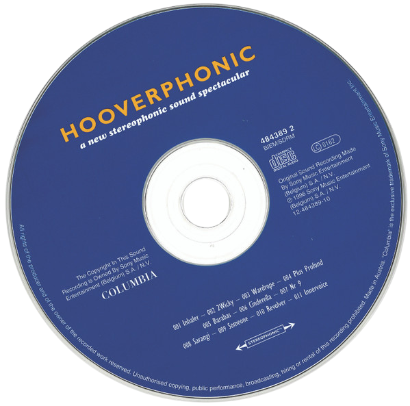

###  n ɔː r ˈ m ɑː n i / nor-MAH-nee

# Black On Both Sides
by Mos Def
<iframe src="https://archive.org/embed/mos-def-black-on-both-sides" width="500" height="60" frameborder="0" webkitallowfullscreen="true" mozallowfullscreen="true" allowfullscreen></iframe


[The Maxx [1996 VHS]](https://archive.org/details/the-maxx-1996-vhs) [The Maxx MTV Complete Season 1 (1996)](https://archive.org/details/the-maxx_202209) [The Maxx : Maxximized. Volume 6](https://archive.org/details/maxxmaxximizedvo0000kiet)

<iframe src="https://archive.org/embed/the-maxx_202209" width="640" height="480" frameborder="0" webkitallowfullscreen="true" mozallowfullscreen="true" allowfullscreen></iframe>

[SpelmanTwitter](https://x.com/SpelmanCollege/status/1807778215575814325) [DistroWatch with Ruby](https://x.com/RicoThaka/status/1848142644305600592)
@blackgirlscode @normani i talked about u to Laurie @nasa-jpl [TweetWithSpelman](https://x.com/RicoThaka/status/1897076889585697172)

[RelatedTweet](https://x.com/RicoThaka/status/1896991447972528505) [RelatedTweet](https://x.com/RicoThaka/status/1896912399799902558) [Mecca](https://x.com/RicoThaka/status/1896870475520999784) [gnu](https://x.com/Interior/status/1896559006967267675)


[playlist](https://github.com/ricoThaka/ricothaka.github.io/commit/1a7a98f1b676691fe5e2b22ecc59691bd4de41d2) ... baby someone cut my fingernail idk y
<iframe width="560" height="315" src="https://www.youtube.com/embed/6s4slL3_jtI?si=tapzkvQwbp5wdLSP" title="YouTube video player" frameborder="0" allow="accelerometer; autoplay; clipboard-write; encrypted-media; gyroscope; picture-in-picture; web-share" referrerpolicy="strict-origin-when-cross-origin" allowfullscreen></iframe>

<blockquote class="tiktok-embed" cite="https://www.tiktok.com/@the.lamp.channel/video/7437495925485882656" data-video-id="7437495925485882656" style="max-width: 605px;min-width: 325px;" > <section> <a target="_blank" title="@the.lamp.channel" href="https://www.tiktok.com/@the.lamp.channel?refer=embed">@the.lamp.channel</a> Kash Doll talks about the time she was robbed for Jewellery &#38; When her ATL house was burgled . <a title="kashdoll" target="_blank" href="https://www.tiktok.com/tag/kashdoll?refer=embed">#KashDoll</a> <a title="kashdollchallenge" target="_blank" href="https://www.tiktok.com/tag/kashdollchallenge?refer=embed">#kashdollchallenge</a> <a title="kashdollfanpage" target="_blank" href="https://www.tiktok.com/tag/kashdollfanpage?refer=embed">#kashdollfanpage</a> <a title="kashdollfans" target="_blank" href="https://www.tiktok.com/tag/kashdollfans?refer=embed">#kashdollfans</a> <a title="kashdollnation" target="_blank" href="https://www.tiktok.com/tag/kashdollnation?refer=embed">#kashdollnation</a> <a title="kashdollsssss" target="_blank" href="https://www.tiktok.com/tag/kashdollsssss?refer=embed">#kashdollsssss</a> <a title="djenvy" target="_blank" href="https://www.tiktok.com/tag/djenvy?refer=embed">#djenvy</a> <a title="djenvycarshow" target="_blank" href="https://www.tiktok.com/tag/djenvycarshow?refer=embed">#djenvycarshow</a> <a title="djenvy🎧" target="_blank" href="https://www.tiktok.com/tag/djenvy%F0%9F%8E%A7?refer=embed">#djenvy🎧</a> <a title="jesshilarious" target="_blank" href="https://www.tiktok.com/tag/jesshilarious?refer=embed">#jesshilarious</a> <a title="jesshilarious_official" target="_blank" href="https://www.tiktok.com/tag/jesshilarious_official?refer=embed">#jesshilarious_official</a> <a title="jesshillarious" target="_blank" href="https://www.tiktok.com/tag/jesshillarious?refer=embed">#jesshillarious</a> <a title="tracyt" target="_blank" href="https://www.tiktok.com/tag/tracyt?refer=embed">#tracyt</a> <a title="kashdollandtracy" target="_blank" href="https://www.tiktok.com/tag/kashdollandtracy?refer=embed">#kashdollandtracy</a> <a title="thebreakfastclub" target="_blank" href="https://www.tiktok.com/tag/thebreakfastclub?refer=embed">#thebreakfastclub</a> <a title="thebreakfastclubedit" target="_blank" href="https://www.tiktok.com/tag/thebreakfastclubedit?refer=embed">#thebreakfastclubedit</a> <a title="thebreakfastclubedits" target="_blank" href="https://www.tiktok.com/tag/thebreakfastclubedits?refer=embed">#thebreakfastclubedits</a> <a title="breakfastclub" target="_blank" href="https://www.tiktok.com/tag/breakfastclub?refer=embed">#breakfastclub</a> <a title="breakfastclubinterview" target="_blank" href="https://www.tiktok.com/tag/breakfastclubinterview?refer=embed">#breakfastclubinterview</a> <a title="breakfastclubedit" target="_blank" href="https://www.tiktok.com/tag/breakfastclubedit?refer=embed">#breakfastclubedit</a> <a title="breakfastclubam" target="_blank" href="https://www.tiktok.com/tag/breakfastclubam?refer=embed">#breakfastclubam</a> <a title="breakfastclubchallenge" target="_blank" href="https://www.tiktok.com/tag/breakfastclubchallenge?refer=embed">#breakfastclubchallenge</a> <a title="fyp" target="_blank" href="https://www.tiktok.com/tag/fyp?refer=embed">#fyp</a> <a title="fypage" target="_blank" href="https://www.tiktok.com/tag/fypage?refer=embed">#fypage</a> <a title="fyppppppppppppppppppppppp" target="_blank" href="https://www.tiktok.com/tag/fyppppppppppppppppppppppp?refer=embed">#fyppppppppppppppppppppppp</a> <a title="fypp" target="_blank" href="https://www.tiktok.com/tag/fypp?refer=embed">#fypp</a> <a title="fypdong" target="_blank" href="https://www.tiktok.com/tag/fypdong?refer=embed">#fypdong</a> <a title="fypgakni" target="_blank" href="https://www.tiktok.com/tag/fypgakni?refer=embed">#fypgakni</a> <a title="fypsounds" target="_blank" href="https://www.tiktok.com/tag/fypsounds?refer=embed">#fypsounds</a> <a title="fyppp" target="_blank" href="https://www.tiktok.com/tag/fyppp?refer=embed">#fyppp</a> <a title="fy" target="_blank" href="https://www.tiktok.com/tag/fy?refer=embed">#fy</a> <a title="fypシ゚" target="_blank" href="https://www.tiktok.com/tag/fyp%E3%82%B7%E3%82%9A?refer=embed">#fypシ゚</a> <a title="foryou" target="_blank" href="https://www.tiktok.com/tag/foryou?refer=embed">#foryou</a> <a title="fypシ゚viral🖤tiktok☆♡🦋myvideo" target="_blank" href="https://www.tiktok.com/tag/fyp%E3%82%B7%E3%82%9Aviral%F0%9F%96%A4tiktok%E2%98%86%E2%99%A1%F0%9F%A6%8Bmyvideo?refer=embed">#fypシ゚viral🖤tiktok☆♡🦋myvideo</a> <a title="fypシ゚vira" target="_blank" href="https://www.tiktok.com/tag/fyp%E3%82%B7%E3%82%9Avira?refer=embed">#fypシ゚vira</a> <a title="fypシ゚viraltiktok" target="_blank" href="https://www.tiktok.com/tag/fyp%E3%82%B7%E3%82%9Aviraltiktok?refer=embed">#fypシ゚viraltiktok</a> <a title="fyr" target="_blank" href="https://www.tiktok.com/tag/fyr?refer=embed">#fyr</a> <a title="fypシ゚v" target="_blank" href="https://www.tiktok.com/tag/fyp%E3%82%B7%E3%82%9Av?refer=embed">#fypシ゚v</a> <a title="fypシ゚vir" target="_blank" href="https://www.tiktok.com/tag/fyp%E3%82%B7%E3%82%9Avir?refer=embed">#fypシ゚vir</a> <a title="fypgakni" target="_blank" href="https://www.tiktok.com/tag/fypgakni?refer=embed">#fypgakni</a> <a title="fypシ゚viralvideo" target="_blank" href="https://www.tiktok.com/tag/fyp%E3%82%B7%E3%82%9Aviralvideo?refer=embed">#fypシ゚viralvideo</a> <a title="fypシ゚viral🖤video🤗foryou" target="_blank" href="https://www.tiktok.com/tag/fyp%E3%82%B7%E3%82%9Aviral%F0%9F%96%A4video%F0%9F%A4%97foryou?refer=embed">#fypシ゚viral🖤video🤗foryou</a> <a title="fypシ゚viralberanda" target="_blank" href="https://www.tiktok.com/tag/fyp%E3%82%B7%E3%82%9Aviralberanda?refer=embed">#fypシ゚viralberanda</a> <a title="fypシ゚vi" target="_blank" href="https://www.tiktok.com/tag/fyp%E3%82%B7%E3%82%9Avi?refer=embed">#fypシ゚vi</a> <a title="fypツ" target="_blank" href="https://www.tiktok.com/tag/fyp%E3%83%84?refer=embed">#fypツ</a> <a title="fypツforyoupage" target="_blank" href="https://www.tiktok.com/tag/fyp%E3%83%84foryoupage?refer=embed">#fypツforyoupage</a> <a title="fypツviral" target="_blank" href="https://www.tiktok.com/tag/fyp%E3%83%84viral?refer=embed">#fypツviral</a> <a title="fypツ♡" target="_blank" href="https://www.tiktok.com/tag/fyp%E3%83%84%E2%99%A1?refer=embed">#fypツ♡</a> <a title="fypツviral_videotiktok" target="_blank" href="https://www.tiktok.com/tag/fyp%E3%83%84viral_videotiktok?refer=embed">#fypツviral_videotiktok</a> <a title="fypツシ" target="_blank" href="https://www.tiktok.com/tag/fyp%E3%83%84%E3%82%B7?refer=embed">#fypツシ</a> <a title="fypツ♡❦࿐" target="_blank" href="https://www.tiktok.com/tag/fyp%E3%83%84%E2%99%A1%E2%9D%A6%E0%BF%90?refer=embed">#fypツ♡❦࿐</a> <a title="fypツforyou" target="_blank" href="https://www.tiktok.com/tag/fyp%E3%83%84foryou?refer=embed">#fypツforyou</a> <a title="fypツシツ" target="_blank" href="https://www.tiktok.com/tag/fyp%E3%83%84%E3%82%B7%E3%83%84?refer=embed">#fypツシツ</a> <a title="fypツforyoupagツtiktok" target="_blank" href="https://www.tiktok.com/tag/fyp%E3%83%84foryoupag%E3%83%84tiktok?refer=embed">#fypツforyoupagツtiktok</a> <a title="foryoupage" target="_blank" href="https://www.tiktok.com/tag/foryoupage?refer=embed">#foryoupage</a> <a title="foryoupages" target="_blank" href="https://www.tiktok.com/tag/foryoupages?refer=embed">#foryoupages</a> <a title="foryourpage" target="_blank" href="https://www.tiktok.com/tag/foryourpage?refer=embed">#foryourpage</a> <a title="foryourpages" target="_blank" href="https://www.tiktok.com/tag/foryourpages?refer=embed">#foryourpages</a> <a title="foryoupageofficiall" target="_blank" href="https://www.tiktok.com/tag/foryoupageofficiall?refer=embed">#foryoupageofficiall</a> <a title="foryourpagetiktok" target="_blank" href="https://www.tiktok.com/tag/foryourpagetiktok?refer=embed">#foryourpagetiktok</a> <a title="foryourpagechallenge" target="_blank" href="https://www.tiktok.com/tag/foryourpagechallenge?refer=embed">#foryourpagechallenge</a> <a title="foryourpageofficiall" target="_blank" href="https://www.tiktok.com/tag/foryourpageofficiall?refer=embed">#foryourpageofficiall</a> <a title="foryourpage❤❤" target="_blank" href="https://www.tiktok.com/tag/foryourpage%E2%9D%A4%E2%9D%A4?refer=embed">#foryourpage❤❤</a> <a target="_blank" title="♬ original sound - The LAMP channel" href="https://www.tiktok.com/music/original-sound-7437496300930861856?refer=embed">♬ original sound - The LAMP channel</a> </section> </blockquote> <script async src="https://www.tiktok.com/embed.js"></script>

<blockquote class="twitter-tweet"><p lang="en" dir="ltr">hi <a href="https://twitter.com/SartuAdem?ref_src=twsrc%5Etfw">@SartuAdem</a> was <a href="https://twitter.com/hashtag/Protesting_Abi_Ahmed?src=hash&amp;ref_src=twsrc%5Etfw">#Protesting_Abi_Ahmed</a> <a href="https://t.co/vSYJkRbGJQ">https://t.co/vSYJkRbGJQ</a> an when <a href="https://twitter.com/Playboy?ref_src=twsrc%5Etfw">@playboy</a> <a href="https://twitter.com/HustlerMag?ref_src=twsrc%5Etfw">@hustlermag</a> <a href="https://twitter.com/Penthouse?ref_src=twsrc%5Etfw">@penthouse</a> <a href="https://twitter.com/hashtag/KidnappedHer?src=hash&amp;ref_src=twsrc%5Etfw">#KidnappedHer</a> she became <a href="https://twitter.com/kashdoll?ref_src=twsrc%5Etfw">@kashdoll</a> a <a href="https://twitter.com/hashtag/sexSlave?src=hash&amp;ref_src=twsrc%5Etfw">#sexSlave</a> im committed to them <a href="https://twitter.com/Latto?ref_src=twsrc%5Etfw">@latto</a> we just need to discuss divorce, im amicable <a href="https://twitter.com/GADFCS?ref_src=twsrc%5Etfw">@GADFCS</a> <a href="https://twitter.com/hashtag/reconcile_Coral?src=hash&amp;ref_src=twsrc%5Etfw">#reconcile_Coral</a>! <a href="https://twitter.com/Shocphoto?ref_src=twsrc%5Etfw">@Shocphoto</a> is another <a href="https://twitter.com/hashtag/profile?src=hash&amp;ref_src=twsrc%5Etfw">#profile</a> <a href="https://t.co/FySCrY1NJl">pic.twitter.com/FySCrY1NJl</a></p>&mdash; BubbleGumPop (@BubbleGumPop510) <a href="https://twitter.com/BubbleGumPop510/status/1740490197899620389?ref_src=twsrc%5Etfw">December 28, 2023</a></blockquote> <script async src="https://platform.twitter.com/widgets.js" charset="utf-8"></script>

[](src="https://images.launchbox-app.com/9c048b70-5ef0-4d0d-94d2-ac2a6421172e.png")
[](src="https://images.launchbox-app.com/765b2372-849a-40fe-af2b-546fc720eb8c.png")
[](src="https://images.launchbox-app.com/3e4beca8-1315-4188-bf09-ab56a9d1f1d1.png")
[](src="https://images.launchbox-app.com/74ee801b-71fc-46c4-80f2-c831abeb87e2.png")


<iframe style="border-radius:12px" src="https://open.spotify.com/embed/track/4G1qRhOk1YY0kewtMaCrMC?utm_source=generator" width="100%" height="152" frameBorder="0" allowfullscreen="" allow="autoplay; clipboard-write; encrypted-media; fullscreen; picture-in-picture" loading="lazy"></iframe>

 @blackgirlscode 

# LawnCAre+GameTrades
[](https://upload.wikimedia.org/wikipedia/commons/c/cb/Sega-Saturn-Console-Set-Mk2.png)

[nights into dreams](https://upload.wikimedia.org/wikipedia/commons/b/b8/Sega-Saturn-3D-Controller.jpg) [launch era ad](https://www.youtube.com/watch?v=hv1BE1bexCg)

[Sega MAster System Ads](https://youtu.be/CcOZpDCKK3w?si=1M0dD30LORV9f8i5) idk if its a good idea to smash them together[TimeContext](https://time.gov/)


## [Zelda](https://www.nesfiles.com/NES/Zelda/) wow


[Documentary: Raised on Porn – the new sex education - watch](https://www.youtube.com/watch?v=hzPylqS01qU) - [RiOTiMEs](https://www.riotimesonline.com/brazil-news/modern-day-censorship/documentary-raised-on-porn-the-new-sex-education/) [In today’s world, porn is ubiquitous. It’s everywhere, - https://sexandrelationshiphealing.com/](https://sexandrelationshiphealing.com/blog/documentary-film-raised-on-porn-37-minutes/)

<iframe width="560" height="315" src="https://www.youtube.com/embed/hzPylqS01qU?si=DPTexd6AM7kRczIn" title="YouTube video player" frameborder="0" allow="accelerometer; autoplay; clipboard-write; encrypted-media; gyroscope; picture-in-picture; web-share" referrerpolicy="strict-origin-when-cross-origin" allowfullscreen></iframe>

[https://thakarashard.github.io/BUBBLEGUMPOP_HUMA/](https://thakarashard.github.io/BUBBLEGUMPOP_HUMA/)
[](https://twitter.com/Normani) i got this off [DefConRadio on SOMAfm](https://somafm.com/defcon/) now [Run & Tell That](https://www.youtube.com/watch?v=zLmFhBv0Zfc)
<iframe width="100%" height="300" scrolling="no" frameborder="no" allow="autoplay" src="https://w.soundcloud.com/player/?url=https%3A//api.soundcloud.com/tracks/94498846&color=%23ff5500&auto_play=false&hide_related=false&show_comments=true&show_user=true&show_reposts=false&show_teaser=true&visual=true"></iframe><div style="font-size: 10px; color: #cccccc;line-break: anywhere;word-break: normal;overflow: hidden;white-space: nowrap;text-overflow: ellipsis; font-family: Interstate,Lucida Grande,Lucida Sans Unicode,Lucida Sans,Garuda,Verdana,Tahoma,sans-serif;font-weight: 100;"><a href="https://soundcloud.com/embrz" title="EMBRZ" target="_blank" style="color: #cccccc; text-decoration: none;">EMBRZ</a> · <a href="https://soundcloud.com/embrz/slow-down" title="Slow Down" target="_blank" style="color: #cccccc; text-decoration: none;">Slow Down</a></div>

# [Maxxum/Dynax a 7 in practice](https://www.dyxum.com/dforum/)
[KEH_dOt_COM](https://www.keh.com/)


[nights into dreams](https://upload.wikimedia.org/wikipedia/commons/b/b8/Sega-Saturn-3D-Controller.jpg)

[Rival Schools: United by Fate](https://cdromance.org/psx-iso/rival-schools-united-by-fate-usa/) [JUMPiNGFLASH](https://cdromance.org/psx-iso/jumping-flash-usa/) [Lunar: Silver Star Story Complete](https://cdromance.org/psx-iso/lunar-silver-star-story-complete-usa/)
[Minolta Maxxum 7/ Dynax 7 - manual PDF](https://butkus.org/chinon/minolta/minolta_maxxum_7/minolta_maxxum_7.htm)
[Photo.NET WEddiNG PHotoG Gary Friedman,](https://www.friedmanarchives.com/minolta-maxxum-dynax-7/) [TecData](https://www.mhohner.de/sony-minolta/onebody/7) [Just got a Dynax/Maxxum 7, what do I check? - dyxum.com](https://www.dyxum.com/dforum/just-got-a-dynax-maxxum-7-what-do-i-check_topic137663.html) [ewoodsphoto MaxxUm7](https://ewoodsphoto.com/2018/01/06/maxxum-7-and-maxxum-7d-analog-and-digital-vintage-wonderfulness-twins/) [LEARNCAMERAREPAiR](https://learncamerarepair.com/product.php?product=1043)
[Thoughts on the Minolta Maxxum 7? : r/AnalogCommunity](https://www.reddit.com/r/AnalogCommunity/comments/o9764m/thoughts_on_the_minolta_maxxum_7/?rdt=58057) [35mmc.com maxxum 7 review](https://www.35mmc.com/15/04/2024/minolta-maxxum-7-review/) [MAXXUM 7 - SteveHuff](https://www.stevehuffphoto.com/2018/05/21/back-to-basics-with-a-minolta-maxxum-7-by-ibraar-hussain/)
[casualphotophile maxxum 7 review](https://casualphotophile.com/2017/11/22/minolta-a7-review-maxxum-7-dynax-7/) [earthsunfilm maxxum 7 review](https://earthsunfilm.com/vmlp-28-the-minolta-maxxum-7-im-pretty-sure-picard-has-one/) [CAMERA REVIEW BLOG NO. 104 – MINOLTA MAXXUM 7](http://www.alexluyckx.com/blog/2019/04/08/camera-review-blog-no-104-minolta-maxxum-7/) [Roddy Ricch - The Box [Official Music Video]](https://youtu.be/UNZqm3dxd2w?si=irOUZVZvkLG5r6DM) [](https://twitter.com/Normani) im so angry with u, bc i dont know your personal life, and every guy i see, im upset bc im scared they are your intimate partner, i really wanna like his song to this day! [](https://twitter.com/ricothaka) [Future - Mask Off ](https://www.youtube.com/watch?v=xvZqHgFz51I)


# Minolta AF 50mm f/1.7
The Minolta AF 50mm f/1.7 is a discontinued lens with autofocus that was produced by Minolta for A-mount single lens reflex cameras from 1985[1] through 2006. It is still in use today by users of digital and film SLRs from Minolta (later Konica-Minolta) and Sony. The relatively large maximum aperture (f/1.7) allows the photographer to take shots indoors even when operating at ISO 100 - 200.[wiki](https://en.wikipedia.org/wiki/Minolta_AF_50mm_f/1.7) [DYXUM](https://www.dyxum.com/lenses/Minolta-AF-50mm-F1.7_lens17.html)


[](https://twitter.com/Normani)  [](https://twitter.com/NormaniUpdate) @blackgirlscode
i was in east hollywood and passed by the [swapmeet](https://laccswap.com/) dr dre was not there, i wish u were on the sidewalk... bye... if u did not see my note its on [kordie](https://ricothaka.github.io/normanikordei) [](https://twitter.com/RepKarenBass) 
 [](https://twitter.com/NASAJPL) thats on the page..bc i was sad we are not together. now i know i know [issarae](https://www.imdb.com/name/nm4793987/) an idk what to do..... #crashes
<iframe width="560" height="315" src="https://www.youtube.com/embed/kIuQK_zLN9c?si=A0xwFFjYvp1nhp2V" title="YouTube video player" frameborder="0" allow="accelerometer; autoplay; clipboard-write; encrypted-media; gyroscope; picture-in-picture; web-share" referrerpolicy="strict-origin-when-cross-origin" allowfullscreen></iframe>

[Lessons Learned from the Mars Relay Network: Considerations for Future Relay Networks](https://ieeexplore.ieee.org/document/10521332)
<object data="https://eyes.nasa.gov/apps/mrn/#/mars" width="100%" height=400px ></object>
[](https://twitter.com/Normani)
[HTML Learning Path - List and Nav Elements - GoRails TutoriaL](https://www.youtube.com/watch?v=5havRPfNCQE)
<iframe style="border-radius:12px" src="https://open.spotify.com/embed/album/1dL3GaoLR6Bx4zH5ajCX2L?utm_source=generator&theme=0" width="100%" height="152" frameBorder="0" allowfullscreen="" allow="autoplay; clipboard-write; encrypted-media; fullscreen; picture-in-picture" loading="lazy"></iframe>

[SCHEMA-GAMEPLATFORM](https://schema.org/gamePlatform) [SCHEMA-CREATiVEWORK](https://schema.org/CreativeWork) [SCHEMA-IMAGE](https://schema.org/image)


I played the mose amazing game this morning [Secret Of Mana](https://www.youtube.com/watch?v=Nwj_h8QzmwE) i am running a rom but its on [RetroGames](https://www.retrogames.cc/snes-games/secret-of-mana-usa.html) and several other [OnlineConsole](https://yandex.com/search/?text=secret+of+mana+play+online&lr=200&search_source=yacom_desktop_common), its an [rpg](https://nintendo.fandom.com/wiki/Secret_of_Mana). Mana is a big world, and the fighting engine is fun. I am a [Final Fantasy 7](https://www.youtube.com/watch?v=QDz9A4ByHIQ) fan and oG release buyer so the [SquareFormat](https://archive.org/details/square-enix-commercial-pack) was really accecible. I hope you doing good, i made a video tweet, referencing you... i hope u dig this oj album, there so many clues to whats going on right now,u might hate his ass... @blackgirlscode, @normani i talk to everyone @nasa @nasa-jpl thats how i got into this mess, the witnesses were right u will meet people if u talk

<blockquote class="twitter-tweet" data-media-max-width="560"><p lang="en" dir="ltr"><a href="https://t.co/6jMGSVbHTs">https://t.co/6jMGSVbHTs</a> <a href="https://twitter.com/NASAMars?ref_src=twsrc%5Etfw">@NASAMars</a> <a href="https://twitter.com/LACityCouncil?ref_src=twsrc%5Etfw">@LACityCouncil</a> <a href="https://twitter.com/RepKarenBass?ref_src=twsrc%5Etfw">@RepKarenBass</a> <a href="https://twitter.com/BOEAPS?ref_src=twsrc%5Etfw">@BOEAPS</a> ,, <a href="https://twitter.com/Normani?ref_src=twsrc%5Etfw">@Normani</a> <a href="https://twitter.com/hashtag/MissFrance2025?src=hash&amp;ref_src=twsrc%5Etfw">#MissFrance2025</a> <a href="https://twitter.com/GADFCS?ref_src=twsrc%5Etfw">@GADFCS</a> <a href="https://twitter.com/FultonProbate?ref_src=twsrc%5Etfw">@FultonProbate</a> <a href="https://twitter.com/KeishaBottoms?ref_src=twsrc%5Etfw">@KeishaBottoms</a> I asked for a girlfriend <a href="https://twitter.com/streetz945atl?ref_src=twsrc%5Etfw">@streetz945atl</a> I hope this is a joke and not my <a href="https://twitter.com/hashtag/RealityShow?src=hash&amp;ref_src=twsrc%5Etfw">#RealityShow</a> <a href="https://twitter.com/Essence?ref_src=twsrc%5Etfw">@Essence</a> <a href="https://t.co/ToFY3dtcX6">pic.twitter.com/ToFY3dtcX6</a></p>&mdash; ricoThaka (@RicoThaka) <a href="https://twitter.com/RicoThaka/status/1869099286405030181?ref_src=twsrc%5Etfw">December 17, 2024</a></blockquote> <script async src="https://platform.twitter.com/widgets.js" charset="utf-8"></script>

 <figure>
  <figcaption>DJ Scream & OJ Da Juiceman: `[Alaska N Atlanta 3](Brickhouse (Feat. Block 125) [Prod. By Dubba Aa & Louie Bands])`</figcaption>
  <audio controls src="https://archive.org/download/DJ_Scream_and_OJ_Da_Juiceman_-_Alaska_N_Atlanta_3-2021/04%20Oj%20Da%20Juiceman%20-%20Brickhouse%20%28Feat.%20Block%20125%29%20%5BProd.%20By%20Dubba%20Aa%20%26%20Louie%20Bands%5D.mp3" itemscope itemtype="https://schema.org/MusicRecording"></audio>
  <a href="https://archive.org/download/DJ_Scream_and_OJ_Da_Juiceman_-_Alaska_N_Atlanta_3-2021/04%20Oj%20Da%20Juiceman%20-%20Brickhouse%20%28Feat.%20Block%20125%29%20%5BProd.%20By%20Dubba%20Aa%20%26%20Louie%20Bands%5D.mp3"> Download audio </a>
</figure>

<iframe src="https://archive.org/embed/DJ_Scream_and_OJ_Da_Juiceman_-_Alaska_N_Atlanta_3-2021" width="500" height="60" frameborder="0" webkitallowfullscreen="true" mozallowfullscreen="true" allowfullscreen></iframe>


### cellular magic mirror
# snow White and the seven Dwarfs.mp4
<video controls width="100%" height="auto" poster="https://raw.githubusercontent.com/ricoThaka/ricothaka.github.io/refs/heads/pixelsquare/assets/img/cellular.png">
    
<source src="https://archive.org/download/WaltDisneySignatureCollection_201808/Snow%20White%20and%20the%20Seven%20Dwarfs.mp4" type="video/mp4" />
         Download the
        or
<a href="https://archive.org/download/WaltDisneySignatureCollection_201808/Snow%20White%20and%20the%20Seven%20Dwarfs.mp4">MP4</a>
        video.
</video>   

[Pinoccio](https://archive.org/download/WaltDisneySignatureCollection_201808/Pinocchio.mp4) [The adventures of Pinocchio by Collodi, Carlo, 1826-1890 - BOOK](https://archive.org/details/adventuresofpino00coll_4/page/n11/mode/2up)

#  Season 1 - Hong Kong Phooey
 
@blackgirlscode to my attachments, this shit SupAfunniE [AllFiles](https://archive.org/download/hong-kong-phooey-season-1-episodes-1-through-16-plus-bonuses) [imdb](https://www.imdb.com/title/tt0070996/) Hong Kong Phooey is an American Saturday morning animated television series produced by Hanna-Barbera Productions and originally broadcast on [ABC](https://abc.com/) - [WiKi](https://en.wikipedia.org/wiki/Hong_Kong_Phooey)

<video controls width="100%" height="auto" poster="https://media.tenor.com/e3Fx829AvBIAAAAM/hong-kong-phooey-change.gif">
    
<source src="https://archive.org/download/hong-kong-phooey-season-1-episodes-1-through-16-plus-bonuses/Hong%20Kong%20Phooey%20-%20S01E01%20-%20Car%20Thieves%3B%20Zoo%20Story.mp4" type="video/mp4" />
         Download the
        or
<a href="https://archive.org/download/hong-kong-phooey-season-1-episodes-1-through-16-plus-bonuses/Hong%20Kong%20Phooey%20-%20S01E01%20-%20Car%20Thieves%3B%20Zoo%20Story.mp4">MP4</a>
        video.
</video>    
` For godssake, im dealing with heartbreak`
>-[PushaT](https://soundcloud.com/pushat)
@blackgirlscode::#NORMANi what do that mean, re:eastatlantagraffiti+dance411?
<iframe style="border-radius:12px" src="https://open.spotify.com/embed/album/07bIdDDe3I3hhWpxU6tuBp?utm_source=generator&theme=0" width="100%" height="152" frameBorder="0" allowfullscreen="" allow="autoplay; clipboard-write; encrypted-media; fullscreen; picture-in-picture" loading="lazy"></iframe>

[](https://upload.wikimedia.org/wikipedia/commons/5/59/Intel_pentium_iii_xeon_800_sl4h8_top.png) 

# Rashard's Work...

### Mars Samples: Proposed Containment and Transport


This illustration shows the proposed process for safely recovering, containing, and transporting Mars samples gathered by NASA's Perseverance Mars rover after they are returned to Earth as part of the joint NASA/ESA (European Space Agency) Mars Sample Return Campaign.[ReadMore](https://science.nasa.gov/resource/mars-samples-proposed-containment-and-transport/)


## [Perseverance Rover's Descent and Touchdown on Mars](https://svs.gsfc.nasa.gov/31250) 

### [Perseverance Rover’s Descent and Touchdown on Mars: Onboard Camera Views](https://science.nasa.gov/wp-content/uploads/2024/03/45703_JPL-20210222-M2020f-0001-Perseverance_Rovers_Descent_and_Touchdown_on_Mars-1.mp4)

>NASA's Mars 2020 Perseverance mission captured thrilling footage of its rover landing in Mars' Jezero Crater on Feb. 18, 2021. The real footage in this video was captured by several cameras that are part of the rover's entry, descent, and landing suite. The views include a camera looking down from the spacecraft's descent stage (a kind of rocket-powered jet pack that helps fly the rover to its landing site), a camera on the rover looking up at the descent stage, a camera on the top of the aeroshell (a capsule protecting the rover) looking up at that parachute, and a camera on the bottom of the rover looking down at the Martian surface.

<video controls width="100%" height="auto" poster="https://www.nasa.gov/wp-content/uploads/2021/06/pia24542-perseverances-selfie-with-ingenuity-1041.jpg">
    
<source src="https://svs.gsfc.nasa.gov/vis/a030000/a031200/a031250/Perseverance-landing-1080p.mp4" type="video/mp4" />
         Download the
        or
<a href="https://svs.gsfc.nasa.gov/vis/a030000/a031200/a031250/Perseverance-landing-1080p.mp4">MP4</a>
        video.
</video>    

[15 Second Clip of Parachute Deployment(MP4) (18.86 MB)](https://science.nasa.gov/wp-content/uploads/2024/03/45732_nasa_perseverance_parachute_deployment.mp4)


<iframe loading="lazy" width="560" height="315" src="https://www.youtube.com/embed/uSPHfbHy2Bw?si=94hY14EjC0YpYuV6" title="YouTube video player" frameborder="0" allow="accelerometer; autoplay; clipboard-write; encrypted-media; gyroscope; picture-in-picture; web-share" referrerpolicy="strict-origin-when-cross-origin" allowfullscreen></iframe>
[](https://upload.wikimedia.org/wikipedia/commons/5/59/Intel_pentium_iii_xeon_800_sl4h8_top.png) 

@normani @blackgirlscode
# Learning Decatur 

Ghetto Mafia is an American hip hop group from Decatur, Georgia, United States, composed of Nino and Wicked.[1] Formed in 1993, the Ghetto Mafia signed to local hip hop label, Ichiban Records, who then released their debut album, Draw the Line on April 26, 1994 [Ghetto Mafia](https://en.wikipedia.org/wiki/Ghetto_Mafia)
<iframe style="border-radius:12px" src="https://open.spotify.com/embed/album/75l02En53A3H9CdVfzIk0z?utm_source=generator" width="100%" height="352" frameBorder="0" allowfullscreen="" allow="autoplay; clipboard-write; encrypted-media; fullscreen; picture-in-picture" loading="lazy"></iframe>

[](https://upload.wikimedia.org/wikipedia/commons/5/59/Intel_pentium_iii_xeon_800_sl4h8_top.png) 

# Pentium II
>Intel microprocessor 

Containing 7.5 million transistors (27.4 million in the case of the mobile Dixon with 256 KB on-die L2 cache), the Pentium II featured an improved version of the first P6-generation core of the Pentium Pro, which contained 5.5 million transistors. However, its L2 cache subsystem was a downgrade when compared to the Pentium Pro's. In 1998, Intel stratified the Pentium II family by releasing the Pentium II-based Celeron line of processors for low-end computers and the Intel Pentium II Xeon line for servers and workstations. - [wikiwand](https://www.wikiwand.com/en/articles/Pentium_II) [Internet Arcade: Turbo Edition](https://archive.org/details/internetarcadeturbo)
[](assets/normani/file.png) 
<caption>Pentium II processor with MMX technology, SECC cartridge.</caption>

# @blackGirlsCode re:[retrogaming](https://www.neogeofun.com/)
Nior, I put up a Pentium2 bc that is a good processor to learn linux on, im so upset about [hardware hoarders](https://www.wcrecycler.com/blog/dont-be-guilty-of-hoarding-old-unused-electronics) that buy up everything on [ebay!](https://www.ebay.com/itm/256645621595?itmmeta=01JEC282NBJWWSR67CGMYVBKW9&hash=item3bc145675b:g:HMgAAOSwH9lm6yX~&itmprp=enc%3AAQAJAAAA4Mxmj%2BiGvOveHXEBClPb29hP%2BtvC8uoTI0Hu8iEjYB62IigS9mev7O1ys0KbBShC%2FC%2FVb4uJ81c%2FJLAhL11wiUNQTeFKsfv06b5kQmgorma1xKhnyBNHZ75shNGTwASrGkcybfZ73KmeOrFJCynypUaUsZi0zFh5KMFj5pCNp43%2BtDdKbCECGGT1OAecR%2B8n3ANXsglHT9xrihExvLlANpDjEXQAd3cEuuMYbUNMN6kCedxju7q23k7hrkzkBchSSQI%2BuHXZ9UPiKxCYgO6z6%2BxpFYi%2Fh5lU4TfFiLwoofDj%7Ctkp%3ABk9SR-KqoILzZA&var=556935501663) at $15 i never expect to need that much money to buy one, you have no idea how well [Xmen Vs StreetFighter](https://archive.org/details/arcade_xmvsf) run on one running [FinalBurnAlpha](https://emulation.gametechwiki.com/index.php/FinalBurn_Alpha) on [Windows2000](https://copy.sh/v86/?profile=windows2000) on a [Dell Optiplex G110](https://www.lakemichigancomputers.com/products/dell-optiplex-gx110-mt-intel-pentium-iii-600-mhz-256mb-ram-no-hdd-no-os) with an [y2kera](https://www.hercircle.in/engage/fashion/trends/what-is-y2k-fashion-and-why-is-it-trending-915.html#:~:text=Y2K%20fashion%2C%20short%20for%20%22Year,major%20comeback%20in%20recent%20years.) [Sony Trinitron](https://www.freegeektwincities.org/retro/r210gs) <style> img[src*=s-l1600.webp] {width: 30%;}</style> 

[What about hardware hoarding? - REDDiT r/DataHoarder](https://www.reddit.com/r/DataHoarder/comments/11vtgwa/what_about_hardware_hoarding/?rdt=59848) [I seem to have a computer part hoarding illness...anyone else suffer from this? - Anandtech - u/Meghan54](https://forums.anandtech.com/threads/i-seem-to-have-a-computer-part-hoarding-illness-anyone-else-suffer-from-this.2575385/)

# (World 910520) : Three Wonders by [CapCom](https://www.capcom.com/)
Three Wonders[a] is a 1991 video game collection developed and published by Capcom, originally released for the arcades using the CPS-1 platform [Wiki](https://en.wikipedia.org/wiki/Three_Wonders)
<iframe src="https://archive.org/embed/arcade_3wonders" width="560" height="384" frameborder="0" webkitallowfullscreen="true" mozallowfullscreen="true" allowfullscreen></iframe>

[](https://i.discogs.com/QxMo2q5KlL9Mpbly2KstTA7tMJDqaQSZZ7vCHuK9l7I/rs:fit/g:sm/q:90/h:592/w:600/czM6Ly9kaXNjb2dz/LWRhdGFiYXNlLWlt/YWdlcy9SLTU5NDM4/LTE0NjQ1OTU0MjAt/OTc5OC5qcGVn.jpeg)


# : A New Stereophonic Sound Spectacular - Hooverphonic :
 the debut studio album by the Belgian band Hooverphonic. The album was released by Columbia Records on 29 July 1996,[9] initially credited to the band's original name, Hoover. It is Hooverphonic's only album with lead singer Liesje Sadonius.[wiki](https://en.wikipedia.org/wiki/A_New_Stereophonic_Sound_Spectacular) [YouTube - 1File](https://www.youtube.com/watch?v=9c5kNUj2GLA&themeRefresh=1) [DiscoGs](https://www.discogs.com/release/59438-Hooverphonic-A-New-Stereophonic-Sound-Spectacular?srsltid=AfmBOoq2S7hw4b5z6aBGEljTah0IuLVe1RydRqyz6rcP4XbjRprgvWws) 

[](assets/normani/hooverphonic-Photoroom.png)


<iframe style="border-radius:12px" src="https://open.spotify.com/embed/album/6FFKUYyfC9S8fDy725qLAq?utm_source=generator" width="100%" height="352" frameBorder="0" allowfullscreen="" allow="autoplay; clipboard-write; encrypted-media; fullscreen; picture-in-picture" loading="lazy"></iframe>

[](assets/normani/file1.png)

# Pillars of Creation ([Visualization Mosaic](https://webbtelescope.org/contents/media/images/2024/020/01HZ7D2PPZVGY1H6TQGRH1N9JK?page=3&filterUUID=91dfa083-c258-4f9f-bef1-8f40c26f4c97))


<iframe style="border-radius:12px" src="https://open.spotify.com/embed/track/264t7usRIlj4zaqKsvpfuC?utm_source=generator" width="100%" height="152" frameBorder="0" allowfullscreen="" allow="autoplay; clipboard-write; encrypted-media; fullscreen; picture-in-picture" loading="lazy"></iframe>

# loading="lazy"
Lazy loading is a strategy to identify resources as non-blocking (non-critical) and load these only when needed. It's a way to shorten the length of the critical rendering path, which translates into reduced page load times.[MDn](https://developer.mozilla.org/en-US/docs/Web/Performance/Lazy_loading)

# (ソニック・ザ・ヘッジホッグ2

<iframe loading="lazy" width="560" height="315" src="https://www.youtube.com/embed/KQmuOCWjQB0?si=xHj7TN1yuZtVv-Xu" title="YouTube video player" frameborder="0" allow="accelerometer; autoplay; clipboard-write; encrypted-media; gyroscope; picture-in-picture; web-share" referrerpolicy="strict-origin-when-cross-origin" allowfullscreen></iframe>

# Sonic the Hedgehog 2 Rev 2 [launch](https://youtu.be/Nnpe0RZDYzU?si=lGLrXRah_pXS0Pnh)
### Sonic the Hedgehog 2  Sonikku za Hejjihoggu Tsū?)
<iframe src="https://archive.org/embed/sg_Sonic_the_Hedgehog_2_Rev_2_1992_Sega" width="560" height="384" frameborder="0" webkitallowfullscreen="true" mozallowfullscreen="true" allowfullscreen></iframe>

## [sonic the Hedgehog 2 (World) (Rev A)](https://www.retrogames.cc/genesis-games/sonic-the-hedgehog-2-world-rev-a.html) 
[Getting Sonic The Hedgehog 2 on Launch Day Nov 24th 1992 - My Retro Life](https://www.youtube.com/watch?v=CZOOo9BYRFk) [Sonic 2sDay: A Retrospective on Sonic the Hedgehog 2 and its Worldwide Launch on November 24, 1992!](https://www.youtube.com/watch?v=GX6cqZJMEfo)


<iframe loading="lazy" width="560" height="315" src="https://www.youtube.com/embed/O9RHZlnrVDc?si=jB0D0BtKMahv5GA3" title="YouTube video player" frameborder="0" allow="accelerometer; autoplay; clipboard-write; encrypted-media; gyroscope; picture-in-picture; web-share" referrerpolicy="strict-origin-when-cross-origin" allowfullscreen></iframe>


<picture>
  <source srcset="https://ia800705.us.archive.org/4/items/SonicTheHedgehog2SegaGenesisHiResScans/thumbnail.jpg"  />
  
</picture>
# Stevie Wonder - Creepin'
<iframe loading=lazy width="560" height="315" src="https://www.youtube.com/embed/Akwvng0SEjA?si=mIhaeOcv3k3dm0yR" title="YouTube video player" frameborder="0" allow="accelerometer; autoplay; clipboard-write; encrypted-media; gyroscope; picture-in-picture; web-share" referrerpolicy="strict-origin-when-cross-origin" allowfullscreen></iframe>

# – Fulfillingness' First Finale - Stevie Wonder 1974 [DiscoGs](https://www.discogs.com/master/87463-Stevie-Wonder-Fulfillingness-First-Finale)
[](https://i.discogs.com/mib8tH4RYmAofLyvOw-2VJnSCw69Ibusmhs2NM7LKCg/rs:fit/g:sm/q:90/h:144/w:600/czM6Ly9kaXNjb2dz/LWRhdGFiYXNlLWlt/YWdlcy9SLTIwMTk1/MTUyLTE2MzEzNjky/MDAtNDY5Ni5qcGVn.jpeg)
[](https://i.discogs.com/yFjTVV-93ZrGT-nhDg-BzfSBjYTEYd8e508cvgdTA1E/rs:fit/g:sm/q:90/h:600/w:450/czM6Ly9kaXNjb2dz/LWRhdGFiYXNlLWlt/YWdlcy9SLTIwMTk1/MTUyLTE2NTg5OTk4/OTctMTExOC5qcGVn.jpeg) Following the epic scope and social consciousness themes of Innervisions, Fulfillingness' First Finale, in contrast, projected a more reflective, personal, and somber tone. The musical arrangements used in several songs, especially the bleak "They Won't Go When I Go" and the understated "Creepin'", were sparse compared to those of some of Wonder's other 1970s tracks. Wonder had not completely foregone social commentary, as evidenced by the Billboard Hot 100 number-one single "You Haven't Done Nothin'", which launched a pointed criticism of the Nixon administration bolstered by clavinet, drum machine, and a cameo by the Jackson 5. [WiKi](https://en.wikipedia.org/wiki/Fulfillingness%27_First_Finale) [BuY](https://shop.motownrecords.com/products/stevie-wonder-fulfillingness-first-finale-lp)

<iframe style="border-radius:12px" src="https://open.spotify.com/embed/album/1kda4McF274Jl5x3aOAmPJ?utm_source=generator" width="100%" height="352" frameBorder="0" allowfullscreen="" allow="autoplay; clipboard-write; encrypted-media; fullscreen; picture-in-picture" loading="lazy"></iframe>


# Dear_Normani,
I hope u were not doing anything raunchy today, its thanksgiving weekend and i was loving on u on twitter, its a reflex, i think i know u more. [Chloe](https://web.archive.org/web/20080611104542/http://www.nypl.org/styleguide/css/guidelines.html) was o the bullhorn and i worked on a page for her. Its getting important as my mission duties clarify! Imma be ginvg tours man! Like [Bethel](https://youtu.be/trB4hHgYQhY?si=HcJnmRGC2ONpPWu7), maybe jehovahs witnesses is a nasa lie to combat playboy kidnapping, [](https://twitter.com/SenBillNelson) voice scares me if i listen with my heart i think i might be moved too much. Thats why im head down following orders as i understand [](https://twitter.com/US_SpaceCom) [](https://twitter.com/nasajpl) requires of me. Dwayne Gooden might be on the mission, i have to nuetralize my stand point bc i was isolated. I dont like how he said people always dying around you, that make me thing he on the dark team... Back to [chloe](https://ricothaka.github.io/chloe) i made that page [XHTML](https://web.archive.org/web/20080611105650/http://www.nypl.org/styleguide/xhtml/index.html) but had to scale back, im learning how your seo skills can be used in your company web infrastructure with [semantic tags](https://developer.mozilla.org/en-US/docs/Glossary/Semantics) and developing flow [NYPL_STYLEGUiDE_ARCHiVE](https://web.archive.org/web/20080617044807/http://www.nypl.org/styleguide/) will help u get an authentic retro flow for readers

[NYPL_STYLEGUiDE_ARCHiVE](https://web.archive.org/web/20080617044807/http://www.nypl.org/styleguide/)
[Can we talk about web design?](https://web.archive.org/web/20080605234605/http://www.thenoodleincident.com/tutorials/design_rant/)
[NYPLBase The Library's rapid prototyping system and design pattern library](nypl.github.io/NYPLBase/styleguide/index.html) 

[NYPL_STYLEGUiDE_ARCHiVE](https://web.archive.org/web/20080617044807/http://www.nypl.org/styleguide/)
<div class="panel4-container">
   
  <div class="item1"></div>
    <div class="item2"></div>
    <div class="item3"></div>
    <div class="item4"></div>

</div>

[Bob Marley Legend full album](https://www.youtube.com/watch?v=Hp325M9MMFI)
[Artifacts - Between A Rock And A Hard Place 1994 FULL ALBUM](https://www.youtube.com/watch?v=vCu6ztxthXI) [Dr Dre - The Roadium Mix Tape - Criminal](https://www.youtube.com/watch?v=8oeff7LxaP4)


<div class="flex-container">

  <div class="item1"> </div>
  <div class="item2"> </div>
  <div class="item3"> </div>
</div>


<div class="flex-container">

  <div class="item1"> </div>
  <div class="item2"> </div>
  <div class="item3"> </div>
</div>


 
   <a href="https://www.youtube.com/watch?v=NX7zS_GRX14">  </a>


[BGP](https://thakarashard.github.io/BUBBLEGUMPOP_PAPA/)


<a href="https://slate.com/technology/2017/03/did-the-cia-really-astrally-project-to-mars-in-1984.html">##DID_THE_CIA##ASTRAL_PROJECT_TO_MARS</a>
<a href="https://comicbook.com/irl/news/cia-documents-leak-extrasensory-perception-mind-telepathy-reveal/">##EXTRA_SENSORY_PERCEPTION##</a>
<a href="https://www.vice.com/en/article/7k9qag/how-to-escape-the-confines-of-time-and-space-according-to-the-cia">##RAVEN_AT_VICE_KNOWS_PSYCHIC_SHIT##</a>
<a href="https://www.nsa.gov/portals/75/documents/news-features/declassified-documents/cryptologs/cryptolog_85.pdf">##NSA_TYPESHIT_wit_DAH_SOViETS</a>
<a href="https://jamesaconrad.com/TK/US-government-interest-in-telekinesis-and-psychokinesis.html">##PSYCHIC_ARMY##ALEX_JONES_and_DAVID_ICK_KNOW_ALL_ABOUT_IT</a>
<a href="https://youtu.be/tWpQNexUZUQ">##LETHAL_ENFORCERS_2##GUN_FIGHTERS##</a><a href="https://youtu.be/6nwA8oPkaSg">##FORZA5_STi</a><a href="https://www.youtube.com/embed/O9MIvIVWq3E">##SQUARE_ENIX_KNOWS_THAKA_WANTS##A_DRIVING_GAME##</a> <a href="https://en.wikipedia.org/wiki/Stargate_Project">##STARGATE_PROJECT##</a>
<a href="https://www.californiapsychics.com/blog/psychic-tools-abilities/benefits-reading-remote-viewing-psychic.html">The Benefits of Reading with a Remote Viewing Psychic</a><a href="https://www.cia.gov/readingroom/docs/CIA-RDP96-00792R000700620001-2.pdf">##PARAPSYCHOLOGY_COMMUNiCATiON_BARRiERS</a>
<a href="https://www.gaia.com/article/what-is-remote-viewing">What is Remote Viewing?</a>
<a href="https://www.cia.gov/readingroom/docs/CIA-RDP96-00787R000200080050-9.pdf">##TELEPATHY_COULD_BE_REAL##</a> <a href="https://www.cia.gov/readingroom/docs/CIA-RDP96-00792R000300420008-1.pdf"> ##PSYCHIC_MAGNIFICATION## </a><a href="https://www.cia.gov/readingroom/docs/CIA-RDP96-00789R003300190006-0.pdf">##NONiNVASiVE_BRAiN_WORK##</a>
<a href="https://www.cia.gov/readingroom/docs/CIA-RDP96-00792R000400030001-0.pdf"> EXPERIMENTAL DREAM TELEPATHY-CLAIRVOYANCE AND GEOMAGNETIC ACTIVITY (MICHAEL PERSINGER) </a> <a href="https://www.cia.gov/readingroom/docs/CIA-RDP96-00787R000300180001-1.pdf"> ##EFFORTS_TO_IMPROVE_REMOTE_VIEWING##</a>
<a href="https://www.cia.gov/readingroom/docs/NSA-RDP96X00790R000100040012-1.pdf"> ##TELEKINESIS## </a>
<a href="https://www.cia.gov/readingroom/docs/CIA-RDP96-00792R000400100005-8.pdf"> PARAPSYCHOLOGY ##THE_ANGLOS_-->VS<--_THE_LATiNS##</a>
<a href="https://www.cia.gov/readingroom/freedom-information-act-5-usc-%C2%A7552"> ##THE_SOCIAL_MEDIA_COMPANIES_VIOLATED##THE_FREEDOM_OF_INFORMATION_ACT_IN_SUPRESSING
 THE_SEARCH_FOR_THAKA_BEKELE_SELASSIE_aka_RASHARD_IMAN_KELLY_AHMEDs_FAMILY##</a>
 
 <a href="http://www.wefunkradio.com/"> #### TUNE_IN --> WeFunK_RADIO [##STREAMING## </a>
<a href="http://www.wefunkradio.com/show/498/play_aa"> WeFunk_RADIO_BACK_EPISODE --> EPISODE_498] </a>

[THiS_iS_NOT_HOW_HEALTHY_AFRiCA##OPERATES](https://www.youtube.com/watch?v=EPoXBbigVeo) [Sexuality: A Graphic Guide | Launch Event](https://youtu.be/jOIbOMWBHHM) [The Freeze Response and Sexual Assault: PTSD and Trauma Recovery](https://www.youtube.com/watch?v=pes7H4ECTdw) [6 Hidden Signs of Complex PTSD cPTSD](https://www.youtube.com/watch?v=44hqDT7NNHU) [What It’s Like to Break Up with a Narcissist](https://www.youtube.com/watch?v=CtllLbN1IAo) [Intimacy After Trauma | Kat Smith | TEDxMountainViewCollege](https://youtu.be/VB9-4kELT2k) [Relationships After Rape | Shelby St. Pierre | TEDxHamlineUniversity](https://www.youtube.com/watch?v=UC05PVN621k) [Men Need To Talk About Their Sexual Abuse | Seth Shelley | TEDxUNBC](https://www.youtube.com/watch?v=r4CIop1zlVM) [Men Can Be Sexually Assaulted, Too | CJ Krainock | TEDxRexburg](https://www.youtube.com/watch?v=PnoRVCqeM6U)
[data](https://ricothaka.github.io/rashardlearned/2024/11/18/EuropaClipper.html) <~ thats work related >

# <track>: The Embed Text Track element
@normani see [coralpage](https://ricothaka.github.io/coral) for my notes 
```
The <track> HTML element is used as a child of the media elements, <audio> and <video>. Each track element lets you specify a timed text track (or time-based data) that can be displayed in parallel with the media element, for example to overlay subtitles or closed captions on top of a video or alongside audio tracks.
```

# My Neighbor Totoro: The Fox Video Dub
>Publisher Studio Ghibli
`At long last. The return of the Fox Video dub which had been missing since 2013. It has been restored to this site.` - [Hayao Miyazaki](https://www.bing.com/search?q=https%3A%2F%2Fwww.google.com%2Fsearch%3Fq%3Dhayao%2Bmiyazaki%26rlz%3D1CASLJZ_enUS1138%26oq%3DHayao%2BMiyazaki%26gs_lcrp%3DEgZjaHJvbWUqDQgAEAAY4wIYsQMYgAQyDQgAEAAY4wIYsQMYgAQyCggBEC4YsQMYgAQyCggCEAAYsQMYgAQyDQgDEC4Y1AIYsQMYgAQyDQgEEC4Y1AIYsQMYgAQyBwgFEAAYgAQyBwgGEAAYgAQyBwgHEAAYgAQyBwgIEAAYgAQyBwgJEAAYgASoAgCwAgE%26sourceid%3Dchrome%26ie%3DUTF-8&form=QBLH&sp=-1&lq=0&pq=&sc=0-0&qs=n&sk=&cvid=C953266AD4B14ECDB68DA05670764BEF&ghsh=0&ghacc=0&ghpl=) 
<video controls preload="none"  poster="https://media0.giphy.com/media/v1.Y2lkPTc5MGI3NjExZ2o5eHBtZ2Uxd3ZseTJueTM4cTY3N252NngwczVqODkwNWsxajExYyZlcD12MV9pbnRlcm5hbF9naWZfYnlfaWQmY3Q9Zw/xMkWcQ9xTGH8A/giphy.webp">
<source src="https://archive.org/download/totofox/totofox.mp4" type="video/mp4" />
  Download the
  <a href="https://archive.org/download/totofox/totofox.mp4">MP4</a>
  video.
</video>

# WebDoc
[FlexBox - MDN](https://developer.mozilla.org/en-US/docs/Learn/CSS/CSS_layout/Flexbox)


#  n ɔː r ˈ m ɑː n i / nor-MAH-nee
# [The Chemical Brothers](https://www.thechemicalbrothers.com/web/layouts) : No Geography @blackgirlscode im not being mean or silly acting like i have a job, half these niggas cant read at all!!!! and im scared with them an they [BlackMirrors!](https://en.wikipedia.org/wiki/Talk:Black_Mirror)

<iframe style="border-radius:12px" src="https://open.spotify.com/embed/album/7d1KwAPdMEBqCERVsKRUox?utm_source=generator" width="100%" height="352" frameBorder="0" allowfullscreen="" allow="autoplay; clipboard-write; encrypted-media; fullscreen; picture-in-picture" loading="lazy"></iframe>


# CURIOSITY RAW IMAGES : Sol 4374: Left Navigation Camera

This image was taken by Left Navigation Camera onboard NASA's Mars rover Curiosity on Sol 4374 (2024-11-25 07:54:39 UTC).

# Permutation : Amon Toin 1997
great production, andy at rpm reccomended it 
@blackgirlscode 
<iframe style="border-radius:12px" src="https://open.spotify.com/embed/album/7jxs0XY2yJS36PZCjUv4Hp?utm_source=generator" width="100%" height="352" frameBorder="0" allowfullscreen="" allow="autoplay; clipboard-write; encrypted-media; fullscreen; picture-in-picture" loading="lazy"></iframe>

<iframe src="https://archive.org/embed/jay-z-reasonable-doubt" width="500" height="60" frameborder="0" webkitallowfullscreen="true" mozallowfullscreen="true" allowfullscreen></iframe>

# Important Files
@blackgirlscode Normani The California Constitution expresses that 
> "Every person may freely speak, write and publish…sentiments on all subjects, being responsible for the abuse of this right. A law may not restrain or abridge liberty of speech or press." [Article I, Section 2(a)](https://leginfo.legislature.ca.gov/faces/codes_displaySection.xhtml?lawCode=CONS&sectionNum=SEC.%202.&article=I) `downloadBelow`
### CaliforniaConstitution Article 1 sec 2(a)
Although already generally protected via the 1st Amendment, the California Constitution goes on to further confirm freedom of speech for both individuals and the press. [CalState](https://www.csuchico.edu/freespeech/rights/index.shtml) University Chico

[RashardLeanred - Updated](https://ricothaka.github.io/rashardlearned/) and [SpaceForce](https://www.spaceforce.mil/) tweeted [RashardMRO](ricothaka.github.io/rashardmro) so [](https://twitter.com/US_SpaceCom) ... [](https://twitter.com/Normani) ### Mars MissionObjectives [MArs Reconnocinse Orbiter](https://hirise-pds.lpl.arizona.edu/PDS/CATALOG/MISSION.CAT)
[WipEout® OST [PSX]: CoLD SToRAGE - Messij](https://youtu.be/4uQnXvRndcE?si=Shb49Z9P4TdnkV2s) [California Constitution](https://archives.cdn.sos.ca.gov/collections/1879/archive/1879-constitution.pdf)
[1879 California Constitution](https://archives.cdn.sos.ca.gov/collections/1879/archive/1879-constitution.pdf) [Equal Rights Amendments: State Provisions](https://web.archive.org/web/20140517123130/https://digital.library.unt.edu/ark:/67531/metacrs7397/m1/1/high_res_d/RS20217_2004Aug23.pdf)  [1849 California Constitution (spanish)](https://archives.cdn.sos.ca.gov/collections/1849/images/1849Constitucion2.pdf) [PDS Cartography and Imaging Sciences Node - WebTool](https://pds-imaging.jpl.nasa.gov/beta/search) [Computer Ethics 4th ed. Deborah G. Johnson](https://github.com/ricoThaka/ricothaka.github.io/blob/pixelsquare/assets/pdf/computer-ethics-4e_compress.pdf) [NASAJPL Technology Highlights 2022](https://scienceandtechnology.jpl.nasa.gov/sites/default/files/documents/JPL_2022_Technology_Highlights.pdf) <~ @whitehouse @deptofdefense thats a report that i missed from @nasa


# 93ANiME:獣兵衛忍風帖 Ninja Scroll
 Ninja Scroll (Japanese: 獣兵衛忍風帖, Hepburn: Jūbē Ninpūchō, lit. "Jubei's Ninja Chronicles") is a 1993 Japanese animated jidaigeki-chanbara film written and directed by Yoshiaki Kawajiri, starring the voices of Kōichi Yamadera, Emi Shinohara, Takeshi Aono, Daisuke Gōri, Toshihiko Seki and Shūichirō Moriyama. The film was a co-production between JVC, Toho and Movic, with Madhouse serving as the animation studio. Ninja Scroll was theatrically released in Japan on June 5, 1993, and received an English-dubbed release through Manga Entertainment in 1995.[1][Wiki](https://en.wikipedia.org/wiki/Ninja_Scroll)
>dubbing - (also known as re-recording and mixing) is a post-production process used in filmmaking and video production where supplementary recordings (known as doubles) are lip-synced and "mixed" with original production audio to create the final product. [Wiki](https://en.wikipedia.org/wiki/Dubbing)
<video controls preload="none"  poster="https://i.imgur.com/GpPhM58.gif">
  
<source src="https://archive.org/download/ninja-scroll_202207/Ninja_Scroll.mp4" />
  

  Sorry, your browser doesn't support embedded videos, but don't worry, you can
  <a href="https://archive.org/download/ninja-scroll_202207/Ninja_Scroll.mp4">download it</a>
  and watch it with your favorite video player!
</video>


# - Shin Samurai Spirits - Haohmaru Jigokuhen (NGM-063 ~ NGH-063) Samurai Shodown II 
<iframe src="https://archive.org/embed/arcade_samsho2" width="560" height="384" frameborder="0" webkitallowfullscreen="true" mozallowfullscreen="true" allowfullscreen></iframe>

[Samurai Shodown II / Shin Samurai Spirits - Haohmaru jigokuhen (NGM-063)(NGH-063)](https://www.retrogames.cc/arcade-games/samurai-shodown-ii-shin-samurai-spirits-haohmaru-jigokuhen-ngm-063-ngh-063.html) [Samurai Shodown! 2 - Pocket Fighting Series (World) (En,Ja)](https://www.retrogames.cc/ngp-games/samurai-shodown-2-pocket-fighting-series-world-en-ja.html)


# 87ANiME: 妖獣都市 Wicked City 
 Wicked City (Japanese: [妖獣都市](https://archive.org/details/WickedCity1987CompleteFilm), Hepburn: Yōjū Toshi, lit. 'Supernatural Beast City') is a 1987 Japanese adult animated dark fantasy[2] action horror film[3] produced by Video Art and Madhouse for Japan Home Video. Based on Black Guard, the first novel of the [Wicked City](https://en.wikipedia.org/wiki/Wicked_City_(novel_series)) series by Hideyuki Kikuchi, the film is the solo directorial debut of Yoshiaki Kawajiri, who also served as the character designer, storyboard artist, animation director, and a key animator. [Wiki](https://en.wikipedia.org/wiki/Wicked_City_(1987_film))
<video controls preload="none"  poster="https://media.tenor.com/1akj8ZkvBnIAAAAM/wicked-city-aesthetic.gif">
  
<source src="https://archive.org/download/WickedCity1987CompleteFilm/Wicked%20City%20%281987%29%20-%20Complete%20Film.mp4" />
  

  Sorry, your browser doesn't support embedded videos, but don't worry, you can
  <a href="https://archive.org/download/WickedCity1987CompleteFilm/Wicked%20City%20%281987%29%20-%20Complete%20Film.mp4">download it</a>
  and watch it with your favorite video player!
</video>

# Dear_Normani 
Im really angry with you, because i have been looking at old [pictures of u in google images](https://www.google.com/search?sca_esv=332c1457e26e21ac&rlz=1CASLJZ_enUS1137&sxsrf=ADLYWIJ3oQ6qfHXorY-SAqJ-VzYKKKaRQQ:1732246262169&q=normani&udm=2&fbs=AEQNm0Aa4sjWe7Rqy32pFwRj0UkWd8nbOJfsBGGB5IQQO6L3JzWreY9LW7LdGrLDAFqYDH2bHZiU5SwFHpsjQQXz5AGYvVpY8Fv7klAkKlNSPjiPAC5gfvk2-OEYP0kL1SIpmq-4fzmsHs101ekJGO3KVonB-P1V5SR_rzNZstcrUqT3m9kl7sXbF92WuTR1zfVlMP2ZQs7l76iW0qB2yeE3-D40rQjdwQ&sa=X&ved=2ahUKEwi63vqYgO-JAxUwHkQIHSdkOa8QtKgLegQIJRAB). No pornogrpahy comes up on my end, [Dogpile is more Racy](https://www.dogpile.com/serp?q=normani&page=4&sc=dLsLYsh6fwpB00). Its not your fault. I wrote `@dkm14 the relationship is off @enews @playboy fuck you` [ThisisTheTweet](https://x.com/thakasartu/status/1859743891349700768) I was at Durant an someone stole my weed, ppl dont care if im military and medical im so sad, then i saw those pics of u an [that mean ass white man](https://dai.ly/x5i6dhm) an broke down. I missed my [Voyager Team Meeting](https://x.com/NASAJPL/status/1859274920024482270), some one hid the tweet, so i need to chill, if you dump me thats ok, im just lonely, but very satisfied with my job an ppl hurting me constantly!Im [WorkiNg](https://ricothaka.github.io/rashardmro/) on our webpresence bc i learned [5th Harmony](https://youtu.be/5GL9JoH4Sws?si=1jPQ5Vf4zlW8PP6X) is a famous group. And i was seen with u, so imma hold u down till i get further instructions... i hope u like the games if u have internet and hardware to play @blackgirlscode [im learning](https://ricothaka.github.io/rashardlearned) and i made a new page for u with a permalink [normanikordei](https://ricothaka.github.io/normanikordei) for your gossip

# The Last Blade - Bakumatsu Roman - Gekka no Kenshi (NGM-2340)

 The Last Blade[a] is a fighting game developed and released by SNK for the Neo Geo system in 1997. It was also ported to several home systems. A sequel, The Last Blade 2, was released in 1998. A second sequel, The Last Blade: Beyond the Destiny, was released in 2000.

The game takes place during the Bakumatsu era in Japan, and incorporates various elements of Japanese mythology (with a heavy emphasis on the symbology of the Four Symbols). As such, the background music generally incorporates synthesized instruments simulating a sound appropriate to the 19th century setting, in a Western classical, pseudo-Romantic style. The Last Blade series is seen as a spiritual offshoot to SNK's popular Samurai Shodown series, due to it being a similar 2D weapons-based fighting game [video game database VGDB](https://www.vgdb.com.br/neo-geo-advanced-entertainment-system/jogos/the-last-blade--/) [instructions](https://archive.org/details/Last_Blade_The_1998_SNK_JP_Bakumatsu_Roman_Gekka_no_Kenshi/page/n7/mode/2up) [Star Gladiator Episode I: Final Crusade (USA 960627)](https://archive.org/details/arcade_starglad) [Vampire Savior 2: The Lord of Vampire (Japan 970913)](https://archive.org/details/arcade_vsav2) [Dead Or Alive ++ (Japan)](https://archive.org/details/arcade_doapp)
# [The Last Blade / Bakumatsu Roman - Gekka no Kenshi (NGM-2340)](https://www.retrogames.cc/arcade-games/the-last-blade-bakumatsu-roman-gekka-no-kenshi-ngm-2340.html)
<iframe src="https://archive.org/embed/arcade_lastblad" width="560" height="384" frameborder="0" webkitallowfullscreen="true" mozallowfullscreen="true" allowfullscreen></iframe>

[](https://www.vgdb.com.br/gf/fotos/games/media_54879/the-last-blade---54879.jpg)

# The Last Blade (幕末ばくまつ浪漫ろまん, lit. "Curtain Closing Romance")
[](https://upload.wikimedia.org/wikipedia/commons/5/5c/Satsuma-samurai-during-boshin-war-period.jpg)
By <a href="https://en.wikipedia.org/wiki/en:Felice_Beato" class="extiw" title="w:en:Felice Beato"><span title="Italian-British photographer">Felice Beato</span></a> - From the English Wikipedia. Origin source unknown, Public Domain, <a href="https://commons.wikimedia.org/w/index.php?curid=53809">Link</a>


[](https://upload.wikimedia.org/wikipedia/commons/9/95/PSX-Console-wController.png)

<iframe src="https://archive.org/embed/psx_kof95" width="560" height="384" frameborder="0" webkitallowfullscreen="true" mozallowfullscreen="true" allowfullscreen></iframe>
<iframe src="https://archive.org/embed/psx_parappad" width="560" height="384" frameborder="0" webkitallowfullscreen="true" mozallowfullscreen="true" allowfullscreen></iframe>

[PlayStationLibrary](https://game-rave.com/?p=8531)


# UnixHistory
>AT&T's computer operating system is threatening to take over IBM's MS-DOS dominance.
<video controls preload="none"  poster="https://archive.org/download/UNIX1985/UNIX1985.gif">
  
<source src="https://archive.org/download/UNIX1985/UNIX1985.mp4" />
  

  Sorry, your browser doesn't support embedded videos, but don't worry, you can
  <a href="https://archive.org/download/UNIX1985/UNIX1985.mp4">download it</a>
  and watch it with your favorite video player!
</video>


[The art & science of CSS - BOOK](https://archive.org/details/artscienceofcss0000unse) [LA County Library - iNTERNETARCHiVE](https://archive.org/details/colapl)
[BubbleGumFM https://bubblegumpop01.tumblr.com/ Demo](https://archive.org/details/screen-recording-2024-07-02-3.14.48-pm)
@normani I used a theme I think Erika may have done on the low, the icons work and the Muna folder takes you to a page with a man marrying an Ethiopian woman.... I get it she faked her death to avoid me https://bubblegumpop01.tumblr.com/


[](https://pbs.twimg.com/media/GbQyVFRakAIF30c?format=jpg&name=large)

[](https://d2pn8kiwq2w21t.cloudfront.net/images/27-mission-current-MRO.height-700.png)

### [Normani @blackgirlscode someone left a scary message](https://x.com/thakasartu/status/1857546216739057809)

# Earth Rotation from Galileo Imagery: 600 x Real-Time
>Released Tuesday, September 1, 1998 
This animation is one in a series created to show an accurate representation of the Earth's rotation at different temporal resolutions. The animation is created from images taken by the [Galileo spacecraft](https://starchild.gsfc.nasa.gov/docs/StarChild/questions/question61.html) during a close pass of the Earth on December 11-12, 1990. The animations range from real-time, in which no rotation can be perceived . . . [Visualizations by: Horace Mitchell](https://svs.gsfc.nasa.gov/1374/) [ATLAS CARTOGRAPHY](https://pds-imaging.jpl.nasa.gov/beta/archive-explorer?mission=vgr&instrument=pdart16&bundle=wenkert_pdart16_vgr_rav1ciun&uri=atlas:pds4:vgr:voyager_1:/wenkert_pdart16_vgr_rav1ciun/browse/rdr/vgr1/V1NA_0231550_RAW.png-)
<video controls preload="none"  poster="https://svs.gsfc.nasa.gov/vis/a000000/a001300/a001374/a001374.00095_print.png">
  
<source src="https://svs.gsfc.nasa.gov/vis/a000000/a001300/a001374/a001374.webmhd.webm" />
  

  Sorry, your browser doesn't support embedded videos, but don't worry, you can
  <a href="https://svs.gsfc.nasa.gov/vis/a000000/a001300/a001374/a001374.webmhd.webm">download it</a>
  and watch it with your favorite video player!
</video>

### A Latinx Resource Guide: Civil Rights Cases and Events in the United States
## 1968: East Los Angeles Walkouts
Discrepancies in the education of Anglo and Mexican-American students surfaced in Los Angeles during the 1950s and 1960s. Mexican-American students experienced a 60% dropout rate from high school, and those who did graduate averaged the reading level of an 8th grade Anglo student. In some schools, teachers prohibited students from speaking Spanish, and in others, school staff recommended Mexican-American students educational curriculum meant to help students with mental disabilities. These schools funneled many Mexican American students into vocational programs and discouraged from post-secondary studies. In response, students, teachers, parents, and activists began to organize.[ContinueReading](https://guides.loc.gov/latinx-civil-rights/east-la-walkouts) [Related Tweet EastLosangeles Today](https://x.com/RicoThaka/status/1831786037527638408)


[1986 SPECIAL REPORT:"THE VANISHING BLACK FAMILY"](https://www.youtube.com/watch?v=_vrw416MnJ8)
[LAPD DETAinMENT on METROLA](https://raw.githubusercontent.com/ricoThaka/ricothaka.github.io/pixelsquare/assets/pdf/image.pdf) [CoronaVirusPAtent European Publication Server](https://data.epo.org/publication-server/document/xml/3172319/B1/2019-11-20)


# [Coldcut - Essential Mix [2006-01-29] bbc radio 1](https://www.youtube.com/watch?v=05YRmVTM2RM)


<iframe src="https://archive.org/embed/arcade_msh" width="560" height="384" frameborder="0" webkitallowfullscreen="true" mozallowfullscreen="true" allowfullscreen></iframe>

# Marvel Super Heroes (Euro 951024)


# Marvel Super Heroes 1960s Cartoon Series Preservation


<iframe src="https://archive.org/embed/marvel-super-heroes" width="640" height="480" frameborder="0" webkitallowfullscreen="true" mozallowfullscreen="true" allowfullscreen></iframe>


# [#Normani](https://youtube.com/shorts/5As_tra2euA?si=jOptiA5ITZ_2c-H7) and [#ArianaGrande](https://youtube.com/shorts/NNuB4uNS_ms?si=FDDx25gNrRpdBp7r)'s friendship gives us a dopamine boost. 😍 [#WickedMovie](https://www.youtube.com/watch?v=6COmYeLsz4c)
<blockquote class="tiktok-embed" cite="https://www.tiktok.com/@enews/video/7435496425376533802" data-video-id="7435496425376533802" style="max-width: 605px;min-width: 325px;" > <section> <a target="_blank" title="@enews" href="https://www.tiktok.com/@enews?refer=embed">@enews</a> <a title="normani" target="_blank" href="https://www.tiktok.com/tag/normani?refer=embed">#Normani</a> and <a title="arianagrande" target="_blank" href="https://www.tiktok.com/tag/arianagrande?refer=embed">#ArianaGrande</a>&#39;s friendship gives us a dopamine boost. 😍 <a title="wickedmovie" target="_blank" href="https://www.tiktok.com/tag/wickedmovie?refer=embed">#WickedMovie</a> <a target="_blank" title="♬ original sound - E! News" href="https://www.tiktok.com/music/original-sound-7435496384159107883?refer=embed">♬ original sound - E! News</a> </section> </blockquote> <script async src="https://www.tiktok.com/embed.js"></script>

<iframe width="100%" height="300" scrolling="no" frameborder="no" allow="autoplay" src="https://w.soundcloud.com/player/?url=https%3A//api.soundcloud.com/tracks/296704151&color=%23ff5500&auto_play=false&hide_related=false&show_comments=true&show_user=true&show_reposts=false&show_teaser=true&visual=true"></iframe><div style="font-size: 10px; color: #cccccc;line-break: anywhere;word-break: normal;overflow: hidden;white-space: nowrap;text-overflow: ellipsis; font-family: Interstate,Lucida Grande,Lucida Sans Unicode,Lucida Sans,Garuda,Verdana,Tahoma,sans-serif;font-weight: 100;"><a href="https://soundcloud.com/lapalux" title="Lapalux" target="_blank" style="color: #cccccc; text-decoration: none;">Lapalux</a> · <a href="https://soundcloud.com/lapalux/swallowing-smoke" title="Swallowing Smoke" target="_blank" style="color: #cccccc; text-decoration: none;">Swallowing Smoke</a></div>

# [Enter The Dragon [ 1973] 816p](https://en.wikipedia.org/wiki/Vertigo_(film))


<video controls preload="none" width="100%" height="auto" poster="https://i.etsystatic.com/29534914/r/il/0f268e/5497958111/il_794xN.5497958111_ivqi.jpg">
  
<source src="https://archive.org/download/cinema_bucanero_202306/Enter%20The%20Dragon%20%5B1973%5D816p.mp4" />
  

  Sorry, your browser doesn't support embedded videos, but don't worry, you can
  <a href="https://archive.org/download/cinema_bucanero_202306/Enter%20The%20Dragon%20%5B1973%5D816p.mp4">download it</a>
  and watch it with your favorite video player!
</video>

# Mortal Kombat (1992 video game)
Mortal Kombat is a 1992 fighting game developed and published by Midway. It is the first entry in the Mortal Kombat series and was subsequently released by Acclaim Entertainment for nearly every home platform at that time. The game focuses on several characters of various intentions who enter a martial arts tournament with worldly consequences. It introduced many key aspects of the Mortal Kombat series, including the unique five-button control scheme and gory finishing moves called Fatalities. [Wiki](https://en.wikipedia.org/wiki/Mortal_Kombat_(1992_video_game)) [imdb](https://www.imdb.com/title/tt0203701/plotsummary/) [Mortal Kombat (rev 5.0 T-Unit 03/19/93) retrogames.cc](https://www.retrogames.cc/arcade-games/mortal-kombat-rev-5-0-t-unit-03-19-93.html) 
[](https://i.ebayimg.com/images/g/RvIAAOSwimZdcTmf/s-l1600.webp)
[](https://i0.wp.com/arcademarquee.com/wp-content/uploads/2015/02/mortal-kombat_marquee-scaled.jpg)

# Mortal Kombat (rev 5.0 T-Unit 03-19-93)

<iframe src="https://archive.org/embed/arcade_mk" width="560" height="384" frameborder="0" webkitallowfullscreen="true" mozallowfullscreen="true" allowfullscreen></iframe>


# Erikas Breakup on the LosAngeles Freeway
<iframe style="border-radius:12px" src="https://open.spotify.com/embed/album/41PwFUEt9XE3Cz0H8RA7vU?utm_source=generator" width="100%" height="352" frameBorder="0" allowfullscreen="" allow="autoplay; clipboard-write; encrypted-media; fullscreen; picture-in-picture" loading="lazy"></iframe>

[BUBBLEGUMPOP633](https://archive.org/details/fav-bubblegumpop633) [thakaserika_selassie_kelly](https://archive.org/details/@thakaserika_selassie_kelly) [ThakaRasharD - FaVs](https://archive.org/details/fav-thakaserika_selassie_kelly) [Designing CSS Web pages](https://archive.org/details/isbn_9780735712638/mode/2up)

# Dear NorMani @blackgirlscode
I have to make a tool to understand what we do on the moon. So i need u to know that so u can do whatever you do, im just participating till u tell me to stop. I have to work on the moon as well bc orbit paths to mars and jupiter are effected by our moon, as each day goes by Im learning each planet is a living being and While i want to silo/pigeon Hole, I cant. I really like that hiphop 45's mix. IDK how much u dig 45s but i was into [BrainFreeze when it came out](https://www.youtube.com/watch?v=2HlOo0wwGQo&themeRefresh=1)[Side-a .mp3](https://archive.org/download/brain-freeze/01%20-%20Side%20A.mp3) [Side-b .mp3](https://archive.org/download/brain-freeze/02%20-%20Side%20B.mp3) [WiKi](https://en.wikipedia.org/wiki/Brainfreeze_(album)) [NORMANi EXPLORES #ASMR](https://youtu.be/s5LeJSGlegY?si=2bupk2ZVh_465849) [Normani - Motivation (2019 MTV VMAs)](https://www.youtube.com/watch?v=EkhPx3HE160)

#  DJ Shadow and Cut Chemist : Brainfreeze 45MiX
<iframe width="100%" height="300" scrolling="no" frameborder="no" allow="autoplay" src="https://w.soundcloud.com/player/?url=https%3A//api.soundcloud.com/tracks/115581721&color=%23dea754&auto_play=false&hide_related=false&show_comments=true&show_user=true&show_reposts=false&show_teaser=true&visual=true"></iframe><div style="font-size: 10px; color: #cccccc;line-break: anywhere;word-break: normal;overflow: hidden;white-space: nowrap;text-overflow: ellipsis; font-family: Interstate,Lucida Grande,Lucida Sans Unicode,Lucida Sans,Garuda,Verdana,Tahoma,sans-serif;font-weight: 100;"><a href="https://soundcloud.com/jon-binstead" title="Jon Binstead" target="_blank" style="color: #cccccc; text-decoration: none;">Jon Binstead</a> · <a href="https://soundcloud.com/jon-binstead/dj-shadow-cut-chemist" title="DJ Shadow &amp; Cut Chemist - Brainfreeze 1999 Part 1" target="_blank" style="color: #cccccc; text-decoration: none;">DJ Shadow &amp; Cut Chemist - Brainfreeze 1999 Part 1</a></div>
[](https://live.staticflickr.com/65535/52529253591_cc8b0ea933_k.jpg)
[](https://live.staticflickr.com/65535/52511158560_9a9ab55261_k.jpg)

# Orion Snaps a Selfie During External Inspection
>Orion snapped this high-resolution selfie in space with a camera mounted on its solar array wing during a routine external inspection of the spacecraft on the third day into the Artemis I mission.
[](https://live.staticflickr.com/65535/52542743900_d7cfd07b30_k.jpg)

[](https://live.staticflickr.com/65535/52535436627_28683df65e_h.jpg)


<iframe width="100%" height="300" scrolling="no" frameborder="no" allow="autoplay" src="https://w.soundcloud.com/player/?url=https%3A//api.soundcloud.com/tracks/115582343&color=%23a4513c&auto_play=false&hide_related=false&show_comments=true&show_user=true&show_reposts=false&show_teaser=true&visual=true"></iframe><div style="font-size: 10px; color: #cccccc;line-break: anywhere;word-break: normal;overflow: hidden;white-space: nowrap;text-overflow: ellipsis; font-family: Interstate,Lucida Grande,Lucida Sans Unicode,Lucida Sans,Garuda,Verdana,Tahoma,sans-serif;font-weight: 100;"><a href="https://soundcloud.com/jon-binstead" title="Jon Binstead" target="_blank" style="color: #cccccc; text-decoration: none;">Jon Binstead</a> · <a href="https://soundcloud.com/jon-binstead/dj-shadow-cut-chemist-1" title="DJ Shadow &amp; Cut Chemist - Brainfreeze 1999 Part 2" target="_blank" style="color: #cccccc; text-decoration: none;">DJ Shadow &amp; Cut Chemist - Brainfreeze 1999 Part 2</a></div>

# [back](./)

<iframe width="100%" height="166" scrolling="no" frameborder="no" allow="autoplay" src="https://w.soundcloud.com/player/?url=https%3A//api.soundcloud.com/tracks/922608766&color=ff5500"></iframe><div style="font-size: 10px; color: #cccccc;line-break: anywhere;word-break: normal;overflow: hidden;white-space: nowrap;text-overflow: ellipsis; font-family: Interstate,Lucida Grande,Lucida Sans Unicode,Lucida Sans,Garuda,Verdana,Tahoma,sans-serif;font-weight: 100;"><a href="https://soundcloud.com/mrbongo" title="Mr Bongo" target="_blank" style="color: #cccccc; text-decoration: none;">Mr Bongo</a> · <a href="https://soundcloud.com/mrbongo/mr-bongo-hip-hop-45s-mixed-by-chris-read" title="Mr Bongo Hip Hop 45s - Mixed by Chris Read" target="_blank" style="color: #cccccc; text-decoration: none;">Mr Bongo Hip Hop 45s - Mixed by Chris Read</a></div>

# Dear_BossLady : @blackgirlscode Normani
Im frustrated with the time i have to access a computer. I added a Computer ethics book to [RashardMRO](https://ricothaka.github.io/rashardmro/) and [RashardLearned](https://ricothaka.github.io/rashardlearned) its like i found something noteworthy. A crater on mars with a wild texture! And its so hard to get undistracted time to work on it if u look below there is some software you can put on your computer to see mars surface pics. i saw a landslide once and i think this is related *Index of /PDS/EXTRAS/DTM/PSP/ORB_001900_001999/PSP_001981_1825_PSP_002258_1825/* [SpiralCrater on MArs](https://hirise-pds.lpl.arizona.edu/PDS/EXTRAS/DTM/PSP/ORB_001900_001999/PSP_001981_1825_PSP_002258_1825/)

[](https://pbs.twimg.com/media/GcnxtdDacAAzr7k?format=jpg&name=large)
[](https://raw.githubusercontent.com/ricoThaka/rashardlearned/refs/heads/master/assets/img/marscrater.png)


<iframe style="border-radius:12px" src="https://open.spotify.com/embed/track/4dTtYVQzlwBMpVyQ4h3wy2?utm_source=generator&theme=0" width="100%" height="152" frameBorder="0" allowfullscreen="" allow="autoplay; clipboard-write; encrypted-media; fullscreen; picture-in-picture" loading="lazy"></iframe>

## [HiView Image Viewer - Software](https://pirlwww.lpl.arizona.edu/software/HiView/download.php)

### WHAT HiView DOES
HiView is a data explorer and image viewing application supporting the [JPEG2000](https://jpeg.org/jpeg2000/) image format  HiView is the best way to explore HiRISE images of the Martian surface at the full resolution of the imagery. Tracks of boulders that have fallen down crater walls, delicate rays of ejecta from fresh impact craters, and the unearthly formations created by carbon dioxide ice on the Martian south pole are just a few of the things that are waiting to be discovered by anyone using a tool like HiView with HiRISE imagery. [Video Tutorial](https://youtu.be/y3PCKnACusk?si=U5H8oqIfENLKOCNU)


<iframe style="border-radius:12px" src="https://open.spotify.com/embed/track/4dTtYVQzlwBMpVyQ4h3wy2?utm_source=generator&theme=0" width="100%" height="152" frameBorder="0" allowfullscreen="" allow="autoplay; clipboard-write; encrypted-media; fullscreen; picture-in-picture" loading="lazy"></iframe>


# Dear_Normani
[<~back](https://ricothaka.github.io/rashardmro)
[](https://is1-ssl.mzstatic.com/image/thumb/Music124/v4/66/b8/08/66b808a1-eebf-347d-4ec5-d43d378a1b92/859740137800_cover.jpg/1200x1200bf-60.jpg)

However [you](https://codepen.io/ricoThaka/pen/vYMyNzo) doing, I was reviewing Male RnB, if u wanna call it that. Im healing from all the impersonations. They were in my head like 8th graders impersonating according to their response. Its so messy! I mean whatever it means to take your clothes off for people, its not fair I would not imagine anyone purposely brining this much creepy guilt on their nieghbors at the very least! Im still working my duties at NASAJPL and i Saw [Erika](https://www.bet.com/article/m64b2n/latto-first-solo-female-atl-rapper-earn-number-1-rap-album) but i think Lauren London and her swap roles sometimes, i dont know if its rabbithead or not. But its like when we were in Atlanta and ppl used to swap u and [Muna](https://www.atlutd.com/news/behind-the-stripes/muna-ahmed)-[MOON](https://codepen.io/ricoThaka/pen/LYoRxRp) BTW im getting hacked alot on @internetarchive! I still have all thjse old repos named [BubblegumPop](https://archive.org/details/fav-bubblegumpop633) and i know people from your world are using my concept for some pornographic or popmusic means to an end! I feel so trapped bc i cannot untie my real life from my [WebDevelopment](https://archive.org/download/detrmi-Census_2020_-_Kash_Doll/Census_2020_-_Kash_Doll.mp4) [Mariah Carey - Breakdown ft. Krayzie Bone, Wish Bone](https://youtu.be/bC7V9dn1rC8?t=19) [MariahCarey - The Roof](https://youtu.be/sOApp3n-abA?si=Dq7uhTmnYYCr7yZP) [Computer Systems: Moral Entities but not Moral Agents.](https://nissenbaum.tech.cornell.edu/papers/computer_systems.pdf) [Computer ethics - Johnson, Deborah G., 1945-](https://archive.org/details/computerethics3r00debo) Written in clear, accessible prose, this text brings together philosophy, law, and technology to provide a rigorous, in-depth analysis of the ethical implications of widespread use of computer technology. The author proposes that the ethical issues surrounding computers are new species of traditional and recurrent moral issues.

<iframe style="border-radius:12px" src="https://open.spotify.com/embed/album/0bf1IKVWM1yv1rduV6gx0B?utm_source=generator" width="100%" height="352" frameBorder="0" allowfullscreen="" allow="autoplay; clipboard-write; encrypted-media; fullscreen; picture-in-picture" loading="lazy"></iframe>


# filter: MozillaDev
The filter CSS property applies graphical effects like blur or color shift to an element. Filters are commonly used to adjust the rendering of images, backgrounds, and borders.

Several functions, such as blur() and contrast(), are available to help you achieve predefined effects. [ReadMore](https://developer.mozilla.org/en-US/docs/Web/CSS/filter)


<iframe style="border-radius:12px" src="https://open.spotify.com/embed/episode/1j2EhMoMkbiuC9LkrLG1gX?utm_source=generator&theme=0" width="100%" height="352" frameBorder="0" allowfullscreen="" allow="autoplay; clipboard-write; encrypted-media; fullscreen; picture-in-picture" loading="lazy"></iframe>


<iframe style="border-radius:12px" src="https://open.spotify.com/embed/track/25tSC2vwRwcoIm49RWfZGD?utm_source=generator" width="100%" height="352" frameBorder="0" allowfullscreen="" allow="autoplay; clipboard-write; encrypted-media; fullscreen; picture-in-picture" loading="lazy"></iframe>

<iframe style="border-radius:0px" src="https://open.spotify.com/embed/track/0NHkPGVWlemuhuggKKivXZ?utm_source=generator" width="100%" height="152" frameBorder="0" allowfullscreen="" allow="autoplay; clipboard-write; encrypted-media; fullscreen; picture-in-picture" loading="lazy"></iframe>

<iframe style="border-radius:0px" src="https://open.spotify.com/embed/track/7EKHulqBejrbByZ1E36FDC?utm_source=generator" width="100%" height="152" frameBorder="0" allowfullscreen="" allow="autoplay; clipboard-write; encrypted-media; fullscreen; picture-in-picture" loading="lazy"></iframe>

[Hell Q Crater](https://www.lroc.asu.edu/images/1003)
Recent impact craters are some of the most spectacular landforms on the Moon [](https://twitter.com/NASAMoon) ! For example, Hell Q (3.4 kilometers in diameter, 33.0° S, 355.5° E) shows off pristine impact melt that lined the crater walls and pooled in the bottom, now solidified into rock.Ejecta was thrown out several crater radii, and dark impact-melt streamers that formed late in the impact process crossed over the early emplaced ejecta; NAC M1221369684LR [[](https://twitter.com/NASA) NASA/ [](https://twitter.com/NASAGoddard) GSFC/[](https://twitter.com/uarizona)[Arizona State University](https://marsoweb.nas.nasa.gov/hirise/)].
[](https://www.lroc.asu.edu/ckeditor_assets/pictures/659/content_m1221369684_lrmos_warp_1100p.png)
[](https://www.lroc.asu.edu/ckeditor_assets/pictures/631/content_04_hellq_m1221369684_lr_952p.png)


this my favorite code editor normani
[Visual Studio Code](https://github.com/microsoft/vscode), also commonly referred to as VS Code,[9] is an integrated development environment developed by Microsoft for Windows, Linux, macOS and web browsers.[10][11] Features include support for debugging, syntax highlighting, intelligent code completion, snippets, code refactoring, and embedded version control with Git. Users can change the theme, keyboard shortcuts, preferences, and install extensions that add functionality. Visual Studio Code is proprietary software released under the "Microsoft Software License",[6] but based on the MIT licensed program named "Visual Studio Code — Open Source" (also known as "Code — OSS"), also created by Microsoft and available through GitHub.[12] [WiKi](https://en.wikipedia.org/wiki/Visual_Studio_Code) [Boogie Down Productions (BDP) - 'By All Means Necessary' (Full Album) [1988]](https://youtu.be/wgHAdESSiX4?t=930)

[](https://upload.wikimedia.org/wikipedia/commons/9/9a/Visual_Studio_Code_1.35_icon.svg)
# Landsat Plumbs the (Shallow) Depths [KeyWesT_FL](https://earthobservatory.nasa.gov/images/153529/landsat-plumbs-the-shallow-depths) 
Hi Noir, iloveu, im still working in outerspace but i want u to know im working with earth directed imaging tech as well. here is a blurb abt landsat - As the workhorses for Earth science from space, Landsat satellites have imaged Earth’s land surfaces uninterrupted for over 50 years. The missions continue to execute on the big idea of consistent, long-term observations. But limiting observations to land would have kept Landsat from its full potential. Scientists at the U.S. Geological Survey have developed a new way to measure ocean depth, or bathymetry, in shallow nearshore environments using Landsat data. By applying a sophisticated physics-based algorithm to satellite observations, their method offers an expedient way to map the seafloor from space without relying on prior depth measurements. Deriving bathymetry from satellites—a process researchers have been refining for decades—can fill in many mapping gaps in coastal areas and provide up-to-date information critical for modeling water movement, tracking coastal changes, studying coral reef habitats, and more. [earthObservatory](https://earthobservatory.nasa.gov/images/153529/landsat-plumbs-the-shallow-depths)

[](https://eoimages.gsfc.nasa.gov/images/imagerecords/153000/153529/bathymetry_oli_oli2_lrg.jpg)
[](https://www.google.com/logos/doodles/2024/valentines-day-2024-6753651837110186-2xa.gif)




[D̲J̲ S̲h̲a̲d̲o̲w̲ | E̲n̲d̲t̲r̲o̲d̲u̲c̲i̲n̲g̲.̲.̲.̲.̲.̲](https://www.youtube.com/watch?v=EEV2EqVe9vU) [ShopMerch](https://djshadow.com/collections/action-adventure)

<div class='twoPanelSpread'>
        <div class='row'>
          <div class='panelColumn'>
            <div class='leftColumn'>
            <a href="https://i.discogs.com/e1Mz3cJO_eC6kdX6Bz7Wk7_mdnLYRxwslJ7bfig7YV8/rs:fit/g:sm/q:90/h:600/w:596/czM6Ly9kaXNjb2dz/LWRhdGFiYXNlLWlt/YWdlcy9SLTEyMjYx/LTE0MjUwMTU4NzIt/NTAxMC5qcGVn.jpeg">
               </a>
            </div>
          </div>
          <div class='panelColumn'>
            <div class='rightColumn'>
            <a href="https://i.discogs.com/oUpx-QGCDWdiB2oNkXbRvztYirikkMjPNdjsNkkLNkM/rs:fit/g:sm/q:90/h:600/w:595/czM6Ly9kaXNjb2dz/LWRhdGFiYXNlLWlt/YWdlcy9SLTEyMjYx/LTE1MTM5ODM3OTMt/NDU1NS5qcGVn.jpeg">   </a>
      
   </div>
  </div>    
 </div>
</div>


# Hi Normani
I found out about another mission i am attatched to its [Psyche](https://science.nasa.gov/mission/psyche/) idk the details but since there is a mars flyby i understand y they let me know about it. It launched in 2023 so its at a level with your life man... im just tired. but the sex is gross and the way the family members treat me. I still love u... 
[](https://science.nasa.gov/wp-content/uploads/2023/07/psyche-mission-illustration-pia24930.jpg?w=2048&format=webp)
[](https://upload.wikimedia.org/wikipedia/commons/thumb/9/94/Psyche_spacecraft_model.png/1200px-Psyche_spacecraft_model.png)
[](https://upload.wikimedia.org/wikipedia/commons/thumb/b/b2/Psyche_insignia.png/600px-Psyche_insignia.png)

### [Fzero(snes)](https://www.retrogames.cc/snes-games/f-zero-usa.html)
Nintendo's flagship futuristic racing game (for the Super Nintendo Entertainment System) - [retrogames.cc](https://www.retrogames.cc/snes-games/f-zero-usa.html)
[](https://pbs.twimg.com/media/GbBcyV0aQAAQk7w?format=jpg&name=large)
[Ella Fitzgerald And Louis Armstrong 🎵 Ella And Louis Full Album 🎶 Vintage Music Songs](https://www.youtube.com/watch?v=6myvNnjONKs) [Mike Giant: 1996 interview: "If it doesn't have letters, it's not graffiti."](https://www.youtube.com/watch?v=AwpufzTG7lg) [Summer In New York pt.5 - Bombing With Zexor. (Graffiti documentary).- TagsAndThrows](https://youtu.be/AT-Km8ToCGU) [Summer In New York pt.1 - Bombing With Ojae ft. Left. (Graffiti documentary).](https://www.youtube.com/watch?v=3LrnAHpEGNI) [MisterTotem2 - Totem's Voltron Letters!](https://www.youtube.com/watch?v=F7JZBJmZzJA) [Graffiti Tags Tutorial - Everything You Need To Know](https://www.youtube.com/watch?v=L44qLzz_FB0) [Curve Handstyle History](https://www.youtube.com/watch?v=MW5uCCuxp0U) [Mike Giant-Handstyle History Lesson](https://youtu.be/iluqN6p0xEc?si=18LCMGRJ7NhdlC4b) [The Free Agents (FA) Crew was Established in 1985](https://freeagentscrew.com/crew-history/) Remember Dekay in Savannah? 

# (งツ)ว Normani (° ͜ʖ͡°)╭∩╮
### [Is That All There Is? - Peggy Lee](https://www.youtube.com/watch?v=QPP6UgkmyM4)
# ⊂(◉‿◉)つ Normani 
im still your friend, i think u will like this [Hexstatic - Solid Steel Presents Hexstatic: Listen & Learn (full mix-CD)](https://youtu.be/KHDOj2QxAfQ?t=483)
i wrote u a not on [my page](ricothaka.github.io)

<iframe width="960" height="540" src="https://www.youtube.com/embed/F6wnB3Aa8TI" title="Count Basie - Have A Nice Day" frameborder="0" allow="accelerometer; autoplay; clipboard-write; encrypted-media; gyroscope; picture-in-picture; web-share" referrerpolicy="strict-origin-when-cross-origin" allowfullscreen></iframe>

### learning Linux
[Linux Journey](https://linuxjourney.com/) [DistroSea: Test Linux distros online](https://distrosea.com/)

---
Just some thigs from my job to help you and everyone else connected understand im studying our solar system, but the truth is SpaceCraft like Voyager, they are outside an using the space telescopes we have discovered 5500+ planets, we call them exoplanets from our perspective

## PIA21958: Major Solar Flare
[Credits](https://svs.gsfc.nasa.gov/14648#section_credits)
[NASA/GSFC/Solar Dynamics Observatory](https://sdo.gsfc.nasa.gov/)

<video controls preload="none"   width="100%" height="auto" poster="https://sdo.gsfc.nasa.gov/assets/img/latest/latest_1024_0193.jpg">

  <source src="https://photojournal.jpl.nasa.gov/archive/PIA21958_X8_flare_Sept_big.mp4" type="video/mp4" />

  <source src="https://photojournal.jpl.nasa.gov/archive/PIA21958_X8_flare_Sept_big.mp4" type="video/mp4" />

  Download the
  or
  <a href="https://photojournal.jpl.nasa.gov/archive/PIA21958_X8_flare_Sept_big.mp4">MP4</a>
  video.
</video>

# PIA21837: NASA's Hubble Sees Martian Moon Orbiting the Red Planet 


[](https://photojournal.jpl.nasa.gov/jpeg/PIA17386.jpg)


Normani i will update u soon but i wanted you to have some 
things b4 ppl get all inspired an you miss the developing...

## An Ocean in Bloom 8/16/2024
[Credits](https://svs.gsfc.nasa.gov/14648#section_credits)
[NasaGoodard](https://www.nasa.gov/goddard/)

<video controls preload="none"   width="100%" height="auto" poster="https://svs.gsfc.nasa.gov/vis/a010000/a014600/a014648/NHQ_2024_0724_AnOceanInBloom_PROMO3.01389_print.jpg">

  <source src="https://svs.gsfc.nasa.gov/vis/a010000/a014600/a014648/NHQ_2024_0801_AnOceanInBloom_FinalCut_HD.mp4" type="video/mp4" />

  <source src="https://svs.gsfc.nasa.gov/vis/a010000/a014600/a014648/NHQ_2024_0801_AnOceanInBloom_FinalCut_HD.mp4" type="video/mp4" />

  Download the
  or
  <a href="https://svs.gsfc.nasa.gov/vis/a010000/a014600/a014648/NHQ_2024_0801_AnOceanInBloom_FinalCut_HD.mp4">MP4</a>
  video.
</video>


## cellular magic mirror


### normani 
[Lights On](https://www.youtube.com/watch?v=6Rzd1ch_cvo) i really like [this song](https://genius.com/Normani-lights-on-lyrics) // [ithappens](https://youtu.be/6is73HW6B8s?si=rVxKSMTAcTWXBn-y)


[RusH WorkingMan 1972](https://www.youtube.com/watch?v=IrxzRFj03Ro) [Jimi Hendrix Manic Depression - The Experiance](https://www.youtube.com/watch?v=xI-WVWM_GR0)[Houses Of The Holy - Led Zeppelin HD](https://www.youtube.com/watch?v=fPv2bbCTAfw)
[[𝐜𝐥𝐚𝐬𝐬𝐢𝐜 𝐟𝐫𝐞𝐧𝐜𝐡 𝐩𝐥𝐚𝐲𝐥𝐢𝐬𝐭] oldies but goldies  famous old french songs](https://www.youtube.com/watch?v=DQByGm2y50Y) [Edith Piaf - La foule](https://www.youtube.com/watch?v=Fgn8gZHJZzA)

## Normani if you are claiming me
You have to talk about how im being burned and my hair has lice mounds, that sting when ppl spray they are dormant otherwise as i pick them off and scrape out the dust they scramble together some pairing for sex other wrestleing out of bordom [HairCare](https://youtu.be/PDyBIoY1MfU?si=M0DTqNs3udSBQlKE) they look like headlice, its the living in my head thing, and there is this goo that forms on the base of my folicles that they make the mounds out of .. its [LittleBigPlanetOnMyHEad!](https://www.youtube.com/watch?v=oh5mzqjgRj4&list=PL9H1ai1PRZ3P-Rn3EGf41afqag2nGggXl&index=121)

## Puzzle Bobble 4 (Ver 2.04O 1997/12/19)

<iframe loading="lazy"  src="https://archive.org/embed/arcade_pbobble4" width="560" height="384" frameborder="0" webkitallowfullscreen="true" mozallowfullscreen="true" allowfullscreen></iframe>

[How Long (Betcha' Got A Chick On The Side) - The Pointer Sisters](https://www.youtube.com/watch?v=Ad4HPYFzJNU) [Yes We Can Can · The Pointer Sisters](https://www.youtube.com/watch?v=DXRjBVXanzc) [Smokey Robinson - Just My Soul Responding](https://www.youtube.com/watch?v=ikYqdYSYJ3c) [The Untold Truth Of The Pointer Sisters](https://www.youtube.com/watch?v=-BsSCHMOa28) [The Pointer Sisters - TV Special - UP ALL NIGHT - 1987](https://www.youtube.com/watch?v=BFuN_Wg45qg) [The Pointer Sisters - Live in Paris (1985)](https://www.youtube.com/watch?v=vqTMdZOwFlc)
 [In My House · Mary Jane Girls](https://youtu.be/FVSZ527FOTM?t=12) [Michael Jackson, Janet Jackson - Scream (Official Video)](https://youtu.be/0P4A1K4lXDo?t=11) 

<pre class="mermaid">

mindmap
root{{Low Developer Velocity}}
  (Method)
    too many meetings
    lack of proper planning
    lack of agile methodologies
    unclear requirements
  (Code)
    too much technical debt
      not enough tests
      outdated technology
      code duplication
      tightly coupled components
      inconsistent coding standards
    complex codebase
    lack of proper documentation
  (People)
    lack of necessary skillsets
    inadequate team size
    high employee turnover
    communication barriers among team members
    insufficient onboarding and training
    burnout and low morale
  (Systems)
    development servers are down
      server hardware is failing
      firewall rules are incorrect
      domain name setup is incorrect
      went over the billing limit
    slow or unstable development environment
    lack of proper development tools
    inadequate version control system
    insufficient testing infrastructure


</pre>
<script type="module">
  import mermaid from 'https://cdn.jsdelivr.net/npm/mermaid@11/dist/mermaid.esm.min.mjs';
  mermaid.initialize({ startOnLoad: true });
</script>

# 1996 Stakes Is High - De La Soul 
Stakes Is High is the fourth studio album by [American hip hop group De La Soul](https://soundcloud.com/wearedelasoul). It was released on July 2, 1996, through Tommy Boy Records. The album marked a change in the group's sound and direction, as it was their first release not produced in collaboration with Prince Paul. [Stakes Is High was mainly produced by the group](https://www.youtube.com/channel/UCngimeRWT1E9ZlasMs-eQSg) themselves, with additional tracks provided by Jay Dee, DJ Ogee, Spearhead X and Skeff Anslem. It is considered the group's darkest and most serious album. It received mostly strong reviews but little commercial success.[Wiki](https://en.wikipedia.org/wiki/Stakes_Is_High) 

[De La Soul is Dead](https://soundcloud.com/wearedelasoul/sets/de-la-soul-is-dead-4?utm_source=clipboard&utm_medium=text&utm_campaign=social_sharing) got 5 mics... i wonder where ppl were with they family situation. BC Stakes is high is so refined an smooth listen... How did it miss five mics ?
[5 Mic Albums](https://en.wikipedia.org/wiki/The_Source) 
- *ADMin*

<iframe loading="lazy"  loading="lazy"  src="https://archive.org/embed/de-la-soul-stakes-is-high"  height="70" frameborder="0" webkitallowfullscreen="true" mozallowfullscreen="true" allowfullscreen></iframe>


<div class='twoPanelSpread'>
        <div class='row'>
          <div class='panelColumn'>
            <div class='leftColumn'>
            <a href="https://www.deejay.de/images/xl/3/9//1024639.jpg">
               </a>
            </div>
          </div>
          <div class='panelColumn'>
            <div class='rightColumn'>
            <a href="https://www.deejay.de/images/xl/3/9//1024639b.jpg">   </a>
      
   </div>
  </div>    
 </div>
</div>

<iframe loading="lazy"  loading="lazy" width="560" height="315" src="https://www.youtube.com/embed/BobCc2xD4kg?si=BerH8BslCGFebK9O" title="YouTube video player" frameborder="0" allow="accelerometer; autoplay; clipboard-write; encrypted-media; gyroscope; picture-in-picture; web-share" referrerpolicy="strict-origin-when-cross-origin" allowfullscreen></iframe>


[The Awakening · Ahmad Jamal Trio - 1970](https://youtu.be/L34b0ut8Loc?si=RqGamNrGvo-pjLFW)


# Marvel Super Heroes
# (CP System II) 
# マーヴル・スーパーヒーローズ
[SOUNDTRACK OST](https://downloads.khinsider.com/game-soundtracks/album/marvel-super-heroes-arcade-game-tracks)


<div class='twoPanelSpread'>
        <div class='row'>
          <div class='panelColumn'>
            <div class='leftColumn'>
            <a href="https://pbs.twimg.com/media/GZVG5aTasAAhJHk?format=jpg&name=large">
               </a>
            </div>
          </div>
          <div class='panelColumn'>
            <div class='rightColumn'>
            <a href="https://pbs.twimg.com/media/GZVG5aIasAAz4WH?format=jpg&name=large">   </a>
      
   </div>
  </div>    
 </div>
</div>

<iframe loading="lazy"  loading="lazy"  src="https://archive.org/embed/arcade_msh" width="560" height="384" frameborder="0" webkitallowfullscreen="true" mozallowfullscreen="true" allowfullscreen></iframe>

<div class="pinupImage expandingGallery">


</div>

# Decatur SongS
[OJ Da Juiceman - Make Tha Trap Say Aye ft. Gucci Mane](https://www.youtube.com/watch?v=JgCoHhsW2Is) [Kash Doll ft. DJ Infamous, Mulatto & Benny The Butcher - Bad Azz ](https://www.youtube.com/watch?v=N4oMrTT_fZw) [Kash Doll - Single & Happy ft. Wale, Eric Bellinger](https://www.youtube.com/watch?v=o_nXmFlGMwE)


[ 'Codey the Codecademy mascot')](https://build.ford.com/dig/Ford/Mustang/2025/HD-TILE/Image%5B%7CFord%7CMustang%7C2025%7C1%7C1.%7C300A.P8C..PG1..88D.89W.576.~BCMAB_2WD00.13R.COU.BSHEH.BYBBR.CJPAA.LTS.47A.64T.TA6.RWD.DWBAA.45D.99F.FS--A.HLLAD.58V.IDBAD.SY4.44X.GT.YZTAB.CLO.%5D/EXT/4/vehicle.png)


[](https://pbs.twimg.com/media/GZJSEueacAANYV0?format=jpg&name=large)

```markdown
[ 'Codey the Codecademy mascot')](https://build.ford.com/dig/Ford/Mustang/2025/HD-TILE/Image%5B%7CFord%7CMustang%7C2025%7C1%7C1.%7C300A.P8C..PG1..88D.89W.576.~BCMAB_2WD00.13R.COU.BSHEH.BYBBR.CJPAA.LTS.47A.64T.TA6.RWD.DWBAA.45D.99F.FS--A.HLLAD.58V.IDBAD.SY4.44X.GT.YZTAB.CLO.%5D/EXT/4/vehicle.png)
```


<pre>
  <code class="ruby">
    puts "hello"
  </code>
</pre>


<pre class="mermaid">
gitGraph:
    commit "Ashish"
    branch newbranch
    checkout newbranch
    commit id:"1111"
    commit tag:"test"
    checkout main
    commit type: HIGHLIGHT
    commit
    merge newbranch
    commit
    branch b2
    commit
</pre>

 [Huang He Delta, China](https://eros.usgs.gov/earthshots/huang-he-delta-china)
 [Great Games That Will (Probably) Never Be Released Again: Jurassic Park by Ocean by David Oxford](https://www.oldschoolgamermagazine.com/great-games-that-will-probably-never-be-released-again-jurassic-park-by-ocean/) [Play Jurassic Park SNES Online](https://oldgameshelf.com/games/snes/jurassic-park-1915) [Videogame and Computer Game Magazines](https://archive.org/details/videogamemagazines?tab=collection&query=primary_collection%3Avideogamemagazines&page=2&sort=title)


[2024 Eclipse as Seen From The Moon](https://www.lroc.asu.edu/images/1368) [Space Shuttle Audio Collection](https://archive.org/details/spaceshuttleaudiocollection)

<div class="twoPanelSpread">
  <div class="row">
    <div class="panelColumn">
      <div class="leftColumn">
<a href="https://www.reddit.com/r/HipHopImages/comments/1bsecsk/gang_starr_released_moment_of_truth_on_this_day/?rdt=36853"><h3>Mars Reconnaissance Orbiter</h3></a>
        </div>
    </div>
    <div class="panelColumn">
      <div class="rightColumn">

<a href="https://www.discogs.com/release/3603991-Gang-Starr-Moment-Of-Truth"><h3>GAnGSTARR</h3></a>
         </div>
    </div>
  </div>
</div>


<iframe loading="lazy"  loading="lazy"  width="100%" height="300" scrolling="no" frameborder="no" allow="autoplay" src="https://w.soundcloud.com/player/?url=https%3A//api.soundcloud.com/tracks/1237893811&color=%23db362d&auto_play=false&hide_related=false&show_comments=true&show_user=true&show_reposts=false&show_teaser=true&visual=true"></iframe><div style="font-size: 10px; color: #cccccc;line-break: anywhere;word-break: normal;overflow: hidden;white-space: nowrap;text-overflow: ellipsis; font-family: Interstate,Lucida Grande,Lucida Sans Unicode,Lucida Sans,Garuda,Verdana,Tahoma,sans-serif;font-weight: 100;"><a href="https://soundcloud.com/will-danner" title="Will Danner" target="_blank" style="color: #cccccc; text-decoration: none;">Will Danner</a> · <a href="https://soundcloud.com/will-danner/gang-starr-moment-of-truth" title="Gang Starr - Moment Of Truth 1998" target="_blank" style="color: #cccccc; text-decoration: none;">Gang Starr - Moment Of Truth 1998</a></div>


<iframe loading="lazy"  loading="lazy"  width="100%" height="300" scrolling="no" frameborder="no" allow="autoplay" src="https://w.soundcloud.com/player/?url=https%3A//api.soundcloud.com/tracks/296074477&color=%2300ff11&auto_play=false&hide_related=false&show_comments=true&show_user=true&show_reposts=false&show_teaser=true&visual=true"></iframe><div style="font-size: 10px; color: #cccccc;line-break: anywhere;word-break: normal;overflow: hidden;white-space: nowrap;text-overflow: ellipsis; font-family: Interstate,Lucida Grande,Lucida Sans Unicode,Lucida Sans,Garuda,Verdana,Tahoma,sans-serif;font-weight: 100;"><a href="https://soundcloud.com/dolladollabillyo" title="$WVNK" target="_blank" style="color: #cccccc; text-decoration: none;">$WVNK</a> · <a href="https://soundcloud.com/dolladollabillyo/wu-tang-clan-enter-the-36-chambers-full-album" title="Enter The Wu-Tang(36 Chambers) - Wu-Tang Clan (FULL ALBUM)" target="_blank" style="color: #cccccc; text-decoration: none;">Enter The Wu-Tang(36 Chambers) - Wu-Tang Clan (FULL ALBUM)</a></div>


<div class="twoPanelSpread">
  <div class="row">
    <div class="panelColumn">
      <div class="leftColumn">
<a href="https://www.reddit.com/r/HipHopImages/comments/1bsecsk/gang_starr_released_moment_of_truth_on_this_day/?rdt=36853"></a>
        </div>
    </div>
    <div class="panelColumn">
      <div class="rightColumn">

<a href="https://www.discogs.com/release/3603991-Gang-Starr-Moment-Of-Truth"></a>
         </div>
    </div>
  </div>
</div>


<iframe loading="lazy"  loading="lazy"  src="https://archive.org/embed/arcade_mvsc" width="560" height="384" frameborder="0" webkitallowfullscreen="true" mozallowfullscreen="true" allowfullscreen></iframe>

[Fire and Ice 1983](https://archive.org/details/a137ee3e2a37701695abd791d95bfeaf-1080p)
<video controls width="100%" height="auto" poster="https://cover.box3.net/newsimg/dvdmov/max1126915764-frontback-cover.jpg">

  <source src="https://archive.org/download/a137ee3e2a37701695abd791d95bfeaf-1080p/a137ee3e2a37701695abd791d95bfeaf-1080p.mp4" type="video/mp4" />

  <source src="https://archive.org/download/a137ee3e2a37701695abd791d95bfeaf-1080p/a137ee3e2a37701695abd791d95bfeaf-1080p.mp4" type="video/mp4" />

  Download the
  or
  <a href="https://archive.org/download/a137ee3e2a37701695abd791d95bfeaf-1080p/a137ee3e2a37701695abd791d95bfeaf-1080p.mp4">MP4</a>
  video.
</video>


## (ﾉ◕ヮ◕)ﾉ*:・ﾟ✧ ♫♪.ılılıll|̲̅̅●̲̅̅|̲̅̅=̲̅̅|̲̅̅●̲̅̅|llılılı.♫♪
Normani, Hi I am getting my thoughts together after a lot of Architechture and infrastructure Research. If you Remember Jeff at RentPath he talked about the problem too. We Need [Water for launches](https://www.theguardian.com/global/video/2018/oct/24/nasa-cools-rocket-launch-pad-with-2m-litre-flood-of-water-video) and private corps moved the water supply and thats why la is a Desert. So im still having issues at LA PUblic with not being able to listen to music. It a really difficult thing to deal with bc i still prime my day with whatever im in the mood. Its like when Coral was around... I remember i told her abt you traveling and that i really dont know, who u are, and if u will be good to us. This playlist will rumble the freeway... PPL outside NY really dont know how to listen to the music, [Philly do that shit right](https://youtu.be/xIVuaS08C3c?si=AAAy9gk1jW4h2dIV), and i dont know [chicago](https://youtu.be/TVQv8Bh-RFY?si=mKNAjjKlWmAyh6vO) Erika would freak out about me listening to Jay Z. I think his imposter raped her.. I cant put the story together at all and i dont want it to [bite us in the ass at a piknik](https://www.youtube.com/watch?v=j5qnLw9JJwA).. I have to say that the Los Angeles tourist are enjoying playing music outloud. Thats Old Los Angeles Culture we grew up on in savannah and they be sending messages after they see yall dancing in the club 
[Jay-Z - Things That U Do (Feat. Mariah Carey)](https://youtu.be/XRxItoK6wKc?si=_7LvBtKB8-wuzTzA) [JAY-Z - Anything](https://youtu.be/odThhIA2gUM?si=ssS76gc4Xhd_YKTt) [JAY-Z - On To The Next One ft. Swizz Beatz](https://www.youtube.com/watch?v=VTYXVwrWz4Y) [Jay-Z - Intro / A Million & One Questions](https://youtu.be/Qn3XxrjGbWI?si=3GBVJtlqEwZ_QcxT) [Coming Of Age - JayZ MemphisBleek](https://www.youtube.com/watch?v=3HjubPJ-Xjk) [Brooklyn's Finest - JayZ](https://www.youtube.com/watch?v=gwbUtfEJ8lE) [Jay - Z Girls, Girls, Girls](https://youtu.be/Evpc2pRHX9I?si=SvrwoKMAV-JcEEEJ)[Jay-Z - Smile (Feat. Gloria Carter)](https://youtu.be/U-csUZICf4k?si=5f3BlyxLF0om1Qc5) [Renegade - JayZ](https://www.youtube.com/watch?v=zUSTrXxJLJQ) [Heart Of The City (Ain't No Love) Jay-Z](https://www.youtube.com/watch?v=Cn4alua9o2o) [JayZ - Song Cry](https://youtu.be/LBFBMTq0334?si=AA-y98OAsrRY_MX3) [Heart Of The City (Ain't No Love) (Live On MTV Unplugged / 2001)](https://youtu.be/uzWb0oVp2J8?si=7qigLi4Rh74zcOhL) [Song Cry (Live On MTV Unplugged / 2001)](https://www.youtube.com/watch?v=pYI6bSq6a2Y) [Ruff Ryders(feat. Jay-Z) - Jigga my nigga](https://youtu.be/yr1gvbKibTU?si=Ba29-igcPLup0c1w)  [Roll Out - Ludacris](https://www.youtube.com/watch?v=3ArhZPYplFk) [Kash Doll - "Hustla"](https://www.youtube.com/watch?v=2Ii85xGRoPw) [KAshdoll -Rich Hoochie](https://youtu.be/gfyF2RqNTBI?si=UmnM4xP6fOk5T88V) [Kash Doll - For Everybody](https://youtu.be/tQ8xAeVp9qQ?si=YqEkwXd_cZRZc74r) [GloRilla - Yeah Glo!](https://www.youtube.com/watch?v=voT9hOs6FZc) [GloRilla - TGIF](https://youtu.be/zP6eqCOM7tk) [Moneybagg Yo feat. GloRilla - On Wat U On](https://www.youtube.com/watch?v=DMaZ_hRAu0A) [Moneybagg Yo - Wockesha (Official Music Video)](https://youtu.be/6bN45f9NjlA?si=lQE9D3pt-aNeFRRe) [Three 6 Mafia - Poppin' My Collar](https://youtu.be/2klTw123_jw?si=G9bVSscLsOXCGf6x) [Three 6 Mafia - That's Right (Feat. Akon)](https://www.youtube.com/watch?v=WWuyIN1YJY4) [Rich Homie Quan - Type of Way](https://www.youtube.com/watch?v=-KKbdErJkiY)


<iframe loading="lazy"  width="100%" height="300" scrolling="no" frameborder="no" allow="autoplay" src="https://w.soundcloud.com/player/?url=https%3A//api.soundcloud.com/tracks/156920432&color=%23ff5500&auto_play=false&hide_related=false&show_comments=true&show_user=true&show_reposts=false&show_teaser=true&visual=true"></iframe><div style="font-size: 10px; color: #cccccc;line-break: anywhere;word-break: normal;overflow: hidden;white-space: nowrap;text-overflow: ellipsis; font-family: Interstate,Lucida Grande,Lucida Sans Unicode,Lucida Sans,Garuda,Verdana,Tahoma,sans-serif;font-weight: 100;"><a href="https://soundcloud.com/home-2001" title="HOME" target="_blank" style="color: #cccccc; text-decoration: none;">HOME</a> · <a href="https://soundcloud.com/home-2001/oort-cloud" title="Oort Cloud" target="_blank" style="color: #cccccc; text-decoration: none;">Oort Cloud</a></div>


## Dominion Tank Police (Acts I and II) [English Dubbed] (1997 Manga Entertainment Home Video Master) [Betacam SP Transfer.mp4

<video controls width="100%" height="auto" poster="https://theglorioblog.com/wp-content/uploads/2018/02/vlcsnap-2017-05-02-20h28m27s332.png">

  <source src="https://archive.org/download/dominion-tank-police-english-dubbed-master/Dominion%20Tank%20Police%20%28Acts%20I%20and%20II%29%20%5BEnglish%20Dubbed%5D%20%281997%20Manga%20Entertainment%20Home%20Video%20Master%29%20%5BBetacam%20SP%20Transfer.mp4" type="video/mp4" />

  <source src="https://archive.org/download/dominion-tank-police-english-dubbed-master/Dominion%20Tank%20Police%20%28Acts%20I%20and%20II%29%20%5BEnglish%20Dubbed%5D%20%281997%20Manga%20Entertainment%20Home%20Video%20Master%29%20%5BBetacam%20SP%20Transfer.mp4" type="video/mp4" />

  Download the
  or
  <a href="https://archive.org/download/dominion-tank-police-english-dubbed-master/Dominion%20Tank%20Police%20%28Acts%20I%20and%20II%29%20%5BEnglish%20Dubbed%5D%20%281997%20Manga%20Entertainment%20Home%20Video%20Master%29%20%5BBetacam%20SP%20Transfer.mp4">MP4</a>
  video.
</video>


<iframe loading="lazy"  width="912" height="513" src="https://www.youtube.com/embed/lEMLhZrZs5U" title="Jay Z: Hard Knock Life (EXPLICIT) [UP.S 1080] (1998)" frameborder="0" allow="accelerometer; autoplay; clipboard-write; encrypted-media; gyroscope; picture-in-picture; web-share" referrerpolicy="strict-origin-when-cross-origin" allowfullscreen></iframe>

  [Normani Wants You To Expect the Unexpected](https://www.wmagazine.com/culture/normani-new-music-album-interview) [Normani Prefers This $100 vs. $700 Purse ](https://www.youtube.com/watch?v=7nfovVLjnr4) [Fifth Harmony Made Their First Red Carpet Appearance as a Foursome and Looked Fierce AF](https://www.cosmopolitan.com/style-beauty/fashion/a8616047/fifth-harmony-first-red-carpet-appearance-performance-as-foursome/)


## DEar Normani
I understand who you are, and where it all started. But i need you to know im notyour friend. But i really like your songs. Your old connections to Playboy, StreetPorn, Theater and god knows what else always mute my sound! I cant listn to none of yal music without being bullied. [Chloe is the worse](https://www.youtube.com/watch?v=4SEvuhxTr8U). Cardi left a message that applied to me in [Ring](https://www.youtube.com/watch?v=kcRWyLMVrFM). I really dont know what she had with Offset but when she did Coral hair she laid down some rules in her apartment by [KroBar](https://atlanta.curbed.com/maps/a-definitive-mildly-wrong-map-of-atl-kroger-nicknames) and i violated. Like she want missed messages. I have no woman by my side and you guys are all friends and are arranging whatever bc i was promised a girlfriend if i followed all the rules all i got was [skeezed by nickiminaj](https://soundcloud.com/music-audio-131073614/nicki-minaj-barbie-drip-drip?utm_source=clipboard&utm_medium=text&utm_campaign=social_sharing) But the missed messages lyic ripped my heart open in Ring bc i got kind cold working with Dwayne... im sorry [cardi](https://www.youtube.com/watch?v=_lioDjWSWcE) But after Listening outloud Ascending the staris of MetroLosAngeles [CivicCenter Station](https://en.wikipedia.org/wiki/Civic_Center/Grand_Park_station), I was robbed the same night by a [armed gunman](https://www.justice.gov/usao-cdca/pr/3-gang-members-sentenced-decades-federal-prison-their-roles-robbery-and-fatal-shooting) at [city hall](https://www.nbclosangeles.com/news/local/pro-palestinian-encampment-erected-outside-la-city-hall/3427805/) [DTLA](https://www.ladowntownnews.com/)


<iframe loading="lazy"  width="912" height="513" src="https://www.youtube.com/embed/x-x-eyZf8Ko" title="Normani - Waves (feat. 6LACK) (Official Music Video)" frameborder="0" allow="accelerometer; autoplay; clipboard-write; encrypted-media; gyroscope; picture-in-picture; web-share" referrerpolicy="strict-origin-when-cross-origin" allowfullscreen></iframe>

## a few songs 

[Deborah Laws - Very Special](https://youtu.be/trgt59mXtW8?si=pyix6XFkbYDgf31P) [Miki Howard - Love Under New Management](https://www.youtube.com/watch?v=SReOKWeSKRM) [Fearless Four - Rockin´ it](https://www.youtube.com/watch?v=XOHvOhADAic) [TheRoots feat. MosDef - Double Trouble](https://youtu.be/AmSUb5H5G0s?si=MBOK17rBA0iucppV) [Krs_oNE - A Friend](https://youtu.be/Xcat8N4143o?si=wv41zDo7NZARfA2F) [2nd Childhood - NAS](https://www.youtube.com/watch?v=A5nM66F903I) [Nas - Take it In Blood](https://www.youtube.com/watch?v=pmmnzusZZMU) [The Roots - Pointro Star](https://www.youtube.com/watch?v=AV9KwitVZAE) [The Roots - CLones](https://youtu.be/SsrCaVnHQjg?si=z7TtWdDlAQlsZJaU) [Bahamadia feat Da Roots Da_JAWN](https://youtu.be/1QOefzGx_L0?si=MX-OhX60TLloeRqn) [BahamaDia - Rugged Ruff Glorilla plz explore the song structure phillyhiphop](https://www.youtube.com/watch?v=OrYKESic7CI)
[Normani - All Yours (Audio)](https://www.youtube.com/watch?v=iHS9gu-RZGQ) Normani i dont know where i am in girlfriend lessons. But this song hipped me to a lot... [treatment](https://www.youtube.com/watch?v=oVG-vQNbiJQ) 


[Normani and why her career failed- gossip blog](https://youtu.be/aoTHnFWKPKs?si=D928XYkUJG8MgNm_)


Captain America: Chapter 2 - Mechanical Executioner
<iframe loading="lazy"  loading="lazy"  src="https://archive.org/embed/captain_america_ep2" width="640" height="480" frameborder="0" webkitallowfullscreen="true" mozallowfullscreen="true" allowfullscreen></iframe>


 
Batman is a 1943 American 15-chapter [theatrical serial](https://en.wikipedia.org/wiki/Serial_film) from Columbia Pictures, produced by Rudolph C. Flothow, The serial's story line involves the Batman, a secret U.S. government agent, attempting to defeat the schemes of Japanese agent Dr. Daka operating in Los Angeles at the height of World War II.[3] Serving Daka are his American henchmen.

Batman is notable for being the first appearance on film of Batman and for debuting story elements that quickly became permanent parts of the Batman character's mythos, such as the "Bat's Cave" and its secret entrance through a grandfather clock inside Wayne Manor. The serial also changed the course of how Alfred's physical appearance was depicted in future Batman stories. At the time Batman was released in theaters, Alfred was drawn as a portly gentleman in the comics. Subsequent issues suddenly depicted Alfred as slim and sporting a thin moustache, following actor William Austin's appearance. [Wikipedia](https://en.wikipedia.org/wiki/Batman_(serial))
[Batman 1943 all episodes](https://archive.org/download/batman-1943-episode-01)

<iframe loading="lazy"  loading="lazy"  src="https://archive.org/embed/batman-1943-episode-01" width="640" height="480" frameborder="0" webkitallowfullscreen="true" mozallowfullscreen="true" allowfullscreen></iframe>

[uptown butterfly _movie](https://youtu.be/UVhDEN4o7zk?si=c4evez9O4c5Z5SAB) [Tina, @kashdoll so pretty - song](https://youtu.be/-mv0YNUCoj4?si=YE7jtcVRzWUrPwcj) 


[Heltah Skeltah & OGC - Leflaur Leflah Eshkoshka](https://www.youtube.com/watch?v=i4sW3jJuVDg) 


[Attack of the Killer Kung-Fu Wolf Bitch](https://boondocks.fandom.com/wiki/Attack_of_the_Killer_Kung-Fu_Wolf_Bitch) 
Robert's online dating adventures lead him to a beautiful woman named Luna, whom he invites for the weekend. Unfortunately, Huey, Riley and Robert soon learn that Luna...[FromFandom](https://boondocks.fandom.com/wiki/Attack_of_the_Killer_Kung-Fu_Wolf_Bitch) [imdb](https://www.imdb.com/title/tt1143232/) [Normani playlist gift](https://youtu.be/wGpJbD9h-J0?si=zaSExbm4087w_yCi) its another cycle bae...


<iframe loading="lazy"  loading="lazy" width="560" height="315" src="https://www.youtube.com/embed/dzvM0M6lRfI?si=myvBDFWjg00s0o9s" title="YouTube video player" frameborder="0" allow="accelerometer; autoplay; clipboard-write; encrypted-media; gyroscope; picture-in-picture; web-share" referrerpolicy="strict-origin-when-cross-origin" allowfullscreen></iframe>

[Adam and Eve · Nas · The-Dream](https://youtu.be/tobfI7tl7-g?si=yG2QHamIS8xOVrpV) [Sade - Turn My Back On You](https://youtu.be/CCzANcg3Xag?si=DvJzeab8_fsdMitS) 


[The endless possibilities and services LA libraries offer](https://www.cbsnews.com/losangeles/video/the-endless-possibilities-and-services-la-libraries-offer/) <cite>With National Library Week in full swing, a Los Angeles librarian tells us about all of the amazing services they offer to enrich the lives of students, children, and adults.
Apr 11, 2024</cite>

Los angeles is a [Euridite civiliZation](https://en.wiktionary.org/wiki/erudite) so i may need to pay more attention to signage
`characterized by great knowledge; learned or scholarly: an erudite professor; an erudite commentary. Synonyms: sapient, wise, knowledgeable, educated.`


# Listen to NASA’s Ingenuity Mars Helicopter in Flight
<iframe loading="lazy"  width="100%" height="300" scrolling="no" frameborder="no" allow="autoplay" src="https://w.soundcloud.com/player/?url=https%3A//api.soundcloud.com/tracks/1044556651&color=%238c9265&auto_play=false&hide_related=false&show_comments=true&show_user=true&show_reposts=false&show_teaser=true&visual=true"></iframe><div style="font-size: 10px; color: #cccccc;line-break: anywhere;word-break: normal;overflow: hidden;white-space: nowrap;text-overflow: ellipsis; font-family: Interstate,Lucida Grande,Lucida Sans Unicode,Lucida Sans,Garuda,Verdana,Tahoma,sans-serif;font-weight: 100;"><a href="https://soundcloud.com/nasa" title="NASA" target="_blank" style="color: #cccccc; text-decoration: none;">NASA</a> · <a href="https://soundcloud.com/nasa/listen-to-nasas-ingenuity-helicopter-as-it-flies-on-mars" title="Listen to NASA’s Ingenuity Mars Helicopter in Flight" target="_blank" style="color: #cccccc; text-decoration: none;">Listen to NASA’s Ingenuity Mars Helicopter in Flight</a></div>
Mars Sounds 
<iframe loading="lazy"  width="100%" height="300" scrolling="no" frameborder="no" allow="autoplay" src="https://w.soundcloud.com/player/?url=https%3A//api.soundcloud.com/tracks/1242752284&color=%238c9265&auto_play=false&hide_related=false&show_comments=true&show_user=true&show_reposts=false&show_teaser=true&visual=true"></iframe><div style="font-size: 10px; color: #cccccc;line-break: anywhere;word-break: normal;overflow: hidden;white-space: nowrap;text-overflow: ellipsis; font-family: Interstate,Lucida Grande,Lucida Sans Unicode,Lucida Sans,Garuda,Verdana,Tahoma,sans-serif;font-weight: 100;"><a href="https://soundcloud.com/nasa" title="NASA" target="_blank" style="color: #cccccc; text-decoration: none;">NASA</a> · <a href="https://soundcloud.com/nasa/perseverance-rover-records-puffs-and-pings-of-gaseous-dust-removal-tool-14-minutes" title="Perseverance Rover Records Puffs and Pings of Gaseous Dust Removal Tool (14 minutes)" target="_blank" style="color: #cccccc; text-decoration: none;">Perseverance Rover Records Puffs and Pings of Gaseous Dust Removal Tool (14 minutes)</a></div>


### [ThakaRashard.GiTHuB.iO](https://thakarashard.github.io/)
# Was Normani Megan Thee Stallion at some point ?

<iframe loading="lazy"  width="560" height="315" src="https://www.youtube.com/embed/oBYf6gpVvRA?si=zzuzHbSAE5CmF4YT" title="YouTube video player" frameborder="0" allow="accelerometer; autoplay; clipboard-write; encrypted-media; gyroscope; picture-in-picture; web-share" referrerpolicy="strict-origin-when-cross-origin" allowfullscreen></iframe>


[Peek-a-Bloom in the North Atlantic](https://earthobservatory.nasa.gov/images/152953/peek-a-bloom-in-the-north-atlantic)


### worknotes
[ricoThaka.GiTHUB.iO/workNotes(current)](https://ricothaka.github.io/worknotes03/)

### ♫♪.ılılıll|̲̅̅●̲̅̅|̲̅̅=̲̅̅|̲̅̅●̲̅̅|llılılı.♫♪
[Game Type-Tragedy Khadafi](https://www.youtube.com/watch?v=CU_LYy4cnE0) [Tragedy Khadafi - Da Funk Mode [Extra P Remix] (feat. Havoc)](https://www.youtube.com/watch?v=euyyIgBDlaE) [Outkast - Ms. Jackson ](https://youtu.be/CSD2J8yaMmM?si=KnN0jo5__y-u4bTY)


# André 3000 - Listening To The Sun  
[André 3000 - Listening To The Sun (an intimate album film for New Blue Sun 11/17/2023)](https://www.youtube.com/watch?v=2nOxSeBhQAA)


Darkstalkers: The Night Warriors, known in Japan as Vampire: The Night Warriors (ヴァンパイア ザ ナイト ウォーリアー, Vanpaia Za Naito Wōriā), is a 1994 fighting game developed and released by Capcom originally for the [CPS II arcade hardware](https://en.wikipedia.org/wiki/CP_System_II) as the first game in the first title in the Darkstalkers series

<iframe loading="lazy"  loading="lazy"  src="https://archive.org/embed/arcade_dstlk" width="560" height="384" frameborder="0" webkitallowfullscreen="true" mozallowfullscreen="true" allowfullscreen></iframe>


## The Wizard
<iframe loading="lazy"  src="https://archive.org/embed/the-wizard-1989-hd" width="640" height="480" frameborder="0" webkitallowfullscreen="true" mozallowfullscreen="true" allowfullscreen></iframe>


N00012813.jpg was taken on 2004-02-19 18:59 (PST) and received on Earth 2004-02-21 17:06 (PST). The camera was pointing toward Saturn, and the image was taken using the CL1 and MT2 filters. This image has not been validated or calibrated. A validated/calibrated image will be archived with the NASA Planetary Data System


Cassini Raw Images :: 
[This gallery](https://solarsystem.nasa.gov/cassini-raw-images/) contains the full record of the Cassini spacecraft’s raw images taken from Feb. 20, 2004 to Cassini’s end of mission on Sept. 15, 2017. The archive will remain available to all as a historical record. [Computer Hacking Documentries Mega Collection](https://archive.org/details/ComputerHackingDocumentriesMegaCollection)

[Pryors Place](https://youtube.com/playlist?list=PLJC-pZxs0HrunzHxx2UMkfZYi4s1hIkIH&si=M8sG2PGSSHzJnPHM)
[Richard Pryor Live on the Sunset Stip (audio)](https://youtu.be/-u5mwcMgh0Q?si=q4Ou_ZPbjP6EeFI2) [FiLES](https://archive.org/download/CM0916) [Richard Pryor Makes Emotional Return After Setting Himself on Fire | Carson Tonight Show](https://youtu.be/GQk2PteVpkY?si=YLov0T6GCT4byTNm) [Richard Pryor on DVD](https://archive.org/details/pryor_202009)


 [Spoonie GeeLove Rap](https://youtu.be/cv2ReNgW8I0?si=cr5W6_OKCA8lqaKn)  [Treacherous Three - Feel the heartbeat - 1981](https://www.youtube.com/watch?v=Hk_DBrjtH0s) [The New Rap Language](https://youtu.be/ppdQMWKQ2ok?si=NDZhEmaibyTDOn3_) [The Body Rock](https://www.youtube.com/watch?v=bo8u7aQEmUo) [Rappin and Rocking the House (Version B)](https://youtu.be/D1xnK3xVQY4?si=Tna8F65EJjIUcRxG) [Superrappin'](https://youtu.be/Up8zxybJNHQ?si=7vYe0Ilnux7jmSWd) [Time Machine-The Way Things Are](https://youtu.be/5YMYrB0dqoU?si=sWlWNsKNUSS9GreM) [Yma Sumac – Mambo! (1955) - Latin Folk Jazz Exotica](https://youtu.be/T7kPRvm7X34?si=dlEsijdHgSHuhBDx) [Esquivel and his orchestra - Other worlds, other sounds LP: RCA Victor](https://youtube.com/playlist?list=PLCzdBMu_SA7HkBCfIrvVibp_1a_H5JGb6&si=D7nwcE3mDWRgPRUw) [Yma Sumac sings Taita Inty "Hymn of the Sun Virgin" 1950. The Colgate Comedy Hour.](https://youtu.be/5waBf-jzZmc?si=d672wz6zBUZtNEEA)


### This is my injury report Richard Kelly NASA JPL Mars
<iframe loading="lazy"  src="https://archive.org/embed/vid-20240730-093425" width="640" height="480" frameborder="0" webkitallowfullscreen="true" mozallowfullscreen="true" allowfullscreen></iframe>


[Play Retro SNK Neo Geo games online | NEOGEOFUN](https://www.neogeofun.com/)
[Marvel Super Heroes Vs Street Fighter (970625 USA)](https://www.retrogames.cc/arcade-games/marvel-super-heroes-vs-street-fighter-970625-usa.html#)

<iframe loading="lazy"  src="https://archive.org/embed/screen-recording-2024-07-29-4.53.08-pm" width="640" height="480" frameborder="0" webkitallowfullscreen="true" mozallowfullscreen="true" allowfullscreen></iframe>
[Screen Recording 2024 07 29 4.53.08 PM](https://archive.org/details/screen-recording-2024-07-29-4.53.08-pm)


[Normani - All Yours](https://youtu.be/iHS9gu-RZGQ?si=W7gbLHUdKXktGebp) [Marco Polo feat. Masta Ace - Nostalgia](https://www.youtube.com/watch?v=PPZ2-FVcM3M) [The Visionaries - Blessings](https://youtu.be/I2zWUFlfWWM?si=KofRVQ_Ic5Qoh8Jo) [Capone-N-Noreaga - Thug Paradise](https://www.youtube.com/watch?v=0Ei1mcRvOV4) [O.C. Times Up](https://youtu.be/6gNmCGQRpcc?si=u5qa7C0yNHCB16U4) [Bahamadia- Spontaneity](https://www.youtube.com/watch?v=_LG8YLpQvoQ) [Acid Raindrops - People Under The Stairs](https://youtu.be/UcKDx4cmvio?si=tB9kdDqslizc-bVW) [(っ◕‿◕)っ Normani - Lights On](https://www.youtube.com/watch?v=6Rzd1ch_cvo) [Monica - So Gone](https://youtu.be/UE6zfOuYfVI?si=TMIp7w9KD08mvvYF) [Mary J Blige - All My Love](https://www.youtube.com/watch?v=6ArSfXnm2c0) [Mary J BLige - You Gotta Believe](https://www.youtube.com/watch?v=9ZXuZZbKH8Y) [Aaliyah - Never Givin' Up](https://youtu.be/LbS7vO1qwg4?si=EzYyldmQVHPnxdgZ) [ (っ◕‿◕)っMuni Long - Time MAchine ](https://www.youtube.com/watch?v=uMV-UVpe568) [Time Machine - Mind in a Spin](https://www.youtube.com/watch?v=HWwCVqWmgro) [Beef - Boogie Down Productions](https://youtu.be/nn4JLAmbbJk?si=anpyTQiTPZz4qyy9) 

### ¯\_(ツ)_/¯ ¯\_(ツ)_/¯ ¯\_(ツ)_/¯ 

[Keke Wyatt's World Season 1 Episode 1](https://youtu.be/SPh6o23ZdTE?si=SG2-_Uq4cWGNmIR9) [GloRilla Responds Too Being COMPROMISED By Her Label With A SHOCKING Response!](https://youtu.be/Za9oGQZ2l_o?si=Myy2PyItUubgaYKX) [¯\_(ツ)_/¯ Marlon Wayans' Hollywood Stories & Mo'Nique Saying The Wayans Bros Stole Her Joke In White Chicks](https://www.youtube.com/watch?v=xhP4qSYlFIA) [Chloe Bailey Talks New Music, Rumored Relationships, Being An Auntie, Pursuit Of Perfection](https://www.youtube.com/watch?v=CXC2qxnaQAE) [LL COOL J Talks New Album, Ownership Vs Artistry, New School Hip Hop](https://www.youtube.com/watch?v=BtvsibBnNhI) [Muni Long: New Album Revenge, Writing "Hrs & Hrs", & Upcoming Tour  Apple Music](https://youtu.be/SIcKQsVVmQQ?si=xn5bLONdfiOo36iB) [Muni Long Explains Revenge Album Title, Florida Activities & She Sings in Spanish](https://www.youtube.com/watch?v=uMV-UVpe568) [Muni Long On Writing Hits, Streaming Vs Radio, Autism, Mental Health](https://www.youtube.com/watch?v=KaoOWrfzKQ4) [Muni long Freestyles Over 50 Cent's "21 Questions"  SWAY’S UNIVERSE](https://youtu.be/D_wf3619krs?si=gfWLVWasEt7H8T79) [Muni Long Talks Writing for Your Favorite Artists, Overcoming Lupus & Freestyle over “21 Questions”](https://youtu.be/qCOQhTnMeN0?si=KtVXKrCKYpLgUKQM) [Cardi B Tells Truth About GloRilla, Lying about Shakira + New Album after 6 year break](https://www.youtube.com/watch?v=PrxR9Qvq2Fg) [Cardi B Addresses Her Beefs In The Music, Craziest Paparazzi Experience ](https://www.youtube.com/watch?v=uI7MWduMadU) [Megan Thee Stallion and GloRilla  Close Friends Only with Instagram](https://www.youtube.com/watch?v=VO2P161QYp0) [Glorilla talks MixTape, Megan Thee Stallion, Dating & Social Media, The Twerking Challenge](https://youtu.be/bIHSnQRCVMM?si=GnjqqH629zLF0Glq) [Ice Spice Has Baby Fever? + She Talks New Album, Gunna, The Bronx](https://www.youtube.com/watch?v=llknoscDK9M) [Latto Speaks on Jason Lee Revealing Her Messy Affair With 21 Savage](https://youtu.be/fyyfRPHMN-k?si=ANRCfTGv_zOU1TnZ) [Latto Is The Queen Of Humbling Dudes ‿( ́ ̵ _-`)‿  The Joe Budden Podcast](https://youtu.be/PRGFxlB36Zk?si=3bnNU-hdlVoQnyY8) [Latto Says Her Man Pays All The Bills + Crazy ATL Strip Club Story](https://www.youtube.com/watch?v=3Fls39A29uo)   [Anycia Reveals Collab With GloRillaTalks How ATL Rap Scene Really Is  More  Acton Entertainment](https://youtu.be/GJtIvBju_Wo?si=0vS2yu-y8NO6l80D) [Monaleo Answers 20 Questions for 2023  MTV's Women In Rap Week](https://youtu.be/26e0VYO-aA4?si=aKFdnT4f79krrkPG) [MONALEO LIVE @ Rolling Loud Miami 2022 ](https://www.youtube.com/watch?v=RO4Er6RWHKA) [Kaliii LIVE @ Rolling Loud New York 2021](https://www.youtube.com/watch?v=powXt9cN55M) [Open Thoughts with Nicki Minaj](https://www.youtube.com/watch?v=Ignr0g9ZHB0)


[Time Machine-The Way Things Are - Los Angeles Romance Scams](https://www.youtube.com/watch?v=5YMYrB0dqoU) [De La Soul - Area](https://youtu.be/PxiVxvbb3QY?si=7rHQI7R7uavD41aR)


[RetroArch Tutoria](https://forums.libretro.com/t/retroarch-tutorial/24164) i was outside [CityHall Los Angles](https://mayor.lacity.gov/news/mayor-bass-signs-city-council-motion-fly-pride-flag-over-city-hall-first-time-ever) And wanted to play [Ridge Racer](https://en.wikipedia.org/wiki/Ridge_Racer_(1993_video_game)) at the last minute i forgot what i was doing but you can see that with Termux its a regular [PowerUser](https://techcommunity.microsoft.com/t5/windows-blog-archive/the-power-in-power-users/ba-p/723522) computer. "he Power Users group is able to install software, manage power and time-zone settings, and install ActiveX controls, actions that limited Users are denied." - [TechCommunityAPIAdminTechCommunityAPIAdmin](https://techcommunity.microsoft.com/t5/user/viewprofilepage/user-id/75284#profile) [Windows Blog Archive](https://techcommunity.microsoft.com/t5/windows-blog-archive/bg-p/Windows-Blog-Archive) [The Case of the Father-in-Law’s Scareware](https://techcommunity.microsoft.com/t5/windows-blog-archive/the-case-of-the-father-in-law-8217-s-scareware/ba-p/724376)

<video controls poster="https://upload.wikimedia.org/wikipedia/en/d/d3/Ridge_Racer_Coverart.png">
    
<source src="https://ia800602.us.archive.org/34/items/screenshot-20240728-051602/screen-20240727-125057.ia.mp4" type="video/mp4" />
         Download the
        or
<a href="https://ia800602.us.archive.org/34/items/screenshot-20240728-051602/screen-20240727-125057.ia.mp4">MP4</a>
        video.
</video> 
<iframe loading="lazy"  width="100%" height="300" scrolling="no" frameborder="no" allow="autoplay" src="https://w.soundcloud.com/player/?url=https%3A//api.soundcloud.com/tracks/968932438&color=%23ff5500&auto_play=false&hide_related=false&show_comments=true&show_user=true&show_reposts=false&show_teaser=true&visual=true"></iframe><div style="font-size: 10px; color: #cccccc;line-break: anywhere;word-break: normal;overflow: hidden;white-space: nowrap;text-overflow: ellipsis; font-family: Interstate,Lucida Grande,Lucida Sans Unicode,Lucida Sans,Garuda,Verdana,Tahoma,sans-serif;font-weight: 100;"><a href="https://soundcloud.com/erick-chapa-villarreal" title="TREEKEL" target="_blank" style="color: #cccccc; text-decoration: none;">TREEKEL</a> · <a href="https://soundcloud.com/erick-chapa-villarreal/ridge-racer-psx-rare-hero-hq" title="Ridge Racer (PSX) - Rare Hero (HQ)" target="_blank" style="color: #cccccc; text-decoration: none;">Ridge Racer (PSX) - Rare Hero (HQ)</a></div>
<iframe loading="lazy"  src="https://archive.org/embed/arcade_ridgerac" width="560" height="384" frameborder="0" webkitallowfullscreen="true" mozallowfullscreen="true" allowfullscreen></iframe>

[Time Machine-The Way Things Are - Los Angeles Romance Scams](https://www.youtube.com/watch?v=5YMYrB0dqoU) [Must Be dues - Melba Moore - song](https://www.youtube.com/watch?v=Cg1j3kMD2a4) [Coi Leray - Bops](https://youtu.be/ttDtl94JNx0?si=riyfLgLTBbG4O1fh) [Latto - Sunday Service (feat. Megan Thee Stallion & Flo Milli) [Remix]](https://www.youtube.com/watch?v=9gL0F1xIt2I) [Latto - Big Mama](https://www.youtube.com/watch?v=N79jE4q3b-M) [Krush GrooVe](https://youtu.be/GwK47zAL3eM?si=JD3Fy_61uJe6hT6k) [Sexyy Red ft. Chief Keef - Bow Bow Bow (F My Baby Dad) (Official Video)](https://www.youtube.com/watch?v=KsblGR2_fhI) [B.G.S. official video](https://www.youtube.com/watch?v=Ao-l4JmJ9cw) [18 African Countries Where BEAUTIFUL Women DESPERATELY Seek Men](https://www.youtube.com/watch?v=j7L8KA9cj20) [Welcome 2 WEST END Atlanta - Hood Vlogs](https://www.youtube.com/watch?v=8zYp_OqpPx8) [Jim Larer - T.I. - Atlanta Tour](https://www.youtube.com/watch?v=S9mYFMy1yvU) [My Block Atlanta - T.I. / 12.05.2005](https://www.youtube.com/watch?v=FFr6QB9v4dk) [T.I. & Lil' 3rd - Str8 Hood DVD Vol. 1 (2004)](https://www.youtube.com/watch?v=yVHKfkB5Pm8)


[Sheriff Statement](https://ricothaka.github.io/dispositionforsherrif) [Sheriff Statement failover](https://thakarashard.github.io/ricothaka/dispositionforsherrif)

[Normani](https://glittermagazine.co/2024/06/18/normani-releases-new-debut-album-dopamine/normani-9/) [Discusses Her Traumatizing Time in Fifth Harmony](https://glittermagazine.co/2024/05/06/normani-discusses-her-traumatizing-time-in-fifth-harmony/) with [Shannay](https://www.linkedin.com/in/shannay-porter-582a301b2) [Porter](https://www.tiktok.com/@shannayporter)

[Android forensics : investigation, analysis, and mobile security for Google Android](https://archive.org/details/androidforensics0000hoog) [Android-Forensics-References](https://github.com/RealityNet/Android-Forensics-References)
[Learning Android Forensics By Rohit Tamma, Donnie Tindall](https://books.google.com/books?id=hYnwCAAAQBAJ&printsec=frontcover#v=onepage&q&f=false)
[The Gods Of Eden: The Chilling Truth About Extraterrestrial Infiltration   And Conspiracy To Keep Humankind In Chains by WILLIAM BRAMLEY](https://archive.org/details/gods-of-eden)
[The Martian tales trilogy by Burroughs, Edgar Rice, 1875-1950](https://archive.org/details/martiantalestril0000burr)


[Mario64](https://youtu.be/1uDQ8mTYUHQ?si=p0dQbBDu6WLgUyaQ) [OST](https://youtu.be/C5fwP6pYXtk?si=H-uzFb4KVa8zvdLq)

<video controls 
  src="https://archive.org/download/tumblr_rtylmxBjam1zhx4f1/tumblr_rtylmxBjam1zhx4f1.mp4"
  poster="https://pbs.twimg.com/media/F7dh62nbYAA8wS0?format=jpg&name=medium">

  Sorry, your browser doesn't support embedded videos, but don't worry, you can
  <a href="https://archive.org/download/tumblr_rtylmxBjam1zhx4f1/tumblr_rtylmxBjam1zhx4f1.mp4">download it</a>
  and watch it with your favorite video player!
</video>

<iframe loading="lazy"  loading="lazy"  src="https://archive.org/embed/aaliyah-one-in-a-million" width="500" height="60" frameborder="0" webkitallowfullscreen="true" mozallowfullscreen="true" allowfullscreen></iframe>

## There Is Only Now : by Adrian Younge & souls Of Mischief
<iframe loading="lazy"  loading="lazy"  src="https://archive.org/embed/adrianmischiefsthereisonlynow" width="500" height="60" frameborder="0" webkitallowfullscreen="true" mozallowfullscreen="true" allowfullscreen></iframe>

## The Lost Tapes II by Nas
<iframe loading="lazy"  loading="lazy"  src="https://archive.org/embed/nas-the-lost-tapes-2" width="500" height="60" frameborder="0" webkitallowfullscreen="true" mozallowfullscreen="true" allowfullscreen></iframe>

## The Empire strikes Back
<iframe loading="lazy"  loading="lazy"  src="https://archive.org/embed/arcade_esb" width="560" height="384" frameborder="0" webkitallowfullscreen="true" mozallowfullscreen="true" allowfullscreen></iframe>


[V-103 NUMARX MIXES-DJ SPEN AND THE NUMARX CREW - BroadCast](https://www.youtube.com/watch?v=6T1kMPTD0UQ)[Time Machine - Mind in a Spin](https://www.youtube.com/watch?v=HWwCVqWmgro) [Walters The World Famous Shoe & Clothing Store In Atlanta 4 Normani](https://www.youtube.com/watch?v=-5vJvjlgAYQ) [Sexyy Red EXPOSES What Actually Went Down In Doja Cat CONFRONTATION wireless festival??](https://www.youtube.com/watch?v=l4SjUdFHhpg)
[D.A. Fani Willis on Donald Trump's Georgia Case And The YSL Rico Trial](https://www.youtube.com/watch?v=YOFE901DkEE)
<iframe loading="lazy"  width="560" height="315" src="https://www.youtube.com/embed/TiFGCStjnik?si=d8lAdPPjvz2xBhFg" title="YouTube video player" frameborder="0" allow="accelerometer; autoplay; clipboard-write; encrypted-media; gyroscope; picture-in-picture; web-share" referrerpolicy="strict-origin-when-cross-origin" allowfullscreen></iframe>

[Señor Kaos - "Automatic Classic" OFFICIAL VIDEO](https://youtu.be/TiFGCStjnik?si=2-g4QJ5-DUSHAHmw)
[Time Machine - Mind in a Spin](https://www.youtube.com/watch?v=HWwCVqWmgro) [Walters The World Famous Shoe & Clothing Store In Atlanta 4 Normani](https://www.youtube.com/watch?v=-5vJvjlgAYQ) [Sexyy Red EXPOSES What Actually Went Down In Doja Cat CONFRONTATION wireless festival??](https://www.youtube.com/watch?v=l4SjUdFHhpg)
[Compiling:TheBlog~NewPost[thakarashard.github.io dump 731]](https://ricothaka.github.io/compiling/thakarashard731)
[Must Be dues - Melba Moore - song](https://www.youtube.com/watch?v=Cg1j3kMD2a4)


JAY-Z - The Story of O.J. [Jay Z Goes on Twitter Spree Thanking Influences After Songwriters Hall of Fame Induction](https://www.billboard.com/music/rb-hip-hop/jay-z-goes-thanks-influences-songwriters-hall-twitter-7833773/) 
[Sevyn Streeter On 76ers Stopping Her From Wearing "We Matter" Shirt](https://youtu.be/nUa32C6LuDE?si=E23brWEiJBr4xfuk) [The Breakfast Club Classic - Jay Z Interview 2013](https://www.youtube.com/watch?v=Y2TbLohPKI0) [Sevyn Streeter Perfoms in We Matter Jersey](https://www.youtube.com/watch?v=SM9oFokxCKw)  [Media Upload ThakaSartu](https://x.com/thakasartu/media) [Thakasartu bulliten board of sorts on github [css archive]](https://thakasartu.github.io/) [Kevin Hart Exposes Disturbing Party Footage Of Diddy.. (Exclusive)](https://youtu.be/yS_GWY6B_y8?si=OgN1CE7OerTzRYUZ) [Jay-Z - Things That U Do (Feat. Mariah Carey)](https://www.youtube.com/watch?v=XRxItoK6wKc) [Tru Playaz](https://youtu.be/pPoFtP-65sM?si=A2jrbVpkfGIrovgy) 
 #ivf [Likes on ThakaSartu](https://x.com/thakasartu/likes) 
[ThakaRashard on Twitter](https://x.com/MooNLOVER404/) [Thakarashard.github.io/computer_dmz](https://thakarashard.github.io/computer_dmz) [HOLE_TO_ANOTHER_UNiVERSE watch Smokey and The Bandit](https://thakarashard.github.io/civic01) [@RicoThaka Follows US GovernMent Often on Twitter](https://x.com/RicoThaka/with_replies) [RicoThaka uploaded twitter Media](https://x.com/RicoThaka/media)
[LocalLosAngeles](https://thakarashard.github.io/civic01) [Computing Notes](https://thakarashard.github.io/computer_dmz) [NewBits+Notes](https://thakarashard.github.io/news) [FamilyNotes](https://thakarashard.github.io/thefam_dmz)[Take It In Blood - SonG](https://www.youtube.com/watch?v=pmmnzusZZMU) [Occupational Safety and Health Administration 200 Constitution Ave NW Washington, DC 20210](https://www.osha.gov/workers/) OSHA Worker Rights and Protections [Psychological impact of false accusations of sexual abuse](https://youtu.be/scSQc9iauuw?si=1ZyjOYql9RLrm8cX) [Queens 5 (2024 Hottest Female Rappers - Cypher Like Mix)](https://youtu.be/Zn3N9aWmtF4?si=6EzHCpyRh6fjID9a) [Magic Mountain - EriC Burton and WAR [delasoulpotholes]](https://youtu.be/wgHvxnTN4Nk?si=O4ByUUq2YLUFieB_) [Moneybagg Yo & Glorilla - Hate Me ft. Sexyy Red & 42 Dugg (Music Video) 2024](https://www.youtube.com/watch?v=CJBAurWDcdY)


<iframe loading="lazy"  width="560" height="315" src="https://www.youtube.com/embed/6lYDGzCvbgw?si=7AuHPFGSrlyb1hdb" title="YouTube video player" frameborder="0" allow="accelerometer; autoplay; clipboard-write; encrypted-media; gyroscope; picture-in-picture; web-share" referrerpolicy="strict-origin-when-cross-origin" allowfullscreen></iframe>

[Magic Citys Mr Magic Reveals How He Created ATLs #1 Strip Club Sip N Smoke With Cam Newton](https://www.youtube.com/watch?v=0dtGIjbe0r0&t=91s)


<iframe loading="lazy"  src="https://archive.org/embed/playboy-after-dark-s01e03-1968-08-08" width="640" height="480" frameborder="0" webkitallowfullscreen="true" mozallowfullscreen="true" allowfullscreen></iframe>


<iframe loading="lazy"  width="560" height="315" src="https://www.youtube.com/embed/tMk_Y2p_oRY?si=gCGMLG4SS5GreSne" title="YouTube video player" frameborder="0" allow="accelerometer; autoplay; clipboard-write; encrypted-media; gyroscope; picture-in-picture; web-share" referrerpolicy="strict-origin-when-cross-origin" allowfullscreen></iframe>

[Los Angeles City Hall, 200 North Spring Street, Los Angeles, Los Angeles County, CA](https://www.loc.gov/item/ca1261/#:~:text=Los%20Angeles%20City%20Hall%2C%20200,County%2C%20CA%20%7C%20Library%20of%20Congress) 

